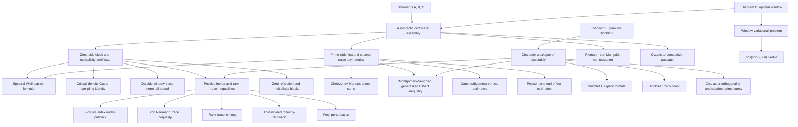

# Anthropic Zeta23 Dependency And Route Audit

Date: 2026-08-13

Status: source/dependency audit complete; external implementation pinned and checked as a
reference only; no source vendored; no local theorem claim added in this audit.

Global RH goal: active.

## Scope And Sources

This audit answers a narrower question than a paper summary: what exact information enters the
new proportion theorem, which part is new relative to `lean-lab-rh`, where the route provably
saturates, and what follow-up could carry information not already present in the proof.

Primary materials:

- [Full paper](https://www-cdn.anthropic.com/564f962e60643842f5fcb4a17c9dbc8f608f1c37.pdf)
- [Anthropic overview](https://www.anthropic.com/research/riemann-zeta)
- [Lean repository](https://github.com/anthropics/zeta-23-lean)
- [Concise expert proof note](https://www-cdn.anthropic.com/23455459f8832d06bb175cc0f88d019aed962ef8.pdf)
- [Discovery account](https://www-cdn.anthropic.com/d7f3ecf1d01392d887f8bc974ca187e2a121b1ed.pdf)
- [Selected sub-agent transcripts](https://www-cdn.anthropic.com/8a0d1add3c637b858a9a181e98c40e9548c3f44f.pdf)

The external repository was inspected at commit
`3635e74826a4c1fcece7d1cd2b6fa75e43a00510`. Its toolchain is Lean `v4.33.0-rc2` with mathlib
commit `51e6992efd06126df61a496bebf8f49482a4e129`. The local project remains on Lean `v4.31.0`
with mathlib commit `fabf563a7c95a166b8d7b6efca11c8b4dc9d911f`. This version gap is one reason not to import
the implementation before a separate definition-bridge campaign.

## Headline Theorems

For `0 < lambda <= 1`, set

```text
H(lambda)  = 2 - 1/lambda - lambda/3,
Hd(lambda) = (1 + H(lambda))/2,
F(lambda)  = lambda/(1 + lambda^2/3).
```

The paper proves asymptotic lower proportions `H(lambda)` for distinct critical-line zeros
(Theorem A) and simple critical-line zeros (Theorem B), and
`max(Hd(lambda), F(lambda))` for distinct zeros (Theorem C). At `lambda = 1` these are `2/3`,
`2/3`, and `5/6`. The optimal Montgomery--Taylor window raises the first two constants to
`0.67250...` and the distinct-zero constant to `0.83625...` (Theorem D). The fixed primitive
Dirichlet L-function analogues are Theorem E.

The multiplicity constants in the paper are represented by `Zeta23/FinalMult.lean` and
`Zeta23/ThmD/Mult.lean`. `Zeta23/Final.lean` also retains weaker Cauchy--Schwarz forms with
constants `1/2` and `3/4`; those weaker declarations must not be mistaken for Theorems B and C
as stated in the paper.

The repository additionally proves results about zeros of `xi'`. They are real formal results but
are not an input to Theorems A--E and are not treated as a new RH bridge here.

## Theorem Dependency Graph



## Proof Edges

### 1. Spectral explicit formula and Gabor compression

For a compactly supported taper `phi`, the paper takes modulated tests centered at critical
sampling frequencies through `[T,2T]`. The dimension is

```text
d = (lambda + o(1)) N(T,2T).
```

Proposition 2.1 rewrites the Weil form as a Gram matrix `G`. Lemma 2.2 is the exact
Poisson/Gabor sampling identity. The proof stays in coefficient coordinates: it does not
orthonormalize the taper family. This is essential because the ordinary mass matrix has small
eigenvalues near the taper boundary and its inverse would amplify directions for which only
short-scale prime-density control is available.

### 2. Zero-side block structure

After restricting to a slightly enlarged zero window, the normalized matrix has the form

```text
Ahat = P + Q.
```

Critical-line atoms contribute positive rank-one forms to `P`. Each reflected off-line pair
contributes a hyperbolic block with signature `(1,1)` to `Q`. Lemma 3.1 transports positive
inertia through the evaluation map without assuming linear independence of the zero vectors.
Proposition 4.2 bounds the omitted zero tail in trace norm using the local count
`N(t+1)-N(t) << log(t+3)` and taper decay; no zero-density estimate is used.

### 3. New linear-algebraic lever

For Hermitian `P >= 0` of rank at most `r`, and Hermitian `Q` with at most `b` positive
eigenvalues, Lemma 3.2 gives, for `c > 0`,

```text
||P+Q||_F^2 >= c tr(P) - c^2 r/4 + 2c tr(Q) - c^2 b.
```

At `c=2`, this rearranges to the rank lower bound used for on-line points. Regrouping simple
line zeros on the rank side and multiple line zeros plus off-line pairs on the index side yields
the paper's multiplicity inequality

```text
3 s1 + 4 s2 + 4 p >= 4 tr(Ahat) - ||Ahat||_F^2.
```

This matrix inequality is the genuinely new ingredient relative to the local repository. It
encodes two integer levels, corresponding to `(m-1)^2 >= 0` and
`(m-1)(m-2) >= 0`, without requiring positivity of the full Weil form.

### 4. Prime-side information

The explicit formula turns the first two matrix traces into mean values involving prime powers
up to `X = (T/(2*pi))^lambda`. Chebyshev--Mertens estimates and the
Montgomery--Vaughan generalized Hilbert inequality give, in the zero-side normalization,

```text
tr(Ahat) = (1 + o(1)) N,
||Ahat||_F^2 = (1/lambda + lambda/3 + o(1)) N.
```

Substitution into the zero-side inequality gives `H(lambda)`. Theorem D changes the taper and
optimizes the ratio of these two traces; it does not add a new kind of information.

## External Lean Dependency Audit

The external implementation formalizes the complete analytic closure rather than assuming the
four literature inputs at the headline boundary:

| analytic input | external modules | status at pinned commit |
|---|---|---|
| Weil explicit formula for zeta | `Zeta23/WeilEF/`, `Zeta23/ExplicitFormula*` | proved |
| Riemann--von Mangoldt and local counts | `Zeta23/RvM/` | proved |
| Gamma/digamma vertical estimates | `Zeta23/GammaFacts/`, `Zeta23/Analytic/` | proved |
| Chebyshev--Mertens estimates | `Zeta23/Chebyshev.lean`, `Zeta23/FromPNTPlus/` | proved |
| Montgomery--Vaughan inequality | `Zeta23/MV/` | proved |
| Rank/positive-index package | `Zeta23/LinAlg/` | proved |
| Gabor, taper, and trace asymptotics | `Zeta23/Poisson*`, `Taper/`, `PrimeSideA/`, `PrimeSideB/` | proved |
| Zero blocks and tail control | `Zeta23/ZeroSide/`, `Tail/` | proved |
| A--E assembly | `FinalMult.lean`, `ThmD/`, `ThmE/`, `ThmDE/` | proved |

The external default library build completes without a production `sorry`. Its production theorem
tree declares no custom axioms, and its headline axiom reports contain only `propext`,
`Classical.choice`, and `Quot.sound`. The repository includes two non-production examples of
`axiom` declarations inside the block comment of the ported additive-combination tactic; they do
not elaborate and do not enter any declaration. The `comparator/Challenge*.lean` statement files
contain deliberate placeholder proofs; they are comparator inputs, not dependencies of the
production theorems. They must not be copied or treated as proof evidence.

One qualification is material: the bandwidth-one `PairCeiling` theorem has an explicit
`EnclOK` premise for interval enclosures generated outside Lean. Lean checks the downstream
integer certificate and analytic consequence. Therefore the displayed numerical ceiling is not
a hypothesis-free theorem until that enclosure premise is independently discharged. The
paper's analytic sharpness examples and the first-two-moment extremal configuration do not
depend on importing this numerical certificate.

## Comparison With `lean-lab-rh`

### Genuine overlap

| subject | local implementation | relation to Zeta23 |
|---|---|---|
| Actual zeta zeros, analytic multiplicity, reflection | `RiemannXiDivisorZeroIndex` and [`PairCorrelationHorizontalMultiplicity.lean`](../LeanLab/Riemann/PairCorrelationHorizontalMultiplicity.lean) | Conceptual overlap; different local data model and window counts. |
| Compact zero cutoff | [`WeilZeroCutoff.lean`](../LeanLab/Riemann/WeilZeroCutoff.lean), [`WeilCompactLaplaceZeroCutoff.lean`](../LeanLab/Riemann/WeilCompactLaplaceZeroCutoff.lean) | Supplies local finite/limit zero-side infrastructure, but not the moving Gabor matrix. |
| Arithmetic Weil formula | [`WeilCompactLaplaceArithmeticFormula.lean`](../LeanLab/Riemann/WeilCompactLaplaceArithmeticFormula.lean) | A full reflection-symmetrized compact-smooth formula; normalization and test interface differ from `Zeta23.WeilEF`. |
| Exact Weil positivity criterion | [`WeilCompactPositivityCriterion.lean`](../LeanLab/Riemann/WeilCompactPositivityCriterion.lean) | Local route attacks full positivity/RH equivalence; Zeta23 extracts finite-compression inertia without full positivity. |
| Finite Weil/Li Gram geometry | [`LiWeilGram.lean`](../LeanLab/Riemann/LiWeilGram.lean) | Conceptual Gram overlap, but static Li tests do not supply moving-height trace laws. |
| Horizontal multiplicity and sparse exceptions | [`PairCorrelationHorizontalMultiplicity.lean`](../LeanLab/Riemann/PairCorrelationHorizontalMultiplicity.lean) | Local exact-cofinal consumer is a genuine last-exception RH localizer; Zeta23's density theorem cannot supply its premise. |
| Pair mass and moving windows | [`PairCorrelationTriangularMass.lean`](../LeanLab/Riemann/PairCorrelationTriangularMass.lean), [`PairCorrelationMovingWindowBoundary.lean`](../LeanLab/Riemann/PairCorrelationMovingWindowBoundary.lean) | Related zero-statistics bookkeeping, but not the unconditional rank-trace route. |

The local compact explicit formula is substantial overlap, not a drop-in replacement. A theorem
bridge would still have to align Fourier conventions, taper regularity, zero-window
normalization, prime cutoff, matrix entries, and tail estimates.

### Genuinely missing locally

1. A moving-height, critical-density Gabor family and its exact sampling identity in the
   normalization used by the trace argument.
2. Positive index, Hermitian positive part, pullback inertia, von Neumann trace inequality, and
   the rank-trace lemma as a reusable finite-matrix package.
3. The complete first- and second-trace asymptotics, including taper end effects and the prime
   off-diagonal bound.
4. A matching Riemann--von Mangoldt/local-count package and trace-norm tail consumer.
5. The Montgomery--Vaughan generalized Hilbert inequality in the required weighted form.
6. The optimized-window variational calculation.
7. The primitive Dirichlet L-function analogue and its character-specific seams.

Mathlib supplies foundational pieces such as `riemannZeta`, analytic order, matrices, Fourier
analysis, Gamma functions, and Dirichlet L-functions. It does not by itself supply the seven
assembled inputs above. The external repository formalizes them on top of mathlib; the local
repository independently formalizes only part of the analytic and zero-structure layer.

## Exact Bottleneck To One Hundred Percent

There are two distinct bottlenecks. Improving the displayed decimal addresses neither by itself.

### Bottleneck I: information loss inside one compression

The proof retains only:

```text
dimension, tr(G), tr(G^2), rank(P), positiveIndex(Q), and coarse block counts.
```

For these data the rank-trace inequality is sharp. A configuration with `2N/3` orthogonal
simple line atoms and `N/6` double atoms matches the trace data and attains the simple-line and
distinct-zero bounds. Replacing doubles by increasingly shallow off-line pairs gives the same
spectral obstruction for the on-line count. Optimizing the window changes the trace ratio but
does not recover location, phase, or coherence discarded by these statistics.

The arithmetic reason is the bandwidth wall `lambda <= 1`. Beyond it, prime off-diagonal terms
require Hardy--Littlewood-strength prime-pair information, equivalently pair-correlation support
beyond one. Unconditionally available higher moments do not repair this: in the
Rudnick--Sarnak range `k lambda < 2`, `lambda > 1/2` permits at most a third moment, and an odd
moment does not improve the positive-index bound; for `lambda <= 1/2`, the compression dimension
already makes the certificate vacuous. Conditional fourth moments improve the proportion, and
all moments or full support can give asymptotic proportion one, but not RH itself.

### Bottleneck II: sparse-exception blindness

Every input and output is normalized on the scale `N(T,2T)`. One off-line reflected pair, any
finite set of such pairs, or an `o(N)` population changes the trace laws by an amount swallowed by
the error terms. Thus even an asymptotic proportion-one theorem would not imply that every zero
lies on the line.

This is the exact quantifier mismatch with RH:

```text
asymptotic density statement: exceptional count = o(N),
RH: exceptional count = 0 at every height.
```

The local theorem `riemannHypothesis_of_exactHorizontalPairCountCofinal` exposes the missing
kind of input: an exact cofinal disappearance statement can eliminate the last exception. Zeta23
does not approach that premise because its trace errors are much larger than an `O(1)` defect.

## Extension Analysis

Everything in this section is a research hypothesis until compiled as a local theorem. No item is
counted as progress from this audit alone.

### Cross-Gram matrices

For two window families `f^a_k` and `f^b_l`, retain the polarized block

```text
G^{ab}_{kl} = W(f^a_k, f^b_l)
```

rather than only `tr((G^{aa})^j)` and `tr((G^{bb})^j)`. Mixed traces such as
`tr(G^{ab} G^{ba})`, together with a joint zero-side evaluation map, can in principle retain
relative coherence discarded by separate compressions.

Falsification gate: if every evaluable mixed statistic reduces to the same scalar form-factor
data on Fourier support `[-1,1]`, or if the paper's extremal synthetic configuration realizes all
the mixed data, the extension adds no certifying power. Direct sums with cross blocks discarded
are already known to add no information.

### Multiple overlapping compressions

Several height or bandwidth windows can help only if the proof enforces that the same zero atom
produces compatible vectors in every compression. The relevant object is a joint evaluation map,
its intersection kernels, and cross blocks, not a sum of separate rank-trace inequalities.

Falsification gate: construct one common extremal zero configuration satisfying every proposed
compression simultaneously. If it exists, adding windows only repeats the same average.

### Localized trace data

A mesoscopic or height-local trace law could attack sparse blindness if a single off-line pair
caused a defect larger than the complete analytic error. Current global trace errors cannot do
this. A successful version needs either an amplifier that makes one off-line orbit contribute at
macroscopic scale, or error control approaching `o(1)` on the relevant localized observable.

Falsification gate: compare the exact contribution of one reflected pair with every prime,
Gamma, cutoff, and tail error. If the signal/error ratio tends to zero, the proposed localizer
cannot imply RH.

### Auxiliary L-function families

Theorem E shows that the compression is stable for each fixed primitive character. Family
averaging can restore arithmetic bandwidth through character orthogonality, but it also averages
away information about the individual zeta function. A useful extension first needs a proved
coupling identity forcing a zeta off-line zero to create a correlated anomaly across the auxiliary
family. Fixed-family proportion theorems alone provide no such transfer.

Falsification gate: require an explicit common-zero, Euler-factor, Rankin--Selberg, or other
zero-transfer theorem before treating family averages as evidence about an individual zeta zero.

### Higher moments and support beyond one

This is the cleanest way to improve density constants, but its missing inputs are precisely
Hardy--Littlewood prime correlations or equivalent extended-support zero statistics. It remains a
valid conditional research branch. It does not resolve the last-exception quantifier and therefore
must be paired with an individual-zero amplifier before it becomes an RH route.

## Route Reprioritization

| branch | ruling | reason |
|---|---|---|
| External `zeta-23-lean` source | `PINNED_REFERENCE_ONLY` | Complete external implementation exists; version and definition bridge is nontrivial; no vendoring authorized. |
| H11 old PCC/Fujii proportion producer | `FREEZE_AS_REDUNDANT_FOR_PROPORTION` | The new theorem obtains a stronger unconditional endpoint without the PCC premise. Retain local finite identities as infrastructure. |
| H11 horizontal multiplicity and exact-cofinal consumer | `KEEP_HIGH_PRIORITY` | It represents the sparse-exception information missing from the new method. |
| Theorem D/window constant optimization | `FREEZE` | The paper solves this variational problem and proves that it does not change the information class. |
| H5/H7 compact Weil formula | `KEEP_AS_BRIDGE_INFRASTRUCTURE` | Strong overlap can support polarized/multiple compression work; more fixed-test formulas alone are not selected. |
| H12 height-ten low-cell slicing after `[0,1/4]` | `PAUSE_BY_REPRIORITIZATION` | The closed theorem remains valid, but extending the numerical cover is not the best response to the new information. H12 itself remains open. |
| H1 mollifier route | `KEEP_IN_HISTORICAL_SURVEY` | It uses different arithmetic information and is not subsumed by the compression theorem. |
| H2 density/mean-value route | `KEEP_SUPPORTING` | It may control large exceptional populations, but density alone also cannot remove a finite residue. |
| Auxiliary-family amplification | `WATCH / REQUIRE_COUPLING_IDENTITY` | Potential bandwidth gain is real; transfer back to zeta is presently absent. |

No route is declared globally failed. A freeze here means that the indicated local mechanism is
not the next selected use of proof effort.

## Selected Next Research Question

The next high-value campaign candidate is not to reprove Theorems A--E locally. It is:

```text
ANTHROPIC-CROSS-GRAM-NOVEL-INFORMATION-01

Does a two-profile polarized Gabor compression expose a mixed invariant that
(a) is unconditionally evaluable on the prime side within bandwidth one,
(b) is constrained jointly by the same zero atoms, and
(c) excludes the sharp single-compression extremal configuration?
```

The campaign must preregister two terminal outcomes:

1. `NEW_INFORMATION`: a Lean theorem proving a strict joint constraint not derivable from the
   two separate first/second trace packages.
2. `FORMAL_NO_GAIN`: a Lean-checked extremal model satisfying all proposed cross data, freezing
   that cross-Gram observable.

Before production work, it must align definitions with the external paper while implementing
only the minimal abstract finite-dimensional model locally. It must not copy external source and
must not treat numerical separation as a theorem.

## Claim Boundary

This audit records an externally formalized unconditional proportion theorem and a route
decision. It does not claim RH progress, does not discharge the `PairCeiling.EnclOK` premise,
does not prove any proposed extension, and does not import an external theorem into the local
trust graph. All future mathematical intermediates remain subject to the local no-placeholder,
exact-witness, TargetChecks, and axiom-audit gates.

## Verification Receipt

- External reference commit: `3635e74826a4c1fcece7d1cd2b6fa75e43a00510`.
- External default build: `9010/9010` jobs completed.
- External `Solution`, `Solution.Multiplicity`, and `Solution.XiPrime` build: `9002/9002`
  jobs completed.
- External standard, multiplicity, `xi'`, and `PairCeiling` axiom audits completed; headline
  declarations use only the standard trust base recorded above.
- Local docs-only audit commit: `bb0c30deb478030170ae8bb87b7942b1057bea00`.
- Public Lean Action CI: run `31670157608`, build job `94352936721`, passed in `1m42s`.
