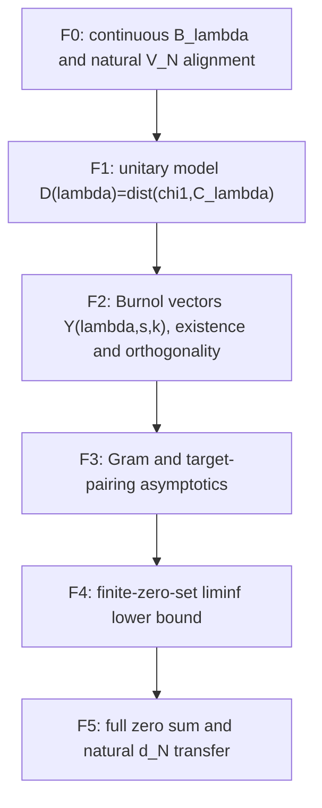

# G4 Burnol Lower-Bound Dependency Audit

Date: 2026-07-13

Audit ID: `AUDIT-20260713-G4-01`

## Result

- `node_id`: `B1`
- `gap_id`: `G4`
- `work_class`: `LITERATURE`
- `result_class`: `DEPENDENCY_GAP_IDENTIFIED`
- `novelty_label`: `KNOWN_MATHEMATICS`
- `hard_gap_delta`: the broad G4 target is replaced by the source-level frontier F0-F5 below;
  neither M2 nor G3 changes.

## Primary Theorem

Burnol defines, in the complex Hilbert space `K = L2((0,infinity), dt)`,

```text
B_lambda = span_C { t |-> rho(theta/t) : lambda <= theta <= 1 }
D(lambda) = inf { ||chi - f|| : f in B_lambda },
```

where `chi = chi_(0,1]`. His Theorem `mytheo` states

```text
liminf_(lambda -> 0+)
  D(lambda) * sqrt(log(1/lambda))
    >= sqrt(sum_rho m_rho^2 / |rho|^2).
```

Primary source: Jean-Francois Burnol, *A lower bound in an approximation problem involving the
zeros of the Riemann zeta function*, Advances in Mathematics 170 (2002), 56-70,
arXiv `math/0103058v2`, <https://arxiv.org/abs/math/0103058>.

The nearest predecessor is Baez-Duarte, Balazard, Landreau, and Saias, *Notes sur la fonction zeta
de Riemann, 3*, Advances in Mathematics 149 (2000), 130-144, DOI
<https://doi.org/10.1006/aima.1999.1861>. Their lower-bound constant counts each nontrivial zero
once. Burnol strengthens it by replacing that count with squared zero multiplicities.

Burnol explicitly treats the theorem as trivial when RH fails and proves the nontrivial case after
assuming RH. The first Lean target will therefore state the finite-zero lower bound under
`Mathlib.RiemannHypothesis`. The off-RH branch is a separate continuous Nyman-Beurling dependency
and must not be smuggled in from the already formalized positive-natural criterion.

## Statement Alignment

| Published component | Project component | Audit result |
| --- | --- | --- |
| Scalar field | Burnol uses complex finite linear combinations | `positiveHalfLineComplexL2` and complex `Submodule.span` match. |
| Hilbert space | `L2((0,infinity), dt)` | Exact match: `Lp Complex 2 (volume.restrict (Ioi 0))`. |
| Target | indicator of `(0,1]` | Exact match: `baezDuarteComplexTargetL2`, whose real representative is `Ioc 0 1`. |
| Kernel | `rho(theta/t)` | Exact formula is `fractionalPartKernel theta t`; existing `MemLp` proof applies for `0 < theta <= 1`. |
| Continuous space | finite span for all real `lambda <= theta <= 1` | Missing. The project currently packages only positive-natural reciprocal parameters. |
| Distance | Hilbert-space infimum over the nonclosed finite span | `Metric.infDist` on the submodule carrier is the direct representation; closure is not part of the definition. |
| Limit | `lambda -> 0+` | Use `nhdsWithin 0 (Set.Ioi 0)`; the condition `lambda < 1` is eventual. |
| Natural finite space | not Burnol's primary `B_lambda` | For `1 <= n <= N`, `theta=1/n` lies in `[1/N,1]`, so `V_N <= B_(1/N)`. |
| Distance transfer | distance reverses subspace inclusion | Correct direction: `D(1/N) <= d_N`; therefore a lower bound for `D(1/N)` is also a lower bound for `d_N`. |
| Scale transfer | `log(1/(1/N))` | Equals `log N` for positive `N`; `N -> infinity` maps `1/N -> 0+`. |

The audit therefore validates the natural-distance consequence, but only through the inclusion
`V_N <= B_(1/N)`. The project's all-natural closure is not itself Burnol's continuously
parameterized space.

## Source-Level Dependency DAG



### F0: Statement Alignment

Define the continuous complex kernel span, `burnolDistance`, the finite natural span `V_N`, and
`baezDuarteNaturalDistance N`. Prove `V_N <= B_(1/N)` and
`burnolDistance (1/N) <= baezDuarteNaturalDistance N` for positive `N`. This is a required
engineering batch, not G4 progress by itself.

### F1: Burnol's Unitary Model

Formalize `chi1(t)=(1+log t)chi(t)`, the Hardy averaging operator, the phase/unitary multiplier
`V`, the source vector `A`, and the spaces `C_lambda`; prove that the original distance `D(lambda)`
equals the distance from `chi1` to `C_lambda`. The project has Mellin/Fourier `L2` isometries but
does not have this source unitary or the pointwise inverse-transform estimates.

### F2: Orthogonal Burnol Vectors

For a critical-line point `s` and `k`, construct the `L2` limit

```text
Y(lambda,s,k) = lim_(w -> s, re(w)<1/2) V^-1 Q_lambda V(psi(w,k))
```

and prove its pairing with every generator `D_theta(A)`. At a zeta zero, analytic order converts
the derivative vanishing conditions into orthogonality to `C_lambda`.

### F3: Finite-Dimensional Asymptotics

Normalize `Y` to `X`, prove the Gram limits to block Hilbert/Cauchy matrices and the target-pairing
limits, prove the top-left inverse entry is `m^2`, and pass matrix inversion through the limit.
Mathlib has continuity of matrix inverse at a nonsingular matrix, but no searched theorem for the
inverse of the finite Hilbert/Cauchy matrix or its top-left entry.

### F4: Finite-Zero Lower Bound

Use orthogonality and the finite-dimensional projection/Gram formula to obtain the lower bound for
an arbitrary finite set of nontrivial zeros. This is the first nonmechanical source theorem target.

### F5: Full Sum And Natural Transfer

Take the supremum over finite zero sets to identify the nonnegative `tsum`, then compose F0 with
`lambda=1/N`. The full unconditional published wording additionally needs the off-RH continuous
criterion branch; the first formalized version will retain the RH hypothesis exactly as Burnol's
nontrivial proof does.

## Exact Proposed Lean Target

After F0 supplies the named definitions and zero multiplicity is defined from
`analyticOrderAt riemannZeta`, the first source-level theorem is proposed as:

```lean
theorem RiemannHypothesis.burnolDistance_liminf_ge_finset
    (hRH : RiemannHypothesis)
    (R : Finset {rho : Complex // IsNontrivialZero rho}) :
    (ENNReal.ofReal
        (Real.sqrt
          (sum rho in R,
            (riemannZetaZeroMultiplicity rho : Real) ^ 2 /
              norm (rho : Complex) ^ 2))) <=
      Filter.liminf
        (fun lambda : Real =>
          ENNReal.ofReal (burnolDistance lambda) *
            ENNReal.ofReal (Real.sqrt (Real.log lambda.inverse)))
        (nhdsWithin 0 (Set.Ioi 0))
```

The finite-set form avoids asserting summability or an enumeration of all zeros before the hard
analytic argument exists. It is not an RH proof: it assumes RH and supplies a lower obstruction to
the rate of approximation.

## Library And External Formalization Audit

Local and public searches found no Nyman-Beurling, Baez-Duarte, or Burnol distance formalization in:

- the pinned Mathlib tree;
- the vendored `PrimeNumberTheoremAnd` subset and public
  `AlexKontorovich/PrimeNumberTheoremAnd` repository;
- `MichaelStollBayreuth/EulerProducts`;
- the Isabelle AFP public mirror `isabelle-prover/mirror-afp-devel`;
- public GitHub code indexed as Lean or Isabelle theory files.

Existing useful APIs include `Metric.infDist_le_infDist_of_subset`, complex `Lp` Hilbert spaces,
closed-submodule orthogonal projection, finite-dimensional Gram matrices, continuous matrix
inversion away from zero determinant, `analyticOrderAt`, derivative/order equivalences, and the
project's countability of zeta zeros. Missing source-specific blocks are the continuous phase
unitary, Burnol vector limits and estimates, the Hilbert/Cauchy inverse formula, and the complete
finite-set projection asymptotic.

These negative searches are route evidence only. They do not complete the separate P3 novelty
audit and do not justify a public "first formalization" claim.

## Frontier After

- `hard_gap_after`: G4 remains open with F0-F5 fixed from the published proof.
- `assumption_frontier_after`: the first mathematical target is F4, but it depends on source-level
  F1-F3; F0 is a single engineering batch and must not be counted as research progress.
- `next_admitted_batch`: implement F0 in one batch and preregister F1 as the first source-specific
  analytic construction. Do not create one loop per span, distance, or inclusion lemma.

## Runtime Record

- `model`: Codex, GPT-5 family (exact backend identifier not exposed)
- `reasoning_effort`: not exposed
- `loop_budget`: unbounded persistent-goal budget
- `compaction_since_previous_loop`: no
- `Lean_theorems_added`: none

