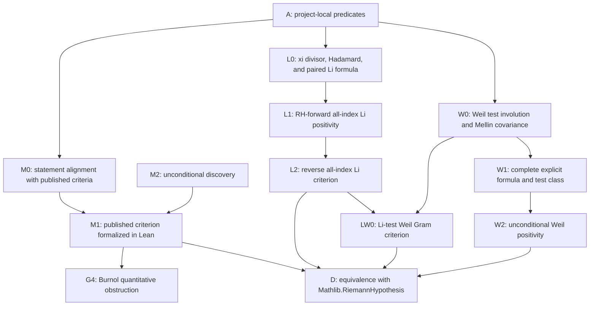

# RH Hard-Gap DAG

Date: 2026-07-15

This file is the fixed external gap ledger for future RH work. A future loop may only count as
research progress when it changes the status of one of these nodes. Local predicate wrappers,
rewrite bridges, finite-support transports, and one-step corollaries are engineering work unless
they reduce a node below.

## DAG

## Fixed Nodes

| node_id | status | description | current frontier |
| --- | --- | --- | --- |
| A | in progress | Project-local xi, Li, Nyman-Beurling, and Baez-Duarte scaffolding. | Mostly formalization scaffolding; not RH progress under v2. |
| M0 | complete | Align project-local Nyman-Beurling/Baez-Duarte predicates with published statements. | The positive-natural Baez-Duarte closure side is aligned in real and complex `L2(0,infinity)`: parameter indexing, kernel formula, target, closed span, whole-line error, endpoint, tolerance, and coefficient field are Lean-checked. |
| M1 | complete | Formalize one accurately cited published Nyman-Beurling or Baez-Duarte criterion. | Batch M1-18 compiles both directions of the exact strong positive-natural Baez-Duarte criterion in full-half-line complex `L2`. |
| D | complete | Connect the formalized criterion to `Mathlib.RiemannHypothesis`. | `riemannHypothesis_iff_baezDuarteComplexTarget_mem_kernelClosure` is the exact compiled bridge. |
| M2 | parked | Unconditional discovery route: explicit approximants with error tending to zero, or a literature-audited new structural lemma. | Parked unless a novelty audit justifies work. |
| B1 | complete | Formalize Burnol's published quantitative lower bound for the Nyman-Beurling approximation distance. | Batches G4-F0 through G4-F5 are public. The full RH-conditional continuous zero-sum lower bound and exact natural-distance liminf transfer are Lean-checked. This is known mathematics, not M2 progress. |
| L0 | complete | Align the project xi divisor, genus-one Hadamard product, all-index Li family, and symmetry-paired raw zero formula. | The multiplicity-bearing paired formula is public and all infinite-sum operations are Lean-checked. |
| L1 | complete | Prove the RH-forward all-index Li real-part nonnegativity direction. | Under RH every paired summand is exactly half a complex norm square. |
| L2 | complete | Prove all-index Li real-part nonnegativity implies `Mathlib.RiemannHypothesis`. | The project-specialized Bombieri-Lagarias argument compiles: finite threshold superlevels, simultaneous phase recurrence, fixed-weight tail domination, an off-line-to-negative-coefficient theorem, and the exact Li/RH iff. Implementation and evidence commits passed public CI runs `29406614212` and `29406932411`. |
| LW0 | complete | Construct the multiplicity-bearing Li-test Weil Gram form and prove positivity on every finite real combination is exactly equivalent to RH. | The reflection-averaged kernel, exact Li matrix, RH norm-square formula, and finite-real-span positivity iff are public. Implementation commit `2317143e73e1d788d65dcdff9b609a98f8ac60b2` passed public CI run `29415448733`. This is known-theorem formalization with hard_gap_delta=0. |
| W0 | complete | Formalize Weil's multiplicative test-function involution, conjugate star, and exact Mellin covariance. | `WeilTestAlgebra.lean` proves pointwise involutivity on `0<x`, the zero-boundary counterexample, convergence iff, endpoint swap, conjugate-star covariance, and critical-line specialization. This is test algebra only. |
| W1 | open | Formalize a source-faithful admissible test class, multiplicative convolution, and the complete zero/prime/pole/archimedean explicit formula. | W1a, W1b's physical analytic-strip algebra core, and W1c0 are public. The fixed Gaussian zero-side and arithmetic subedges compile, but generic class integration, quotient/completeness, and regularization remain. |
| W2 | open | Prove unconditional Weil positivity on a complete RH-equivalent test class. | This is the genuine RH-hard R5 edge. Connes-Consani's semi-local mechanism is explicitly conjectural and is not a premise. |

## Hard Gaps

| gap_id | node_id | status | description |
| --- | --- | --- | --- |
| G1 | M1/D | complete | The exact strong positive-natural Baez-Duarte full-line closure criterion is Lean-equivalent to `Mathlib.RiemannHypothesis`. |
| G2 | M1 | complete | Batch M1-18 compiles the weighted finite formula, fixed-epsilon transformed limit, epsilon-to-zero dominated convergence, diagonal assembly, tail removal, and `RH -> closure`. |
| G3 | M2 | parked | Construct unconditional finite approximants with error tending to zero. In the NB/BD framework this is essentially the hard RH direction; numerical convergence is not evidence. |
| G4 | B1 | complete | Burnol's RH-conditional lower bound `liminf D(lambda) * sqrt(log(1/lambda)) >= sqrt(sum_rho m_rho^2 / |rho|^2)` and its natural-subspace liminf consequence are publicly Lean-checked through the fixed F0-F5 frontier. M2/G3 is unchanged. |
| G5 | L2 | complete | Reverse the exact project Li criterion: from nonnegative real parts of every `liCoefficientCandidate n`, derive RH by a project-specialized Bombieri-Lagarias transformed-zero argument. |
| G6 | W1 | open | Prove the complete source-faithful Weil explicit formula and convolution-stable admissible test space, without dropping moment, density, convergence, or regularization conditions. |
| G7 | W2 | open | Supply an unconditional positivity mechanism on the full Weil class. Finite test-family checks and RH-conditional norm identities do not reduce this gap. |

## W1 Fixed Source Frontier

| edge | status | source-level content |
| --- | --- | --- |
| W1a | complete | Source-faithful `dy/y` convolution, exact convergence closure, Mellin product, star covariance, and critical-line `normSq` autocorrelation compile through logarithmic transport to Mathlib additive Bochner convolution. |
| W1b | complete | A positive-width physical class with pointwise closed-strip convergence, open-strip analyticity, closed-strip continuity, and a finite uniform bound is closed under vector operations, involution, conjugate star, convolution, and autocorrelation. Quotient/uniqueness/completeness and density are explicitly not claimed. Implementation commit `335d6dfa175a345555aaa408b5581ed743d2abf7` passed public CI run `29412820223`. |
| W1c0 | complete | On `Re(s)>1`, `WeilExplicitIntegrand.lean` proves the exact xi logarithmic-derivative identity joining the multiplicity-bearing Hadamard zero sum to the pole, `GammaR`, and von Mangoldt terms. Implementation `89d4dd12ebedc75c13261a0d43a9254b5931c30d` passed public CI run `29417432562`; evidence backfill `1b405639a4e28c72fc1e2484259c047ad95ed0b2` passed run `29417710278`. This is the analytic integrand only. |
| W1c1 | open | Integrate the compiled identity against a source-faithful test class and justify the rectangle/zero cutoff passage. |
| W1c1g0 | complete | For the fixed centered Gaussian, selected zero-free right-line truncations converge to the absolute multiplicity-bearing Gaussian zero `tsum`. Implementation `00410cc2a6919acfa5835b121c47489c5105e0de` and evidence backfill `2292801d710a1a95857de69a92498c39ae79d0d3` passed public CI. This does not supply the generic class limit. |
| W1c1g1 | complete | `WeilGaussianExplicitFormula.lean` evaluates the same fixed Gaussian line integral into its exact pole, `GammaR`, and von Mangoldt terms, with every interchange and full-line limit proved. Implementation `6c65019d9de2d31127dd3bf8389994207c17dcb5` and evidence backfill `fa5fdc5aefd4dd3e99966cc1e0fcca62293e9600` passed public CI runs `29441160498` and `29441452307`. This does not close generic W1c1. |
| W1c2 | open | Prove the complete distributional limit and all endpoint/local regularization choices, including the covariance extension. |

## G4 Fixed Source Frontier

| edge | status | source-level content |
| --- | --- | --- |
| F0 | complete | Continuous `B_lambda`, finite natural `V_N`, distances, `V_N <= B_(1/N)`, `D(1/N) <= d_N`, and `1/N -> 0+` are Lean-checked in `BurnolLowerBound.lean`. |
| F1a | complete | `BurnolA.lean` defines the explicit floor formula, proves support in `(0,1]`, the exact Hardy-tail identity, `L2` membership, and `HasMellin A s ((s-1)zeta(s)/s^2)` for `0<Re(s)<1`. |
| F1b | complete | `BurnolHardy.lean` constructs the critical-line phase isometry, proves its explicit action on `chi` and every `rho(theta/t)`, transports the explicit model span, and proves `D(lambda)=dist(chi1,C_lambda)`. |
| F2 | complete | `BurnolY.lean` constructs the second source phase `V`, physical cutoff `Q_lambda`, `psi(w,k)`, the BBLS/Burnol oscillatory continuation, critical-line `L2` limits `Y(lambda,s,k)`, lambda-independent transformed representative bounds, exact model-kernel pairings, and analytic-order orthogonality to the full model span. |
| F3 | complete | Gram-block and target-pairing asymptotics, including the Hilbert/Cauchy inverse entry `m^2`, unequal multiplicity blocks, and inverse convergence, are publicly Lean-checked. |
| F4 | complete | The RH-conditional finite-zero-set liminf lower bound is publicly Lean-checked. |
| F5 | complete | The full extended zero sum and exact natural-distance asymptotic liminf transfer are publicly Lean-checked. |

## Post-M1 Admission Rule

- `G3` remains parked and must not be selected by the automatic loop. It may be reopened only by an
  independent novelty audit that preregisters a specific unconditional estimate or structural
  lemma against the closest published results.
- `G4` is an auditor-approved adjacent research line. Closing it is `KNOWN_THEOREM_FORMALIZED`, not
  `HARD_GAP_REDUCED` for RH and not evidence that the approximation distance tends to zero.
- Mathlib upstreaming is an engineering/publication track and must not be reported as a change to
  `M2` or `G3`.

## External Publication Gate

The final M1 equivalence may be described inside this repository as a compiled project-local
formalization aligned with Baez-Duarte 2002. A public claim of "first formalization" or a release
claim that the equivalence has passed external review requires all three independent gates:

| gate | status | evidence required |
| --- | --- | --- |
| P1 | complete | Clean-context Sol 5.6 max review `019f59c3-c4c7-7b63-a203-c25a12034c14`; no P0-P3 finding, decision `CONTINUE`. See `research/m1_sol_max_review_20260713.md`. |
| P2 | pending | Lean Zulip `#maths` statement/definition review with no unresolved objection. |
| P3 | pending | Novelty audit covering mathlib, Isabelle AFP, relevant external Lean repositories, and arXiv. |

Until P1-P3 are complete, repository documentation must not call this the first formalization.

## Loop Reporting Policy

Every future loop or engineering batch must report:

- `hard_gap_before`
- `hard_gap_after`
- `hard_gap_delta`
- `assumption_frontier_before`
- `assumption_frontier_after`

If all hard gaps are unchanged, the loop result is at most `FORMALIZATION_ONLY`.

## Current Governance State

- Loops 1-130 do not reduce G1, G2, or G3 under v2.
- The proposed loop-131 corollary
  `nymanBeurlingBaezDuarteConcreteApprox -> nymanBeurlingConcreteApprox` is a mechanical batch
  item on node A. It is not an accepted standalone research loop.
- Audit `AUDIT-20260710-M0-01` proved `nymanBeurlingConcreteApprox` unconditionally by using
  parameters `1` and `-1`. The unrestricted branch is falsified as a criterion carrier, and the
  governance decision is `PIVOT` to exact restricted-statement alignment.
- Batch `BATCH-20260710-M0-02` proved the project restricted closure/tolerance equivalence and
  computed the omitted `(1, infinity)` tail as the square of `sum c_k * a_k`. The result is
  `DEPENDENCY_GAP_IDENTIFIED`: current restricted and positive-natural local predicates omit the
  moment/tail condition present in the published criteria.
- Batch `BATCH-20260710-M0-03` defined the positive-natural split full-line error, proved its
  normalized form `unitIntervalError + reciprocalMoment^2`, and packaged the source-faithful
  positive-tolerance predicate. Result: `FORMALIZATION_ONLY`; M1/G1 and RH remain open.
- Batch `BATCH-20260710-M0-04` packaged the target and positive-natural kernels in the actual real
  `L2(0, infinity)` space and proved closure membership equivalent to the Batch 03 predicate. The
  endpoint difference is discharged by a null-set integral identity. Result:
  `FORMALIZATION_ONLY`; the coefficient-field convention remains under M0, while M1/G1 and RH are
  unchanged.
- Batch `BATCH-20260710-M0-05` inspected the primary Baez-Duarte paper, proved the source kernel
  formula, packaged the complex `L2(0, infinity)` closed span, and proved complex target closure
  membership equivalent to the real closure and source-aligned finite-error predicate. Result:
  `HARD_GAP_REDUCED`; fixed node M0 is complete. M1/G1, D, and RH remain open.
- Audit `AUDIT-20260710-M1-01` compiled
  `RiemannHypothesis.riemannZeta_ne_zero_of_half_le_lt_re` and compared every Theorem 1.1 proof
  block against the pinned mathlib tree. Result: `DEPENDENCY_GAP_IDENTIFIED`. G2 is narrowed to
  explicit forward and reverse theorem boundaries; G1 and RH remain unproved.
- Batch `BATCH-20260710-M1-02` audited external Lean projects, vendored only the trusted
  Abel-continuation source subset from `PrimeNumberTheoremAnd`, extended its formula to the full
  half-plane `re(s) > 0`, and proved `hasMellin_fractionalPartKernel_one` plus
  `hasMellin_baezDuarteKernel`. Result: `HARD_GAP_REDUCED`; the fractional-kernel Mellin block is
  closed, while the quantitative Mobius, weighted-log isometry, convergence, and reverse-criterion
  gaps remain.
- Batch `BATCH-20260711-M1-03` proved the weighted logarithmic change of variables is an
  invertible complex-linear isometry from `L2(0,infinity)` to `L2(real line)`, exposed both
  representatives, composed it with Fourier Plancherel, and verified the `tau/(2*pi)` frequency
  normalization. Result: `HARD_GAP_REDUCED`; the weighted-log isometry block is closed, while the
  quantitative Mobius, RH-to-Lindelof, source-convergence, and reverse-criterion gaps remain.
- Batch `BATCH-20260711-M1-04` inspected both source convergence passages and compiled the exact
  power-majorant `L2` statements, the countability and nullity of critical-line zeta-zero
  ordinates, and almost-everywhere convergence of the source zeta ratio to one. Result:
  `DEPENDENCY_GAP_IDENTIFIED`; G2 remains open but its broad convergence item is replaced by F1-F3
  above. The source's malformed displayed Gamma ratio and ambiguous tail exponent are recorded in
  `research/m1_source_convergence_boundary_20260711.md` and are not assumed.
- Batch `BATCH-20260711-M1-05` reconstructed the source tail formula from `f_(delta,n)`, Lean-checked
  the `1+2*epsilon` exponent, and proved the quotient-level estimate
  `norm(f)^2 <= (1+2*epsilon)*norm(x^(-epsilon)f)^2` for errors with an `m/x` tail. It also proves
  the varying-epsilon convergence transfer and instantiates the estimate on actual natural-kernel
  finite sums. Result: `HARD_GAP_REDUCED`; F3 is removed, while F1, F2, and the reverse criterion
  remain open.
- Batch `BATCH-20260711-M1-06` vendored the audited Apache-2.0 digamma-series module, derived a
  vertical-strip Gamma quotient estimate by Gronwall, reconstructed the correct completed-Gamma
  ratio from the zeta functional equation, and proved a uniform Baez-Duarte zeta-ratio bound on a
  fixed positive epsilon interval. Lean also verifies that the resulting transformed quotients are
  dominated by one explicit `MemLp` function. Result: `HARD_GAP_REDUCED`; F2 is removed, while F1
  and the reverse base criterion remain open.
- Audit `AUDIT-20260711-M1-07` compared Baez-Duarte's fixed-epsilon argument with Burnol's
  published alternative. Burnol combines the Balazard-Saias estimate with the unconditional
  critical-line convexity bound `zeta(1/2+it)=O(|t|^(1/4))`, so RH-to-Lindelof is not required for
  this route. The pinned and public Lean audit found neither Balazard-Saias nor a zeta convexity
  exponent below `1/2`; an Apache-2.0 external module supplies only a linear strip bound, while an
  unlicensed exploration leaves the weighted Phragmen-Lindelof core as an axiom. Result:
  `DEPENDENCY_GAP_IDENTIFIED`; F1 is corrected but remains open.
- Batch `BATCH-20260711-M1-08` compiled the removable entire function `(s-1)zeta(s)`, an Abel
  truncation bound of exponent `1/8` on `Re(s)=1`, exact Gamma-reflection cancellation on
  `Re(s)=0`, and the resulting pole-removed boundary exponents `9/8` and `13/8`. The fixed
  critical-line `3/8` target remains open because the corrected Fiori midpoint quotient and its
  uniform interior growth witness are not yet formalized. Result: `FORMALIZATION_ONLY`; G2/F1 is
  unchanged and no interpolation theorem is assumed.
- Batch `BATCH-20260711-M1-09` formalized Fiori's corrected analytic midpoint symmetrization with
  integer powers `(13,9)`, extended both edge estimates over compact segments, and discharged the
  exact `PhragmenLindelof.vertical_strip` growth premise using the audited finite-order bound for
  `(s-1)zeta(s)`. Lean derives pole-removed exponent `11/8` and the unconditional critical-line
  bound `|zeta(1/2+it)| <= C*(1+|t|)^(3/8)`. Result: `HARD_GAP_REDUCED`; the zeta-convexity
  component is removed from F1, while Balazard-Saias, the reverse criterion, G1, D, and RH remain
  open.
- Batch `BATCH-20260711-M1-10` encodes the exact Balazard-Saias statement as an explicit proposition
  and Lean-checks its complete Burnol consumer chain. The compiled `3/8` zeta bound gives quotient
  decay `-5/8`; hence the source height exponent must satisfy `eta < 1/8`, and the coefficient
  `N^(-delta/3)` tends to zero. The encoded estimate is never asserted or hidden as an axiom.
  Result: `FORMALIZATION_ONLY` with `hard_gap_delta = 0`; G2/F1 remains exactly Balazard-Saias.
- Batch `BATCH-20260711-M1-11` reads Titchmarsh Sections 3.12, 14.2, and 14.25 and decomposes the
  Balazard-Saias source route into truncated Perron, reciprocal-zeta subpower growth, and contour
  balancing. Lean proves that a nonvanishing holomorphic function on a simply connected open set
  has a holomorphic logarithm branch with derivative `g'/g`, and applies it to zeta on zero-free
  domains that explicitly avoid `1`. Result: `DEPENDENCY_GAP_IDENTIFIED`, `hard_gap_delta = 0`;
  the next hard subedge is the Borel-Caratheodory/Hadamard reciprocal-zeta bound, while G2/F1
  remains Balazard-Saias.
- Batch `BATCH-20260711-M1-12` formalizes Titchmarsh 14.2 in the exact RH specialization required
  downstream. Lean derives a coarse outer-circle zeta bound from Abel continuation, normalizes a
  zero-free analytic logarithm, applies Borel-Caratheodory, derives three-circles from Mathlib's
  Hadamard three-lines theorem, proves the uniform interpolation exponent is strictly below one,
  exponentiates to arbitrary positive powers, and patches finite heights by residue control and
  compactness. Result: `HARD_GAP_REDUCED`; remove only the reciprocal-zeta subpower subedge. The
  Balazard-Saias estimate, reverse criterion, G1, D, and RH remain open.
- Batch `BATCH-20260711-M1-13` audits Titchmarsh Lemma 3.12 and formalizes the no-pole half of its
  truncated Perron kernel argument. Lean checks the right-half-plane rectangle identity, both
  horizontal estimates, vanishing of the remote vertical side, and the quantitative `c=2`,
  `0<y<1` kernel bound. The sole Mobius truncated Perron target remains open: the exact next
  dependency is the positive-side `2*pi*i` residue contribution for `1/w`, followed by series
  interchange and source-error summation. Result: `DEPENDENCY_GAP_IDENTIFIED`;
  `hard_gap_delta=0`.
- Batch `BATCH-20260711-M1-14` closes the source-specialized Mobius truncated Perron input. Lean
  computes the crossing-pole rectangle boundary from explicit arctangent integrals, obtains both
  single-coefficient kernel estimates, exchanges the absolutely convergent Mobius series with the
  finite interval integral by dominated convergence, and sums the half-integral spacing errors
  with an `n^(-3/2)` majorant. The exact absolute `C*(N+1)^2/T` theorem compiles. Result:
  `HARD_GAP_REDUCED`; remove only `G2/F1/Balazard-Saias/truncated-Perron`. Contour shifting and
  error balancing remain, so Balazard-Saias and G2 are open.
- Batch `BATCH-20260711-M1-15` closes the preregistered RH-specialized Balazard-Saias estimate.
  Lean formalizes the analytic reciprocal at the zeta pole, the residue-subtracted rectangle
  identity, logarithmic left-edge integration, both horizontal-edge bounds, and the simultaneous
  choice `T=(N+1/2)^3*(1+|Im(s)|)`. The compiled Burnol consumer has no `hBS` premise. Result:
  `HARD_GAP_REDUCED`; remove the contour-balancing subedge and close forward block F1. The stronger
  general-alpha proposition and the reverse criterion remain open, so M1, G2, G1, D, and RH are
  not complete.
- Batch `BATCH-20260711-M1-16` closes the reverse implication for the exact M0-aligned carrier.
  Lean proves the full Mellin transform of finite natural-kernel sums vanishes at a zeta zero,
  controls the local error by Holder, computes the exact `m/x` tail contribution, and reflects
  left-side nontrivial zeros with the completed-zeta functional equation. Result:
  `HARD_GAP_REDUCED`; remove `G2/reverse/base-criterion`. The earlier projected Hardy-space
  dependency is bypassed for this exact carrier, without asserting the general base criterion.
  The forward RH-to-closure convergence assembly remains, so M1, G2, G1, D, and RH are open.
- Batch `BATCH-20260711-M1-17` closes the fixed-positive-delta forward convergence subedge. Lean
  packages the exact source Mobius sums in real and complex `L2`, proves their finite Mellin
  formula, derives classical/L2 Fourier compatibility through tempered distributions and
  Fourier-Fubini, rescales Burnol's vertical majorant, and proves the complex approximants are
  Cauchy under RH. Completeness and the real-part map give a real norm limit in the natural-kernel
  closure. Result: `HARD_GAP_REDUCED`; remove only
  `G2/forward/fixed-epsilon-natural-convergence`. The unconditional `delta -> 0` source limit and
  final RH-to-target-closure assembly remain, so M1, G2, G1, D, and RH are open.
- Batch `BATCH-20260711-M1-18` closes `G2/forward/delta-to-zero-and-assembly`. Lean proves the
  finite weighted formula, fixed-epsilon transformed convergence, epsilon-to-zero dominated
  convergence, diagonal selection, and exact tail removal. The forward closure theorem combines
  with M1-16 as `riemannHypothesis_iff_baezDuarteComplexTarget_mem_kernelClosure`. Result:
  `KNOWN_THEOREM_FORMALIZED`; M1, G1, G2, and D are complete. This is a criterion equivalence,
  not an unconditional proof of either side; G3/M2 remains parked.
- Batch `BATCH-20260713-G4-F1A` closes the explicit-function half of Burnol's unitary model. Lean
  checks the source floor formula including its tail constant, proves the exact Hardy-tail
  representation and `L2` membership, establishes absolute integrability on the triangle
  `0<t<u`, and uses Fubini to prove `Mellin(A)(s)=(s-1)zeta(s)/s^2` on `0<Re(s)<1`. Result:
  `KNOWN_THEOREM_FORMALIZED`; close only G4/F1a and select F1b. F2-F5 and M2/G3 are unchanged.
- Batch `BATCH-20260713-G4-F1B` closes the complete unitary distance-model edge. Lean constructs
  the critical-line multiplier `(s-1)/s` as a complex `L2` isometric equivalence, conjugates it by
  Fourier-Mellin, proves `T chi=chi1` and `T rho(theta/t)=-A(t/theta)` for every admissible
  `theta`, maps the original span exactly onto the explicit model span, and proves the exact
  distance equality. Result: `KNOWN_THEOREM_FORMALIZED`; close only G4/F1b and select F2. F3-F5
  and M2/G3 are unchanged.
- Audit `AUDIT-20260713-G4-F2-01` recovers the exact Burnol-vector construction. F2 uses the phase
  `V=conj(Mellin(A))/Mellin(A)`, not the completed F1b distance isometry. Its boundary limit
  depends essentially on the BBLS Lemma 4/6 oscillatory estimates for `k=0`, Burnol's `k>=1`
  integral/series extension, two Hardy averages, and dominated convergence after `Q_lambda`.
  Result: `DEPENDENCY_GAP_IDENTIFIED`; F2 remains open and selected as one indivisible batch that
  must include F3-ready representative bounds and zero-order orthogonality. F3-F5 and M2/G3 are
  unchanged.
- Batch `BATCH-20260713-G4-F2` closes the indivisible boundary-vector edge. Lean constructs the
  total second phase, physical time reversal and cutoff, all-order `psi` and oscillatory `phi`,
  proves the exact interior Mellin/Fourier phase identity, obtains a local-uniform square-
  integrable majorant and the critical-line `L2` limit, exposes F3-ready small/large physical
  bounds, proves the direct normalized source pairing, and converts analytic zeta order to
  orthogonality against the complete model span. Result: `KNOWN_THEOREM_FORMALIZED`; close F2 and
  select F3. F4-F5 and M2/G3 are unchanged.
- Batch `BATCH-20260714-G4-F3` closes the indivisible source-formalization edge. The
  batch. The actual normalized Gram entries, physical `chi1` image and both target-pairing cases,
  explicit `O(t^2)` small-end decay, Hilbert determinant and inverse `(0,0)=m^2`, generic inverse
  continuity, and actual finite Burnol block/inverse limits all compile without new premises. The
  final source-facing block is indexed by `Sigma a, Fin (multiplicity a)`, allowing unequal
  multiplicities at distinct critical parameters. Exact target checks, standard-only axiom
  output, scans, diff check, and the 8613-job local build pass. Implementation commit
  `897e35b16ad3039c069d86f0c35f89d4bce526ad` passed public CI run `29289392653`, build job
  `86949324989`. Result: `KNOWN_THEOREM_FORMALIZED`; close F3 and select F4. F5 and M2/G3 remain
  parked and unchanged.
- Batch `BATCH-20260714-G4-F4` closes the preregistered finite-zero-set edge. Lean proves
  canonical positive zeta-zero multiplicities, the explicit inverse-Gram projection and its
  model-distance comparison, convergence and exact evaluation of the scaled finite quadratic
  form, convergence of the scaled projection norm, and the exact RH-conditional finite-Finset
  `ENNReal` liminf endpoint. Exact target and standard-only axiom checks, scans, diff check, and
  the 8614-job local build pass. Implementation commit
  `3cf0b91a65f6830eb73896bee77cc0db65b7387b` passed public CI run `29351353828`, build job
  `87148078056`. Result: `KNOWN_THEOREM_FORMALIZED`; close F4 and select F5. M2/G3 are unchanged.
- Batch `BATCH-20260714-G4-F5` closes the fixed full-sum and natural-transfer edge. Lean identifies the full
  extended zero-sum constant as the supremum of finite F4 constants, proves the RH-conditional
  continuous liminf lower bound without summability or countability assumptions, and transfers it
  along `lambda=(N : Real)^-1` to the exact natural-distance `liminf d_N*sqrt(log N)` endpoint.
  Exact targets, standard-only axiom checks, clean scans/diff check, and the 8615-job full build
  pass. Implementation commit `9edf524877c7fcfd2112d50095eb021f3da12b0a` passed public CI run
  `29352792330`, build job `87152928492`. Result: `KNOWN_THEOREM_FORMALIZED`; close F5 and G4/B1.
  M2/G3 are unchanged.
- Audit `AUDIT-20260715-M2-G3-01` tests Wong arXiv `2310.03972v5`, an apparent unconditional
  NB/BD route, without reopening M2/G3. Lean verifies the source's exact `n=3` matrix, Gram
  inverse, and Euclidean projection, then computes maximum-norm growth from `1` to `10/7` on
  `(1,1,-1,1,1)`. Thus the source's asserted bound
  `norm_infinity(P_n) <= norm_2(P_n) = 1` fails inside its own special family. Result:
  `BRANCH_FALSIFIED`; the proof route is rejected, no successor edge is admitted, and the
  unconditional closure-membership frontier and M2/G3 status are unchanged. Implementation
  commit `b4894f0cb9903b5fa14c766e30bdb10c3bdeaeb4` passed public Lean Action CI run
  `29383306167`, build job `87251333374`.
- Audit `AUDIT-20260715-M2-G3-02` tests the unconditional smoothed-ladder decay route in Carvill
  arXiv `2510.18132`. Lean verifies that the source's admissible index pair `(0,2)` and `(3,0)` has
  Manhattan distance `5` but satisfies the strict reverse of the proof's asserted frequency lower
  bound, using the exact inequalities `2^3<3^2<2^4`. Result: `BRANCH_FALSIFIED`; the advertised
  polynomial distance decay and finite-section consequences do not follow from that proof. This
  does not disprove every possible Gram-decay theorem, admits no M2 successor, and leaves the
  unconditional closure frontier and M2/G3 status unchanged. Implementation commit
  `ff0f14f10e75d73424addb671b3da34f0c44c679` passed public Lean Action CI run `29384172003`,
  build job `87253877106`.
- Audit `AUDIT-20260715-M2-G3-03` screens the remaining current candidates and admits no new Lean
  edge. Iyer's residual covariance is explicitly open and equivalent to the weighted Hilbert
  approximation bridge; the 2026 Colombeau result is an RH equivalence; Bhattacharjee et al. study
  a mismatched `{x/k}` rank-one carrier and disclaim an RH proof; the dyadic exploration is
  conditional and numerical. Result: `NO_PROGRESS`, `hard_gap_delta=0`. Together with audits 01
  and 02, this triggers the v2 three-zero-delta `STOP` rule. M2/G3 remains parked and automatic
  candidate looping must not resume without a new independently qualified external input.
  Governance commit `6bdbd1f9a459edb1b0baa7d3568b44605f0d4fc6` passed public Lean Action CI
  run `29384810340`, build job `87255750317`.
