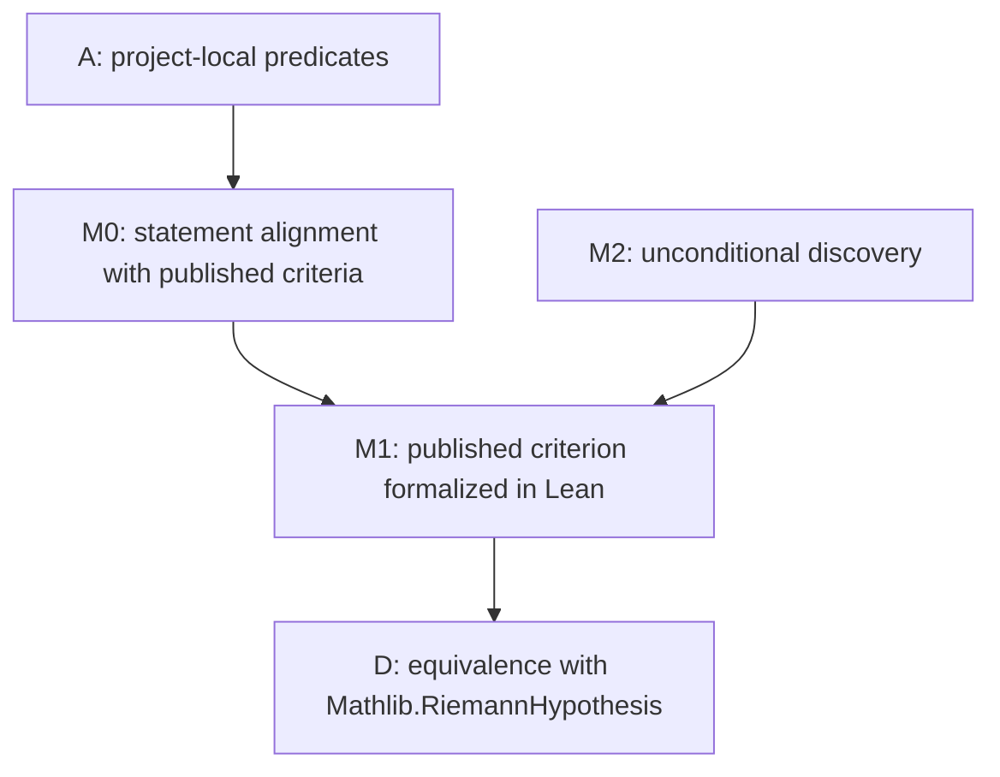

# RH Hard-Gap DAG

Date: 2026-07-11

This file is the fixed external gap ledger for future RH work. A future loop may only count as
research progress when it changes the status of one of these nodes. Local predicate wrappers,
rewrite bridges, finite-support transports, and one-step corollaries are engineering work unless
they reduce a node below.

## DAG

## Fixed Nodes

| node_id | status | description | current frontier |
| --- | --- | --- | --- |
| A | in progress | Project-local xi, Li, Nyman-Beurling, and Baez-Duarte scaffolding. | Mostly formalization scaffolding; not RH progress under v2. |
| M0 | complete | Align project-local Nyman-Beurling/Baez-Duarte predicates with published statements. | The positive-natural Baez-Duarte closure side is aligned in real and complex `L2(0,infinity)`: parameter indexing, kernel formula, target, closed span, whole-line error, endpoint, tolerance, and coefficient field are Lean-checked. |
| M1 | in progress | Formalize one accurately cited published Nyman-Beurling or Baez-Duarte criterion. | The exact eligible closure side is fixed. Batches M1-02 through M1-06 closed F2/F3 and the supporting transforms. Batch M1-09 closes the unconditional critical-line zeta-convexity component of F1 with exponent `3/8`; Balazard-Saias remains the forward quantitative gap. |
| D | open | Connect the formalized criterion to `Mathlib.RiemannHypothesis`. | No direct bridge yet. |
| M2 | parked | Unconditional discovery route: explicit approximants with error tending to zero, or a literature-audited new structural lemma. | Parked unless a novelty audit justifies work. |

## Hard Gaps

| gap_id | node_id | status | description |
| --- | --- | --- | --- |
| G1 | M1/D | open | Formalize the classical Nyman-Beurling/Baez-Duarte equivalence with RH, using either Beurling's moment-constrained unit-interval space or Baez-Duarte's full-line space, and connect it to `Mathlib.RiemannHypothesis`. |
| G2 | M1 | in progress | Available: full-line `L2`, finite-error/field alignment, exact kernel Mellin transforms, weighted-log Fourier-Mellin isometry and Plancherel, source power-majorant integrability, countability/nullity of critical-line zeta-zero ordinates, almost-everywhere convergence of the epsilon-dependent zeta ratio, Baez-Duarte Lemma 2.2 with an epsilon-independent `L2` majorant, the quantitative weighted-to-unweighted tail transfer, and an unconditional critical-line zeta bound with exponent `3/8`. The source tail exponent is Lean-verified as `1+2*epsilon`. Missing forward block F1 is now precisely the Balazard-Saias Mobius partial-sum estimate in Burnol's route. Missing reverse block: the base Nyman-Beurling criterion and its half-plane Hardy-space factorization infrastructure. |
| G3 | M2 | parked | Construct unconditional finite approximants with error tending to zero. In the NB/BD framework this is essentially the hard RH direction; numerical convergence is not evidence. |

## Loop Reporting Policy

Every future loop or engineering batch must report:

- `hard_gap_before`
- `hard_gap_after`
- `hard_gap_delta`
- `assumption_frontier_before`
- `assumption_frontier_after`

If all hard gaps are unchanged, the loop result is at most `FORMALIZATION_ONLY`.

## Current Governance State

- Loops 1-130 do not reduce G1, G2, or G3 under v2.
- The proposed loop-131 corollary
  `nymanBeurlingBaezDuarteConcreteApprox -> nymanBeurlingConcreteApprox` is a mechanical batch
  item on node A. It is not an accepted standalone research loop.
- Audit `AUDIT-20260710-M0-01` proved `nymanBeurlingConcreteApprox` unconditionally by using
  parameters `1` and `-1`. The unrestricted branch is falsified as a criterion carrier, and the
  governance decision is `PIVOT` to exact restricted-statement alignment.
- Batch `BATCH-20260710-M0-02` proved the project restricted closure/tolerance equivalence and
  computed the omitted `(1, infinity)` tail as the square of `sum c_k * a_k`. The result is
  `DEPENDENCY_GAP_IDENTIFIED`: current restricted and positive-natural local predicates omit the
  moment/tail condition present in the published criteria.
- Batch `BATCH-20260710-M0-03` defined the positive-natural split full-line error, proved its
  normalized form `unitIntervalError + reciprocalMoment^2`, and packaged the source-faithful
  positive-tolerance predicate. Result: `FORMALIZATION_ONLY`; M1/G1 and RH remain open.
- Batch `BATCH-20260710-M0-04` packaged the target and positive-natural kernels in the actual real
  `L2(0, infinity)` space and proved closure membership equivalent to the Batch 03 predicate. The
  endpoint difference is discharged by a null-set integral identity. Result:
  `FORMALIZATION_ONLY`; the coefficient-field convention remains under M0, while M1/G1 and RH are
  unchanged.
- Batch `BATCH-20260710-M0-05` inspected the primary Baez-Duarte paper, proved the source kernel
  formula, packaged the complex `L2(0, infinity)` closed span, and proved complex target closure
  membership equivalent to the real closure and source-aligned finite-error predicate. Result:
  `HARD_GAP_REDUCED`; fixed node M0 is complete. M1/G1, D, and RH remain open.
- Audit `AUDIT-20260710-M1-01` compiled
  `RiemannHypothesis.riemannZeta_ne_zero_of_half_le_lt_re` and compared every Theorem 1.1 proof
  block against the pinned mathlib tree. Result: `DEPENDENCY_GAP_IDENTIFIED`. G2 is narrowed to
  explicit forward and reverse theorem boundaries; G1 and RH remain unproved.
- Batch `BATCH-20260710-M1-02` audited external Lean projects, vendored only the trusted
  Abel-continuation source subset from `PrimeNumberTheoremAnd`, extended its formula to the full
  half-plane `re(s) > 0`, and proved `hasMellin_fractionalPartKernel_one` plus
  `hasMellin_baezDuarteKernel`. Result: `HARD_GAP_REDUCED`; the fractional-kernel Mellin block is
  closed, while the quantitative Mobius, weighted-log isometry, convergence, and reverse-criterion
  gaps remain.
- Batch `BATCH-20260711-M1-03` proved the weighted logarithmic change of variables is an
  invertible complex-linear isometry from `L2(0,infinity)` to `L2(real line)`, exposed both
  representatives, composed it with Fourier Plancherel, and verified the `tau/(2*pi)` frequency
  normalization. Result: `HARD_GAP_REDUCED`; the weighted-log isometry block is closed, while the
  quantitative Mobius, RH-to-Lindelof, source-convergence, and reverse-criterion gaps remain.
- Batch `BATCH-20260711-M1-04` inspected both source convergence passages and compiled the exact
  power-majorant `L2` statements, the countability and nullity of critical-line zeta-zero
  ordinates, and almost-everywhere convergence of the source zeta ratio to one. Result:
  `DEPENDENCY_GAP_IDENTIFIED`; G2 remains open but its broad convergence item is replaced by F1-F3
  above. The source's malformed displayed Gamma ratio and ambiguous tail exponent are recorded in
  `research/m1_source_convergence_boundary_20260711.md` and are not assumed.
- Batch `BATCH-20260711-M1-05` reconstructed the source tail formula from `f_(delta,n)`, Lean-checked
  the `1+2*epsilon` exponent, and proved the quotient-level estimate
  `norm(f)^2 <= (1+2*epsilon)*norm(x^(-epsilon)f)^2` for errors with an `m/x` tail. It also proves
  the varying-epsilon convergence transfer and instantiates the estimate on actual natural-kernel
  finite sums. Result: `HARD_GAP_REDUCED`; F3 is removed, while F1, F2, and the reverse criterion
  remain open.
- Batch `BATCH-20260711-M1-06` vendored the audited Apache-2.0 digamma-series module, derived a
  vertical-strip Gamma quotient estimate by Gronwall, reconstructed the correct completed-Gamma
  ratio from the zeta functional equation, and proved a uniform Baez-Duarte zeta-ratio bound on a
  fixed positive epsilon interval. Lean also verifies that the resulting transformed quotients are
  dominated by one explicit `MemLp` function. Result: `HARD_GAP_REDUCED`; F2 is removed, while F1
  and the reverse base criterion remain open.
- Audit `AUDIT-20260711-M1-07` compared Baez-Duarte's fixed-epsilon argument with Burnol's
  published alternative. Burnol combines the Balazard-Saias estimate with the unconditional
  critical-line convexity bound `zeta(1/2+it)=O(|t|^(1/4))`, so RH-to-Lindelof is not required for
  this route. The pinned and public Lean audit found neither Balazard-Saias nor a zeta convexity
  exponent below `1/2`; an Apache-2.0 external module supplies only a linear strip bound, while an
  unlicensed exploration leaves the weighted Phragmen-Lindelof core as an axiom. Result:
  `DEPENDENCY_GAP_IDENTIFIED`; F1 is corrected but remains open.
- Batch `BATCH-20260711-M1-08` compiled the removable entire function `(s-1)zeta(s)`, an Abel
  truncation bound of exponent `1/8` on `Re(s)=1`, exact Gamma-reflection cancellation on
  `Re(s)=0`, and the resulting pole-removed boundary exponents `9/8` and `13/8`. The fixed
  critical-line `3/8` target remains open because the corrected Fiori midpoint quotient and its
  uniform interior growth witness are not yet formalized. Result: `FORMALIZATION_ONLY`; G2/F1 is
  unchanged and no interpolation theorem is assumed.
- Batch `BATCH-20260711-M1-09` formalized Fiori's corrected analytic midpoint symmetrization with
  integer powers `(13,9)`, extended both edge estimates over compact segments, and discharged the
  exact `PhragmenLindelof.vertical_strip` growth premise using the audited finite-order bound for
  `(s-1)zeta(s)`. Lean derives pole-removed exponent `11/8` and the unconditional critical-line
  bound `|zeta(1/2+it)| <= C*(1+|t|)^(3/8)`. Result: `HARD_GAP_REDUCED`; the zeta-convexity
  component is removed from F1, while Balazard-Saias, the reverse criterion, G1, D, and RH remain
  open.
- Batch `BATCH-20260711-M1-10` encodes the exact Balazard-Saias statement as an explicit proposition
  and Lean-checks its complete Burnol consumer chain. The compiled `3/8` zeta bound gives quotient
  decay `-5/8`; hence the source height exponent must satisfy `eta < 1/8`, and the coefficient
  `N^(-delta/3)` tends to zero. The encoded estimate is never asserted or hidden as an axiom.
  Result: `FORMALIZATION_ONLY` with `hard_gap_delta = 0`; G2/F1 remains exactly Balazard-Saias.
