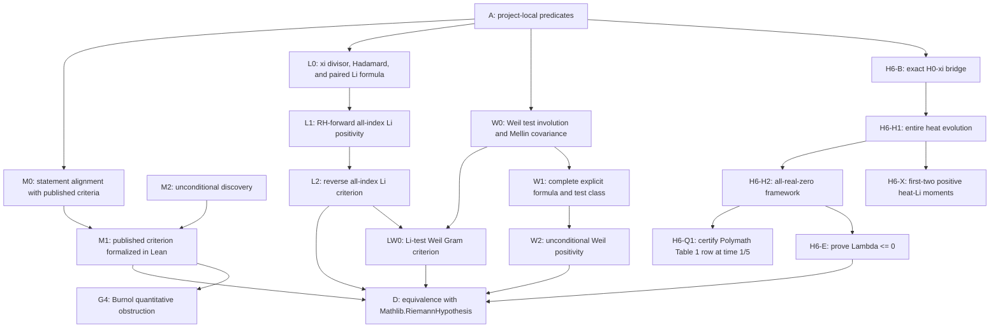

# RH Hard-Gap DAG

Date: 2026-07-17

This file is the external gap ledger for RH work under
[`rh_governance_current.md`](rh_governance_current.md). Local predicate wrappers, rewrite bridges,
finite-support transports, and one-step corollaries are engineering work unless they change an
open mathematical frontier. RH itself and every open node may be attacked directly.

## DAG

## Fixed Nodes

| node_id | status | description | current frontier |
| --- | --- | --- | --- |
| A | in progress | Project-local xi, Li, Nyman-Beurling, and Baez-Duarte scaffolding. | Mostly formalization infrastructure; classify it separately from unconditional RH progress. |
| M0 | complete | Align project-local Nyman-Beurling/Baez-Duarte predicates with published statements. | The positive-natural Baez-Duarte closure side is aligned in real and complex `L2(0,infinity)`: parameter indexing, kernel formula, target, closed span, whole-line error, endpoint, tolerance, and coefficient field are Lean-checked. |
| M1 | complete | Formalize one accurately cited published Nyman-Beurling or Baez-Duarte criterion. | Batch M1-18 compiles both directions of the exact strong positive-natural Baez-Duarte criterion in full-half-line complex `L2`. |
| D | complete | Connect the formalized criterion to `Mathlib.RiemannHypothesis`. | `riemannHypothesis_iff_baezDuarteComplexTarget_mem_kernelClosure` is the exact compiled bridge. |
| M2 | open | Unconditional discovery route: explicit approximants with error tending to zero, or a new structural lemma. | Direct `PROOF-ATTEMPT` is allowed; preregister the exact endpoint, known obstacle, and new attack angle. |
| B1 | complete | Formalize Burnol's published quantitative lower bound for the Nyman-Beurling approximation distance. | Batches G4-F0 through G4-F5 are public. The full RH-conditional continuous zero-sum lower bound and exact natural-distance liminf transfer are Lean-checked. This is known mathematics, not M2 progress. |
| L0 | complete | Align the project xi divisor, genus-one Hadamard product, all-index Li family, and symmetry-paired raw zero formula. | The multiplicity-bearing paired formula is public and all infinite-sum operations are Lean-checked. |
| L1 | complete | Prove the RH-forward all-index Li real-part nonnegativity direction. | Under RH every paired summand is exactly half a complex norm square. |
| L2 | complete | Prove all-index Li real-part nonnegativity implies `Mathlib.RiemannHypothesis`. | The project-specialized Bombieri-Lagarias argument compiles: finite threshold superlevels, simultaneous phase recurrence, fixed-weight tail domination, an off-line-to-negative-coefficient theorem, and the exact Li/RH iff. Implementation and evidence commits passed public CI runs `29406614212` and `29406932411`. |
| LW0 | complete | Construct the multiplicity-bearing Li-test Weil Gram form and prove positivity on every finite real combination is exactly equivalent to RH. | The reflection-averaged kernel, exact Li matrix, RH norm-square formula, and finite-real-span positivity iff are public. Implementation commit `2317143e73e1d788d65dcdff9b609a98f8ac60b2` passed public CI run `29415448733`. This is known-theorem formalization with hard_gap_delta=0. |
| W0 | complete | Formalize Weil's multiplicative test-function involution, conjugate star, and exact Mellin covariance. | `WeilTestAlgebra.lean` proves pointwise involutivity on `0<x`, the zero-boundary counterexample, convergence iff, endpoint swap, conjugate-star covariance, and critical-line specialization. This is test algebra only. |
| W1 | open | Formalize a source-faithful admissible test class, multiplicative convolution, and the complete zero/prime/pole/archimedean explicit formula. | W1a, W1b's physical analytic-strip algebra core, W1c0, and the Gaussian test cores are public. The complete compact `C^6` reflection-class formula and its arbitrary-finite-`F` RH-equivalent positivity criterion are public; quotient/completeness, closure identification, continuity, and distributional regularization remain. |
| W2 | open | Prove unconditional Weil positivity on a complete RH-equivalent test class. | The finite equal-width Gaussian arithmetic family is now publicly Lean-equivalent to RH: W2g0 gives the forward square identity, W2g1 gives the reverse separator criterion, and W2g2 compresses the width quantifier to any one preassigned positive width. None supplies the unconditional sign, so W2 and G7 remain fully open. Connes-Consani's semi-local mechanism is explicitly conjectural and is not a premise. |
| H6-B | complete | Align the Polymath-normalized de Bruijn-Newman heat family at time zero with the project xi. | `deBruijnNewmanH_zero_eq_riemannXi` proves `H_0(z) = (1/8) * riemannXi((1+i*z)/2)` from explicit theta-kernel and Mellin calculations. This is a definition bridge with `hard_gap_delta=0`. |
| H6-H1 | complete | Prove the exact source family is entire in space for every real time and satisfies the backward heat equation. | `DeBruijnNewmanHeat.lean` proves arbitrary quadratic/linear weighted integrability, differentiation in time and twice in complex space, and `partial_t H_t = -partial_z^2 H_t` on all `R x C`. This is analytic infrastructure with `hard_gap_delta=0`. |
| H6-H | open globally; H2a-H2f and zero-dynamics interfaces compiled | Formalize the all-real-zero predicate, de Bruijn forward preservation, threshold existence, threshold closedness, strip contraction, and the full Polymath regional-continuation interface for the exact H6-B/H6-H1 family. | The framework reaches the unconditional `t=1/2` witness, arbitrary-base strip contraction, and the complete conditional Polymath three-region criterion. Simple contacts use the regularized divisor force; repeated contacts use compiler-checked backward Hermite splitting and zero transfer. The three unconditional Table 1 region certificates, global enumeration/continuation beyond the criterion, H6-E/G8, and RH remain open. |
| H6-Q1 | `PARKED_BY_USER_DIRECTIVE_20260722`; Loop 31 closure retained | Kernel-check the initial, final, and barrier certificates for the second row of Polymath Table 1 and derive `deBruijnNewmanAllZerosReal (1/5)` without hypotheses. | The conditional Polymath consumer, finite-height-RH initial bridge, complete Theorem 1.3 normalization, explicit final-region consumer, equation `(htz)`, fixed principal-power `5*pi/4` line integrability, every positive-integer local residue normalization, exact adjacent and finite `R_(0,0)` shifts, full Titchmarsh `(xio)`, finite equation `(39)`, and both actual-source contour shifts are public K0. Loops 10--30 reduce the Boyd analytic input through saddle geometry, boundary dispersion, and the near/middle/tail trace decomposition. Loop 31 reconstructs the actual scaled-Gamma Stieltjes formula noncircularly, proves direct and inverse `3/|z|^2` bounds, closes the shifted tail, inner trace, and both outer edges, and proves the unconditional dispersion certificate and Boyd--Nemes equation `(15)`. The inverse-Jacobian global-cut-stitching route remains bypassed and is no longer required for `(15)`. Proposition 6.1/6.3 and the remaining Table 1 certificate assembly, strict finite-sum certificates, finite RH through `3*10^12`, and compact barrier winding remain mathematically open but are parked because their endpoint is a numerical Newman upper-bound certificate. H6-E/G8 and RH remain open rather than parked. External Arb output is navigation evidence only. |
| H6-X | complete first-three finite endpoint | Prove theta-specific Li information for the exact heat family beyond the generic heat PDE. | `DeBruijnNewmanLiMoments.lean` publicly proves the exact first-two moment spine. `DeBruijnNewmanThirdLi.lean` extends it through `F_t'''(1)=64D`, `B*C<=A*D`, the exact third Li formula, and strict positive-real `liCoefficientCandidate 2`; implementation commit `1b521686d4e8561f01ba98a6ceaa4905ced4d92f` passed public CI run `29545583372`. This is finite-index route infrastructure with `hard_gap_delta=0`; no all-index extrapolation is made. |
| H6-X3 | complete public | Prove the actual-theta ordered covariance and third Li sign. | The one-integral monotone covariance certificate gives `B*C<=A*D`; together with `B^2<=A*C` and `liCoefficientCandidate_zero_re_lt_one`, Lean proves `0 < (liCoefficientCandidate 2).re` and zero imaginary part. Implementation `1b521686d4e8561f01ba98a6ceaa4905ced4d92f` and evidence `abf5ebf19e3636662a45eed7a5eff9e947c3c3b4` passed public CI. The exact aggregate is `deBruijnNewmanHeat_thirdLi_covariance_endpoint`; this does not reduce H6-E/G8. |
| H6-E | open | Prove all zeros of `H_0` are real, equivalently `Lambda <= 0` in the audited normalization. | The generic adjacent-gap and positive-kernel/Hankel routes are obstructed. The actual-theta heat-Li time-monotonicity candidate survived high-precision finite screening, and Lean compiles its exact reduction to RH plus the function-level heat-log evolution, but no all-index sign representation or global moving-divisor differentiation theorem was obtained. A new attack must supply that theta-specific input, height-aware continuation, or a different all-index invariant. The endpoint is unchanged. |
| H10-B | complete | Prove finite aggregate power-sum spectral rigidity and the reciprocal-pairing square-root-circle corollary. | The final finite-spectral step of function-field RH is publicly compiled. It proves no curve point-count bound and supplies no finite-spectrum or uniform-tail transfer for the Riemann zeta zero divisor; `hard_gap_delta=0`. |
| H10-C | evidence CI passed; final ledger pending | Test a countably infinite ordinary power-trace extension with nonzero reciprocal pairing. | Lean proves `Summable (alpha^k)` for positive `k` forces `q=0` under `alpha(sigma n)*alpha(n)=q`; a one-point finite witness shows the obstruction is specific to the infinite ordinary-trace transfer. Frozen implementation and immutable-evidence commits passed independent public CI; final-ledger CI remains before returning to route selection. |

## Hard Gaps

| gap_id | node_id | status | description |
| --- | --- | --- | --- |
| G1 | M1/D | complete | The exact strong positive-natural Baez-Duarte full-line closure criterion is Lean-equivalent to `Mathlib.RiemannHypothesis`. |
| G2 | M1 | complete | Batch M1-18 compiles the weighted finite formula, fixed-epsilon transformed limit, epsilon-to-zero dominated convergence, diagonal assembly, tail removal, and `RH -> closure`. |
| G3 | M2 | open | Construct unconditional finite approximants with error tending to zero. Numerical convergence can select a candidate but is not a proof premise. |
| G4 | B1 | complete | Burnol's RH-conditional lower bound `liminf D(lambda) * sqrt(log(1/lambda)) >= sqrt(sum_rho m_rho^2 / |rho|^2)` and its natural-subspace liminf consequence are publicly Lean-checked through the fixed F0-F5 frontier. M2/G3 is unchanged. |
| G5 | L2 | complete | Reverse the exact project Li criterion: from nonnegative real parts of every `liCoefficientCandidate n`, derive RH by a project-specialized Bombieri-Lagarias transformed-zero argument. |
| G6 | W1 | open | Prove the complete source-faithful Weil explicit formula and convolution-stable admissible test space, without dropping moment, density, convergence, or regularization conditions. |
| G7 | W2 | open | Supply an unconditional positivity mechanism on the full Weil class. The compiled finite Gaussian arithmetic family is exactly RH-equivalent; this sharper criterion still does not provide its unconditional sign and therefore does not reduce G7. |
| G8 | H6-E | open | Prove `Lambda <= 0`, equivalently all zeros of the compiled source-normalized `H_0` are real. The local pair law and adjacent estimate `(gap^2)'<=8` compile, but the exact quadratic audit proves that generic estimate is sharp and cannot yield a fixed backward interval. H6-X now supplies theta-specific positivity through the third Li expression only; the missing edge still requires an all-index mechanism or height-aware continuation through the first possible repeated zero. |
| OBS-H6-REVERSE-HEAT-LI-01 | H6-H/H6-E | complete obstruction | An exact degree-two heat-Xi polynomial has reflection symmetry, the forward heat PDE, nonvanishing at `s=1` for every nonnegative real time, and all time-one zeros on the critical line, yet its time-zero second Li value is `-64/9` and it has an off-line zero. Generic backward Li transfer is false; theta-specific structure is required. |
| OBS-H6-ADJACENT-GAP-EIGHT-01 | H6-H/H6-E | complete public obstruction | At every all-real time an adjacent simple pair satisfies `(gap^2)'<=8`, and integration gives only terminal-gap-squared divided by eight of backward persistence. An exact quadratic backward-heat family attains collision on that scale and inside every proposed positive uniform interval. Generic adjacent-gap geometry cannot close H6-E; theta-specific mechanisms remain open. Implementation `ce5b0c405f06078f549c6a27a477df04ccbcfb35` passed public CI run `29538670221`. |
| OBS-H6-POSITIVE-COSH-LI3-01 | H6-X/H6-E | complete public obstruction | A normalized positive two-atom `cosh` transform is entire, reflection symmetric, and has positive real first and second standard Li values, but its third Li value is strictly negative. Implementation commit `5fdfc5c7437349735c57552a75838f16b4d63f5e` passed public CI run `29543145545`, job `87769424525`; evidence commit `61ce528793a9fc04e4a6b26ba83463cf0557bafc` passed run `29543336971`, job `87770059112`. Positive-kernel and ordinary moment/Hankel positivity therefore cannot generically scale H6-Z to all indices; quantitative theta-kernel structure remains necessary. |
| OBS-H6-XI-LOGCONCAVITY-LEAN-01 | H6-E/G8 | complete public obstruction | At external commit `7a89db1`, the advertised log-concavity predicate and full-kernel endpoints conclude only `True`; decisive perturbation claims are custom axioms and the numerical script omits the infinite tail. The exact no-convergence Hurwitz axiom is Lean-refuted by `F_n=1` and `G(z)=z-i`. Implementation `8ecb002d1591ae93fbc23ba42c7a487c16c8beb5` passed public CI run `29550587517`, job `87792042425`; evidence `131aff89283644bcabd2f620b94f99dc6ae30843` passed run `29550788159`, job `87792636844`. Reject only this external certification chain: actual Xi-kernel TP2, TP-infinity, H6-E/G8, and RH remain open. |
| OBS-H6-XI-PF5-01 | H6 physical-kernel total positivity | complete public obstruction | The exact full-series Xi kernel has a negative `5x5` Toeplitz determinant at `(u0,h)=(1/100,1/20)`. Lean independently proves rational enclosures for all nine infinite `tsum` entries, an exact LU center determinant, a 120-permutation perturbation bound, and the source-faithful ordered `not PF5` witness. Classification `ACTUAL_KERNEL_PF5_FORMALLY_FALSIFIED`, with `hard_gap_delta=0` and `obstruction_map_delta=1`: PF5/PF-infinity physical-kernel routes are blocked, while global PF4, H6-E/G8, and RH remain open. Implementation `7bdf2b9ab08f2b298d1565921158ff9a199c867a` passed public CI run `29565362144`, job `87836632525`. |
| OBS-H6-XI-PF4-SEARCH-01 | H6 physical-kernel total positivity | public search boundary | A preregistered non-Toeplitz global-PF4 falsification search examined 11 million random seven-parameter configurations and 16,160,859 rational-lattice minors. No condition-resolved negative was found; every selected double-negative candidate became positive under high-precision numerical reevaluation. Classification `NO_PROGRESS`, with all progress deltas zero. This is neither a proof nor evidence of global PF4 and does not change H6-E/G8 or RH. Closure `503b83e35761e87b35fe7db3fb49feab8ea372de` passed public CI run `29567807097`, job `87844319595`. |
| OBS-H6-HEAT-LI-TIME-MONOTONICITY-01 | H6-X/H6-E/G8 | public search and proof boundary | The actual-theta conjecture that all heat-Li coefficients tend to zero at `atBot` and are nondecreasing on `t<=0` implies RH by a compiled exact reduction. Numerical derivative scans found no negative sign through project index 31 at 80/120/180 digits, through index 63 at 240 digits, or at time zero through index 127 at 500 digits; this is not proof evidence. Lean compiles `(partial_t F)/F=(1/4)*(deriv(logDeriv F)+(logDeriv F)^2)`, but the resulting cross-index convolution has no known theta-specific all-index sign. The moving-zero route separately lacks a global collision-compatible divisor transport and differentiated-`tsum` theorem. Classification `NO_PROGRESS`, `hard_gap_delta=0`, `route_infrastructure_delta=1`; the conjecture, H6-E/G8, and RH remain open. Implementation `fc2a32e8316f59370471597df9a8a26c02480bdd` passed public CI run `29570628316`, job `87853282509`; evidence `f4a26d5a1ee891099003221b766a2f19a39ab07b` passed run `29570843171`, job `87853982402`. |

## W1 Fixed Source Frontier

| edge | status | source-level content |
| --- | --- | --- |
| W1a | complete | Source-faithful `dy/y` convolution, exact convergence closure, Mellin product, star covariance, and critical-line `normSq` autocorrelation compile through logarithmic transport to Mathlib additive Bochner convolution. |
| W1b | complete | A positive-width physical class with pointwise closed-strip convergence, open-strip analyticity, closed-strip continuity, and a finite uniform bound is closed under vector operations, involution, conjugate star, convolution, and autocorrelation. Quotient/uniqueness/completeness and density are explicitly not claimed. Implementation commit `335d6dfa175a345555aaa408b5581ed743d2abf7` passed public CI run `29412820223`. |
| W1c0 | complete | On `Re(s)>1`, `WeilExplicitIntegrand.lean` proves the exact xi logarithmic-derivative identity joining the multiplicity-bearing Hadamard zero sum to the pole, `GammaR`, and von Mangoldt terms. Implementation `89d4dd12ebedc75c13261a0d43a9254b5931c30d` passed public CI run `29417432562`; evidence backfill `1b405639a4e28c72fc1e2484259c047ad95ed0b2` passed run `29417710278`. This is the analytic integrand only. |
| W1c1 | open | Integrate the compiled identity against a source-faithful test class and justify both the rectangle/zero cutoff passage and the complete arithmetic evaluation. The reflection-symmetrized compact-support class with six continuous derivatives is publicly complete on both zero and arithmetic sides; extension/identification with the full convolution-stable admissible class remains open. |
| W1c1g0 | complete | For the fixed centered Gaussian, selected zero-free right-line truncations converge to the absolute multiplicity-bearing Gaussian zero `tsum`. Implementation `00410cc2a6919acfa5835b121c47489c5105e0de` and evidence backfill `2292801d710a1a95857de69a92498c39ae79d0d3` passed public CI. This does not supply the generic class limit. |
| W1c1g1 | complete | `WeilGaussianExplicitFormula.lean` evaluates the same fixed Gaussian line integral into its exact pole, `GammaR`, and von Mangoldt terms, with every interchange and full-line limit proved. Implementation `6c65019d9de2d31127dd3bf8389994207c17dcb5` and evidence backfill `fa5fdc5aefd4dd3e99966cc1e0fcca62293e9600` passed public CI runs `29441160498` and `29441452307`. This does not close generic W1c1. |
| W1c1g2 | complete | `WeilSymmetricGaussianFamily.lean` proves the two-parameter family `exp(a(s-1/2)^2)cosh(b(s-1/2))`, including a generic selected-height rectangle skeleton, both translated von-Mangoldt kernels, the exact pole term, GammaR integrability, and `b=0` compatibility. Implementation `5c4ae54c031a6d999111390694ef738a3da57146` and evidence backfill `ed92d851f0eb697f2b2aec0e1260fe0002ea5bcf` passed public CI runs `29444276732` and `29444485950`. Schwartz/Hermite density, tempered extension, generic W1c1, and positivity remain open. |
| W1c1g3 | complete | `WeilFiniteGaussianTestCore.lean` proves the complete direct zero/pole/GammaR/prime explicit formula for every finite complex packet of positive-width symmetric Gaussian probes. Absolute summability, integrability, all finite interchanges, and singleton/empty reductions compile. Implementation `736901e03f08ccb399e4ec5f84980a641cb4e344` passed public CI run `29445905312`, job `87456185038`, in `2m33s`; evidence backfill `6d7433b694b60150c19ca67f85087ba0e0c6255b` passed run `29446148141`, job `87456989353`, in `1m26s`. This constructs the algebraic test core but does not prove its Schwartz density, functional continuity, tempered extension, generic W1c1, or positivity. |
| W1s0 | complete | `WeilCompactLaplaceSeparator.lean` constructs, for every selected multiplicity-bearing xi-divisor value and every positive tolerance, a smooth compactly supported log-line test normalized to one there with arbitrarily small absolute `tsum` on all different zero values. The proof compiles inverse-square transform decay, complete divisor summability, fixed-superlevel polynomial annihilation, and compact convolution-power suppression. Implementation `6d12bad98b80c34217757df01943509965a64781` and evidence `941756c2e7e0b4da8f765dc7187e4be703af36c8` passed public CI runs `29461298466` and `29461494669`. This is a reverse-separation component only: generic W1c1, the explicit formula for this class, W2/G7, and RH remain open. |
| W1c1c0 | complete | `WeilCompactLaplaceZeroCutoff.lean` proves the selected-height xi zero-side limit for the reflection symmetrization of every smooth compactly supported additive-log function. Lean derives transform differentiability, exact reflection, complete divisor summability, arbitrary integration by parts, inverse-sixth-power fixed-strip decay, and top-edge vanishing from smoothness and compact support alone. Implementation `0e6451944ee1edb2d76d67f4fe097de2aa19ad17` and evidence `6c2f3ab912097e4e5b325e9d0c27d43438a29d99` passed public CI runs `29464308480` and `29464469804`. The compact arithmetic evaluation, W2/G7, and RH remain open. |
| W1c1c1 | complete | `WeilCompactLaplaceArithmeticFormula.lean` proves the complete reflection-symmetrized compact-smooth explicit formula. Exact scaled Schwartz inversion yields `pi*vonMangoldt(n)*(f(log n)+f(-log n)/n)` with finite natural support; the pole pair contributes `2*pi*F(1)`; the GammaR product and prime line are integrable; and selected arithmetic limits match the complete multiplicity-bearing zero sum. Implementation `55a6406f235a7548bf7f7d53ae5d30014795e9ce` and evidence `ed5d03f65bd234f95afb55389b2766d611a3eeab` passed public CI runs `29466850965` and `29467021669`. Quotient/completeness, full-class continuity, regularization, W2/G7, and RH remain open. |
| W1c1c2 | complete | The C6 endpoint removes the compact formula's `C-infinity` Schwartz wrapper. General Fourier inversion follows from continuity and inverse-square decay, the first absolute Fourier moment from inverse-sixth decay, and the selected xi top edge from exactly six continuous derivatives. The old smooth formula remains a corollary. Implementation `3e3c677495c592096d7843aa4845e861bc393937` and evidence `94b6be8fc934b3d4909d066b168491389df9afd8` passed public CI runs `29468797210` and `29468980147`. Broader W1, W2/G7, and RH gaps are unchanged. |
| W1c1c3 | complete | The Connes--Consani/Yoshida compact-support criterion is Lean-equivalent to `Mathlib.RiemannHypothesis` for every finite zero-free `F` containing `0,1`. The reverse uses finite-constrained compact separators, the conjugate-reflection pair, complete multiplicity-bearing tails, and no assumed conjugation permutation. Implementation `d590ee42e37366388800bafda04020a84eee8452` and evidence `03e1661b077ab8d3e2f8c9b93b19aa63c3c1eebc` passed public CI runs `29487332091` and `29487596817`. This closes the compact criterion edge only; W1 full-class extension, W2/G7, and RH remain open. |
| W1c2 | open | Prove the complete distributional limit and all endpoint/local regularization choices, including the covariance extension. |

## W2 Open Frontier

| edge | status | source-level content |
| --- | --- | --- |
| W2g0 | complete | `WeilGaussianQuadraticPositivity.lean` applies the direct finite packet formula to ordered pairs with common width `a>0`, shift `b_i-b_j`, and real coefficient `w_i*w_j`. Under RH, every multiplicity-bearing zero term is `exp(-a*gamma^2)` times a cosine square plus a sine square; the real square family is summable, its `tsum` equals the direct zero packet, and the real part of the direct pole/GammaR/von-Mangoldt arithmetic expression is nonnegative. Implementation `cf271684f786efcb2e83a57d76c51e215205d1d1` passed public CI run `29447980403`, job `87463120301`, in `1m49s`; evidence backfill `dafcd758a5257718ed2c9f6c8813213a2821708e` passed run `29448199280`, job `87463856783`, in `1m32s`. This is RH-forward only and has zero hard-gap delta for unconditional W2, G7, and RH. |
| W2g1 | complete | `WeilGaussianPositivityCriterion.lean` proves the exact converse. Any off-line xi divisor zero is isolated by a finite real exponential separator; its protected lowest-decay square class is made strictly negative while the scaled higher tail vanishes by dominated convergence. The explicit formula yields a finite arithmetic quadratic with negative real part, so positivity of every such quadratic at `c=2` is equivalent to RH. Implementation `b2d2ce18ff1491f684098b04c7a5be73e0ebdc98` passed public CI run `29453270303`; evidence backfill `68e96525f3f89562ae47e1da9e074911701a6c2e` passed run `29453470463`; closure `ae2b970a8b6f883ea2e8245e264396381c279f56` passed run `29453660135`. This exact criterion has zero hard-gap delta for unconditional positivity, W2, G7, and RH. |
| W2g2 | complete | `WeilGaussianFixedWidthCriterion.lean` proves that every larger Gaussian width is a dominated limit of finite Rademacher exponential packets at any fixed base width `a0>0`. Combining this transfer with W2g1 gives the exact iff between RH and nonnegativity of all finite real arithmetic quadratics at exactly `a0`. Implementation `f56b70478ab552802cac719b8e9af0f56fc44b1d`, evidence `f93e73cbdd71785a28cc2b05f8ef2b0390b358cf`, and closure `8b45a091aa4f16e348a2cd8b73e949480f446508` passed public CI runs `29458594435`, `29458788171`, and `29458987040`. This compresses the parameter family but does not prove its unconditional sign; hard-gap delta remains zero for W2, G7, and RH. |
| W2p0 | complete | `WeilGaussianPrimeKernelSignAudit.lean` proves that the actual `n=2` symmetric Gaussian von-Mangoldt translation kernel is indefinite on an explicit two-shift family. Width `(log 2)^2/16` makes the off-diagonal exceed the diagonal; `(1,-1)` is a negative direction and the diagonal is positive. Implementation `01ea63517670a81b8c640de1135dec62d44436b9` and evidence `af7848aea84287329ce50900d5e425538165baaa` passed public CI runs `29462677629` and `29462828680`. This eliminates same-sign semidefinite assembly prime term by prime term, not cancellation in the complete arithmetic form. W2/G7 and RH remain open. |

## G4 Fixed Source Frontier

| edge | status | source-level content |
| --- | --- | --- |
| F0 | complete | Continuous `B_lambda`, finite natural `V_N`, distances, `V_N <= B_(1/N)`, `D(1/N) <= d_N`, and `1/N -> 0+` are Lean-checked in `BurnolLowerBound.lean`. |
| F1a | complete | `BurnolA.lean` defines the explicit floor formula, proves support in `(0,1]`, the exact Hardy-tail identity, `L2` membership, and `HasMellin A s ((s-1)zeta(s)/s^2)` for `0<Re(s)<1`. |
| F1b | complete | `BurnolHardy.lean` constructs the critical-line phase isometry, proves its explicit action on `chi` and every `rho(theta/t)`, transports the explicit model span, and proves `D(lambda)=dist(chi1,C_lambda)`. |
| F2 | complete | `BurnolY.lean` constructs the second source phase `V`, physical cutoff `Q_lambda`, `psi(w,k)`, the BBLS/Burnol oscillatory continuation, critical-line `L2` limits `Y(lambda,s,k)`, lambda-independent transformed representative bounds, exact model-kernel pairings, and analytic-order orthogonality to the full model span. |
| F3 | complete | Gram-block and target-pairing asymptotics, including the Hilbert/Cauchy inverse entry `m^2`, unequal multiplicity blocks, and inverse convergence, are publicly Lean-checked. |
| F4 | complete | The RH-conditional finite-zero-set liminf lower bound is publicly Lean-checked. |
| F5 | complete | The full extended zero sum and exact natural-distance asymptotic liminf transfer are publicly Lean-checked. |

## Post-M1 Open-Route Rule

- `G3/M2`, `W2/G7`, and RH are open and selectable without approval. Direct attacks use the
  `PROOF-ATTEMPT` preregistration and output audit.
- `G4` is an adjacent known-mathematics line. Closing it is `KNOWN_THEOREM_FORMALIZED`, not
  `HARD_GAP_REDUCED` for RH and not evidence that the approximation distance tends to zero.
- Mathlib upstreaming is an engineering/publication track and must not be reported as a change to
  `M2` or `G3`.

## External Publication Gate

The final M1 equivalence may be described inside this repository as a compiled project-local
formalization aligned with Baez-Duarte 2002. A public claim of "first formalization" or a release
claim that the equivalence has passed external review requires all three independent gates:

| gate | status | evidence required |
| --- | --- | --- |
| P1a | complete | Clean-context Sol 5.6 max review `019f59c3-c4c7-7b63-a203-c25a12034c14`; no P0-P3 finding, decision `CONTINUE`, for the earlier Baez-Duarte/contour surface. See `research/m1_sol_max_review_20260713.md`. |
| P1b | complete | Separate clean-context Sol 5.6 max review found no P0-P2 issue and two P3 statement/attribution corrections. See `research/li_weil_sol_max_review_20260717.md`. |
| P2 | pending human publication | Lean Zulip `#maths` statement/definition review with no unresolved objection; the request must be written by the user in their own words under current mathlib policy. |
| P3 | complete within fixed scope | Bounded novelty audit covering pinned mathlib, Isabelle AFP, PNT+, selected external Lean repositories, and primary literature. See `research/exposure_novelty_audit_20260716.md`; it explicitly makes no global absence or first-formalization claim. |

Until P1a-P3 are complete, repository documentation must not call this the first formalization.

## Loop Reporting Policy

Every future loop or engineering batch must report:

- `hard_gap_before`
- `hard_gap_after`
- `hard_gap_delta`
- `assumption_frontier_before`
- `assumption_frontier_after`

If all hard gaps are unchanged, the loop result is at most `FORMALIZATION_ONLY`.

## Current Governance State

- Loops 1-130 do not reduce G1, G2, or G3 under v2.
- The proposed loop-131 corollary
  `nymanBeurlingBaezDuarteConcreteApprox -> nymanBeurlingConcreteApprox` is a mechanical batch
  item on node A. It is not an accepted standalone research loop.
- Audit `AUDIT-20260710-M0-01` proved `nymanBeurlingConcreteApprox` unconditionally by using
  parameters `1` and `-1`. The unrestricted branch is falsified as a criterion carrier, and the
  governance decision is `PIVOT` to exact restricted-statement alignment.
- Batch `BATCH-20260710-M0-02` proved the project restricted closure/tolerance equivalence and
  computed the omitted `(1, infinity)` tail as the square of `sum c_k * a_k`. The result is
  `DEPENDENCY_GAP_IDENTIFIED`: current restricted and positive-natural local predicates omit the
  moment/tail condition present in the published criteria.
- Batch `BATCH-20260710-M0-03` defined the positive-natural split full-line error, proved its
  normalized form `unitIntervalError + reciprocalMoment^2`, and packaged the source-faithful
  positive-tolerance predicate. Result: `FORMALIZATION_ONLY`; M1/G1 and RH remain open.
- Batch `BATCH-20260710-M0-04` packaged the target and positive-natural kernels in the actual real
  `L2(0, infinity)` space and proved closure membership equivalent to the Batch 03 predicate. The
  endpoint difference is discharged by a null-set integral identity. Result:
  `FORMALIZATION_ONLY`; the coefficient-field convention remains under M0, while M1/G1 and RH are
  unchanged.
- Batch `BATCH-20260710-M0-05` inspected the primary Baez-Duarte paper, proved the source kernel
  formula, packaged the complex `L2(0, infinity)` closed span, and proved complex target closure
  membership equivalent to the real closure and source-aligned finite-error predicate. Result:
  `HARD_GAP_REDUCED`; fixed node M0 is complete. M1/G1, D, and RH remain open.
- Audit `AUDIT-20260710-M1-01` compiled
  `RiemannHypothesis.riemannZeta_ne_zero_of_half_le_lt_re` and compared every Theorem 1.1 proof
  block against the pinned mathlib tree. Result: `DEPENDENCY_GAP_IDENTIFIED`. G2 is narrowed to
  explicit forward and reverse theorem boundaries; G1 and RH remain unproved.
- Batch `BATCH-20260710-M1-02` audited external Lean projects, vendored only the trusted
  Abel-continuation source subset from `PrimeNumberTheoremAnd`, extended its formula to the full
  half-plane `re(s) > 0`, and proved `hasMellin_fractionalPartKernel_one` plus
  `hasMellin_baezDuarteKernel`. Result: `HARD_GAP_REDUCED`; the fractional-kernel Mellin block is
  closed, while the quantitative Mobius, weighted-log isometry, convergence, and reverse-criterion
  gaps remain.
- Batch `BATCH-20260711-M1-03` proved the weighted logarithmic change of variables is an
  invertible complex-linear isometry from `L2(0,infinity)` to `L2(real line)`, exposed both
  representatives, composed it with Fourier Plancherel, and verified the `tau/(2*pi)` frequency
  normalization. Result: `HARD_GAP_REDUCED`; the weighted-log isometry block is closed, while the
  quantitative Mobius, RH-to-Lindelof, source-convergence, and reverse-criterion gaps remain.
- Batch `BATCH-20260711-M1-04` inspected both source convergence passages and compiled the exact
  power-majorant `L2` statements, the countability and nullity of critical-line zeta-zero
  ordinates, and almost-everywhere convergence of the source zeta ratio to one. Result:
  `DEPENDENCY_GAP_IDENTIFIED`; G2 remains open but its broad convergence item is replaced by F1-F3
  above. The source's malformed displayed Gamma ratio and ambiguous tail exponent are recorded in
  `research/m1_source_convergence_boundary_20260711.md` and are not assumed.
- Batch `BATCH-20260711-M1-05` reconstructed the source tail formula from `f_(delta,n)`, Lean-checked
  the `1+2*epsilon` exponent, and proved the quotient-level estimate
  `norm(f)^2 <= (1+2*epsilon)*norm(x^(-epsilon)f)^2` for errors with an `m/x` tail. It also proves
  the varying-epsilon convergence transfer and instantiates the estimate on actual natural-kernel
  finite sums. Result: `HARD_GAP_REDUCED`; F3 is removed, while F1, F2, and the reverse criterion
  remain open.
- Batch `BATCH-20260711-M1-06` vendored the audited Apache-2.0 digamma-series module, derived a
  vertical-strip Gamma quotient estimate by Gronwall, reconstructed the correct completed-Gamma
  ratio from the zeta functional equation, and proved a uniform Baez-Duarte zeta-ratio bound on a
  fixed positive epsilon interval. Lean also verifies that the resulting transformed quotients are
  dominated by one explicit `MemLp` function. Result: `HARD_GAP_REDUCED`; F2 is removed, while F1
  and the reverse base criterion remain open.
- Audit `AUDIT-20260711-M1-07` compared Baez-Duarte's fixed-epsilon argument with Burnol's
  published alternative. Burnol combines the Balazard-Saias estimate with the unconditional
  critical-line convexity bound `zeta(1/2+it)=O(|t|^(1/4))`, so RH-to-Lindelof is not required for
  this route. The pinned and public Lean audit found neither Balazard-Saias nor a zeta convexity
  exponent below `1/2`; an Apache-2.0 external module supplies only a linear strip bound, while an
  unlicensed exploration leaves the weighted Phragmen-Lindelof core as an axiom. Result:
  `DEPENDENCY_GAP_IDENTIFIED`; F1 is corrected but remains open.
- Batch `BATCH-20260711-M1-08` compiled the removable entire function `(s-1)zeta(s)`, an Abel
  truncation bound of exponent `1/8` on `Re(s)=1`, exact Gamma-reflection cancellation on
  `Re(s)=0`, and the resulting pole-removed boundary exponents `9/8` and `13/8`. The fixed
  critical-line `3/8` target remains open because the corrected Fiori midpoint quotient and its
  uniform interior growth witness are not yet formalized. Result: `FORMALIZATION_ONLY`; G2/F1 is
  unchanged and no interpolation theorem is assumed.
- Batch `BATCH-20260711-M1-09` formalized Fiori's corrected analytic midpoint symmetrization with
  integer powers `(13,9)`, extended both edge estimates over compact segments, and discharged the
  exact `PhragmenLindelof.vertical_strip` growth premise using the audited finite-order bound for
  `(s-1)zeta(s)`. Lean derives pole-removed exponent `11/8` and the unconditional critical-line
  bound `|zeta(1/2+it)| <= C*(1+|t|)^(3/8)`. Result: `HARD_GAP_REDUCED`; the zeta-convexity
  component is removed from F1, while Balazard-Saias, the reverse criterion, G1, D, and RH remain
  open.
- Batch `BATCH-20260711-M1-10` encodes the exact Balazard-Saias statement as an explicit proposition
  and Lean-checks its complete Burnol consumer chain. The compiled `3/8` zeta bound gives quotient
  decay `-5/8`; hence the source height exponent must satisfy `eta < 1/8`, and the coefficient
  `N^(-delta/3)` tends to zero. The encoded estimate is never asserted or hidden as an axiom.
  Result: `FORMALIZATION_ONLY` with `hard_gap_delta = 0`; G2/F1 remains exactly Balazard-Saias.
- Batch `BATCH-20260711-M1-11` reads Titchmarsh Sections 3.12, 14.2, and 14.25 and decomposes the
  Balazard-Saias source route into truncated Perron, reciprocal-zeta subpower growth, and contour
  balancing. Lean proves that a nonvanishing holomorphic function on a simply connected open set
  has a holomorphic logarithm branch with derivative `g'/g`, and applies it to zeta on zero-free
  domains that explicitly avoid `1`. Result: `DEPENDENCY_GAP_IDENTIFIED`, `hard_gap_delta = 0`;
  the next hard subedge is the Borel-Caratheodory/Hadamard reciprocal-zeta bound, while G2/F1
  remains Balazard-Saias.
- Batch `BATCH-20260711-M1-12` formalizes Titchmarsh 14.2 in the exact RH specialization required
  downstream. Lean derives a coarse outer-circle zeta bound from Abel continuation, normalizes a
  zero-free analytic logarithm, applies Borel-Caratheodory, derives three-circles from Mathlib's
  Hadamard three-lines theorem, proves the uniform interpolation exponent is strictly below one,
  exponentiates to arbitrary positive powers, and patches finite heights by residue control and
  compactness. Result: `HARD_GAP_REDUCED`; remove only the reciprocal-zeta subpower subedge. The
  Balazard-Saias estimate, reverse criterion, G1, D, and RH remain open.
- Batch `BATCH-20260711-M1-13` audits Titchmarsh Lemma 3.12 and formalizes the no-pole half of its
  truncated Perron kernel argument. Lean checks the right-half-plane rectangle identity, both
  horizontal estimates, vanishing of the remote vertical side, and the quantitative `c=2`,
  `0<y<1` kernel bound. The sole Mobius truncated Perron target remains open: the exact next
  dependency is the positive-side `2*pi*i` residue contribution for `1/w`, followed by series
  interchange and source-error summation. Result: `DEPENDENCY_GAP_IDENTIFIED`;
  `hard_gap_delta=0`.
- Batch `BATCH-20260711-M1-14` closes the source-specialized Mobius truncated Perron input. Lean
  computes the crossing-pole rectangle boundary from explicit arctangent integrals, obtains both
  single-coefficient kernel estimates, exchanges the absolutely convergent Mobius series with the
  finite interval integral by dominated convergence, and sums the half-integral spacing errors
  with an `n^(-3/2)` majorant. The exact absolute `C*(N+1)^2/T` theorem compiles. Result:
  `HARD_GAP_REDUCED`; remove only `G2/F1/Balazard-Saias/truncated-Perron`. Contour shifting and
  error balancing remain, so Balazard-Saias and G2 are open.
- Batch `BATCH-20260711-M1-15` closes the preregistered RH-specialized Balazard-Saias estimate.
  Lean formalizes the analytic reciprocal at the zeta pole, the residue-subtracted rectangle
  identity, logarithmic left-edge integration, both horizontal-edge bounds, and the simultaneous
  choice `T=(N+1/2)^3*(1+|Im(s)|)`. The compiled Burnol consumer has no `hBS` premise. Result:
  `HARD_GAP_REDUCED`; remove the contour-balancing subedge and close forward block F1. The stronger
  general-alpha proposition and the reverse criterion remain open, so M1, G2, G1, D, and RH are
  not complete.
- Batch `BATCH-20260711-M1-16` closes the reverse implication for the exact M0-aligned carrier.
  Lean proves the full Mellin transform of finite natural-kernel sums vanishes at a zeta zero,
  controls the local error by Holder, computes the exact `m/x` tail contribution, and reflects
  left-side nontrivial zeros with the completed-zeta functional equation. Result:
  `HARD_GAP_REDUCED`; remove `G2/reverse/base-criterion`. The earlier projected Hardy-space
  dependency is bypassed for this exact carrier, without asserting the general base criterion.
  The forward RH-to-closure convergence assembly remains, so M1, G2, G1, D, and RH are open.
- Batch `BATCH-20260711-M1-17` closes the fixed-positive-delta forward convergence subedge. Lean
  packages the exact source Mobius sums in real and complex `L2`, proves their finite Mellin
  formula, derives classical/L2 Fourier compatibility through tempered distributions and
  Fourier-Fubini, rescales Burnol's vertical majorant, and proves the complex approximants are
  Cauchy under RH. Completeness and the real-part map give a real norm limit in the natural-kernel
  closure. Result: `HARD_GAP_REDUCED`; remove only
  `G2/forward/fixed-epsilon-natural-convergence`. The unconditional `delta -> 0` source limit and
  final RH-to-target-closure assembly remain, so M1, G2, G1, D, and RH are open.
- Batch `BATCH-20260711-M1-18` closes `G2/forward/delta-to-zero-and-assembly`. Lean proves the
  finite weighted formula, fixed-epsilon transformed convergence, epsilon-to-zero dominated
  convergence, diagonal selection, and exact tail removal. The forward closure theorem combines
  with M1-16 as `riemannHypothesis_iff_baezDuarteComplexTarget_mem_kernelClosure`. Result:
  `KNOWN_THEOREM_FORMALIZED`; M1, G1, G2, and D are complete. This is a criterion equivalence,
  not an unconditional proof of either side; G3/M2 was historically unselected (open under V4.1).
- Batch `BATCH-20260713-G4-F1A` closes the explicit-function half of Burnol's unitary model. Lean
  checks the source floor formula including its tail constant, proves the exact Hardy-tail
  representation and `L2` membership, establishes absolute integrability on the triangle
  `0<t<u`, and uses Fubini to prove `Mellin(A)(s)=(s-1)zeta(s)/s^2` on `0<Re(s)<1`. Result:
  `KNOWN_THEOREM_FORMALIZED`; close only G4/F1a and select F1b. F2-F5 and M2/G3 are unchanged.
- Batch `BATCH-20260713-G4-F1B` closes the complete unitary distance-model edge. Lean constructs
  the critical-line multiplier `(s-1)/s` as a complex `L2` isometric equivalence, conjugates it by
  Fourier-Mellin, proves `T chi=chi1` and `T rho(theta/t)=-A(t/theta)` for every admissible
  `theta`, maps the original span exactly onto the explicit model span, and proves the exact
  distance equality. Result: `KNOWN_THEOREM_FORMALIZED`; close only G4/F1b and select F2. F3-F5
  and M2/G3 are unchanged.
- Audit `AUDIT-20260713-G4-F2-01` recovers the exact Burnol-vector construction. F2 uses the phase
  `V=conj(Mellin(A))/Mellin(A)`, not the completed F1b distance isometry. Its boundary limit
  depends essentially on the BBLS Lemma 4/6 oscillatory estimates for `k=0`, Burnol's `k>=1`
  integral/series extension, two Hardy averages, and dominated convergence after `Q_lambda`.
  Result: `DEPENDENCY_GAP_IDENTIFIED`; F2 remains open and selected as one indivisible batch that
  must include F3-ready representative bounds and zero-order orthogonality. F3-F5 and M2/G3 are
  unchanged.
- Batch `BATCH-20260713-G4-F2` closes the indivisible boundary-vector edge. Lean constructs the
  total second phase, physical time reversal and cutoff, all-order `psi` and oscillatory `phi`,
  proves the exact interior Mellin/Fourier phase identity, obtains a local-uniform square-
  integrable majorant and the critical-line `L2` limit, exposes F3-ready small/large physical
  bounds, proves the direct normalized source pairing, and converts analytic zeta order to
  orthogonality against the complete model span. Result: `KNOWN_THEOREM_FORMALIZED`; close F2 and
  select F3. F4-F5 and M2/G3 are unchanged.
- Batch `BATCH-20260714-G4-F3` closes the indivisible source-formalization edge. The
  batch. The actual normalized Gram entries, physical `chi1` image and both target-pairing cases,
  explicit `O(t^2)` small-end decay, Hilbert determinant and inverse `(0,0)=m^2`, generic inverse
  continuity, and actual finite Burnol block/inverse limits all compile without new premises. The
  final source-facing block is indexed by `Sigma a, Fin (multiplicity a)`, allowing unequal
  multiplicities at distinct critical parameters. Exact target checks, standard-only axiom
  output, scans, diff check, and the 8613-job local build pass. Implementation commit
  `897e35b16ad3039c069d86f0c35f89d4bce526ad` passed public CI run `29289392653`, build job
  `86949324989`. Result: `KNOWN_THEOREM_FORMALIZED`; close F3 and select F4. F5 was not started in
  that batch; M2/G3 is open under V4.1.
- Batch `BATCH-20260714-G4-F4` closes the preregistered finite-zero-set edge. Lean proves
  canonical positive zeta-zero multiplicities, the explicit inverse-Gram projection and its
  model-distance comparison, convergence and exact evaluation of the scaled finite quadratic
  form, convergence of the scaled projection norm, and the exact RH-conditional finite-Finset
  `ENNReal` liminf endpoint. Exact target and standard-only axiom checks, scans, diff check, and
  the 8614-job local build pass. Implementation commit
  `3cf0b91a65f6830eb73896bee77cc0db65b7387b` passed public CI run `29351353828`, build job
  `87148078056`. Result: `KNOWN_THEOREM_FORMALIZED`; close F4 and select F5. M2/G3 are unchanged.
- Batch `BATCH-20260714-G4-F5` closes the fixed full-sum and natural-transfer edge. Lean identifies the full
  extended zero-sum constant as the supremum of finite F4 constants, proves the RH-conditional
  continuous liminf lower bound without summability or countability assumptions, and transfers it
  along `lambda=(N : Real)^-1` to the exact natural-distance `liminf d_N*sqrt(log N)` endpoint.
  Exact targets, standard-only axiom checks, clean scans/diff check, and the 8615-job full build
  pass. Implementation commit `9edf524877c7fcfd2112d50095eb021f3da12b0a` passed public CI run
  `29352792330`, build job `87152928492`. Result: `KNOWN_THEOREM_FORMALIZED`; close F5 and G4/B1.
  M2/G3 are unchanged.
- Audit `AUDIT-20260715-M2-G3-01` tests Wong arXiv `2310.03972v5`, an apparent unconditional
  NB/BD route, without reopening M2/G3. Lean verifies the source's exact `n=3` matrix, Gram
  inverse, and Euclidean projection, then computes maximum-norm growth from `1` to `10/7` on
  `(1,1,-1,1,1)`. Thus the source's asserted bound
  `norm_infinity(P_n) <= norm_2(P_n) = 1` fails inside its own special family. Result:
  `BRANCH_FALSIFIED`; the proof route is rejected, no successor edge is admitted, and the
  unconditional closure-membership frontier and M2/G3 status are unchanged. Implementation
  commit `b4894f0cb9903b5fa14c766e30bdb10c3bdeaeb4` passed public Lean Action CI run
  `29383306167`, build job `87251333374`.
- Audit `AUDIT-20260715-M2-G3-02` tests the unconditional smoothed-ladder decay route in Carvill
  arXiv `2510.18132`. Lean verifies that the source's admissible index pair `(0,2)` and `(3,0)` has
  Manhattan distance `5` but satisfies the strict reverse of the proof's asserted frequency lower
  bound, using the exact inequalities `2^3<3^2<2^4`. Result: `BRANCH_FALSIFIED`; the advertised
  polynomial distance decay and finite-section consequences do not follow from that proof. This
  does not disprove every possible Gram-decay theorem, admits no M2 successor, and leaves the
  unconditional closure frontier and M2/G3 status unchanged. Implementation commit
  `ff0f14f10e75d73424addb671b3da34f0c44c679` passed public Lean Action CI run `29384172003`,
  build job `87253877106`.
- Audit `AUDIT-20260715-M2-G3-03` screens the remaining current candidates and admits no new Lean
  edge. Iyer's residual covariance is explicitly open and equivalent to the weighted Hilbert
  approximation bridge; the 2026 Colombeau result is an RH equivalence; Bhattacharjee et al. study
  a mismatched `{x/k}` rank-one carrier and disclaim an RH proof; the dyadic exploration is
  conditional and numerical. Result: `NO_PROGRESS`, `hard_gap_delta=0`. Together with audits 01
  and 02, this triggered the then-current v2 local `STOP`. V4.1 abolishes that numerical rule;
  M2/G3 is open, and a materially new preregistered attack may re-enter it.
  Governance commit `6bdbd1f9a459edb1b0baa7d3568b44605f0d4fc6` passed public Lean Action CI
  run `29384810340`, build job `87255750317`.
- Audit `AUDIT-20260716-R5-POLSON-GGC-CONTINUATION-01` tests retention of the defining 2018
  Levy-Frullani integral after an imaginary spectral substitution. Lean proves the exact complex
  component is not integrable on `(1,infinity)` whenever `gamma>0` and
  `y^2>2*gamma^2`. Implementation commit `0c174e82713c18be16ae9ea3afd5197b77ab4347`
  passed public CI run `29455171888`, build job `87486632024`; evidence commit
  `d277252fa21de89e228a2d1db6addd727d975d99` passed run `29455360041`, build job
  `87487225276`. Result: `BRANCH_ELIMINATED`, `hard_gap_delta=0`. This rejects only the tested
  integral-retention mechanism; analytic continuation, the revised 2026 Thorin framework, G6/W1,
  G7/W2, G3/M2, and RH remain unchanged.
- Audit `AUDIT-20260716-R4-FREEDMAN-GREEN-LIFT-CONTRACTION-01` tests a closure inference in
  Freedman arXiv `2606.29555`. Lean gives a two-dimensional model with nontrivial trace kernel,
  exact trace-fiber Euler--Lagrange orthogonality, a contractive middle multiplier, and
  `G_-=C K E G_+`, while `C K E` expands by two and the signed unit form is `-3`. Implementation
  commit `b360163ccdad0d0076408c2a65eee99d2d4df7b5` passed public CI run `29456581043`, build job
  `87490980870`; evidence commit `779a8092992e85b8e8a4b3a57a872456dd7fc1d9` passed run
  `29456771395`, build job `87491571306`. Result: `BRANCH_ELIMINATED`, `hard_gap_delta=0`. The
  displayed premises do not force contraction; a concrete surrounding-map norm estimate or exact
  energy identity could still repair the Volterra route. G6/W1, G7/W2, G3/M2, and RH are
  unchanged.

## 2026-07-19 H6-Q1 Loop 17 status update

- `H6-Q1`: open; selected; Loop 17 preregistered.
- `fixed_edge`: construct the origin inverse branch on the centered disk of radius `2*sqrt(pi)`,
  prove radial landing at the two adjacent saddles, and obtain the inverse-Jacobian Cauchy series.
- `fallback_obstruction`: exact critical-image norms and the no-differentiable-inverse/radius
  obstruction may be retained only as the complete preregistered proper prefix.
- `still_open`: disk-wide complex continuation, adjacent-saddle landing and decomposition,
  Boyd--Nemes equation `(15)`, effective `R2`, all unconditional Table 1 certificates, H6-E/G8,
  and RH.

## 2026-07-19 H6-Q1 Loop 17 outcome

- `H6-Q1`: open; Loop 17 proper prefix compiled; actual branch remains in progress.
- `K0-H6-BOYD-ADJACENT-RADIUS-01`: proven. Exact critical-image norms, complete phase critical
  locus, critical-value-free open disk, conditional disk phase identity and Cauchy expansion, and
  the explicit-landing radius obstruction are kernel checked.
- `OBS-H6-BOYD-COVERING-CERTIFICATE-01`: open. Prove that the phase over the Boyd origin saddle
  component has the path-lifting/covering and no-asymptotic-singularity properties needed for a
  single-valued inverse on `ball 0 (2*sqrt(pi))`; prove that the two relevant boundary lifts land
  at `2*pi*i` and `-2*pi*i` along the adjacent contours.
- `why_critical_values_are_insufficient`: a transcendental phase may have inverse singularities
  not represented by finite critical points. The compiled absence of smaller nonzero critical
  values therefore cannot by itself construct the branch.
- `source_anchor`: Boyd 1995 Conditions 2.1 (unique descent path and adjacent-contour domain) and
  its Gamma adjacent-saddle classification. Nemes equation `(15)` remains downstream.
- `deltas`: `rh_frontier_delta=0`, `hard_gap_delta=0`, `route_infrastructure_delta=1`,
  `obstruction_map_delta=1`.
- `public_implementation`: commit `159ec6c565a3f69cdd4cce5c60fe78d11bab7038`, CI run
  `29666112428`, build job `88136696208`, passed in `2m18s`.
- `public_closure`: evidence commit `851c9664d9ed92aada42450cfb9b49dcd79955cf`, CI run
  `29666217582`, build job `88136964270`, passed in `1m30s`.
- `still_open`: `OBS-H6-BOYD-COVERING-CERTIFICATE-01`, adjacent-saddle decomposition,
  Boyd--Nemes equation `(15)`, effective `R2`, unconditional Table 1 certificates, H6-E/G8, and
  RH.

## 2026-07-19 H6-Q1 Loop 18 selection

- `OBS-H6-BOYD-COVERING-CERTIFICATE-01`: open; selected one-dimensional contour subedge.
- `fixed_edge`: prove that the unique `x in [-2,0]` satisfying
  `exp(x)*cos(y)=x+1` gives a continuous adjacent contour from `0` to `2*pi*i`, with phase height
  strictly decreasing from `0` to `-2*pi`; obtain the conjugate lower contour.
- `material_difference_from_loop17`: Loop 17 classified critical points and recorded the missing
  covering geometry. Loop 18 constructs the actual adjacent boundary lift and attacks source
  Conditions 2.1 directly; it does not repeat critical-point enumeration.
- `remaining_after_success`: extend the two boundary lifts to a two-dimensional origin saddle
  domain, exclude asymptotic singularities over the target disk, and prove the disk covering and
  analytic inverse.

## 2026-07-19 H6-Q1 Loop 18 outcome

- `H6-Q1`: open; the selected one-dimensional adjacent-contour subedge is proven.
- `K0-H6-BOYD-ADJACENT-CONTOURS-01`: proven. The upper and lower zero-real-phase contours have
  globally continuous real graphs, exact phase parameterizations, unique phase lifts, and
  kernel-checked landing at the adjacent saddles `+/-2*pi*i`.
- `OBS-H6-BOYD-COVERING-CERTIFICATE-01`: narrowed but open. Its adjacent-boundary/landing layer is
  discharged. The residual certificate must identify the two-dimensional origin saddle component,
  prove phase properness or otherwise exclude asymptotic singularities above the target disk, and
  establish the covering/path-lifting property that yields the single-valued analytic inverse.
- `why_contours_are_insufficient`: two explicit boundary paths do not by themselves prove that the
  region between them maps properly or covers the centered phase disk without an interior escape
  to infinity.
- `deltas`: `rh_frontier_delta=0`, `hard_gap_delta=0`, `route_infrastructure_delta=1`,
  `obstruction_map_delta=1`.
- `public_preregistration`: commit `54d120eab46217730506e334e24d27aea25da472`, CI run
  `29666526948`, build job `88137742671`, passed in about `2m12s`.
- `public_implementation`: commit `3b2e050eaab55c41a2f9dc5fffa88e173b284f89`, CI run
  `29667229566`, build job `88139688107`, passed in `2m22s`.
- `public_closure`: evidence commit `b2d868b60f4510c00f84578af6c61f31a1034188`, CI run
  `29667324379`, build job `88139957737`, passed in `1m33s`.
- `still_open`: residual `OBS-H6-BOYD-COVERING-CERTIFICATE-01`, adjacent-saddle decomposition,
  Boyd--Nemes equation `(15)`, effective `R2`, unconditional Table 1 certificates, H6-E/G8, and
  RH.

## 2026-07-19 H6-Q1 Loop 19 selection

- `OBS-H6-BOYD-COVERING-CERTIFICATE-01`: open; selected normalized-coordinate boundary-lift
  subedge.
- `fixed_edge`: prove the principal removable factor stays in the closed right half-plane along
  both Loop 18 contours, then prove the actual normalized coordinate maps them exactly onto radial
  segments from zero to the `n=+/-1` critical images.
- `material_difference_from_loop18`: Loop 18 controls the phase only, so the normalized coordinate
  is determined only up to sign. Loop 19 audits the principal square-root branch and proves the
  sign cannot switch.
- `remaining_after_success`: identify the two-dimensional component between the boundary lifts,
  exclude interior asymptotic escape over the target disk, and prove covering/path lifting for the
  disk-wide analytic inverse.

## 2026-07-19 H6-Q1 Loop 19 outcome

- `H6-Q1`: open; the selected normalized-coordinate boundary-lift subedge is proven.
- `K0-H6-BOYD-COORDINATE-RAYS-01`: proven. The principal factor remains in the closed right
  half-plane on both adjacent contours; the actual normalized coordinate is continuous there and
  maps each contour exactly onto the radial segment ending at its compiled adjacent critical image.
- `OBS-H6-BOYD-COVERING-CERTIFICATE-01`: narrowed but open. Both boundary curves and their exact
  coordinate lifts are K0. The residual node is the two-dimensional component/properness theorem:
  exclude interior asymptotic escape and prove a covering of the open coordinate disk.
- `why_boundary_lifts_are_insufficient`: explicit inverse paths for two boundary rays do not give
  path lifting for arbitrary disk paths or compactness of all inverse fibers; an interior path may
  still escape to infinity without approaching either boundary curve.
- `deltas`: `rh_frontier_delta=0`, `hard_gap_delta=0`, `route_infrastructure_delta=1`,
  `obstruction_map_delta=1`.
- `public_preregistration`: commit `17000cb4a3a9b1eabada3fd35ea4d744fe5520fb`, CI run
  `29667732245`, build job `88141103415`, passed in `1m35s`.
- `public_implementation`: commit `7efc4496c89badf7182f6fc6fe81734bb8782924`, CI run
  `29668228884`, build job `88142434731`, passed in `2m22s`.
- `public_closure`: evidence commit `54aaea3800d7eb39f49f3eb7c7183969af3f0253`, CI run
  `29668328534`, build job `88142709051`, passed in `1m47s`.
- `still_open`: residual `OBS-H6-BOYD-COVERING-CERTIFICATE-01`, adjacent-saddle decomposition,
  Boyd--Nemes equation `(15)`, effective `R2`, unconditional Table 1 certificates, H6-E/G8, and
  RH.

## 2026-07-19 H6-Q1 Loop 20 outcome

- `H6-Q1`: open; the selected two-dimensional no-asymptotic-escape subedge is proven locally.
- `K0-H6-BOYD-STRIP-PHASE-PROPERNESS-01`: proven locally. The phase is at least `2*pi` in norm on
  both boundaries `|Im u|=2*pi`; every bounded closed-strip phase sublevel is compact; and the
  phase map from `{|Im u|<2*pi, |phase u|<2*pi}` to the open phase disk is an actual proper map.
- `OBS-H6-BOYD-COVERING-CERTIFICATE-01`: reduced but open. Interior asymptotic escape over compact
  subsets of the first phase disk is now impossible. The residual certificate must identify the
  source domain as the connected origin component, prove the proper holomorphic map has degree
  two with sole branch point at the origin, and construct the normalized-coordinate lift/inverse.
- `why_properness_is_not_yet_covering`: properness controls escape and makes fibers compact, but it
  neither proves the source domain connected nor computes fiber cardinality or the global
  square-root branch. Those are the next nonformal geometric inputs.
- `deltas`: `rh_frontier_delta=0`, `hard_gap_delta=1`, `route_infrastructure_delta=1`,
  `obstruction_map_delta=1`.
- `public_preregistration`: commit `0aa33d4a8a3cd1a78de7a46faf90e9d4d87d8fa4`, CI run
  `29668684962`, build job `88143662554`, passed in `2m11s` before proof-source editing.
- `public_implementation`: commit `0ba680319f11c9bcd8647a1c9501002987ea61ec`, CI run
  `29669163075`, build job `88144972286`, passed in `2m17s`.
- `public_closure`: evidence commit `7691e3353161c8f9ead1f726517900adf8ec7018`, CI run
  `29669268220`, build job `88145255930`, passed in `1m47s`.
- `still_open`: connected-origin-component and degree-two covering layers of
  `OBS-H6-BOYD-COVERING-CERTIFICATE-01`, adjacent-saddle decomposition, Boyd--Nemes equation
  `(15)`, effective `R2`, unconditional Table 1 certificates, H6-E/G8, and RH.

## 2026-07-19 H6-Q1 Loop 21 selection

- `OBS-H6-BOYD-COVERING-CERTIFICATE-01`: open; selected connected-origin-component and
  surjectivity subedge.
- `fixed_edge`: prove the phase has unique zero in `|Im u|<2*pi`, prove the actual proper subtype
  map open, use its singleton zero fiber to prove the Loop 20 source domain connected, and prove
  surjectivity onto the full open phase disk.
- `material_difference_from_loop20`: properness alone only prevents escape. Loop 21 combines the
  source-specific zero equations with open/closed-map connected-component cardinality to identify
  the source as one component and force the full target range.
- `remaining_after_success`: compute branched degree two, construct the normalized-coordinate
  disk inverse, and derive the inverse-Jacobian adjacent-saddle decomposition without assuming
  Boyd--Nemes equation `(15)`.
- `gate`: no Loop 21 Lean proof-source edit before the preregistration commit passes public CI.

## 2026-07-19 H6-Q1 Loop 21 outcome

- `H6-Q1`: open; the connected-origin-component and phase-surjectivity subedge is proven locally.
- `K0-H6-BOYD-PHASE-DOMAIN-CONNECTEDNESS-01`: proven locally. The phase has only its origin zero
  in `|Im u|<2*pi`; the actual proper subtype phase map is open; its source domain is connected;
  and it is surjective onto the full open target disk.
- `OBS-H6-BOYD-COVERING-CERTIFICATE-01`: reduced but open. Its adjacent boundaries, radial
  coordinate lifts, no-asymptotic-escape layer, connected source component, and target
  surjectivity are now K0. The residual certificate must compute branched degree two and lift the
  phase map through the normalized square-root coordinate to the disk-wide analytic inverse.
- `why_surjectivity_is_not_degree`: the singleton zero fiber is a double analytic zero, but one
  ramified fiber does not by itself prove that every regular fiber has two points counted with
  multiplicity. A degree or argument-principle computation remains mandatory.
- `deltas`: `rh_frontier_delta=0`, `hard_gap_delta=1`, `route_infrastructure_delta=1`,
  `obstruction_map_delta=1`.
- `public_preregistration`: commit `23e977591546a0962562405515a02979e1881b4e`, CI run
  `29669918676`, build job `88146935055`, passed in `2m1s` before proof-source editing.
- `public_implementation`: commit `838e07a2c6d0b2ed10194b3c03170a5a99f375a0`, CI run
  `29670331447`, build job `88148019006`, passed in `2m16s`.
- `public_closure`: evidence commit `1579ae7a1d82726b0975c2742fcb87753e74ef92`, CI run
  `29670422956`, build job `88148267994`, passed in `1m51s`.
- `still_open`: branched degree two and normalized-coordinate inverse layers of
  `OBS-H6-BOYD-COVERING-CERTIFICATE-01`, adjacent-saddle decomposition, Boyd--Nemes equation
  `(15)`, effective `R2`, unconditional Table 1 certificates, H6-E/G8, and RH.

## 2026-07-20 H6-Q1 Loop 22 outcome

- `H6-Q1`: open; the selected branched-degree subedge is proven locally.
- `K0-H6-BOYD-BRANCHED-DEGREE-TWO-01`: proven locally. The actual phase map is a covering over the
  punctured first phase disk. Its phase-one fiber is exactly the two distinct global-real-
  coordinate inverse points at `+/-sqrt(2)`, and covering monodromy proves every nonzero target
  fiber has cardinality two.
- `OBS-H6-BOYD-COVERING-CERTIFICATE-01`: reduced to its final normalized-coordinate lift layer.
  Properness, source connectedness, surjectivity, unique branch point, branched degree two,
  adjacent contour landings, and boundary coordinate rays are K0. The residual certificate must
  compare the phase covering with the punctured square-map covering, globalize the normalized local
  branch across the origin, and prove the disk-wide analytic inverse.
- `why_degree_is_not_yet_the_inverse`: a degree-two map with a unique double branch fiber does not
  by itself choose a single-valued square-root coordinate or prove that the project's principal
  removable-factor formula is analytic on the complete source domain. A covering equivalence or
  global lift, together with agreement at the origin, remains mandatory.
- `deltas`: `rh_frontier_delta=0`, `hard_gap_delta=1`, `route_infrastructure_delta=1`,
  `obstruction_map_delta=1`.
- `public_preregistration`: commit `79ec959`, CI run `29719851304`, build job `88280405198`, passed
  in `1m44s` before proof-source editing.
- `public_implementation`: commit `3768a0cc4ac8e3f1138ed9f958fe5c5dbac4b983`, CI run
  `29721424614`, build job `88285064009`, passed in `2m0s`.
- `public_closure`: evidence commit `12fcc3b1aa7437e74083123bfb15ea43fe72bc8e`, CI run
  `29721623535`, build job `88285645538`, passed in `1m49s`.
- `still_open`: normalized-coordinate global lift/inverse, adjacent-saddle inverse-Jacobian
  decomposition, Boyd--Nemes equation `(15)`, effective `R2`, unconditional Table 1 certificates,
  H6-E/G8, and RH.

## 2026-07-20 H6-Q1 Loop 23 outcome

- `H6-Q1`: open; the selected global normalized-coordinate subedge is proven locally.
- `K0-H6-BOYD-NORMALIZED-COORDINATE-01`: proven locally. The removable phase factor has a
  normalized holomorphic square root on the full first saddle strip. The resulting coordinate is
  an unconditional homeomorphism from the actual first phase domain to the natural coordinate
  disk, with a disk-wide analytic ambient inverse.
- `OBS-H6-BOYD-COVERING-CERTIFICATE-01`: closed locally. The global coordinate and inverse both
  agree near zero with the Loop 15 principal local germs, so no untracked sign choice remains.
- `route_change`: the attempted principal slit-plane route compiled conditionally but was not
  needed. Zero-freeness on the convex strip gave a holomorphic logarithm and hence a normalized
  square root directly; this removes the no-cut statement from the promoted theorem interface.
- `next_obstruction`: derive the inverse-Jacobian adjacent-saddle decomposition from the compiled
  disk inverse, then connect it to Boyd--Nemes equation `(15)` and the effective `R2` estimate.
- `deltas`: `rh_frontier_delta=0`, `hard_gap_delta=1`, `route_infrastructure_delta=1`,
  `obstruction_map_delta=1`.
- `public_preregistration`: commit `02ff528c5ce2a4c63cdd32f8c65238ec795d08d3`, CI run
  `29722372082`, build job `88287886054`, passed in `1m32s` before proof-source editing.
- `public_implementation`: commit `ddf586efa892d4406908cce4fd8db591b87dbbe4`, CI run
  `29724881068`, build job `88295578003`, passed in `1m57s`.
- `public_closure`: evidence commit `6ec48e0250b7e9abba3cd63888a9692fbd3dedc1`, CI run
  `29725055352`, build job `88296112617`, passed in `1m28s`.
- `local_audit`: 1,184-line production module, eight exact TargetChecks, eight selected
  standard-only axiom prints, empty production-source forbidden scans, `git diff --check`, and the
  full 8,728-task build pass.
- `still_open`: inverse-Jacobian adjacent-saddle decomposition, Boyd--Nemes equation `(15)`,
  effective `R2`, unconditional Table 1 certificates, H6-E/G8, and RH.

## 2026-07-20 H6-Q1 Loop 24 local outcome

- `H6-Q1`: open; the selected actual-landing and maximal-radius subedge is proven locally.
- `K0-H6-BOYD-ADJACENT-LANDING-JACOBIAN-01`: locally proven. The actual Loop 23 disk inverse has
  its source-normalized inverse-Jacobian identity and Cauchy expansion on every smaller disk, maps
  the two adjacent radial rays to the Loop 18 contours, and lands at both first saddles.
- `loop17_completion`: the former explicit endpoint-landing premise is discharged. Every centered
  analytic continuation of the origin inverse germ now has radius at most `2*sqrt(pi)` without an
  endpoint hypothesis.
- `sign_control`: equal coordinate squares are not used as a sign assumption. Loop 23 germ
  equality supplies a positive anchor and preconnected interval propagation proves agreement with
  the Loop 19 principal coordinate independently on both contours.
- `next_obstruction`: derive the two singular adjacent-saddle contributions of the inverse
  Jacobian, justify the contour rotation/Stieltjes representation, and prove Boyd--Nemes equation
  `(15)` at `N=2`. Equation `(15)` and effective `R_2` remain open.
- `deltas`: `rh_frontier_delta=0`, `hard_gap_delta=1`, `route_infrastructure_delta=1`,
  `obstruction_map_delta=0`.
- `public_preregistration`: commit `a0443b921a48072d889402737c6d38a468eeab71`, CI run
  `29725851711`, build job `88298656245`, passed in `1m56s` before proof-source editing.
- `public_implementation`: commit `e8ee2a1997a66289459fa7bb0ee1ac7eec3bcef9`, CI run
  `29727609529`, build job `88304224149`, passed in `1m58s`.
- `public_closure`: evidence commit `fc4b716a537448d0630d939cfec44335f6eaaa58`, CI run
  `29727795315`, build job `88304816776`, passed in `2m6s`.
- `local_audit`: 691-line production module, exact TargetChecks, eighteen selected standard-only
  axiom prints, three empty forbidden scans, `git diff --check`, and the full 8,729-task build pass.
- `compaction_state`: two inherited summaries during Loop 24; after each, canonical governance,
  HANDOFF, Targets/TargetChecks, the current attempt, hard-gap DAG, and the relevant
  preregistration were re-read before proof selection or publication.
- `still_open`: adjacent-saddle inverse-Jacobian decomposition, Boyd--Nemes equation `(15)`,
  effective `R_2`, unconditional Table 1 certificates, H6-E/G8, and RH.

## 2026-07-20 H6-Q1 Loop 25 local outcome

- `H6-Q1`: open; the actual positive-real `R2` Jacobian reduction and half-plane propagation
  subedges are proven locally.
- `K0-H6-BOYD-R2-JACOBIAN-REDUCTION-01`: the actual project remainder equals the normalized
  Gaussian integral of the global real inverse Jacobian after subtracting the exact polynomial
  `1-w/3+w^2/12`; all three coefficients are derived from the actual complex inverse equation.
- `K0-H6-BOYD-R2-HOLOMORPHY-01`: both Boyd Stieltjes ray integrals, the complete Boyd RHS, and the
  actual project `R2` are holomorphic on `Re z>0`. Equality on every positive real parameter
  therefore propagates to the complete half-plane by the identity theorem.
- `K0-H6-BOYD-R2-CONTOUR-REDUCTION-01`: full equation `(15)` is equivalent to
  `deBruijnNewmanPolymathBoydR2PositiveRealContourEquality`, itself equivalent to the one-positive-
  ray scalar imaginary-part identity. This is a reduction, not a proof of either side.
- `OBS-H6-BOYD-R2-POSITIVE-REAL-CONTOUR-01`: open. Construct an analytic continuation of the
  actual inverse Jacobian from the first disk to the relevant cut coordinate plane, prove its
  upper and lower adjacent-saddle boundary values and jumps, and justify the whole-real Gaussian
  contour deformation. An independently formalized source-faithful Binet/Stieltjes remainder
  identity proving the exact scalar equality is an alternative closure.
- `why_loop24_landings_are_insufficient`: Loop 24 controls the inverse inside the first disk and
  its two radial endpoint limits. The whole-real Jacobian integral includes coordinates outside
  that disk; endpoint landing alone gives neither exterior analyticity nor boundary jumps or decay
  on the unbounded deformation pieces.
- `binet_inventory`: mathlib has Euler's Gamma integral but no Binet/Stieltjes or Stirling-
  remainder representation. Repeating the Euler saddle change of variables returns the K0
  Jacobian identity. Paris's explicitly unproved alternative-contour equivalence remains excluded.
- `deltas`: `rh_frontier_delta=0`, `hard_gap_delta=1`, `route_infrastructure_delta=1`,
  `obstruction_map_delta=1`.
- `local_audit`: exact Targets and nine witnesses, eight standard-only axiom prints, empty
  forbidden scans, `git diff --check`, and the full 8,730-task build passed.
- `public_preregistration`: commit `cfc705ad1f4bfedd6973b08226f80b1204791024`, CI run
  `29729188057`, build job `88309340646`, passed before proof-source editing.
- `public_implementation`: commit `31b9760e86ddac273caf51f74a34bf8b2a779891`, CI run
  `29733410692`, build job `88322989401`, passed in `2m1s`.
- `public_closure`: evidence commit `69711553db4ce035bf56df2c2b3cbc4fc94b0dee`, CI run
  `29733618787`, build job `88323666807`, passed in `1m55s`.
- `compaction_state`: three inherited summaries; all canonical frontier files were re-read after
  each before continuing.
- `still_open`: `OBS-H6-BOYD-R2-POSITIVE-REAL-CONTOUR-01`, equation `(15)`, effective `R2`,
  unconditional Table 1 certificates, H6-E/G8, and RH.

## 2026-07-20 H6-Q1 Loop 26 local outcome

- `H6-Q1`: open; the selected first-adjacent local branch and jump subedge is proven locally.
- `K0-H6-BOYD-ADJACENT-PUISEUX-JUMP-01`: the actual inverse germ translated to both saddles
  `+/-2*pi*i` gives two analytic sheets with equal translated phase, involution under
  `eta -> -eta`, exact phase-Jacobians, jump, and regularized coefficient two. The actual Loop 24
  upper and lower radial branches select the positive sheets through the global coordinate.
- `K0-H6-BOYD-ADJACENT-PRINCIPAL-BOUNDARY-01`: the principal slit-plane continuation candidates
  solve `h(V)=w^2/2` while their uniformizer stays in the first disk. At `w=0`, both first-adjacent
  principal uniformizers have exact norm `2*sqrt(pi)`, so this certificate reaches the disk
  boundary and does not furnish a single global cut chart.
- `OBS-H6-BOYD-R2-GLOBAL-CUT-STITCHING-01`: open child of
  `OBS-H6-BOYD-R2-POSITIVE-REAL-CONTOUR-01`. Construct and compatibly glue adjacent or exterior
  inverse charts, identify exact upper/lower boundary values and Jacobian jumps along the full
  relevant cuts, and prove the unbounded contour homology and decay needed to transform the
  whole-real Gaussian integral into the two Boyd rays.
- `why_local_jump_is_insufficient`: coefficient two controls only the first local square-root
  singularity. It does not identify boundary values away from the endpoint, continue through the
  infinite saddle lattice, or show that the arcs introduced by an unbounded contour deformation
  vanish.
- `deltas`: `rh_frontier_delta=0`, `hard_gap_delta=1`, `route_infrastructure_delta=1`,
  `obstruction_map_delta=1`.
- `local_audit`: 840-line module, eight exact TargetChecks, ten selected standard-only axiom
  prints, empty forbidden scans, `git diff --check`, and the full 8,731-job build pass.
- `public_preregistration`: commit `92d945958e1f19ea139227e5226d3aae720e4c7a`, CI run
  `29734964368`, build job `88328014471`, passed before proof-source editing.
- `public_implementation`: commit `17bae76ae4a4471cc5ca9cc02f59cc6ff39458b1`, CI run
  `29737649314`, build job `88336694128`, passed in `2m40s`.
- `public_closure`: evidence commit `10be66751465a1c3eebffac127b9242dc71d2ae2`, CI run
  `29737921486`, build job `88337545005`, passed in `2m18s`.
- `compaction_state`: two inherited summaries; all canonical frontier files were re-read after
  each before continuing.
- `still_open`: `OBS-H6-BOYD-R2-GLOBAL-CUT-STITCHING-01`, parent positive-real contour equality,
  equation `(15)`, effective `R2`, unconditional Table 1 certificates, H6-E/G8, and RH.

## 2026-07-22 H6-Q1 Loop 27 local outcome

- `H6-Q1`: open; the boundary-dispersion and finite Cauchy-projection subedge is proven locally.
- `K0-H6-BOYD-R2-BOUNDARY-JUMP-01`: on both imaginary rays, the actual reflection product rewrites
  `exp(-2*pi*s)*GammaStar(+/-i*s)` as the exact jump `GammaStar(z)-1/GammaStar(-z)`. For nonzero
  `z`, that jump is exactly the direct `R2(z)` minus reflected source-normalized `inverseR2(-z)`;
  the two pieces are differentiable on opposite open half-planes.
- `K0-H6-BOYD-R2-FINITE-DISPERSION-01`: the complete Boyd `N=2` integral equals the registered
  boundary-jump projection. Exact right- and left-half-plane rectangle identities expose every
  horizontal and outer vertical edge, and the canonical finite projection equals `R2(z)` minus
  the difference of two named outer-edge residuals divided by `2*pi*i*z`.
- `K0-H6-BOYD-R2-DISPERSION-CONDITIONAL-CLOSURE-01`: the exact three-part limit certificate implies
  Boyd--Nemes equation `(15)` for every `Re z>0`. The certificate itself is not proved or assumed.
- `OBS-H6-BOYD-R2-BOUNDARY-DISPERSION-LIMITS-01`: prove the right `R2` outer-edge residual tends to
  zero, prove the reflected inverse-`R2` left residual tends to zero, and identify the inner
  vertical limit with the Boyd jump projection. This requires a source-level complex second-order
  Stirling/closed-half-plane bound or an equivalent boundary theorem absent from current K0.
- `relation_to_loop26_obstruction`: this is a materially different child attack on equation `(15)`.
  It bypasses the adjacent inverse-chart atlas and therefore does not close or assume
  `OBS-H6-BOYD-R2-GLOBAL-CUT-STITCHING-01`; both routes now expose independent exact analytic
  endpoints.
- `deltas`: `rh_frontier_delta=0`, `hard_gap_delta=1`, `route_infrastructure_delta=1`,
  `obstruction_map_delta=1`.
- `local_audit`: 750-line module, eight exact TargetChecks, ten selected standard-only axiom
  prints, empty placeholder/forbidden-declaration scans, `git diff --check`, and the full
  8,732-job build pass.
- `public_preregistration`: commit `d3d95ed555139112f5826bde32c3bd1a767d499e`, CI run
  `29884574692`, build job `88812386449`, passed in `1m52s` before proof-source editing.
- `public_implementation`: commit `526f7221dc11f15f8d48a98f02f102a4bce507d2`, CI run
  `29886280505`, build job `88817383080`, passed in `2m19s`.
- `public_closure`: evidence commit `2db6acedf415f0588813f2b8155a3d1d7c1fa2de`, CI run
  `29886447528`, build job `88817871887`, passed in `1m53s`.
- `compaction_state`: two compaction recoveries; all canonical frontier files were re-read after
  each before continuing.
- `still_open`: both exact Boyd route obstructions, equation `(15)`, effective `R2`, unconditional
  Table 1 certificates, H6-E/G8, and RH.

## 2026-07-22 H6-Q1 Loop 28 local outcome

- `H6-Q1`: open; the inner boundary-truncation and pointwise-trace subedge is proven locally.
- `K0-H6-BOYD-R2-BOUNDARY-TRACE-TRUNCATION-01`: the canonical heights tend to infinity and the
  two exact source jump truncations converge to the full Loop 27 boundary-jump projection.
- `K0-H6-BOYD-R2-BOUNDARY-TRACE-PAIR-01`: both finite offset-line kernels are interval integrable,
  and their normalized difference is exactly one paired vertical-line integral. For every
  `Re z>0` and every nonzero boundary coordinate, its integrand tends to the exact reflection-jump
  kernel. The `Re z>0` helper hypothesis corrects the preregistration's omitted quantifier.
- `K0-H6-BOYD-R2-BOUNDARY-TRACE-REDUCTION-01`: the complete canonical inner trace holds iff
  `deBruijnNewmanPolymathBoydBoundaryTraceDiscrepancy z` tends to zero. This discrepancy limit is
  not proved or assumed.
- `OBS-H6-BOYD-R2-BOUNDARY-TRACE-UNIFORM-INTEGRABILITY-01`: establish uniform integrability of the
  paired offset kernels on the canonical growing intervals, with explicit control of the
  near-zero cancellation and the shifted tails. Imaginary-axis integrability and pointwise
  convergence do not supply this interchange; the current half-plane estimate has unproved
  growth premises.
- `relation_to_parent`: this refines only the third clause of
  `OBS-H6-BOYD-R2-BOUNDARY-DISPERSION-LIMITS-01`. The right and left outer-edge decay limits remain
  independent obligations, so Boyd--Nemes equation `(15)` is still open.
- `deltas`: `rh_frontier_delta=0`, `hard_gap_delta=1`, `route_infrastructure_delta=1`,
  `obstruction_map_delta=1`.
- `local_audit`: 358-line module, six exact TargetChecks, eight selected standard-only axiom
  prints, empty forbidden scans, `git diff --check`, and the full 8,733-job build pass.
- `public_preregistration`: commit `a370945962a2ce4b1e037ae824da24d3edef85bc`, CI run
  `29887021780`, build job `88819539208`, passed in `2m23s` before proof-source editing.
- `public_implementation`: commit `d7f23c7caa40c14d5f3682722720f863dd3e6438`, CI run
  `29888125681`, build job `88822893952`, passed in `2m28s`.
- `public_closure`: evidence commit `ea2524465f48fa29a1afd73cc2ac4e30b7588de5`, CI run
  `29888372846`, build job `88823638427`, passed in `2m2s`.
- `compaction_state`: one recovery; all canonical frontier files and the new proof source were
  re-read before continuing.
- `still_open`: the new boundary-trace uniform-integrability child, both outer-edge limits, the
  global cut-stitching route, equation `(15)`, effective `R2`, unconditional Table 1 certificates,
  H6-E/G8, and RH.

## 2026-07-22 H6-Q1 Loop 29 local outcome

- `H6-Q1`: open; the compact-annulus and exact three-scale subedge is proven locally.
- `K0-H6-BOYD-R2-BOUNDARY-TRACE-MIDDLE-01`: the paired offset kernel converges uniformly to the
  exact axis jump kernel on every fixed compact annulus away from zero. Both middle integrals and
  their canonical-offset sequence tend to zero.
- `K0-H6-BOYD-R2-BOUNDARY-TRACE-THREE-SCALE-01`: the Loop 28 discrepancy is exactly the sum of
  near-zero, middle, and shifted-tail residuals, and its limit is equivalent to the near-plus-tail
  limit after the middle term is removed.
- `K0-H6-BOYD-R2-BOUNDARY-TRACE-POLE-CANCELLATION-01`: the two explicit `1/(12*w)` Stirling
  singularities in the shifted pair cancel to the regular correction
  `epsilon/(6*(w-z)*(q-z))`; the remaining local terms expose the actual scaled-Gamma boundary
  quantities rather than an artificial pole.
- `OBS-H6-BOYD-R2-BOUNDARY-TRACE-NEAR-ZERO-SCALED-GAMMA-01`: prove a uniform boundary estimate for
  `w*GammaStar(w)` and `w/GammaStar(w)` on the shrinking right-half-disk sampled by the paired
  offset lines, strong enough to make the canonical near residual vanish.
- `OBS-H6-BOYD-R2-BOUNDARY-TRACE-SHIFTED-TAIL-01`: prove a uniform tail majorant as the offset tends
  to zero and the canonical height grows, strong enough to make the canonical tail residual
  vanish.
- `relation_to_loop28_obstruction`: the parent uniform-integrability obstruction is reduced to
  these two exact children; no compact-annulus obligation remains. Neither child is assumed.
- `deltas`: `rh_frontier_delta=0`, `hard_gap_delta=1`, `route_infrastructure_delta=1`,
  `obstruction_map_delta=1`.
- `local_audit`: 884-line module, seven exact TargetChecks, eight selected standard-only axiom
  prints, empty forbidden scans, `git diff --check`, and the full 8,734-job build pass.
- `public_preregistration`: commit `436594434b0611d92978a3e7201f8f5f477ecf4c`, CI run
  `29889067030`, build job `88825688680`, passed in `1m49s` before proof-source editing.
- `public_implementation`: commit `6f34d60701ac696d99b694132d231dc2ab931b62`, CI run
  `29890689402`, build job `88830378785`, passed in `2m16s`.
- `public_closure`: evidence commit `ea0c2cec523adbc394af69e3a93674517c765aa4`, CI run
  `29890883349`, build job `88830937245`, passed in `2m23s`.
- `compaction_state`: two recoveries; all canonical frontier files and the new source were re-read
  after each before continuing.
- `still_open`: both refined trace children, both outer-edge limits, the global cut-stitching
  route, equation `(15)`, effective `R2`, unconditional Table 1 certificates, H6-E/G8, and RH.

## 2026-07-22 H6-Q1 Loop 30 local outcome

- `H6-Q1`: open; the boundary-origin child is proven locally and the inner trace is reduced to the
  shifted tail alone.
- `K0-H6-BOYD-R2-BOUNDARY-TRACE-SCALED-GAMMA-REMOVABLE-01`: globally, including the totalized
  origin, `w*GammaStar(w)` and `1/GammaStar(w)` equal explicit products with the principal
  `sqrt(w)` zero factor. Their continuity at zero follows from the independently compiled complex
  limit `w*log(w) -> 0` and Gamma recurrence.
- `K0-H6-BOYD-R2-BOUNDARY-TRACE-NEAR-UNIFORM-01`: the exact pole-free pair is jointly continuous on
  compact closed right-offset slabs, agrees with the original pair for nonnegative offsets below
  `Re z`, and converges uniformly to the registered axis kernel on every `[-delta,delta]` along
  `nhdsWithin 0 (Ici 0)`.
- `K0-H6-BOYD-R2-BOUNDARY-TRACE-NEAR-ZERO-01`: the fixed and canonical near residuals tend to zero.
  Consequently the full trace discrepancy tends to zero iff the canonical shifted-tail residual
  alone tends to zero for every positive cutoff.
- `CLOSED-OBS-H6-BOYD-R2-BOUNDARY-TRACE-NEAR-ZERO-SCALED-GAMMA-01`: discharged by the preceding
  removable-factor, uniform-convergence, and canonical-integral chain; no local estimate is
  assumed.
- `OBS-H6-BOYD-R2-BOUNDARY-TRACE-SHIFTED-TAIL-01`: now the sole inner-trace child. Prove a uniform
  direct and inverse second-order complex Stirling bound on the two vanishing-offset lines, for
  example `R2 = O((1+y^2)^-1)` uniformly outside a fixed cutoff, strong enough to make the
  canonical tail residual vanish. Current K0 has only exact imaginary-axis modulus facts,
  conditional half-plane propagation, and consequences of an already assumed `R2` bound.
- `relation_to_loop27_obstruction`: this closes the near-origin part of the third Loop 27 limit
  only. The shifted tail and both outer-edge decay limits remain independent, so equation `(15)`
  is still open.
- `deltas`: `rh_frontier_delta=0`, `hard_gap_delta=1`, `route_infrastructure_delta=1`,
  `obstruction_map_delta=0`.
- `local_audit`: 613-line module, eight exact TargetChecks, nine selected standard-only axiom
  prints, empty forbidden scans, `git diff --check`, and the full 8,735-job build pass.
- `public_preregistration`: commit `c56a9cc62744b06b2d82a323b4fc208cb370fe9c`, CI run
  `29891398740`, build job `88832391759`, passed in `2m9s` before proof-source editing.
- `public_implementation`: commit `0abfc639e17512316ba2468fbda7f6e84388210e`, CI run
  `29892793629`, build job `88836454324`, passed in `2m29s`.
- `public_closure`: evidence commit `f7bea1f2d721e085fd901e5cef7cdd6d5e1b3b78`, CI run
  `29892965990`, build job `88836961122`, passed in `1m39s`.
- `compaction_state`: one recovery; all canonical frontier files and the complete in-progress
  source were re-read before continuing. The old V4 archive's proof freeze was audited as
  superseded by V4.1.
- `still_open`: the shifted-tail child, both outer-edge limits, the global cut-stitching route,
  equation `(15)`, effective `R2`, unconditional Table 1 certificates, H6-E/G8, and RH.

## 2026-07-22 H6-Q1 Loop 31 local outcome

- `H6-Q1`: open; the shared Stieltjes scaled-Gamma input, all boundary-dispersion limits, and
  Boyd--Nemes equation `(15)` are proven locally.
- `K0-H6-BOYD-STIELTJES-SCALED-GAMMA-01`: the actual project scaled Gamma equals the exponential
  of the source Stieltjes integral on `Re z>0`, reconstructed from finite unit blocks,
  GammaSeq/Bohr--Mollerup, factorial Stirling, and analytic continuation.
- `K0-H6-BOYD-R2-SECOND-ORDER-01`: centering the periodic kernel at `1/12` gives the logarithmic
  `2/|z|^2` estimate, and exponential remainders give direct and inverse `3/|z|^2` bounds for
  `|z|>=1`.
- `K0-H6-BOYD-BOUNDARY-DISPERSION-LIMITS-01`: a common tail majorant closes every canonical
  shifted tail and the inner trace; explicit
  `24*(|z|+n+1)/(n+1)^2` bounds close both outer-edge residuals.
- `K0-H6-BOYD-NEMES-EQUATION-15-01`: the unconditional three-limit certificate instantiates the
  Loop 27 closure theorem and proves equation `(15)` for every `Re z>0`.
- `closed_obstructions`: the shifted-tail child, its remaining uniform-integrability parent, and
  all three boundary-dispersion limits are discharged. The global cut-stitching obstruction is a
  bypassed route-specific problem rather than a premise of equation `(15)`.
- `next_obstruction`: assemble the remaining Table 1 chain, including the still-needed source
  Proposition 6.1/6.3 uses, finite-RH input, strict finite-sum certificates, and compact barrier.
- `deltas`: `rh_frontier_delta=0`, `hard_gap_delta=1`, `route_infrastructure_delta=1`,
  `obstruction_map_delta=1`.
- `local_audit`: 2,500-line production module, ten exact TargetChecks, eleven selected
  standard-only axiom prints, empty forbidden scans, `git diff --check`, and the full 8,736-job
  build pass; selected declarations depend only on `propext`, `Classical.choice`, and
  `Quot.sound`.
- `public_preregistration`: commit `340e8ebfcf917dd17e03f36a22f2995be62c4058`, CI run
  `29893818120`, build job `88839576741`, passed in `1m32s` before proof-source editing.
- `public_implementation`: commit `a0931346a32400e937bbb1333ea355649d8ec101`, CI run
  `29916415509`, build job `88911217586`, passed in `2m15s`.
- `public_closure`: evidence commit `785028c7b9efa34c26e9589d3817473f40c18452`, CI run
  `29916703368`, build job `88912167838`, passed in `1m31s`.
- `compaction_state`: five inherited summaries; the complete canonical frontier and current
  source were re-read after each before proof or publication work resumed.
- `still_open`: the unconditional Table 1 row, H6-E/G8, and RH.

## 2026-07-22 post-Loop 31 route selection

- `user_decision`: park the H6/Polymath numerical upper-bound successor at the clean Loop 31
  checkpoint under `PARKED_BY_USER_DIRECTIVE_20260722`.
- `retained_assets`: every theorem, TargetCheck, axiom audit, public CI record, and obstruction
  node remains valid and available. Parking neither deletes equation `(15)` nor labels the route
  impossible.
- `parked_scope`: effective-`R2` or constant optimization, unconditional Table 1 certificate
  assembly, and campaigns whose endpoint is another numerical upper bound for `Lambda`.
- `open_scope`: H6-E/G8 (`Lambda <= 0`), RH, and materially new H6 mechanisms remain open; none is
  selected as the current main line.
- `selected_main_line`: `LITERATURE-20260722-HISTORICAL-DOOR-SURVEY-01`, an omission-seeking
  historical route audit that tests whether old obstacles still survive, whether failed premises
  can be weakened, and whether cross-route combinations expose an untried closure.
- `conjecture_lane`: precise conjecture proposal, falsification, numerical screening, and Lean
  testing remain open at every time under the standing admission gates.

## 2026-07-22 Historical Door Survey local outcome

- `SURVEY-DOOR-ATLAS-01`: complete within the registered source boundary. Every admitted H0-H14
  family has a common omission-seeking card in
  `research/door_atlas_ranked_20260722.md`; certified finite computation and countermodels are
  represented as distinct supporting/control doors.
- `H7-WEIL-GROUNDSTATE-ALIGN-01`: selected open node. Align the 2025-2026 finite-prime Weil
  quadratic form and constrained ground-state space with the project's compact Weil form. This
  is an M0 definition and assumption audit, not RH progress.
- `H7-WEIL-GROUNDSTATE-SPECTRAL-01`: open after alignment. Prove or falsify simple isolated even
  ground states and a spectral gap stable under both Galerkin refinement and increasing prime
  cutoff.
- `H7-WEIL-GROUNDSTATE-LIMIT-01`: open RH-strength edge. Prove compact-uniform convergence of the
  normalized ground-state Fourier-Mellin transforms to the Riemann xi transform without assuming
  Weil positivity or RH. The cited real-zero theorem plus Hurwitz would then become relevant.
- `OBS-H1-SPARSE-EXCEPTION-01`: retained. Critical-line proportion one still permits finitely
  many or density-zero off-line orbits; the 2025 derivative-combination optimization does not
  discharge this obstruction.
- `selection`: H7/H5 ground-state alignment is recommended; H1 short-mollifier variational
  reconstruction is runner-up.
- `deltas`: `rh_frontier_delta=0`, `hard_gap_delta=0`, `route_map_delta=1`.
- `still_open`: H7 alignment/spectral/limit nodes, H1 long mean values and sparse exceptions,
  H6-E/G8, W2/G7, M2/G3, and RH.
- `public_implementation`: atlas commit `62c813f51020b2c012a4770c204ea97b3893d87e`
  passed Lean Action run `29921175166`, build job `88926780992`, in `1m49s`.
- `public_closure`: evidence commit `f8cce8ae32f716cc34087cee5319b23656c8733a`
  passed Lean Action run `29921582753`, build job `88928153258`, in `1m48s`.
- `final_ledger`: commit `051ace38c80aebcde083432297c9fa01e02539e4` passed Lean Action run
  `29921844064`, build job `88929023824`, in `2m1s`; the survey is fully publicly closed.

## 2026-07-22 H7 finite-prime Weil alignment campaign launch

- `campaign`: `LITERATURE-20260722-H7-WEIL-GROUNDSTATE-ALIGN-01`.
- `selected_node`: `H7-WEIL-GROUNDSTATE-ALIGN-01`; preregistration public CI is required before
  any Lean proof-source edit or substantive alignment verdict.
- `source_frontier_correction`: Connes 2026 Fact 6.4 already proves the explicit `k_lambda`
  Fourier-transform limit to Riemann `Xi`. The genuinely open limit edge is comparison of the
  actual lowest eigenfunction `xi_lambda` with `k_lambda`; simple-even ground-state structure is
  separately open.
- `new_source_edge`: arXiv:2607.02828 claims an exact one-way finite Guinand--Weil dictionary.
  It may close the finite coefficient-to-test portion of M0 but does not claim an inverse,
  continuum simple-even structure, or the true-ground-state limit.
- `alignment_risk`: the source uses the ordinary additive star on `L^2([0,L])`; the project uses
  a weighted additive involution on smooth compact roots. The candidate exact conjugacy is
  `g(x)=exp(-x/2)*f(x+L/2)` and must be Lean-checked. The source pole block must not be silently
  dropped when comparing with `compactWeilArithmeticQuadratic`.
- `global_goal`: active; RH and all downstream H7 nodes remain open.

## 2026-07-22 H7 finite-prime Weil M0 local outcome

- `H7-WEIL-GROUNDSTATE-ALIGN-01`: locally complete as `MEANINGFUL_PARTIAL`; public implementation
  CI is pending. The exact fourteen-row record is
  `research/h7_weil_groundstate_alignment_20260722.md`.
- `compiled_edge`: the Mellin half-density conjugates the source star and autocorrelation to the
  project's weighted compact-Laplace objects. Under the source convention `u^(-i*z)`, source
  ordinate `z` maps exactly to project `s=1/2-i*z`; both pole moments are compiled.
- `OBS-H7-WEIL-ALIGN-REGULARITY-01`: open project-domain obstruction. Generic finite Fourier
  vectors extended by zero are not globally smooth at support endpoints, so they cannot directly
  instantiate the current `ContDiff infinity` compact criterion. Smoothing changes the matrix and
  is not an equality proof.
- `H7-WEIL-GROUNDSTATE-FINITE-MATRIX-01`: proposed open child. Formalize the exact finite
  divided-difference matrix, diagonal derivatives, parity blocks, and source normalization.
- `H7-WEIL-GROUNDSTATE-SPECTRAL-FALSIFY-01`: proposed open child after the matrix exists. Seek a
  kernel-checked finite failure of simplicity/even-sector minimality or certify bounded parameter
  cells; finite success is not uniform spectral proof.
- `corrected_limit_frontier`: `k_lambda -> Xi` on closed substrips is source-proved; the open
  RH-bearing comparison is the actual lowest eigenfunction `xi_lambda` versus `k_lambda`, together
  with simple-even structure.
- `deltas`: `rh_frontier_delta=0`, `hard_gap_delta=0`, `route_infrastructure_delta=1`,
  `obstruction_map_delta=1`.
- `public_implementation`: commit `0ed05ba49605c7de621f16193ff73dd63a7bbabb` passed Lean Action
  run `29924570570`, build job `88938283725`, in `1m56s`.
- `public_closure_evidence`: commit `b2c752d730a48d76fadfc5ff1165f3e1240feed6` passed Lean Action
  run `29924847974`, build job `88939252739`, in `1m39s`; final-ledger CI remains.
- `global_goal`: active; H7 spectral and true-ground-state limit nodes, W2/G7, M2/G3, H6-E/G8,
  and RH remain open.

## 2026-07-22 H7 finite matrix and parity campaign launch

- `campaign`: `LITERATURE-20260722-H7-WEIL-FINITE-MATRIX-PARITY-01`.
- `selected_node`: `H7-WEIL-GROUNDSTATE-FINITE-MATRIX-01`.
- `parent_status`: the alignment campaign is fully public-green at final-ledger commit
  `9ab3bf45101226f731b371a11ec06b149fa11a9a`, run `29925232284`, build job `88940549581`.
- `exact_edge`: formalize the source divided-difference matrix and reflection blocks, then prove
  that strict Rayleigh positivity on the even orthogonal complement and odd block certifies a
  unique even global ground state.
- `evidence_boundary`: the existing `c=100`, `N=200` Arb certificate proves positive inertia, not
  simple-even structure. Earlier finite-height negative values are source-documented cutoff
  artifacts. Neither is a theorem-level decision on this node.
- `falsification_lane`: any exact odd-sector minimum, degeneracy, or parity crossing opens a
  separate theorem-producing `FALSIFICATION` campaign immediately. Numerical candidates remain
  navigation evidence until kernel checked.
- `still_open`: uniform simple-even structure in both cutoff parameters, actual ground-state to
  `k_lambda` convergence, W2/G7, M2/G3, H6-E/G8, and RH.
- `global_goal`: active; preregistration public CI precedes every Lean proof-source edit.

## 2026-07-22 H7 finite matrix and parity local outcome

- `K0-H7-WEIL-GROUNDSTATE-FINITE-MATRIX-01`: the exact divided-difference matrix, centered
  reflection, transpose symmetry, centrosymmetry, rank-two frequency commutator, parity
  preservation, orthogonal parity decomposition, and quadratic splitting compile.
- `K0-H7-WEIL-GROUNDSTATE-PARITY-CERTIFICATE-01`: strict Rayleigh positivity on the even
  complement and odd block implies a global ground-state line and the source-faithful
  simple-even predicate. This is a conditional finite checker, not a proof that the arithmetic
  matrix supplies its premises.
- `H7-WEIL-GROUNDSTATE-HERGLOTZ-01`: newly exposed open child from four June 2026 S3 sources.
  Align the finite pole-free sector operators and prove the exact Herglotz/Schur-complement
  equivalence reducing even-simplicity to pole localization and
  `<S,(B_odd-lambda_even)^(-1)S><1/2`; then prove or falsify that arithmetic inequality.
- `OBS-H7-WEIL-GROUNDSTATE-HERGLOTZ-UNIFORM-01`: the reported inequality is exponentially tight
  as the tested cutoff grows, and no registered source proves it uniformly. S3 numerical tables
  are navigation only. The claimed pole-free Perron theorem and sector identities require M0 and
  K0 reconstruction before use.
- `REJECTED-H7-CHECKERBOARD-INVERSE-UNIVERSAL-01`: high-precision navigation rejects universal
  checkerboard positivity of the cutoff-free inverse for fixed cutoff and growing band, including
  `(2,8)`, `(3,8)`, `(5,8)`, and `(7,6)`. This rejects only that proposed mechanism; no Lean
  falsification of simple-even structure is claimed.
- `deltas`: `rh_frontier_delta=0`, `hard_gap_delta=0`, `route_infrastructure_delta=1`,
  `obstruction_map_delta=1`.
- `local_audit`: 556-line production module, nine exact TargetChecks, nine selected standard-only
  axiom prints, empty forbidden scans, `git diff --check`, and full 8,738-job build.
- `public_implementation`: commit `77ab09b17d371787a8a2d043fd866056de061003` passed Lean Action
  run `29930107842`, build job `88957270851`, in `2m26s`; immutable evidence and final-ledger CI
  remain.
- `public_closure_evidence`: commit `27582dbf6f8c28eae870ed57fea07409f1b3a2d2` passed Lean Action
  run `29930544524`, build job `88958796486`, in `1m54s`. The finite-checker node is publicly
  closed; only final-ledger CI remains before route selection.
- `still_open`: arithmetic Herglotz inequality, uniform simple-even structure, the actual
  ground-state-to-`k_lambda` comparison, W2/G7, M2/G3, H6-E/G8, and RH.

## 2026-07-22 H7 finite Herglotz criterion campaign launch

- `campaign`: `LITERATURE-20260722-H7-WEIL-HERGLOTZ-CRITERION-01`.
- `selected_node`: `H7-WEIL-GROUNDSTATE-HERGLOTZ-01`.
- `parent_status`: the finite matrix/parity campaign is fully public-green at final-ledger commit
  `c5ba3ab66e9a61446da7ad43d3a1d3786efd220d`, run `29930876406`, build job `88959943824`.
- `exact_edge`: prove by completion of squares that, on the reflection-odd sector, strict
  positivity of `P-2*S*S^T` is equivalent to `2*(S dot u)<1` under `P*u=S` and strict positivity
  of `P`; then construct the existing parity Rayleigh certificate.
- `source_boundary`: the four direct June 2026 sources are S3. Their infinite-operator claims and
  arithmetic inequality are targets, not premises. The finite rank-one algebra must be K0.
- `expected_deltas`: `rh_frontier_delta=0`, `hard_gap_delta=0`,
  `route_infrastructure_delta=1`, `obstruction_map_delta=1`.
- `still_open`: the actual scalar arithmetic inequality, uniform simple-even structure, the true
  ground-state limit, and RH.
- `global_goal`: active; preregistration public CI precedes every Lean proof-source edit.

## 2026-07-22 H7 finite Herglotz criterion local outcome

- `K0-H7-WEIL-GROUNDSTATE-HERGLOTZ-RANK-ONE-01`: locally closed. The exact finite completion of
  squares and strict odd-sector positivity iff compile for `P-2*S*S^T` under `P*u=S` and pole-free
  odd positivity.
- `K0-H7-WEIL-GROUNDSTATE-HERGLOTZ-CONSUMER-01`: locally closed. The scalar condition constructs
  `WeilFiniteParityRayleighCertificate` and the previous finite simple-even endpoint.
- `WEAKENED-H7-HERGLOTZ-S-ODD-01`: the generic iff does not require `S` odd; `u` odd is sufficient
  for the subspace argument. The source certificate retains `odd_S`, so this is a genuine generic
  hypothesis weakening but not a closure of the arithmetic edge.
- `OBS-H7-WEIL-GROUNDSTATE-HERGLOTZ-UNIFORM-01`: remains open and is now isolated exactly as the
  arithmetic theorem `2*(S dot u)<1` for the source matrices, uniformly in the relevant cutoffs.
- `still_open`: source operator/Perron alignment beyond the finite certificate, the arithmetic
  scalar inequality, uniform simple-even structure, actual ground-state-to-`k_lambda` comparison,
  and RH.
- `deltas`: `rh_frontier_delta=0`, `hard_gap_delta=0`, `route_infrastructure_delta=1`,
  `obstruction_map_delta=1`, `source_assumption_weakening_delta=1`.
- `local_audit`: 171-line production module, six exact TargetChecks, six standard-only axiom
  prints, empty forbidden scan, `git diff --check`, and full 8,739-job build.
- `public_implementation`: commit `21dabbcd2a14c306738af5019924475cde1e5238` passed Lean Action
  run `29933348708`, build job `88968461122`, in `2m5s`; immutable evidence and final-ledger CI
  remain.
- `public_closure_evidence`: commit `552c7716673fb2cddd02efc1a1e6a83423a3ef48` passed Lean Action
  run `29933695505`, build job `88969645422`, in `2m2s`. The finite Herglotz node is publicly
  closed; only final-ledger CI remains before cross-route selection.
- `global_goal`: active; final-ledger publication and CI are the next gate.

## 2026-07-23 H8 Jensen eventual-hyperbolicity launch

- `H8-A-JENSEN-WINDOW-LOCALITY-01`: `CLOSED / GENERIC_INTERFACE_COMPILED`. A degree/shift pair
  depends only on its finite coefficient window, and the all-one sequence gives `(1+X)^d`.
- `H8-B-FINITE-WEDGE-BLINDNESS-01`: `CLOSED / FALSIFICATION`. For an arbitrary cutoff, a later
  one-coefficient defect leaves every earlier window exactly equal to `(1+X)^d`.
- `H8-C-EVENTUAL-NOT-GLOBAL-01`: `CLOSED / FALSIFICATION`. Every fixed degree is real-rooted at
  all sufficiently large shifts, but one degree-two window is exactly `1+X^2` and has the nonreal
  root `I`. The generic promotion from source-shaped eventuality to all-index hyperbolicity fails.
- `H8-D-XI-ALL-INDEX-01`: `OPEN / RH_STRENGTH`. Prove all required Jensen polynomials for the
  actual xi coefficients are hyperbolic. No generic coefficient countermodel discharges this.
- `source_update`: Duran 2024 adds Brenke-polynomial RH equivalences but no uniform all-index
  mechanism. The generic quantifier obstruction is compiled and implementation-public-green. The
  forbidden scan, diff check, and full `8,744`-job build pass.
  `rh_frontier_delta=0`, `route_infrastructure_delta=1`.
- `public_implementation_evidence`: frozen implementation commit
  `ca656cb6e24b5084b403d53e5a3763dc34b642be` passed Lean Action run `29950744385`, build job
  `89027520728`, in `2m4s`. Lean proof source is frozen; immutable-evidence CI remains before local
  closure. `H8-D-XI-ALL-INDEX-01` and RH remain open.
- `public_closure_evidence`: immutable-evidence commit
  `c567b96b0315121c3df10c4088422121f8f866a9` passed Lean Action run `29951025462`, build job
  `89028448900`, in `1m37s`. The generic promotion countermodel is publicly closed at its fixed
  endpoint; final-ledger CI remains. `H8-D-XI-ALL-INDEX-01` and RH remain open.

## 2026-07-23 H1 closure and H9 Conrey rationality-gap launch

- `H1-SHORT-MOLLIFIER-VARIATIONAL-01`: fully public-green at final-ledger commit
  `02e8f746a1afacf87d74196883e909f0053a8618`, run `29937476151`, build job `88982651332`.
- `H9-CONREY-RATIONALITY-FLAT-INTERVAL-01`: selected falsification node. The source reduces a zero
  of `f_q` on a fixed prefix to `A-B/(q*x)=H`; the printed rationality inference does not handle
  `B=0`, while a later source paragraph explicitly leaves `A=H,B=0` unproved.
- `exact_endpoint`: compile the weighted-prefix identity, corrected flat-or-rational dichotomy,
  and an irrational countermodel to the omitted generic inference.
- `claim_boundary`: no actual quadratic-character flat interval has been found or assumed. The
  published Proposition 1 is `PROOF_GAP_CANDIDATE`, not `FALSIFIED`.
- `numerical_navigation`: exact formula checks found no sign mismatch for 120 permitted prime
  pairs below 300; squarefree scans below 20,000 found no negative, zero, or flat prefix.
- `expected_deltas`: `rh_frontier_delta=0`, `hard_gap_delta=0`,
  `source_proof_gap_delta=1`, `obstruction_map_delta=1` on success.
- `global_goal`: active; preregistration public CI precedes every Lean proof-source edit.

### H9 local implementation result

- `compiled`: `conreyWeightedPrefix_eq_mass_sub_moment_div`, the zero-moment flatness theorem,
  the exhaustive affine dichotomy, its rational-data corollary, and the `sqrt(2)` countermodel.
- `new_obligation`: to recover the source's unconditional rationality claim from this proof path,
  exclude `B_m=0,A_m=H` for every actual relevant quadratic-character prefix.
- `classification`:
  `SOURCE_GENERIC_INFERENCE_FALSIFIED / ACTUAL_CHARACTER_PROPOSITION_OPEN`.
- `deltas`: `rh_frontier_delta=0`, `hard_gap_delta=0`, `source_proof_gap_delta=1`,
  `obstruction_map_delta=1`.
- `verification`: five exact TargetChecks, five selected standard-only axiom prints, forbidden
  scan, diff check, and full `8,741`-job build pass locally. Public implementation CI remains.
- `public_implementation_evidence`: commit `4c9939496e6a508c2f5e631ad3fa5ede9f5a69aa`
  passed Lean Action run `29940099631`, build job `88991480954`, in `1m56s`; proof source frozen.
- `public_closure_evidence`: evidence commit `3f6eee393a262582f3d52a54f5e18bf07e6dd143`
  passed run `29940351313`, build job `88992322443`, in `1m48s`. The campaign stops locally;
  final-ledger CI remains before route selection.

## 2026-07-23 H9 closure and H12 Speiser counting-equivalence launch

- `H9-CONREY-RATIONALITY-FLAT-INTERVAL-01`: publicly closed at final-ledger commit
  `418a1b3e469a0a71e67ba39ac22eb0dd974d37f3`, run `29940746044`, build job `88993661951`.
- `H12-SPEISER-LEVINSON-MONTGOMERY-COUNT-01`: selected known-theorem reconstruction and
  cross-route localizer. Exact endpoint is
  `RiemannHypothesis iff zeta' has no upper-left-strip zero`.
- `logical_hinge`: asymptotic count agreement with `O(log T)` error permits finite exceptions;
  exact equality of multiplicity-bearing counts on an unbounded height sequence is decisive.
- `analytic_gap`: construct the `zeta'` divisor, then prove the source indented-rectangle boundary
  sign and argument-principle theorem producing exact count equality. No part is assumed.
- `cross_route_role`: H1/H2 would need a theorem forcing the derivative count below one at
  unbounded heights; no such theorem is currently known.
- `global_goal`: active; preregistration public CI precedes proof-source editing.

## 2026-07-23 H12 Speiser compiled decomposition

- `H12-A-DERIVATIVE-DIVISOR-01`: `CLOSED`. The actual `zeta'` divisor on `{1}ᶜ`, support/zero
  equivalence, finite open-rectangle sets, and multiplicity-bearing counts compile.
- `H12-B-REAL-AXIS-01`: `CLOSED`. H6 imaginary-axis positivity plus the exact `H_0`--xi coordinate
  excludes every nontrivial real-axis zeta zero.
- `H12-C-EXACT-COUNT-CONSUMER-01`: `CLOSED`. Exact equality at unbounded heights eliminates the
  last zero in either direction, and the compiled count dichotomy plus sublinear count difference
  forces the exact branch under either zero-free condition.
- `H12-D-LOG-COUNT-BOUND-01`: `OPEN / EXTERNAL_ANALYTIC`. Prove
  `LevinsonMontgomeryLogCountBound` for the actual counts.
- `H12-E-COUNT-DICHOTOMY-01`: `OPEN / EXTERNAL_ANALYTIC`. Prove
  `LevinsonMontgomeryCountDichotomy` from the source boundary sign and top-height argument.
- `H12-SPEISER-LEVINSON-MONTGOMERY-COUNT-01`: conditional consumer compiled; full known theorem
  remains open exactly at H12-D and H12-E. `rh_frontier_delta=0`,
  `route_infrastructure_delta=1`.
- `public_implementation_evidence`: frozen implementation commit
  `2a6290a27fd7675db409f884679d1a554c13b72d` passed Lean Action run `29943873685`, build job
  `89004249306`, in `2m6s`; immutable-evidence commit CI remains before local closure.
- `public_closure_evidence`: evidence commit `eeca9f7fc910b323df7aaaec00f3258c92063483`
  passed Lean Action run `29944285692`, build job `89005620974`, in `1m33s`. Final-ledger CI
  remains; H12-D and H12-E stay open after the consumer campaign stops.
- `final_ledger`: commit `100bc02d691b6a69cf2ca903f8a0aa9f6c99dca1` passed Lean Action run
  `29944572919`, build job `89006584781`, in `2m26s`. The H12 consumer campaign is publicly
  closed; H12-D/H12-E remain open.

## 2026-07-23 H11 pair-correlation horizontal-multiplicity implementation

- `H11-A-HORIZONTAL-FINITE-COUNT-01`: `CLOSED / SOURCE_HINGE_COMPILED`. Lean proves the source
  finite inequality `2*N <= N_simple_critical + N_circ` under exact reflection and
  multiplicity-copy hypotheses.
- `H11-B-EXACT-LAST-EXCEPTION-01`: `CLOSED / CONDITIONAL_CONSUMER`. Exact horizontal pair count
  equality forces every finite fiber to be singleton and critical. The actual zeta cutoff adapter
  compiles, and cofinal exact equality implies RH. Exact cofinal equality itself remains unproved.
- `H11-C-SPARSE-EXCEPTION-MODEL-01`: `CLOSED / FALSIFICATION`. A reflected family with one
  persistent off-line pair has total count `n+2`, pair count `n+4`, simple critical count `n`, and
  both normalized ratios tending to one. Reflection plus density one cannot remove the last
  sparse exception.
- `H11-D-PCC-ANALYTIC-01`: `OPEN / EXTERNAL_ANALYTIC`. Prove the actual PCC asymptotic. Even this
  source conjecture yields density one rather than universal line location without H11-B or an
  arithmetic amplification theorem.
- `H11-E-SPARSE-EXCEPTION-AMPLIFICATION-01`: `OPEN / ARITHMETIC`. Prove that one actual off-line
  zeta orbit forces non-sparse horizontal excess incompatible with PCC, or prove exact cofinal
  horizontal pair-count equality by another route. The finite reflected model proves that
  functional-equation symmetry and normalized count convergence alone are insufficient.
- `route_map_correction`: arXiv:2503.15449v4 supersedes the older claim that pair correlation
  gives no horizontal information. The finite hinge, actual zeta definition adapter, conditional
  exact consumer, and sparse-exception countermodel are compiled and implementation-public-green.
  `rh_frontier_delta=0`, `route_infrastructure_delta=1`.
- `public_implementation_evidence`: frozen implementation commit
  `a2c8dc06f493f8577de668286482c4cbe2e6498f` passed Lean Action run `29948610437`, build job
  `89020321751`, in `2m1s`. Lean proof source is frozen; immutable-evidence CI remains before local
  closure.
- `public_closure_evidence`: immutable-evidence commit
  `3a2d721d0397ff40c9bce496149ac1e05b84db6c` passed Lean Action run `29948908677`, build job
  `89021336009`, in `2m10s`. Final-ledger CI remains; H11-D and H11-E stay open after this finite
  consumer/falsification campaign stops.
- `final_ledger`: commit `3424cb661487a45e544eb4fa1ff4ad8bcd757455` passed Lean Action run
  `29949249815`, build job `89022493860`, in `1m33s`. The finite H11 consumer/falsification
  campaign is publicly closed; H11-D/H11-E remain open.

## 2026-07-22 H7 closure and H1 short-mollifier launch

- `H7-WEIL-GROUNDSTATE-HERGLOTZ-01`: finite criterion campaign fully public-green at final-ledger
  commit `7e15cfb386e961f7437dfa25d39b6cab85d3946b`, run `29934044666`, build job
  `88970856616`. The arithmetic scalar inequality remains open.
- `H1-SHORT-MOLLIFIER-VARIATIONAL-01`: selected cross-route node. Reconstruct source equations
  `(58)`-`(63)` and prove or falsify that `c < 1/4` plus fixed endpoints makes every
  Euler-Lagrange solution the unique global minimizer.
- `K0-H1-WEIGHTED-HARDY-QUARTER-01`: proposed source-exact child. Prove the `cosh`-weighted
  endpoint inequality with threshold `1/4` by completion of squares and integration by parts.
- `OBS-H1-LONG-MEAN-VALUE-01`: retained. Variational optimality does not supply the unproved
  twisted mean values required for proportion one.
- `OBS-H1-SPARSE-EXCEPTION-01`: retained. Even proportion one does not exclude a finite or
  density-zero off-line orbit.
- `expected_deltas`: `rh_frontier_delta=0`, `hard_gap_delta=0`,
  `route_infrastructure_delta=1`, `source_sufficiency_audit_delta=1` on success.
- `global_goal`: active; preregistration public CI precedes every Lean proof-source edit.

## 2026-07-22 H1 short-mollifier variational local outcome

- `K0-H1-WEIGHTED-HARDY-QUARTER-01`: locally closed. Lean proves the exact completion identity
  with the additional positive `integral h^2/cosh` term and hence the source threshold `1/4`.
- `H1-SHORT-MOLLIFIER-VARIATIONAL-01`: locally closed as
  `PROVED / KNOWN_ANALYSIS_FORMALIZED / SOURCE_SUFFICIENCY_CERTIFIED`. Source equation `(58)` is
  aligned exactly with the normalized energy; weighted equation `(63)` cancels the full linear
  variation; `c<1/4`, `R>0`, and fixed endpoints give strict positivity for every distinct C1
  competitor and therefore unique global minimality.
- `source_audit_value`: the bounded source audit did not locate a separate stationarity-to-global
  sufficiency proof. The compiled theorem supplies that logical link without using the displayed
  hypergeometric formula, Mathematica, or a numerical proportion.
- `OBS-H1-LONG-MEAN-VALUE-01`: unchanged. The mollified mean-value asymptotic needed to turn the
  optimized functional into a zeta-zero theorem remains outside the formalization.
- `OBS-H1-SPARSE-EXCEPTION-01`: unchanged. A critical-line proportion result, even proportion one,
  does not by itself rule out finitely many or a density-zero set of off-line zero orbits.
- `deltas`: `rh_frontier_delta=0`, `hard_gap_delta=0`, `route_infrastructure_delta=1`,
  `source_sufficiency_audit_delta=1`.
- `local_audit`: 374-line production module, six exact TargetChecks, six selected standard-only
  axiom prints, forbidden scan, `git diff --check`, and full 8,740-job build pass.
- `public_implementation`: commit `bc1a4004979d12406f2bd415b4a44c6ba6269754` passed Lean Action
  run `29936756654`, build job `88980205237`, in `2m2s`; immutable evidence and final-ledger CI
  remain.
- `public_closure_evidence`: commit `e4a45a430170d7398792f18a6e2105109e568aee` passed Lean Action
  run `29937092592`, build job `88981336680`, in `1m32s`. The variational node is publicly closed;
  only final-ledger CI remains before route selection.
- `global_goal`: active; final-ledger publication and CI are the next gate.

## 2026-07-23 H8 closure and D9 Suzuki reciprocal-limit launch

- `H8-JENSEN-EVENTUAL-NOT-GLOBAL-01`: final-ledger commit
  `c80b9e6a4114d7d591f4db72e6326810d0fe9d1c` passed Lean Action run `29951256366`, build job
  `89029220136`, in `1m53s`. The generic promotion countermodel is publicly closed;
  `H8-D-XI-ALL-INDEX-01` and RH remain open.
- `D9-A-SUZUKI-NORMALIZATION-REGULARITY-01`: `LOCALLY_PROVEN / FALSIFICATION`. A source-shaped
  finite-valued exponential normalization of zero-free functions converges uniformly on every set
  to `z-I`, so real-zero persistence fails without regularity of the normalizer or normalized
  functions.
- `D9-B-SUZUKI-RECIPROCAL-POLE-01`: `LOCALLY_PROVEN / FALSIFICATION`. A symmetric real-rooted
  quartic has a nonzero critical point where `f'` vanishes and `z^2*f` does not, preventing a
  finite global extension of `z^2*f/f'`.
- `D9-C-SUZUKI-ACTUAL-XI-LIMIT-01`: `OPEN / RH_STRENGTH`. Prove a source-valid regular or
  meromorphic limit for the actual finite-interval characteristic functions, with a topology that
  supports the claimed zero transfer and does not assume RH.
- `source_update`: Suzuki 2026 proves the finite self-adjoint-extension real-zero theorem but leaves
  the infinite operator/function limit conjectural. Literal, entire, and meromorphic readings must
  remain separate. Preregistration commit `b455391bf7211e0136a98b082f1264fee4cac1ca` passed public
  CI run `29952313617`, job `89032753680`. Frozen implementation commit
  `8442a4ac2b71886efbc11fb90d78a91a8cbdbcdb` passed run `29954158019`, job `89038905667`, in
  `2m37s`. Immutable-evidence commit `36d6f6e9b47240e95b9d6668d7a4cc9bccc8045e` passed run
  `29954848710`, job `89041187831`, in `1m32s`. The two generic audit nodes are publicly closed at
  their fixed endpoints; final-ledger CI remains. `D9-C-SUZUKI-ACTUAL-XI-LIMIT-01` remains open.
  `rh_frontier_delta=0`; persistent RH Goal active.

## 2026-07-23 D9 closure and H10 infinite ordinary-trace launch

- `D9-A/B-SUZUKI-GENERIC-AUDIT`: final-ledger commit
  `276282262f033aeb3f106e7eb66180a92b23ec4d` passed Lean Action run `29955117117`, build job
  `89042095525`, in `2m2s`. The generic normalization and finite-extension tests are publicly
  closed; `D9-C-SUZUKI-ACTUAL-XI-LIMIT-01` and RH remain open.
- `H10-C-INFINITE-ORDINARY-TRACE-01`: `IMPLEMENTATION_CI_PASSED / FALSIFICATION`. Ordinary
  summability of any positive power cannot coexist with a nonzero constant reciprocal pairing
  under a permutation of a countably infinite spectrum.
- `H10-D-REGULARIZED-NUMBER-FIELD-TRACE-01`: `OPEN / RH_STRENGTH`. Construct a source-valid
  regularized or distributional trace, identify its spectral object and prime/archimedean sides,
  and prove the uniform tail or positivity theorem needed to locate every zeta zero.
- `claim_boundary`: the H10-C audit does not represent zeta zeros and cannot refute regularized
  trace approaches. Preregistration commit `8077a2558142a1968b283296e9fc196da02bda93` passed public
  CI run `29955908591`, job `89044796394`. Frozen implementation commit
  `34b307baaca52e043d05668894abe4cceb9a3c2a` passed run `29956666496`, job `89047355398`, in
  `2m25s`. Immutable-evidence commit `332616ce1d8e0cca4824ef63f135283e9f45b0b3` passed run
  `29957075006`, job `89048714221`, in `2m4s`. H10-C is publicly closed at its fixed ordinary-trace
  endpoint; final-ledger CI remains. `H10-D-REGULARIZED-NUMBER-FIELD-TRACE-01` remains open.
  `rh_frontier_delta=0`; persistent RH Goal active.

## 2026-07-23 H2 half-isolated bow geometry launch

- `H2-HALF-ISOLATED-BOW-GEOMETRY-01`: `PREREGISTERED / FALSIFICATION`. Formalize the exact local
  half-isolation disjunction from Maynard--Pratt, prove the finite-vertical-gap rightmost-bottom
  criterion, and test functional-equation reflection symmetry with a finite bow countermodel.
- `H2-HALF-ISOLATED-ANALYTIC-DETECTOR-01`: `OPEN / KNOWN_EXTERNAL_ANALYTIC`. Reconstruct the
  short Dirichlet-polynomial detector and density bound for actual half-isolated zeta zeros.
- `H2-BOW-EXCLUSION-01`: `OPEN / RH_RELEVANT`. Exclude slowly bending actual-zeta bows or produce
  a detector that remains effective on them and forces zero witnesses to be absent rather than
  sparse.
- `claim_boundary`: finite geometry cannot assert that actual zeta bows exist or fail. Public
  preregistration commit `1475d90b96f6a5aabf9a6afea72a56575f11dc61` passed run `29958359541`,
  job `89053021275`, in `1m48s`. The local implementation proves the positive finite-line
  criterion and a reflection-symmetric bow countermodel. Frozen implementation commit
  `2cac0b4813435dffe468cd87f888d9f2763263d9` passed run `29959216007`, job `89055884594`, in
  `2m11s`. Immutable-evidence commit `5f9f8ea175c269507e96fbb0a8ca8dff40144e12` passed run
  `29959619394`, job `89057229832`, in `1m30s`. The generic geometry node is publicly closed at its
  fixed endpoint; final-ledger CI remains. `H2-BOW-EXCLUSION-01` remains open.
  `rh_frontier_delta=0`; persistent RH Goal active.

Final-ledger commit `b13bc623e266990e9ba40802c6e1deb5ed87215a` passed public Lean Action run
`29959903737`, build job `89058172229`, in `2m14s`. The generic H2 geometry node is publicly
closed. `H2-HALF-ISOLATED-ANALYTIC-DETECTOR-01`, `H2-BOW-EXCLUSION-01`, H2, and RH remain open.

## 2026-07-23 H13 Dirichlet-family inclusion launch

- `H13-DIRICHLET-FAMILY-INCLUSION-01`: `LOCALLY_PROVEN / TRANSFER_AUDIT`. Lean proves the exact
  equivalence between RH and critical-strip zero control for Mathlib's modulus-one Dirichlet
  L-function, then specialize an all-Dirichlet family claim to that member.
- `H13-ZETA-FACTOR-INHERITANCE-01`: `LOCALLY_PROVEN / TRANSFER_AUDIT`. Critical-strip
  zero control for `zeta*g` implies RH, and falsify the reverse-equivalence intuition with an
  explicit factor having an off-line root in the strip.
- `H13-AUTOMORPHIC-INDIVIDUAL-TRANSFER-01`: `OPEN / RH_STRENGTH`. Supply a proved generalized,
  automorphic, family, or p-adic theorem that controls every zero of the individual archimedean
  zeta function without assuming a class statement that already contains RH.
- `claim_boundary`: the modulus-one identity exposes exact inclusion but supplies no new zero
  estimate. The extra-factor witness is not a Davenport--Heilbronn, Dedekind, Rankin--Selberg, or
  p-adic L-function. Public preregistration CI precedes proof-source editing.
- `expected_deltas`: `rh_frontier_delta=0`, `hard_gap_delta=0`, `route_map_delta=1`,
  `obstruction_map_delta=1` on success; persistent RH Goal active.
- `preregistration_gate`: commit `e001e3afb37818918e42b08d76c18b6490062ac7` passed public Lean
  Action run `29960700375`, build job `89060685988`, in `2m2s`; this opened proof-source editing.
- `implementation_gate`: frozen commit `ab45b1bd8ba5c8cdbe5fb2bd9cd87c222131bb91` passed public Lean
  Action run `29961388807`, build job `89062966415`, in `2m18s`. Lean proof source is frozen;
  immutable-evidence commit `cb19d46bd1b62eb15dbd2ff41efe5ddf820c4505` passed run
  `29961677975`, job `89063888150`, in `2m17s`. The transfer-logic node is publicly closed at its
  fixed endpoint; final-ledger CI remains. `H13-AUTOMORPHIC-INDIVIDUAL-TRANSFER-01` stays open.

Final-ledger commit `11822e34ad720b9715f7cc22d17e2ed066e51803` passed public Lean Action run
`29961935426`, build job `89064730187`, in `2m17s`. The H13 transfer-logic node is fully publicly
closed; `H13-AUTOMORPHIC-INDIVIDUAL-TRANSFER-01`, H13, and RH remain open.

## 2026-07-23 H14 finite-height promotion launch

- `H14-FINITE-HEIGHT-PROMOTION-01`: `PREREGISTERED / FALSIFICATION`. For every `T >= 0`, build a
  finite open-strip orbit closed under conjugation and `s |-> 1-s` that is verified on the
  critical line through height `T` but has an off-line point strictly above `T`.
- `H14-GLOBAL-TAIL-REDUCTION-01`: `OPEN / RH_STRENGTH`. Prove a global analytic theorem reducing
  exclusion of all higher off-line zeta zeros to a finite certified calculation.
- `claim_boundary`: the generic orbit is not an actual zeta zero set. Finite verification remains
  a valid and high-value support tool whenever a separate theorem supplies a finite reduction.
- `expected_deltas`: `rh_frontier_delta=0`, `hard_gap_delta=0`, `route_map_delta=1`,
  `obstruction_map_delta=1` on success; preregistration CI precedes proof-source editing.
- `preregistration_gate`: commit `39ba83974d338cffc563945be9a829d0f73018ba` passed public Lean
  Action run `29962435935`, build job `89066333032`, in `1m54s`; proof-source editing is open.

## 2026-07-23 H14 finite-height promotion local result

- `H14-FINITE-HEIGHT-PROMOTION-01`: `PUBLICLY_CLOSED / GENERIC_OBSTRUCTION`.
  `finiteHeightPromotionAudit_endpoint` constructs the registered finite nonempty orbit for every
  `T >= 0`, with both symmetries, open-strip membership, finite-height verification, and a strict
  above-height off-line witness.
- `H14-GLOBAL-TAIL-REDUCTION-01`: `OPEN / RH_STRENGTH`. The generic theorem neither constrains
  actual zeta zeros nor supplies the missing analytic tail reduction.
- `audit`: ten exact TargetChecks, eight standard-only axiom prints, an empty production forbidden
  scan, direct compiles, and a full `8,749`-job build pass.
- `deltas`: `rh_frontier_delta=0`, `hard_gap_delta=0`, `route_map_delta=1`,
  `obstruction_map_delta=1`.
- `public_implementation`: frozen commit `8c61ef5d87ecf9ba5ffb923dabada87080b89f81` passed Lean Action
  run `29963329369`, build job `89069216973`, in `2m42s`; proof source is frozen.
- `public_closure_evidence`: commit `0931f90f08905c0609854788725d151d4ace9632` passed Lean Action
  run `29963630200`, build job `89070175938`, in `1m34s`; proof source remains frozen.
- `public_final_ledger`: commit `cd67e4ad4f899631b11b8d6a8927c5709e4f9fa3` passed Lean Action
  run `29963802981`, build job `89070709361`, in `1m57s`.

## 2026-07-23 H7 prolate Rayleigh-gap campaign launch

- `campaign`: `DISCOVERY-20260723-H7-PROLATE-RAYLEIGH-GAP-01`.
- `selected_node`: `H7-WEIL-GROUNDSTATE-QUANTITATIVE-APPROX-01`.
- `candidate`: for the exact source arithmetic matrix and normalized prolate vector, the Rayleigh
  excess divided by a certified ground-state gap tends to zero in the prescribed two-parameter
  limit. This is original, open, and unavailable as a premise.
- `generic_consumer`: prove that the ratio bounds projective distance to the ground line.
- `falsification`: prove a collapsing-gap two-dimensional family where absolute excess tends to
  zero but projective defect stays one.
- `source_boundary`: actual prime/archimedean matrix entries and prolate coefficients are not yet
  instantiated in Lean. Generic success is route-map progress only.
- `expected_deltas`: `rh_frontier_delta=0`, `hard_gap_delta=0`, `route_map_delta=1`,
  `obstruction_map_delta=1` at the generic endpoint.
- `global_goal`: active; preregistration public CI precedes every new Lean proof-source edit.

## 2026-07-23 H7 prolate Rayleigh-gap local result

- `K0-H7-RAYLEIGH-GAP-CONSUMER-01`: `PUBLICLY_CLOSED / GENERIC_CONSUMER`. A normalized
  finite ground eigenline with positive orthogonal Rayleigh gap satisfies
  `delta * projective_defect <= rayleigh_excess`;
  division and one-parameter limit consumers compile.
- `OBS-H7-COLLAPSING-GAP-01`: locally closed. The exact family `diag(0,epsilon_n)` has excess
  tending to zero while defect and excess/gap remain one, so absolute excess alone cannot close
  the source comparison.
- `H7-WEIL-GROUNDSTATE-SOURCE-RATIO-01`: open original candidate. Instantiate the true finite-prime
  Weil matrix and normalized prolate vector and prove excess/gap tends to zero in the prescribed
  Galerkin and prime-cutoff limit.
- `H7-WEIL-GROUNDSTATE-ORIENTATION-01`: open downstream edge. Convert convergence to the ground
  line into coherently normalized function convergence and transfer through the Fourier-Mellin
  transform.
- `source_boundary`: no prime, digamma, pole, or prolate entries are instantiated by the generic
  module. No source ratio, simple-even theorem, transform limit, or RH conclusion is proved.
- `local_deltas`: `rh_frontier_delta=0`, `hard_gap_delta=0`, `route_map_delta=1`,
  `obstruction_map_delta=1`; persistent RH Goal active.
- `public_implementation`: frozen commit `4404a93e92777c904563cda68120e9a1057e084e` passed Lean Action
  run `29965379529`, build job `89075616914`, in `2m36s`; proof source is frozen.
- `public_closure_evidence`: commit `1e0c560293e189a4f02c5fc67f6de2758a239b28` passed Lean Action
  run `29965651199`, build job `89076440184`, in `1m45s`.
- `public_final_ledger`: commit `5e36c53da657b4018f23339d4744562da07002ba` passed Lean Action
  run `29965855724`, build job `89077075898`, in `1m51s`.
- `next_gate`: complete; historical-route/conjecture-pool selection resumed.

## 2026-07-23 H1 theta-infinity consumer launch

- `H1-FARMER-REAL-CUTOFF-INTERPOLATION-01`: `PREREGISTERED / SOURCE_ALIGNMENT`. Define the exact
  logarithmically tapered mollifier for real cutoffs and prove its affine interpolation in
  `1/log x` between consecutive integer cutoffs, including the convex squared-norm bound.
- `H1-BETTIN-GONEK-POWER-CONSUMER-01`: `PREREGISTERED / LITERATURE`. Prove that
  `T^(2*beta*theta) <<_epsilon T^(1+epsilon+theta)` for every positive epsilon forces
  `beta <= 1/2+1/(2*theta)`, then compile fixed- and all-`theta` zero consumers.
- `H1-BETTIN-GONEK-MOMENT-TO-POWER-01`: `OPEN / PUBLISHED_ANALYTIC_BRIDGE`. Formalize Mellin
  inversion, auxiliary-transform decay, the contour shift and selected-zero residue, Cauchy--Schwarz,
  critical-line zeta second-moment lower bound, and uniform constants in equations `(2.2)`--`(2.5)`.
- `H1-FARMER-THETA-INFINITY-MOMENT-01`: `OPEN / RH_STRENGTH`. Prove the arbitrary-length
  mollified second-moment conjecture. It is unavailable as a premise.
- `route_map_correction`: sparse-exception insufficiency applies to a bare proportion-one theorem,
  not to the full Farmer--Bettin--Gonek mechanism, which excludes individual zeros and implies RH
  for arbitrary `theta`.
- `expected_deltas`: `rh_frontier_delta=0`, `hard_gap_delta=0`, `route_map_delta=1`, and
  `source_consumer_delta=2` at the registered endpoint.
- `global_goal`: active; preregistration public CI precedes Lean proof-source editing.
- `preregistration_gate`: commit `1cb89557a3630778270da171ba59d87b1fa1f132` passed public Lean
  Action run `29966502725`, build job `89079059819`, in `1m56s`; the fixed proof-source gate is
  open.

## 2026-07-23 H1 theta-infinity consumer local result

- `H1-FARMER-REAL-CUTOFF-INTERPOLATION-01`: `LOCALLY_PROVEN / SOURCE_ALIGNMENT`. Exact affine
  cutoff interpolation, pointwise norm-square convexity, continuity, interval integrability, and
  the source moment comparison compile.
- `H1-BETTIN-GONEK-POWER-CONSUMER-01`: `LOCALLY_PROVEN / LITERATURE`. The exact exponent boundary,
  fixed-theta zeta zero-free half-plane, all-theta RH consumer, and fixed-theta boundary witness
  compile.
- `H1-BETTIN-GONEK-MOMENT-TO-POWER-01`: remains `OPEN / PUBLISHED_ANALYTIC_BRIDGE`.
- `H1-FARMER-THETA-INFINITY-MOMENT-01`: remains `OPEN / RH_STRENGTH`.
- `local_gates`: 12 exact TargetChecks and 12 selected standard-only axiom prints pass; production
  forbidden scan is empty, diff checks pass, and the full `8,751`-job build succeeds. Public
  implementation CI remains.
- `local_deltas`: `rh_frontier_delta=0`, `hard_gap_delta=0`, `route_map_delta=1`,
  `source_consumer_delta=2`.
- `implementation_gate`: frozen commit `ed9fb11e3293e80a86561f30eb05073bfbf0b7ab` passed public Lean
  Action run `29967710426`, build job `89082709000`, in `2m3s`; proof source is frozen and immutable
  evidence remains.
- `evidence_gate`: commit `877511c7ae47ba96b1334359d6e6a5c934694ac5` passed public Lean
  Action run `29967964091`, build job `89083481677`, in `2m18s`; final-ledger CI remains. This
  consumer campaign may close, but the two open H1 analytic nodes and the broader mollifier family
  remain active graph candidates.

## 2026-07-23 H1 Bettin--Gonek auxiliary regularization launch

- `parent_closure`: theta-infinity consumer final ledger
  `d4196d0f47d42f1c95d29b48dd341b9a469c514b` passed public run `29968166845`, job
  `89084084918`, in `1m54s`.
- `H1-BETTIN-GONEK-AUXILIARY-REGULARIZATION-01`: `PREREGISTERED / SOURCE_ANALYTIC_ALGEBRA`.
  Regularize `(s-1) zeta(s)/(s-rho)` with `dslope zetaPoleRemoved rho`, recover the raw source
  formula off the patched points, prove the auxiliary factor holomorphic on `Re(w)>-1`, and verify
  the exact nonzero selected-pole coefficient.
- `H1-BETTIN-GONEK-MELLIN-CONVOLUTION-01`: remains `OPEN`.
- `H1-BETTIN-GONEK-DECAY-CONTOUR-01`: remains `OPEN`.
- `H1-BETTIN-GONEK-MOMENT-TO-POWER-01`: remains `OPEN / PUBLISHED_ANALYTIC_BRIDGE`.
- `H1-FARMER-THETA-INFINITY-MOMENT-01`: remains `OPEN / RH_STRENGTH`.
- `claim_boundary`: no contour, decay, convolution, moment, bridge, or RH theorem is registered in
  the auxiliary campaign. Public preregistration CI must precede proof-source editing.
- `expected_deltas`: `rh_frontier_delta=0`, `hard_gap_delta=0`,
  `source_analytic_algebra_delta=1`, with a falsifiable source-normalization endpoint.

## 2026-07-23 H1 Bettin--Gonek auxiliary local result

- `H1-BETTIN-GONEK-AUXILIARY-REGULARIZATION-01`: `LOCALLY_PROVEN / SOURCE_ALIGNED`.
  The `dslope` extension, raw-source equality, `Re(w)>-1` holomorphy, exact selected-pole
  coefficient, and nonvanishing compile.
- `source_audit`: no extra singularity or residue mismatch was found. Raw totalized division at
  the selected point is replaced by the source-intended holomorphic extension.
- `H1-BETTIN-GONEK-MELLIN-CONVOLUTION-01`: remains `OPEN`.
- `H1-BETTIN-GONEK-DECAY-CONTOUR-01`: remains `OPEN`.
- `H1-BETTIN-GONEK-MOMENT-TO-POWER-01`: remains `OPEN / PUBLISHED_ANALYTIC_BRIDGE`.
- `local_gates`: 277-line warning-free module, one proven Target, 10 exact TargetChecks, 7
  standard-only axiom prints, an empty production forbidden scan, `git diff --check`, and the
  8,752-job full build pass. Frozen implementation commit
  `2dd7fcb2284b9fe9afd3e01792a6a6c199a770f9` passed public Lean Action run `29969572291`, build
  job `89088421970`, in `2m4s`; immutable-evidence commit
  `fdd688ba7e2157ec616b8f58a366b86c94c7f0e9` passed run `29969746284`, build job
  `89088970037`, in `2m0s`. Only the final ledger remains.
- `local_deltas`: `rh_frontier_delta=0`, `hard_gap_delta=0`,
  `source_analytic_algebra_delta=1`.

## 2026-07-23 H7 Weil pole block selected

- `H7-WEIL-POLE-RANK-TWO-INSTANTIATION-01`: `PREREGISTERED / PUBLIC_CI_REQUIRED`.
- `parent`: H1 auxiliary final ledger `b3c967d64a7c9df3cec8c251a302190e516aad81`, public run
  `29969901015`, job `89089454873`, in `2m0s`.
- `fixed_edge`: exact source coefficient positivity, divided-difference closed formula, rank-two
  parity decomposition, all-vector quadratic identity, and parity-sector sign laws.
- `strict_boundary`: no total Weil positivity, Herglotz bound, simple-even theorem, source limit,
  or RH theorem is included.
- `next_gate`: publish preregistration and require public CI before production Lean editing.

## 2026-07-23 H7 Weil pole block local result

- `H7-WEIL-POLE-RANK-TWO-INSTANTIATION-01`: `LOCALLY_PROVEN / SOURCE_ALIGNED`.
- `compiled`: exact positive coefficient, sample parity, all-entry source equality, rank-two
  parity decomposition, all-vector quadratic identity, and even/odd sign laws.
- `source_audit`: no coefficient, centered-frequency, diagonal-limit, or rank-one sign mismatch
  was found.
- `local_gates`: 250-line warning-free module, one proven Target, 9 exact TargetChecks, 7
  standard-only axiom prints, empty production scan, `git diff --check`, and the 8,753-job full
  build pass.
- `implementation_gate`: frozen commit `4b22712b531df010901e9813710b8ad145e60392` passed public Lean
  Action run `29971043533`, build job `89092937602`, in `2m30s`; proof source is frozen and
  immutable-evidence commit `58665041b17686cf6ac02abd2b89a295406838f4` passed run
  `29971296016`, build job `89093681779`, in `1m34s`. Only final-ledger CI remains.
- `open`: prime and archimedean block instantiation, total parity ordering, arithmetic Herglotz
  scalar bound, simple-even uniformity, ground/prolate comparison, source limits, H7, and RH.
- `local_deltas`: `rh_frontier_delta=0`, `hard_gap_delta=0`, `actual_source_block_delta=1`.

## 2026-07-23 H7 finite prime source selected

- `H7-WEIL-FINITE-PRIME-SOURCE-INSTANTIATION-01`: `PREREGISTERED / PUBLIC_CI_REQUIRED`.
- `parent`: pole-block final ledger `48e57d28b7e8ec98042cb7f21b836f6eb1c98adc`, public run
  `29971448611`, job `89094128646`, in `1m47s`.
- `fixed_edge`: actual integer-cutoff von Mangoldt sine source, exact derivative diagonals,
  finite atom-matrix sum, reflection-sector preservation, and the `C=16,q=8` opposite-sign atom.
- `falsification_edge`: a successful witness rules out one semidefinite sign for every individual
  arithmetic atom across even and odd sectors; it says nothing about the aggregate prime block.
- `strict_boundary`: no archimedean block, total Weil sign, Herglotz scalar inequality,
  simple-even theorem, source limit, H7, or RH theorem is included.
- `next_gate`: publish preregistration and require public CI before production Lean editing.

## 2026-07-23 H7 finite prime source local result

- `H7-WEIL-FINITE-PRIME-SOURCE-INSTANTIATION-01`: `LOCALLY_PROVEN / SOURCE_ALIGNED /
  TERMWISE_SIGN_OBSTRUCTED`.
- `compiled`: actual integer-cutoff von Mangoldt source, certified derivative diagonals,
  non-prime-power vanishing, finite atom-matrix sum, reflection-sector preservation, and the
  exact `C=16,q=8` opposite-sign parity witness.
- `source_audit`: no cutoff, coefficient, derivative, centered-frequency, reflection, or sign
  normalization mismatch was found.
- `local_gates`: 297-line warning-free module, one proven Target, 12 exact TargetChecks, 9
  standard-only axiom prints, empty production scan, `git diff --check`, and the 8,754-job full
  build pass.
- `implementation_gate`: frozen commit `cc264cde977a8b04e596d267aa6656cd8cbf4058` passed public Lean
  Action run `29973199798`, build job `89099433656`, in `2m8s`; proof source is frozen and
  immutable-evidence commit `6a697d92caa485fe1f274ffb5495e8cd3379b297` passed run
  `29973451920`, build job `89100185836`, in `2m20s`. Only final-ledger CI remains.
- `obstruction`: a genuine prime atom is negative on an even direction and positive on an odd
  direction; termwise common-sign semidefinite compensation is unavailable. The aggregate prime
  block is not classified.
- `open`: aggregate prime control, archimedean instantiation, total parity ordering, arithmetic
  Herglotz scalar bound, simple-even uniformity, source limits, H7, and RH.
- `local_deltas`: `rh_frontier_delta=0`, `hard_gap_delta=0`, `actual_source_block_delta=1`,
  `obstruction_map_delta=1`.

## 2026-07-23 H1 exact mollifier Mellin bridge selected

- `H1-BETTIN-GONEK-H-MELLIN-IDENTITY-01`: `PREREGISTERED / SOURCE_FUBINI_BRIDGE`.
- `input`: the literal real-cutoff `farmerMollifier`, the compiled logarithmic kernel integral,
  and `LSeries_moebius_eq_reciprocal_riemannZeta`.
- `target`: for `Re(w)>3/2`, prove the source `H_t(w)` integral converges and equals
  `1/((w-1)^2*zeta(w-1/2+it))` from the actual Mobius cutoff.
- `successor_edges`: inverse Mellin support/boundedness for `g_t`, vertical decay, contour shift,
  selected-residue lower bound, moment-to-power transfer, and Farmer's arbitrary-length moment.
- `claim_boundary`: no successor edge, H1, or RH is available as a premise.

## 2026-07-23 H1 exact mollifier Mellin bridge local result

- `H1-BETTIN-GONEK-H-MELLIN-IDENTITY-01`: `LOCALLY_PROVEN / SOURCE_ALIGNED`.
- `compiled`: literal real-cutoff Mobius finite and pointwise expansions, scaled logarithmic
  improper integral, absolute integrated-norm summability on `Re(w)>3/2`, Bochner sum-integral
  exchange, Mellin convergence, and the exact reciprocal-zeta `H_t(w)` formula.
- `source_audit`: no cutoff boundary, principal-power branch, exponent, normalization, or Fubini
  mismatch was found.
- `local_gates`: 576-line warning-free module, one proven Target, 12 exact TargetChecks, 9
  standard-only axiom prints, empty production scan, `git diff --check`, and the 8,755-job full
  build pass.
- `implementation_gate`: frozen commit `1ca590891a51da76712e8a2dd177287de56d0b43` passed public Lean
  Action run `29976558428`, build job `89109449098`, in `2m6s`; proof source is frozen and
  immutable-evidence commit `17a1c46f2cb62c1aa351d2d918e872f1cbc9340e` passed run
  `29976815386`, build job `89110232514`, in `1m53s`. Only final-ledger CI remains.
- `delta`: `source_mellin_bridge_delta=1`, while `rh_frontier_delta=0` and
  `hard_gap_delta=0`.
- `open`: inverse Mellin support/boundedness, auxiliary vertical decay, convolution, contour
  movement, selected-residue lower bounds, the complete moment-to-power bridge, Farmer's
  arbitrary-length moment conjecture, H1, and RH.

## 2026-07-23 H7 archimedean tail density selected

- `parent_closure`: H1 Mellin final ledger `98bc69b87c66212e92dc2efc814bbffc4cf847dd`
  passed public run `29977016712`, job `89110861524`, in `1m55s`.
- `H7-WEIL-ARCHIMEDEAN-TAIL-DENSITY-01`: `PREREGISTERED / ACTUAL_SOURCE_DIAGONAL`.
- `target`: compile the literal sine-cosine source kernel, actual node and derivative samples,
  exact rank-two Cauchy matrix density, reflection and quadratic identities, and the integrated
  increment's conditional semidefinite sign under an explicit pointwise `h_+` premise.
- `falsification_edge`: a mismatch in `2`, `pi`, `rho`, sign, or the true-source diagonal stops
  the source block identification.
- `claim_boundary`: no unconditional `h_+` threshold, strict tail order, total positivity, tail
  limit, total Weil sign, Herglotz, simple-even theorem, source convergence, H7, or RH.
- `expected_deltas`: `rh_frontier_delta=0`, `hard_gap_delta=0`,
  `actual_source_block_delta=1`, with a source-diagonal falsification endpoint.

## 2026-07-23 H7 archimedean tail density implementation public-green

- `status`: `IMMUTABLE_EVIDENCE_PUBLIC_GREEN / FINAL_LEDGER_CI_REQUIRED`.
- `compiled`: literal `h_+` and interval source, justified `x` differentiation, exact node and
  true-source diagonal values, actual finite divided-difference matrix, rank-two Cauchy density,
  reflection, all-vector two-square identity, and conditional integrated-increment PSD.
- `source_audit`: no coefficient, trigonometric boundary, centered-frequency, diagonal, or sign
  mismatch was found. Digamma continuity is derived from Gamma analyticity and nonvanishing.
- `local_gates`: 973-line warning-free module, one proven Target, 12 exact checks, 11 selected
  standard-only axiom prints, empty scan, `git diff --check`, and `8756/8756` full build.
- `public_implementation`: commit `9546806d8c3d0afeef9f6c7ee674982e8710576a`, Lean Action run
  `29979643215`, build job `89118608592`, passed in `2m32s`; proof source frozen.
- `immutable_evidence`: commit `213af9d7a26a23a828b12e5b7523d520c424b1b4`, Lean Action run
  `29979851450`, build job `89119211639`, passed in `1m56s`; final-ledger CI remains.
- `deltas`: `actual_source_block_delta=1`, `rh_frontier_delta=0`, `hard_gap_delta=0`.
- `open`: unconditional `h_+` threshold, aggregate prime control, three-block assembly, total
  parity ordering, arithmetic Herglotz scalar inequality, uniform simple-even theorem,
  ground/prolate and source limits, H7, and RH.

## 2026-07-23 H1 Bettin--Gonek J-contour selection

- `node`: `H1-BETTIN-GONEK-J-CONTOUR-01`.
- `status`: `PREREGISTERED / PUBLIC_CI_REQUIRED`.
- `parent`: H7 archimedean final ledger `64782a564a19a8e9c25a0d520bcbbcb2397b807a`, public Lean
  Action run `29980056767`, build job `89119806051`, passed in `1m36s`.
- `fixed_edge`: actual `G_tH_t` cancellation, source rational-kernel vertical integrability,
  finite-to-infinite one-pole shift `(2.5)`, `x`-uniform boundary-line bound, exact positive
  residue scale, and the resulting selected-zero lower inequality.
- `available_both_sides`: actual-mollifier `H_t` and regularized `G_t` are proven; the exact
  nonzero selected-pole coefficient is proven; generic rectangle and improper-integral APIs are
  available.
- `open_after_success`: inverse Mellin support/boundedness, `G_t` vertical decay alone,
  convolution `(2.4)`, Cauchy--Schwarz and zeta moment transfer, Farmer's conjecture, H1, and RH.

## 2026-07-23 H1 Bettin--Gonek J-contour implementation public-green

- `node`: `H1-BETTIN-GONEK-J-CONTOUR-01`.
- `status`: `IMMUTABLE_EVIDENCE_PUBLIC_GREEN / FINAL_LEDGER_CI_PENDING`.
- `compiled_edge`: actual `G_t H_t` cancellation; two absolute vertical integrals; exact finite
  selected-pole rectangle; horizontal `O(|u|^-4)` decay; infinite equation `(2.5)`; uniform
  line-zero bound; exact positive residue scale and selected-zero lower inequality.
- `local_gates`: 947-line warning-free module, one aggregate proven Target and exact TargetCheck,
  selected standard-only axiom prints, empty forbidden scan, `git diff --check`, and the full
  `8757/8757` build.
- `public_implementation`: commit `66f5260c6ae71dbb8c09d31000fd6c13f9bf7ec1`, Lean Action run
  `29982986397`, build job `89128701960`, passed in `2m14s`; proof source frozen.
- `immutable_evidence`: commit `6fccd535aa41d8e953b16bd28537d9984d00be34`, Lean Action run
  `29983227759`, build job `89129435959`, passed in `1m54s`; final-ledger CI remains.
- `deltas`: `source_analytic_bridge_delta=1`, `rh_frontier_delta=0`, `hard_gap_delta=0`.
- `remaining_D3_path`: inverse Mellin support and boundedness of `g_t`; standalone `G_t` decay
  sufficient for inversion; convolution `(2.4)`; Cauchy--Schwarz and zeta second-moment transfer;
  uniform parameter bookkeeping; Farmer's arbitrary-length moment conjecture.
- `claim_boundary`: no remaining edge is assumed, and H1 and RH remain open.

## 2026-07-24 H7 finite dictionary source calculus selected

- `node`: `H7-WEIL-VOLTERRA-SOURCE-CALCULUS-01`.
- `status`: `PREREGISTERED / PUBLIC_CI_REQUIRED`.
- `parent`: H1 J-contour final ledger `c4287392fe4ba0e9d588aca1b13121ae13a27654`,
  public Lean Action run `29983416809`, build job `89129994376`, passed in `1m34s`.
- `fixed_edge`: exact `T_u`, Volterra `K_u`, sine-source divided-difference identity including
  the diagonal, finite superposition, actual prime matrix transport, and Fourier support/cutoff.
- `available_both_sides`: centered finite frequencies, reflection-even vectors, literal prime
  atoms and their sum, matrix quadratic APIs, and interval exponential integration are compiled.
- `open_after_success`: full finite zero-sum dictionary, admissibility in the needed explicit-
  formula class, pole and archimedean transports, cutoff-free source assembly, inverse/density,
  simple-even uniformity, ground/prolate convergence, H7, and RH.
