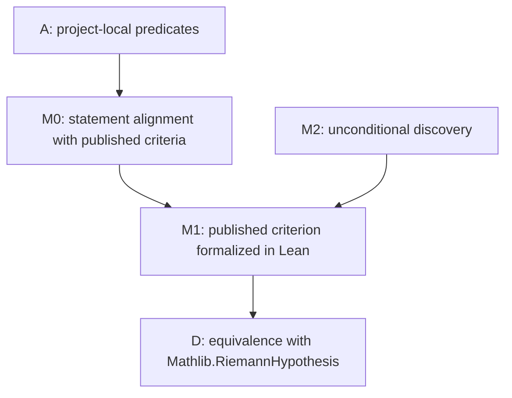

# RH Hard-Gap DAG

Date: 2026-07-10

This file is the fixed external gap ledger for future RH work. A future loop may only count as
research progress when it changes the status of one of these nodes. Local predicate wrappers,
rewrite bridges, finite-support transports, and one-step corollaries are engineering work unless
they reduce a node below.

## DAG

## Fixed Nodes

| node_id | status | description | current frontier |
| --- | --- | --- | --- |
| A | in progress | Project-local xi, Li, Nyman-Beurling, and Baez-Duarte scaffolding. | Mostly formalization scaffolding; not RH progress under v2. |
| M0 | open | Align project-local Nyman-Beurling/Baez-Duarte predicates with published statements. | Need exact comparison of parameter domains, L2 domains, target functions, closure/density form, and natural-parameter form. |
| M1 | open | Formalize one accurately cited published Nyman-Beurling or Baez-Duarte criterion. | Needs M0 first; likely requires Mellin-Plancherel and critical-line L2 infrastructure. |
| D | open | Connect the formalized criterion to `Mathlib.RiemannHypothesis`. | No direct bridge yet. |
| M2 | parked | Unconditional discovery route: explicit approximants with error tending to zero, or a literature-audited new structural lemma. | Parked unless a novelty audit justifies work. |

## Hard Gaps

| gap_id | node_id | status | description |
| --- | --- | --- | --- |
| G1 | M1/D | open | Formalize the classical Nyman-Beurling/Baez-Duarte equivalence with RH, including the published closure/density criterion and its connection to `Mathlib.RiemannHypothesis`. |
| G2 | M1 | open | Inventory and import required analytic infrastructure: vertical-line Plancherel/Hardy-space tools, Mellin transforms, and possible external Lean repos such as PrimeNumberTheoremAnd and EulerProducts. |
| G3 | M2 | parked | Construct unconditional finite approximants with error tending to zero. In the NB/BD framework this is essentially the hard RH direction; numerical convergence is not evidence. |

## Loop Reporting Policy

Every future loop or engineering batch must report:

- `hard_gap_before`
- `hard_gap_after`
- `hard_gap_delta`
- `assumption_frontier_before`
- `assumption_frontier_after`

If all hard gaps are unchanged, the loop result is at most `FORMALIZATION_ONLY`.

## Current Governance State

- Loops 1-130 do not reduce G1, G2, or G3 under v2.
- The proposed loop-131 corollary
  `nymanBeurlingBaezDuarteConcreteApprox -> nymanBeurlingConcreteApprox` is a mechanical batch
  item on node A. It is not an accepted standalone research loop.
