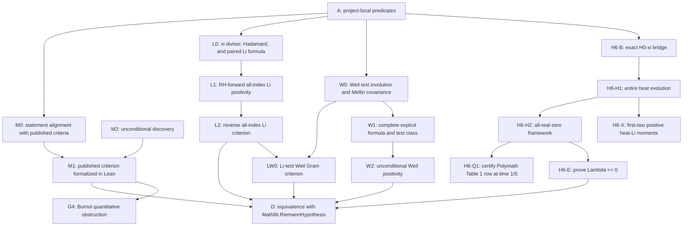

# RH Hard-Gap DAG

Date: 2026-07-17

This file is the external gap ledger for RH work under
[`rh_governance_current.md`](rh_governance_current.md). Local predicate wrappers, rewrite bridges,
finite-support transports, and one-step corollaries are engineering work unless they change an
open mathematical frontier. RH itself and every open node may be attacked directly.

## DAG


```mermaid
flowchart TD
    A["A: project-local predicates"] --> M0["M0: statement alignment with published criteria"]
    M0 --> M1["M1: published criterion formalized in Lean"]
    M1 --> D["D: equivalence with Mathlib.RiemannHypothesis"]
    E["M2: unconditional discovery"] --> M1
    M1 --> G4["G4: Burnol quantitative obstruction"]
    A --> L0["L0: xi divisor, Hadamard, and paired Li formula"]
    L0 --> L1["L1: RH-forward all-index Li positivity"]
    L1 --> L2["L2: reverse all-index Li criterion"]
    L2 --> D
    L2 --> LW0["LW0: Li-test Weil Gram criterion"]
    W0 --> LW0
    LW0 --> D
    A --> W0["W0: Weil test involution and Mellin covariance"]
    W0 --> W1["W1: complete explicit formula and test class"]
    W1 --> W2["W2: unconditional Weil positivity"]
    W2 --> D
    A --> H6B["H6-B: exact H0-xi bridge"]
    H6B --> H6H1["H6-H1: entire heat evolution"]
    H6H1 --> H6H["H6-H2: all-real-zero framework"]
    H6H --> H6Q["H6-Q1: certify Polymath Table 1 row at time 1/5"]
    H6H1 --> H6X["H6-X: first-two positive heat-Li moments"]
    H6H --> H6E["H6-E: prove Lambda <= 0"]
    H6E --> D
```

## Fixed Nodes

| node_id | status | description | current frontier |
| --- | --- | --- | --- |
| A | in progress | Project-local xi, Li, Nyman-Beurling, and Baez-Duarte scaffolding. | Mostly formalization infrastructure; classify it separately from unconditional RH progress. |
| M0 | complete | Align project-local Nyman-Beurling/Baez-Duarte predicates with published statements. | The positive-natural Baez-Duarte closure side is aligned in real and complex `L2(0,infinity)`: parameter indexing, kernel formula, target, closed span, whole-line error, endpoint, tolerance, and coefficient field are Lean-checked. |
| M1 | complete | Formalize one accurately cited published Nyman-Beurling or Baez-Duarte criterion. | Batch M1-18 compiles both directions of the exact strong positive-natural Baez-Duarte criterion in full-half-line complex `L2`. |
| D | complete | Connect the formalized criterion to `Mathlib.RiemannHypothesis`. | `riemannHypothesis_iff_baezDuarteComplexTarget_mem_kernelClosure` is the exact compiled bridge. |
| M2 | open | Unconditional discovery route: explicit approximants with error tending to zero, or a new structural lemma. | Direct `PROOF-ATTEMPT` is allowed; preregister the exact endpoint, known obstacle, and new attack angle. |
| B1 | complete | Formalize Burnol's published quantitative lower bound for the Nyman-Beurling approximation distance. | Batches G4-F0 through G4-F5 are public. The full RH-conditional continuous zero-sum lower bound and exact natural-distance liminf transfer are Lean-checked. This is known mathematics, not M2 progress. |
| L0 | complete | Align the project xi divisor, genus-one Hadamard product, all-index Li family, and symmetry-paired raw zero formula. | The multiplicity-bearing paired formula is public and all infinite-sum operations are Lean-checked. |
| L1 | complete | Prove the RH-forward all-index Li real-part nonnegativity direction. | Under RH every paired summand is exactly half a complex norm square. |
| L2 | complete | Prove all-index Li real-part nonnegativity implies `Mathlib.RiemannHypothesis`. | The project-specialized Bombieri-Lagarias argument compiles: finite threshold superlevels, simultaneous phase recurrence, fixed-weight tail domination, an off-line-to-negative-coefficient theorem, and the exact Li/RH iff. Implementation and evidence commits passed public CI runs `29406614212` and `29406932411`. |
| LW0 | complete | Construct the multiplicity-bearing Li-test Weil Gram form and prove positivity on every finite real combination is exactly equivalent to RH. | The reflection-averaged kernel, exact Li matrix, RH norm-square formula, and finite-real-span positivity iff are public. Implementation commit `2317143e73e1d788d65dcdff9b609a98f8ac60b2` passed public CI run `29415448733`. This is known-theorem formalization with hard_gap_delta=0. |
| W0 | complete | Formalize Weil's multiplicative test-function involution, conjugate star, and exact Mellin covariance. | `WeilTestAlgebra.lean` proves pointwise involutivity on `0<x`, the zero-boundary counterexample, convergence iff, endpoint swap, conjugate-star covariance, and critical-line specialization. This is test algebra only. |
| W1 | open | Formalize a source-faithful admissible test class, multiplicative convolution, and the complete zero/prime/pole/archimedean explicit formula. | W1a, W1b's physical analytic-strip algebra core, W1c0, and the Gaussian test cores are public. The complete compact `C^6` reflection-class formula and its arbitrary-finite-`F` RH-equivalent positivity criterion are public; quotient/completeness, closure identification, continuity, and distributional regularization remain. |
| W2 | open | Prove unconditional Weil positivity on a complete RH-equivalent test class. | The finite equal-width Gaussian arithmetic family is now publicly Lean-equivalent to RH: W2g0 gives the forward square identity, W2g1 gives the reverse separator criterion, and W2g2 compresses the width quantifier to any one preassigned positive width. None supplies the unconditional sign, so W2 and G7 remain fully open. Connes-Consani's semi-local mechanism is explicitly conjectural and is not a premise. |
| H6-B | complete | Align the Polymath-normalized de Bruijn-Newman heat family at time zero with the project xi. | `deBruijnNewmanH_zero_eq_riemannXi` proves `H_0(z) = (1/8) * riemannXi((1+i*z)/2)` from explicit theta-kernel and Mellin calculations. This is a definition bridge with `hard_gap_delta=0`. |
| H6-H1 | complete | Prove the exact source family is entire in space for every real time and satisfies the backward heat equation. | `DeBruijnNewmanHeat.lean` proves arbitrary quadratic/linear weighted integrability, differentiation in time and twice in complex space, and `partial_t H_t = -partial_z^2 H_t` on all `R x C`. This is analytic infrastructure with `hard_gap_delta=0`. |
| H6-H | open globally; H2a-H2f and zero-dynamics interfaces compiled | Formalize the all-real-zero predicate, de Bruijn forward preservation, threshold existence, threshold closedness, strip contraction, and the full Polymath regional-continuation interface for the exact H6-B/H6-H1 family. | The framework reaches the unconditional `t=1/2` witness, arbitrary-base strip contraction, and the complete conditional Polymath three-region criterion. Simple contacts use the regularized divisor force; repeated contacts use compiler-checked backward Hermite splitting and zero transfer. The three unconditional Table 1 region certificates, global enumeration/continuation beyond the criterion, H6-E/G8, and RH remain open. |
| H6-Q1 | `PARKED_BY_USER_DIRECTIVE_20260722`; Loop 31 closure retained | Kernel-check the initial, final, and barrier certificates for the second row of Polymath Table 1 and derive `deBruijnNewmanAllZerosReal (1/5)` without hypotheses. | The conditional Polymath consumer, finite-height-RH initial bridge, complete Theorem 1.3 normalization, explicit final-region consumer, equation `(htz)`, fixed principal-power `5*pi/4` line integrability, every positive-integer local residue normalization, exact adjacent and finite `R_(0,0)` shifts, full Titchmarsh `(xio)`, finite equation `(39)`, and both actual-source contour shifts are public K0. Loops 10--30 reduce the Boyd analytic input through saddle geometry, boundary dispersion, and the near/middle/tail trace decomposition. Loop 31 reconstructs the actual scaled-Gamma Stieltjes formula noncircularly, proves direct and inverse `3/|z|^2` bounds, closes the shifted tail, inner trace, and both outer edges, and proves the unconditional dispersion certificate and Boyd--Nemes equation `(15)`. The inverse-Jacobian global-cut-stitching route remains bypassed and is no longer required for `(15)`. Proposition 6.1/6.3 and the remaining Table 1 certificate assembly, strict finite-sum certificates, finite RH through `3*10^12`, and compact barrier winding remain mathematically open but are parked because their endpoint is a numerical Newman upper-bound certificate. H6-E/G8 and RH remain open rather than parked. External Arb output is navigation evidence only. |
| H6-X | complete first-three finite endpoint | Prove theta-specific Li information for the exact heat family beyond the generic heat PDE. | `DeBruijnNewmanLiMoments.lean` publicly proves the exact first-two moment spine. `DeBruijnNewmanThirdLi.lean` extends it through `F_t'''(1)=64D`, `B*C<=A*D`, the exact third Li formula, and strict positive-real `liCoefficientCandidate 2`; implementation commit `1b521686d4e8561f01ba98a6ceaa4905ced4d92f` passed public CI run `29545583372`. This is finite-index route infrastructure with `hard_gap_delta=0`; no all-index extrapolation is made. |
| H6-X3 | complete public | Prove the actual-theta ordered covariance and third Li sign. | The one-integral monotone covariance certificate gives `B*C<=A*D`; together with `B^2<=A*C` and `liCoefficientCandidate_zero_re_lt_one`, Lean proves `0 < (liCoefficientCandidate 2).re` and zero imaginary part. Implementation `1b521686d4e8561f01ba98a6ceaa4905ced4d92f` and evidence `abf5ebf19e3636662a45eed7a5eff9e947c3c3b4` passed public CI. The exact aggregate is `deBruijnNewmanHeat_thirdLi_covariance_endpoint`; this does not reduce H6-E/G8. |
| H6-E | open | Prove all zeros of `H_0` are real, equivalently `Lambda <= 0` in the audited normalization. | The generic adjacent-gap and positive-kernel/Hankel routes are obstructed. The actual-theta heat-Li time-monotonicity candidate survived high-precision finite screening, and Lean compiles its exact reduction to RH plus the function-level heat-log evolution, but no all-index sign representation or global moving-divisor differentiation theorem was obtained. A new attack must supply that theta-specific input, height-aware continuation, or a different all-index invariant. The endpoint is unchanged. |
| H10-B | complete | Prove finite aggregate power-sum spectral rigidity and the reciprocal-pairing square-root-circle corollary. | The final finite-spectral step of function-field RH is publicly compiled. It proves no curve point-count bound and supplies no finite-spectrum or uniform-tail transfer for the Riemann zeta zero divisor; `hard_gap_delta=0`. |
| H10-C | complete | Test a countably infinite ordinary power-trace extension with nonzero reciprocal pairing. | Lean proves `Summable (alpha^k)` for positive `k` forces `q=0` under `alpha(sigma n)*alpha(n)=q`; a one-point finite witness shows the obstruction is specific to the infinite ordinary-trace transfer. Final-ledger commit `2edf069a217255bbc20b93a2aa938f51dd57d94e` passed public CI. |
| H10-D | complete | Formalize the Bombieri--Stepanov finite-field Frobenius auxiliary mechanism and test its degree budget for slack. | The generic descent, perfect-power multiplicity, and root-degree bounds compile. A nonzero `ZMod 2` kernel witness has exact multiplicity two at both points and saturates the degree budget. Final-ledger commit `b23d601ee8c69a654d542f1da43d16bb042eaf22` passed public CI. |
| H10-E | immutable evidence CI passed; final ledger pending | Audit the nonzero-production gate between Riemann--Roch dimension surplus and the auxiliary function. | Rank-nullity, injective realization, a separated polynomial coefficient-block equivalence, and exact witnesses compile. Frozen implementation and immutable evidence passed independent public CI. |

## Hard Gaps

| gap_id | node_id | status | description |
| --- | --- | --- | --- |
| G1 | M1/D | complete | The exact strong positive-natural Baez-Duarte full-line closure criterion is Lean-equivalent to `Mathlib.RiemannHypothesis`. |
| G2 | M1 | complete | Batch M1-18 compiles the weighted finite formula, fixed-epsilon transformed limit, epsilon-to-zero dominated convergence, diagonal assembly, tail removal, and `RH -> closure`. |
| G3 | M2 | open | Construct unconditional finite approximants with error tending to zero. Numerical convergence can select a candidate but is not a proof premise. |
| G4 | B1 | complete | Burnol's RH-conditional lower bound `liminf D(lambda) * sqrt(log(1/lambda)) >= sqrt(sum_rho m_rho^2 / |rho|^2)` and its natural-subspace liminf consequence are publicly Lean-checked through the fixed F0-F5 frontier. M2/G3 is unchanged. |
| G5 | L2 | complete | Reverse the exact project Li criterion: from nonnegative real parts of every `liCoefficientCandidate n`, derive RH by a project-specialized Bombieri-Lagarias transformed-zero argument. |
| G6 | W1 | open | Prove the complete source-faithful Weil explicit formula and convolution-stable admissible test space, without dropping moment, density, convergence, or regularization conditions. |
| G7 | W2 | open | Supply an unconditional positivity mechanism on the full Weil class. The compiled finite Gaussian arithmetic family is exactly RH-equivalent; this sharper criterion still does not provide its unconditional sign and therefore does not reduce G7. |
| G8 | H6-E | open | Prove `Lambda <= 0`, equivalently all zeros of the compiled source-normalized `H_0` are real. The local pair law and adjacent estimate `(gap^2)'<=8` compile, but the exact quadratic audit proves that generic estimate is sharp and cannot yield a fixed backward interval. H6-X now supplies theta-specific positivity through the third Li expression only; the missing edge still requires an all-index mechanism or height-aware continuation through the first possible repeated zero. |
| OBS-H6-REVERSE-HEAT-LI-01 | H6-H/H6-E | complete obstruction | An exact degree-two heat-Xi polynomial has reflection symmetry, the forward heat PDE, nonvanishing at `s=1` for every nonnegative real time, and all time-one zeros on the critical line, yet its time-zero second Li value is `-64/9` and it has an off-line zero. Generic backward Li transfer is false; theta-specific structure is required. |
| OBS-H6-ADJACENT-GAP-EIGHT-01 | H6-H/H6-E | complete public obstruction | At every all-real time an adjacent simple pair satisfies `(gap^2)'<=8`, and integration gives only terminal-gap-squared divided by eight of backward persistence. An exact quadratic backward-heat family attains collision on that scale and inside every proposed positive uniform interval. Generic adjacent-gap geometry cannot close H6-E; theta-specific mechanisms remain open. Implementation `ce5b0c405f06078f549c6a27a477df04ccbcfb35` passed public CI run `29538670221`. |
| OBS-H6-POSITIVE-COSH-LI3-01 | H6-X/H6-E | complete public obstruction | A normalized positive two-atom `cosh` transform is entire, reflection symmetric, and has positive real first and second standard Li values, but its third Li value is strictly negative. Implementation commit `5fdfc5c7437349735c57552a75838f16b4d63f5e` passed public CI run `29543145545`, job `87769424525`; evidence commit `61ce528793a9fc04e4a6b26ba83463cf0557bafc` passed run `29543336971`, job `87770059112`. Positive-kernel and ordinary moment/Hankel positivity therefore cannot generically scale H6-Z to all indices; quantitative theta-kernel structure remains necessary. |
| OBS-H6-XI-LOGCONCAVITY-LEAN-01 | H6-E/G8 | complete public obstruction | At external commit `7a89db1`, the advertised log-concavity predicate and full-kernel endpoints conclude only `True`; decisive perturbation claims are custom axioms and the numerical script omits the infinite tail. The exact no-convergence Hurwitz axiom is Lean-refuted by `F_n=1` and `G(z)=z-i`. Implementation `8ecb002d1591ae93fbc23ba42c7a487c16c8beb5` passed public CI run `29550587517`, job `87792042425`; evidence `131aff89283644bcabd2f620b94f99dc6ae30843` passed run `29550788159`, job `87792636844`. Reject only this external certification chain: actual Xi-kernel TP2, TP-infinity, H6-E/G8, and RH remain open. |
| OBS-H6-XI-PF5-01 | H6 physical-kernel total positivity | complete public obstruction | The exact full-series Xi kernel has a negative `5x5` Toeplitz determinant at `(u0,h)=(1/100,1/20)`. Lean independently proves rational enclosures for all nine infinite `tsum` entries, an exact LU center determinant, a 120-permutation perturbation bound, and the source-faithful ordered `not PF5` witness. Classification `ACTUAL_KERNEL_PF5_FORMALLY_FALSIFIED`, with `hard_gap_delta=0` and `obstruction_map_delta=1`: PF5/PF-infinity physical-kernel routes are blocked, while global PF4, H6-E/G8, and RH remain open. Implementation `7bdf2b9ab08f2b298d1565921158ff9a199c867a` passed public CI run `29565362144`, job `87836632525`. |
| OBS-H6-XI-PF4-SEARCH-01 | H6 physical-kernel total positivity | public search boundary | A preregistered non-Toeplitz global-PF4 falsification search examined 11 million random seven-parameter configurations and 16,160,859 rational-lattice minors. No condition-resolved negative was found; every selected double-negative candidate became positive under high-precision numerical reevaluation. Classification `NO_PROGRESS`, with all progress deltas zero. This is neither a proof nor evidence of global PF4 and does not change H6-E/G8 or RH. Closure `503b83e35761e87b35fe7db3fb49feab8ea372de` passed public CI run `29567807097`, job `87844319595`. |
| OBS-H6-HEAT-LI-TIME-MONOTONICITY-01 | H6-X/H6-E/G8 | public search and proof boundary | The actual-theta conjecture that all heat-Li coefficients tend to zero at `atBot` and are nondecreasing on `t<=0` implies RH by a compiled exact reduction. Numerical derivative scans found no negative sign through project index 31 at 80/120/180 digits, through index 63 at 240 digits, or at time zero through index 127 at 500 digits; this is not proof evidence. Lean compiles `(partial_t F)/F=(1/4)*(deriv(logDeriv F)+(logDeriv F)^2)`, but the resulting cross-index convolution has no known theta-specific all-index sign. The moving-zero route separately lacks a global collision-compatible divisor transport and differentiated-`tsum` theorem. Classification `NO_PROGRESS`, `hard_gap_delta=0`, `route_infrastructure_delta=1`; the conjecture, H6-E/G8, and RH remain open. Implementation `fc2a32e8316f59370471597df9a8a26c02480bdd` passed public CI run `29570628316`, job `87853282509`; evidence `f4a26d5a1ee891099003221b766a2f19a39ab07b` passed run `29570843171`, job `87853982402`. |

## W1 Fixed Source Frontier

| edge | status | source-level content |
| --- | --- | --- |
| W1a | complete | Source-faithful `dy/y` convolution, exact convergence closure, Mellin product, star covariance, and critical-line `normSq` autocorrelation compile through logarithmic transport to Mathlib additive Bochner convolution. |
| W1b | complete | A positive-width physical class with pointwise closed-strip convergence, open-strip analyticity, closed-strip continuity, and a finite uniform bound is closed under vector operations, involution, conjugate star, convolution, and autocorrelation. Quotient/uniqueness/completeness and density are explicitly not claimed. Implementation commit `335d6dfa175a345555aaa408b5581ed743d2abf7` passed public CI run `29412820223`. |
| W1c0 | complete | On `Re(s)>1`, `WeilExplicitIntegrand.lean` proves the exact xi logarithmic-derivative identity joining the multiplicity-bearing Hadamard zero sum to the pole, `GammaR`, and von Mangoldt terms. Implementation `89d4dd12ebedc75c13261a0d43a9254b5931c30d` passed public CI run `29417432562`; evidence backfill `1b405639a4e28c72fc1e2484259c047ad95ed0b2` passed run `29417710278`. This is the analytic integrand only. |
| W1c1 | open | Integrate the compiled identity against a source-faithful test class and justify both the rectangle/zero cutoff passage and the complete arithmetic evaluation. The reflection-symmetrized compact-support class with six continuous derivatives is publicly complete on both zero and arithmetic sides; extension/identification with the full convolution-stable admissible class remains open. |
| W1c1g0 | complete | For the fixed centered Gaussian, selected zero-free right-line truncations converge to the absolute multiplicity-bearing Gaussian zero `tsum`. Implementation `00410cc2a6919acfa5835b121c47489c5105e0de` and evidence backfill `2292801d710a1a95857de69a92498c39ae79d0d3` passed public CI. This does not supply the generic class limit. |
| W1c1g1 | complete | `WeilGaussianExplicitFormula.lean` evaluates the same fixed Gaussian line integral into its exact pole, `GammaR`, and von Mangoldt terms, with every interchange and full-line limit proved. Implementation `6c65019d9de2d31127dd3bf8389994207c17dcb5` and evidence backfill `fa5fdc5aefd4dd3e99966cc1e0fcca62293e9600` passed public CI runs `29441160498` and `29441452307`. This does not close generic W1c1. |
| W1c1g2 | complete | `WeilSymmetricGaussianFamily.lean` proves the two-parameter family `exp(a(s-1/2)^2)cosh(b(s-1/2))`, including a generic selected-height rectangle skeleton, both translated von-Mangoldt kernels, the exact pole term, GammaR integrability, and `b=0` compatibility. Implementation `5c4ae54c031a6d999111390694ef738a3da57146` and evidence backfill `ed92d851f0eb697f2b2aec0e1260fe0002ea5bcf` passed public CI runs `29444276732` and `29444485950`. Schwartz/Hermite density, tempered extension, generic W1c1, and positivity remain open. |
| W1c1g3 | complete | `WeilFiniteGaussianTestCore.lean` proves the complete direct zero/pole/GammaR/prime explicit formula for every finite complex packet of positive-width symmetric Gaussian probes. Absolute summability, integrability, all finite interchanges, and singleton/empty reductions compile. Implementation `736901e03f08ccb399e4ec5f84980a641cb4e344` passed public CI run `29445905312`, job `87456185038`, in `2m33s`; evidence backfill `6d7433b694b60150c19ca67f85087ba0e0c6255b` passed run `29446148141`, job `87456989353`, in `1m26s`. This constructs the algebraic test core but does not prove its Schwartz density, functional continuity, tempered extension, generic W1c1, or positivity. |
| W1s0 | complete | `WeilCompactLaplaceSeparator.lean` constructs, for every selected multiplicity-bearing xi-divisor value and every positive tolerance, a smooth compactly supported log-line test normalized to one there with arbitrarily small absolute `tsum` on all different zero values. The proof compiles inverse-square transform decay, complete divisor summability, fixed-superlevel polynomial annihilation, and compact convolution-power suppression. Implementation `6d12bad98b80c34217757df01943509965a64781` and evidence `941756c2e7e0b4da8f765dc7187e4be703af36c8` passed public CI runs `29461298466` and `29461494669`. This is a reverse-separation component only: generic W1c1, the explicit formula for this class, W2/G7, and RH remain open. |
| W1c1c0 | complete | `WeilCompactLaplaceZeroCutoff.lean` proves the selected-height xi zero-side limit for the reflection symmetrization of every smooth compactly supported additive-log function. Lean derives transform differentiability, exact reflection, complete divisor summability, arbitrary integration by parts, inverse-sixth-power fixed-strip decay, and top-edge vanishing from smoothness and compact support alone. Implementation `0e6451944ee1edb2d76d67f4fe097de2aa19ad17` and evidence `6c2f3ab912097e4e5b325e9d0c27d43438a29d99` passed public CI runs `29464308480` and `29464469804`. The compact arithmetic evaluation, W2/G7, and RH remain open. |
| W1c1c1 | complete | `WeilCompactLaplaceArithmeticFormula.lean` proves the complete reflection-symmetrized compact-smooth explicit formula. Exact scaled Schwartz inversion yields `pi*vonMangoldt(n)*(f(log n)+f(-log n)/n)` with finite natural support; the pole pair contributes `2*pi*F(1)`; the GammaR product and prime line are integrable; and selected arithmetic limits match the complete multiplicity-bearing zero sum. Implementation `55a6406f235a7548bf7f7d53ae5d30014795e9ce` and evidence `ed5d03f65bd234f95afb55389b2766d611a3eeab` passed public CI runs `29466850965` and `29467021669`. Quotient/completeness, full-class continuity, regularization, W2/G7, and RH remain open. |
| W1c1c2 | complete | The C6 endpoint removes the compact formula's `C-infinity` Schwartz wrapper. General Fourier inversion follows from continuity and inverse-square decay, the first absolute Fourier moment from inverse-sixth decay, and the selected xi top edge from exactly six continuous derivatives. The old smooth formula remains a corollary. Implementation `3e3c677495c592096d7843aa4845e861bc393937` and evidence `94b6be8fc934b3d4909d066b168491389df9afd8` passed public CI runs `29468797210` and `29468980147`. Broader W1, W2/G7, and RH gaps are unchanged. |
| W1c1c3 | complete | The Connes--Consani/Yoshida compact-support criterion is Lean-equivalent to `Mathlib.RiemannHypothesis` for every finite zero-free `F` containing `0,1`. The reverse uses finite-constrained compact separators, the conjugate-reflection pair, complete multiplicity-bearing tails, and no assumed conjugation permutation. Implementation `d590ee42e37366388800bafda04020a84eee8452` and evidence `03e1661b077ab8d3e2f8c9b93b19aa63c3c1eebc` passed public CI runs `29487332091` and `29487596817`. This closes the compact criterion edge only; W1 full-class extension, W2/G7, and RH remain open. |
| W1c2 | open | Prove the complete distributional limit and all endpoint/local regularization choices, including the covariance extension. |

## W2 Open Frontier

| edge | status | source-level content |
| --- | --- | --- |
| W2g0 | complete | `WeilGaussianQuadraticPositivity.lean` applies the direct finite packet formula to ordered pairs with common width `a>0`, shift `b_i-b_j`, and real coefficient `w_i*w_j`. Under RH, every multiplicity-bearing zero term is `exp(-a*gamma^2)` times a cosine square plus a sine square; the real square family is summable, its `tsum` equals the direct zero packet, and the real part of the direct pole/GammaR/von-Mangoldt arithmetic expression is nonnegative. Implementation `cf271684f786efcb2e83a57d76c51e215205d1d1` passed public CI run `29447980403`, job `87463120301`, in `1m49s`; evidence backfill `dafcd758a5257718ed2c9f6c8813213a2821708e` passed run `29448199280`, job `87463856783`, in `1m32s`. This is RH-forward only and has zero hard-gap delta for unconditional W2, G7, and RH. |
| W2g1 | complete | `WeilGaussianPositivityCriterion.lean` proves the exact converse. Any off-line xi divisor zero is isolated by a finite real exponential separator; its protected lowest-decay square class is made strictly negative while the scaled higher tail vanishes by dominated convergence. The explicit formula yields a finite arithmetic quadratic with negative real part, so positivity of every such quadratic at `c=2` is equivalent to RH. Implementation `b2d2ce18ff1491f684098b04c7a5be73e0ebdc98` passed public CI run `29453270303`; evidence backfill `68e96525f3f89562ae47e1da9e074911701a6c2e` passed run `29453470463`; closure `ae2b970a8b6f883ea2e8245e264396381c279f56` passed run `29453660135`. This exact criterion has zero hard-gap delta for unconditional positivity, W2, G7, and RH. |
| W2g2 | complete | `WeilGaussianFixedWidthCriterion.lean` proves that every larger Gaussian width is a dominated limit of finite Rademacher exponential packets at any fixed base width `a0>0`. Combining this transfer with W2g1 gives the exact iff between RH and nonnegativity of all finite real arithmetic quadratics at exactly `a0`. Implementation `f56b70478ab552802cac719b8e9af0f56fc44b1d`, evidence `f93e73cbdd71785a28cc2b05f8ef2b0390b358cf`, and closure `8b45a091aa4f16e348a2cd8b73e949480f446508` passed public CI runs `29458594435`, `29458788171`, and `29458987040`. This compresses the parameter family but does not prove its unconditional sign; hard-gap delta remains zero for W2, G7, and RH. |
| W2p0 | complete | `WeilGaussianPrimeKernelSignAudit.lean` proves that the actual `n=2` symmetric Gaussian von-Mangoldt translation kernel is indefinite on an explicit two-shift family. Width `(log 2)^2/16` makes the off-diagonal exceed the diagonal; `(1,-1)` is a negative direction and the diagonal is positive. Implementation `01ea63517670a81b8c640de1135dec62d44436b9` and evidence `af7848aea84287329ce50900d5e425538165baaa` passed public CI runs `29462677629` and `29462828680`. This eliminates same-sign semidefinite assembly prime term by prime term, not cancellation in the complete arithmetic form. W2/G7 and RH remain open. |

## G4 Fixed Source Frontier

| edge | status | source-level content |
| --- | --- | --- |
| F0 | complete | Continuous `B_lambda`, finite natural `V_N`, distances, `V_N <= B_(1/N)`, `D(1/N) <= d_N`, and `1/N -> 0+` are Lean-checked in `BurnolLowerBound.lean`. |
| F1a | complete | `BurnolA.lean` defines the explicit floor formula, proves support in `(0,1]`, the exact Hardy-tail identity, `L2` membership, and `HasMellin A s ((s-1)zeta(s)/s^2)` for `0<Re(s)<1`. |
| F1b | complete | `BurnolHardy.lean` constructs the critical-line phase isometry, proves its explicit action on `chi` and every `rho(theta/t)`, transports the explicit model span, and proves `D(lambda)=dist(chi1,C_lambda)`. |
| F2 | complete | `BurnolY.lean` constructs the second source phase `V`, physical cutoff `Q_lambda`, `psi(w,k)`, the BBLS/Burnol oscillatory continuation, critical-line `L2` limits `Y(lambda,s,k)`, lambda-independent transformed representative bounds, exact model-kernel pairings, and analytic-order orthogonality to the full model span. |
| F3 | complete | Gram-block and target-pairing asymptotics, including the Hilbert/Cauchy inverse entry `m^2`, unequal multiplicity blocks, and inverse convergence, are publicly Lean-checked. |
| F4 | complete | The RH-conditional finite-zero-set liminf lower bound is publicly Lean-checked. |
| F5 | complete | The full extended zero sum and exact natural-distance asymptotic liminf transfer are publicly Lean-checked. |

## Post-M1 Open-Route Rule

- `G3/M2`, `W2/G7`, and RH are open and selectable without approval. Direct attacks use the
  `PROOF-ATTEMPT` preregistration and output audit.
- `G4` is an adjacent known-mathematics line. Closing it is `KNOWN_THEOREM_FORMALIZED`, not
  `HARD_GAP_REDUCED` for RH and not evidence that the approximation distance tends to zero.
- Mathlib upstreaming is an engineering/publication track and must not be reported as a change to
  `M2` or `G3`.

## External Publication Gate

The final M1 equivalence may be described inside this repository as a compiled project-local
formalization aligned with Baez-Duarte 2002. A public claim of "first formalization" or a release
claim that the equivalence has passed external review requires all three independent gates:

| gate | status | evidence required |
| --- | --- | --- |
| P1a | complete | Clean-context Sol 5.6 max review `019f59c3-c4c7-7b63-a203-c25a12034c14`; no P0-P3 finding, decision `CONTINUE`, for the earlier Baez-Duarte/contour surface. See `research/m1_sol_max_review_20260713.md`. |
| P1b | complete | Separate clean-context Sol 5.6 max review found no P0-P2 issue and two P3 statement/attribution corrections. See `research/li_weil_sol_max_review_20260717.md`. |
| P2 | pending human publication | Lean Zulip `#maths` statement/definition review with no unresolved objection; the request must be written by the user in their own words under current mathlib policy. |
| P3 | complete within fixed scope | Bounded novelty audit covering pinned mathlib, Isabelle AFP, PNT+, selected external Lean repositories, and primary literature. See `research/exposure_novelty_audit_20260716.md`; it explicitly makes no global absence or first-formalization claim. |

Until P1a-P3 are complete, repository documentation must not call this the first formalization.

## Loop Reporting Policy

Every future loop or engineering batch must report:

- `hard_gap_before`
- `hard_gap_after`
- `hard_gap_delta`
- `assumption_frontier_before`
- `assumption_frontier_after`

If all hard gaps are unchanged, the loop result is at most `FORMALIZATION_ONLY`.

## Current Governance State

- Loops 1-130 do not reduce G1, G2, or G3 under v2.
- The proposed loop-131 corollary
  `nymanBeurlingBaezDuarteConcreteApprox -> nymanBeurlingConcreteApprox` is a mechanical batch
  item on node A. It is not an accepted standalone research loop.
- Audit `AUDIT-20260710-M0-01` proved `nymanBeurlingConcreteApprox` unconditionally by using
  parameters `1` and `-1`. The unrestricted branch is falsified as a criterion carrier, and the
  governance decision is `PIVOT` to exact restricted-statement alignment.
- Batch `BATCH-20260710-M0-02` proved the project restricted closure/tolerance equivalence and
  computed the omitted `(1, infinity)` tail as the square of `sum c_k * a_k`. The result is
  `DEPENDENCY_GAP_IDENTIFIED`: current restricted and positive-natural local predicates omit the
  moment/tail condition present in the published criteria.
- Batch `BATCH-20260710-M0-03` defined the positive-natural split full-line error, proved its
  normalized form `unitIntervalError + reciprocalMoment^2`, and packaged the source-faithful
  positive-tolerance predicate. Result: `FORMALIZATION_ONLY`; M1/G1 and RH remain open.
- Batch `BATCH-20260710-M0-04` packaged the target and positive-natural kernels in the actual real
  `L2(0, infinity)` space and proved closure membership equivalent to the Batch 03 predicate. The
  endpoint difference is discharged by a null-set integral identity. Result:
  `FORMALIZATION_ONLY`; the coefficient-field convention remains under M0, while M1/G1 and RH are
  unchanged.
- Batch `BATCH-20260710-M0-05` inspected the primary Baez-Duarte paper, proved the source kernel
  formula, packaged the complex `L2(0, infinity)` closed span, and proved complex target closure
  membership equivalent to the real closure and source-aligned finite-error predicate. Result:
  `HARD_GAP_REDUCED`; fixed node M0 is complete. M1/G1, D, and RH remain open.
- Audit `AUDIT-20260710-M1-01` compiled
  `RiemannHypothesis.riemannZeta_ne_zero_of_half_le_lt_re` and compared every Theorem 1.1 proof
  block against the pinned mathlib tree. Result: `DEPENDENCY_GAP_IDENTIFIED`. G2 is narrowed to
  explicit forward and reverse theorem boundaries; G1 and RH remain unproved.
- Batch `BATCH-20260710-M1-02` audited external Lean projects, vendored only the trusted
  Abel-continuation source subset from `PrimeNumberTheoremAnd`, extended its formula to the full
  half-plane `re(s) > 0`, and proved `hasMellin_fractionalPartKernel_one` plus
  `hasMellin_baezDuarteKernel`. Result: `HARD_GAP_REDUCED`; the fractional-kernel Mellin block is
  closed, while the quantitative Mobius, weighted-log isometry, convergence, and reverse-criterion
  gaps remain.
- Batch `BATCH-20260711-M1-03` proved the weighted logarithmic change of variables is an
  invertible complex-linear isometry from `L2(0,infinity)` to `L2(real line)`, exposed both
  representatives, composed it with Fourier Plancherel, and verified the `tau/(2*pi)` frequency
  normalization. Result: `HARD_GAP_REDUCED`; the weighted-log isometry block is closed, while the
  quantitative Mobius, RH-to-Lindelof, source-convergence, and reverse-criterion gaps remain.
- Batch `BATCH-20260711-M1-04` inspected both source convergence passages and compiled the exact
  power-majorant `L2` statements, the countability and nullity of critical-line zeta-zero
  ordinates, and almost-everywhere convergence of the source zeta ratio to one. Result:
  `DEPENDENCY_GAP_IDENTIFIED`; G2 remains open but its broad convergence item is replaced by F1-F3
  above. The source's malformed displayed Gamma ratio and ambiguous tail exponent are recorded in
  `research/m1_source_convergence_boundary_20260711.md` and are not assumed.
- Batch `BATCH-20260711-M1-05` reconstructed the source tail formula from `f_(delta,n)`, Lean-checked
  the `1+2*epsilon` exponent, and proved the quotient-level estimate
  `norm(f)^2 <= (1+2*epsilon)*norm(x^(-epsilon)f)^2` for errors with an `m/x` tail. It also proves
  the varying-epsilon convergence transfer and instantiates the estimate on actual natural-kernel
  finite sums. Result: `HARD_GAP_REDUCED`; F3 is removed, while F1, F2, and the reverse criterion
  remain open.
- Batch `BATCH-20260711-M1-06` vendored the audited Apache-2.0 digamma-series module, derived a
  vertical-strip Gamma quotient estimate by Gronwall, reconstructed the correct completed-Gamma
  ratio from the zeta functional equation, and proved a uniform Baez-Duarte zeta-ratio bound on a
  fixed positive epsilon interval. Lean also verifies that the resulting transformed quotients are
  dominated by one explicit `MemLp` function. Result: `HARD_GAP_REDUCED`; F2 is removed, while F1
  and the reverse base criterion remain open.
- Audit `AUDIT-20260711-M1-07` compared Baez-Duarte's fixed-epsilon argument with Burnol's
  published alternative. Burnol combines the Balazard-Saias estimate with the unconditional
  critical-line convexity bound `zeta(1/2+it)=O(|t|^(1/4))`, so RH-to-Lindelof is not required for
  this route. The pinned and public Lean audit found neither Balazard-Saias nor a zeta convexity
  exponent below `1/2`; an Apache-2.0 external module supplies only a linear strip bound, while an
  unlicensed exploration leaves the weighted Phragmen-Lindelof core as an axiom. Result:
  `DEPENDENCY_GAP_IDENTIFIED`; F1 is corrected but remains open.
- Batch `BATCH-20260711-M1-08` compiled the removable entire function `(s-1)zeta(s)`, an Abel
  truncation bound of exponent `1/8` on `Re(s)=1`, exact Gamma-reflection cancellation on
  `Re(s)=0`, and the resulting pole-removed boundary exponents `9/8` and `13/8`. The fixed
  critical-line `3/8` target remains open because the corrected Fiori midpoint quotient and its
  uniform interior growth witness are not yet formalized. Result: `FORMALIZATION_ONLY`; G2/F1 is
  unchanged and no interpolation theorem is assumed.
- Batch `BATCH-20260711-M1-09` formalized Fiori's corrected analytic midpoint symmetrization with
  integer powers `(13,9)`, extended both edge estimates over compact segments, and discharged the
  exact `PhragmenLindelof.vertical_strip` growth premise using the audited finite-order bound for
  `(s-1)zeta(s)`. Lean derives pole-removed exponent `11/8` and the unconditional critical-line
  bound `|zeta(1/2+it)| <= C*(1+|t|)^(3/8)`. Result: `HARD_GAP_REDUCED`; the zeta-convexity
  component is removed from F1, while Balazard-Saias, the reverse criterion, G1, D, and RH remain
  open.
- Batch `BATCH-20260711-M1-10` encodes the exact Balazard-Saias statement as an explicit proposition
  and Lean-checks its complete Burnol consumer chain. The compiled `3/8` zeta bound gives quotient
  decay `-5/8`; hence the source height exponent must satisfy `eta < 1/8`, and the coefficient
  `N^(-delta/3)` tends to zero. The encoded estimate is never asserted or hidden as an axiom.
  Result: `FORMALIZATION_ONLY` with `hard_gap_delta = 0`; G2/F1 remains exactly Balazard-Saias.
- Batch `BATCH-20260711-M1-11` reads Titchmarsh Sections 3.12, 14.2, and 14.25 and decomposes the
  Balazard-Saias source route into truncated Perron, reciprocal-zeta subpower growth, and contour
  balancing. Lean proves that a nonvanishing holomorphic function on a simply connected open set
  has a holomorphic logarithm branch with derivative `g'/g`, and applies it to zeta on zero-free
  domains that explicitly avoid `1`. Result: `DEPENDENCY_GAP_IDENTIFIED`, `hard_gap_delta = 0`;
  the next hard subedge is the Borel-Caratheodory/Hadamard reciprocal-zeta bound, while G2/F1
  remains Balazard-Saias.
- Batch `BATCH-20260711-M1-12` formalizes Titchmarsh 14.2 in the exact RH specialization required
  downstream. Lean derives a coarse outer-circle zeta bound from Abel continuation, normalizes a
  zero-free analytic logarithm, applies Borel-Caratheodory, derives three-circles from Mathlib's
  Hadamard three-lines theorem, proves the uniform interpolation exponent is strictly below one,
  exponentiates to arbitrary positive powers, and patches finite heights by residue control and
  compactness. Result: `HARD_GAP_REDUCED`; remove only the reciprocal-zeta subpower subedge. The
  Balazard-Saias estimate, reverse criterion, G1, D, and RH remain open.
- Batch `BATCH-20260711-M1-13` audits Titchmarsh Lemma 3.12 and formalizes the no-pole half of its
  truncated Perron kernel argument. Lean checks the right-half-plane rectangle identity, both
  horizontal estimates, vanishing of the remote vertical side, and the quantitative `c=2`,
  `0<y<1` kernel bound. The sole Mobius truncated Perron target remains open: the exact next
  dependency is the positive-side `2*pi*i` residue contribution for `1/w`, followed by series
  interchange and source-error summation. Result: `DEPENDENCY_GAP_IDENTIFIED`;
  `hard_gap_delta=0`.
- Batch `BATCH-20260711-M1-14` closes the source-specialized Mobius truncated Perron input. Lean
  computes the crossing-pole rectangle boundary from explicit arctangent integrals, obtains both
  single-coefficient kernel estimates, exchanges the absolutely convergent Mobius series with the
  finite interval integral by dominated convergence, and sums the half-integral spacing errors
  with an `n^(-3/2)` majorant. The exact absolute `C*(N+1)^2/T` theorem compiles. Result:
  `HARD_GAP_REDUCED`; remove only `G2/F1/Balazard-Saias/truncated-Perron`. Contour shifting and
  error balancing remain, so Balazard-Saias and G2 are open.
- Batch `BATCH-20260711-M1-15` closes the preregistered RH-specialized Balazard-Saias estimate.
  Lean formalizes the analytic reciprocal at the zeta pole, the residue-subtracted rectangle
  identity, logarithmic left-edge integration, both horizontal-edge bounds, and the simultaneous
  choice `T=(N+1/2)^3*(1+|Im(s)|)`. The compiled Burnol consumer has no `hBS` premise. Result:
  `HARD_GAP_REDUCED`; remove the contour-balancing subedge and close forward block F1. The stronger
  general-alpha proposition and the reverse criterion remain open, so M1, G2, G1, D, and RH are
  not complete.
- Batch `BATCH-20260711-M1-16` closes the reverse implication for the exact M0-aligned carrier.
  Lean proves the full Mellin transform of finite natural-kernel sums vanishes at a zeta zero,
  controls the local error by Holder, computes the exact `m/x` tail contribution, and reflects
  left-side nontrivial zeros with the completed-zeta functional equation. Result:
  `HARD_GAP_REDUCED`; remove `G2/reverse/base-criterion`. The earlier projected Hardy-space
  dependency is bypassed for this exact carrier, without asserting the general base criterion.
  The forward RH-to-closure convergence assembly remains, so M1, G2, G1, D, and RH are open.
- Batch `BATCH-20260711-M1-17` closes the fixed-positive-delta forward convergence subedge. Lean
  packages the exact source Mobius sums in real and complex `L2`, proves their finite Mellin
  formula, derives classical/L2 Fourier compatibility through tempered distributions and
  Fourier-Fubini, rescales Burnol's vertical majorant, and proves the complex approximants are
  Cauchy under RH. Completeness and the real-part map give a real norm limit in the natural-kernel
  closure. Result: `HARD_GAP_REDUCED`; remove only
  `G2/forward/fixed-epsilon-natural-convergence`. The unconditional `delta -> 0` source limit and
  final RH-to-target-closure assembly remain, so M1, G2, G1, D, and RH are open.
- Batch `BATCH-20260711-M1-18` closes `G2/forward/delta-to-zero-and-assembly`. Lean proves the
  finite weighted formula, fixed-epsilon transformed convergence, epsilon-to-zero dominated
  convergence, diagonal selection, and exact tail removal. The forward closure theorem combines
  with M1-16 as `riemannHypothesis_iff_baezDuarteComplexTarget_mem_kernelClosure`. Result:
  `KNOWN_THEOREM_FORMALIZED`; M1, G1, G2, and D are complete. This is a criterion equivalence,
  not an unconditional proof of either side; G3/M2 was historically unselected (open under V4.1).
- Batch `BATCH-20260713-G4-F1A` closes the explicit-function half of Burnol's unitary model. Lean
  checks the source floor formula including its tail constant, proves the exact Hardy-tail
  representation and `L2` membership, establishes absolute integrability on the triangle
  `0<t<u`, and uses Fubini to prove `Mellin(A)(s)=(s-1)zeta(s)/s^2` on `0<Re(s)<1`. Result:
  `KNOWN_THEOREM_FORMALIZED`; close only G4/F1a and select F1b. F2-F5 and M2/G3 are unchanged.
- Batch `BATCH-20260713-G4-F1B` closes the complete unitary distance-model edge. Lean constructs
  the critical-line multiplier `(s-1)/s` as a complex `L2` isometric equivalence, conjugates it by
  Fourier-Mellin, proves `T chi=chi1` and `T rho(theta/t)=-A(t/theta)` for every admissible
  `theta`, maps the original span exactly onto the explicit model span, and proves the exact
  distance equality. Result: `KNOWN_THEOREM_FORMALIZED`; close only G4/F1b and select F2. F3-F5
  and M2/G3 are unchanged.
- Audit `AUDIT-20260713-G4-F2-01` recovers the exact Burnol-vector construction. F2 uses the phase
  `V=conj(Mellin(A))/Mellin(A)`, not the completed F1b distance isometry. Its boundary limit
  depends essentially on the BBLS Lemma 4/6 oscillatory estimates for `k=0`, Burnol's `k>=1`
  integral/series extension, two Hardy averages, and dominated convergence after `Q_lambda`.
  Result: `DEPENDENCY_GAP_IDENTIFIED`; F2 remains open and selected as one indivisible batch that
  must include F3-ready representative bounds and zero-order orthogonality. F3-F5 and M2/G3 are
  unchanged.
- Batch `BATCH-20260713-G4-F2` closes the indivisible boundary-vector edge. Lean constructs the
  total second phase, physical time reversal and cutoff, all-order `psi` and oscillatory `phi`,
  proves the exact interior Mellin/Fourier phase identity, obtains a local-uniform square-
  integrable majorant and the critical-line `L2` limit, exposes F3-ready small/large physical
  bounds, proves the direct normalized source pairing, and converts analytic zeta order to
  orthogonality against the complete model span. Result: `KNOWN_THEOREM_FORMALIZED`; close F2 and
  select F3. F4-F5 and M2/G3 are unchanged.
- Batch `BATCH-20260714-G4-F3` closes the indivisible source-formalization edge. The
  batch. The actual normalized Gram entries, physical `chi1` image and both target-pairing cases,
  explicit `O(t^2)` small-end decay, Hilbert determinant and inverse `(0,0)=m^2`, generic inverse
  continuity, and actual finite Burnol block/inverse limits all compile without new premises. The
  final source-facing block is indexed by `Sigma a, Fin (multiplicity a)`, allowing unequal
  multiplicities at distinct critical parameters. Exact target checks, standard-only axiom
  output, scans, diff check, and the 8613-job local build pass. Implementation commit
  `897e35b16ad3039c069d86f0c35f89d4bce526ad` passed public CI run `29289392653`, build job
  `86949324989`. Result: `KNOWN_THEOREM_FORMALIZED`; close F3 and select F4. F5 was not started in
  that batch; M2/G3 is open under V4.1.
- Batch `BATCH-20260714-G4-F4` closes the preregistered finite-zero-set edge. Lean proves
  canonical positive zeta-zero multiplicities, the explicit inverse-Gram projection and its
  model-distance comparison, convergence and exact evaluation of the scaled finite quadratic
  form, convergence of the scaled projection norm, and the exact RH-conditional finite-Finset
  `ENNReal` liminf endpoint. Exact target and standard-only axiom checks, scans, diff check, and
  the 8614-job local build pass. Implementation commit
  `3cf0b91a65f6830eb73896bee77cc0db65b7387b` passed public CI run `29351353828`, build job
  `87148078056`. Result: `KNOWN_THEOREM_FORMALIZED`; close F4 and select F5. M2/G3 are unchanged.
- Batch `BATCH-20260714-G4-F5` closes the fixed full-sum and natural-transfer edge. Lean identifies the full
  extended zero-sum constant as the supremum of finite F4 constants, proves the RH-conditional
  continuous liminf lower bound without summability or countability assumptions, and transfers it
  along `lambda=(N : Real)^-1` to the exact natural-distance `liminf d_N*sqrt(log N)` endpoint.
  Exact targets, standard-only axiom checks, clean scans/diff check, and the 8615-job full build
  pass. Implementation commit `9edf524877c7fcfd2112d50095eb021f3da12b0a` passed public CI run
  `29352792330`, build job `87152928492`. Result: `KNOWN_THEOREM_FORMALIZED`; close F5 and G4/B1.
  M2/G3 are unchanged.
- Audit `AUDIT-20260715-M2-G3-01` tests Wong arXiv `2310.03972v5`, an apparent unconditional
  NB/BD route, without reopening M2/G3. Lean verifies the source's exact `n=3` matrix, Gram
  inverse, and Euclidean projection, then computes maximum-norm growth from `1` to `10/7` on
  `(1,1,-1,1,1)`. Thus the source's asserted bound
  `norm_infinity(P_n) <= norm_2(P_n) = 1` fails inside its own special family. Result:
  `BRANCH_FALSIFIED`; the proof route is rejected, no successor edge is admitted, and the
  unconditional closure-membership frontier and M2/G3 status are unchanged. Implementation
  commit `b4894f0cb9903b5fa14c766e30bdb10c3bdeaeb4` passed public Lean Action CI run
  `29383306167`, build job `87251333374`.
- Audit `AUDIT-20260715-M2-G3-02` tests the unconditional smoothed-ladder decay route in Carvill
  arXiv `2510.18132`. Lean verifies that the source's admissible index pair `(0,2)` and `(3,0)` has
  Manhattan distance `5` but satisfies the strict reverse of the proof's asserted frequency lower
  bound, using the exact inequalities `2^3<3^2<2^4`. Result: `BRANCH_FALSIFIED`; the advertised
  polynomial distance decay and finite-section consequences do not follow from that proof. This
  does not disprove every possible Gram-decay theorem, admits no M2 successor, and leaves the
  unconditional closure frontier and M2/G3 status unchanged. Implementation commit
  `ff0f14f10e75d73424addb671b3da34f0c44c679` passed public Lean Action CI run `29384172003`,
  build job `87253877106`.
- Audit `AUDIT-20260715-M2-G3-03` screens the remaining current candidates and admits no new Lean
  edge. Iyer's residual covariance is explicitly open and equivalent to the weighted Hilbert
  approximation bridge; the 2026 Colombeau result is an RH equivalence; Bhattacharjee et al. study
  a mismatched `{x/k}` rank-one carrier and disclaim an RH proof; the dyadic exploration is
  conditional and numerical. Result: `NO_PROGRESS`, `hard_gap_delta=0`. Together with audits 01
  and 02, this triggered the then-current v2 local `STOP`. V4.1 abolishes that numerical rule;
  M2/G3 is open, and a materially new preregistered attack may re-enter it.
  Governance commit `6bdbd1f9a459edb1b0baa7d3568b44605f0d4fc6` passed public Lean Action CI
  run `29384810340`, build job `87255750317`.
- Audit `AUDIT-20260716-R5-POLSON-GGC-CONTINUATION-01` tests retention of the defining 2018
  Levy-Frullani integral after an imaginary spectral substitution. Lean proves the exact complex
  component is not integrable on `(1,infinity)` whenever `gamma>0` and
  `y^2>2*gamma^2`. Implementation commit `0c174e82713c18be16ae9ea3afd5197b77ab4347`
  passed public CI run `29455171888`, build job `87486632024`; evidence commit
  `d277252fa21de89e228a2d1db6addd727d975d99` passed run `29455360041`, build job
  `87487225276`. Result: `BRANCH_ELIMINATED`, `hard_gap_delta=0`. This rejects only the tested
  integral-retention mechanism; analytic continuation, the revised 2026 Thorin framework, G6/W1,
  G7/W2, G3/M2, and RH remain unchanged.
- Audit `AUDIT-20260716-R4-FREEDMAN-GREEN-LIFT-CONTRACTION-01` tests a closure inference in
  Freedman arXiv `2606.29555`. Lean gives a two-dimensional model with nontrivial trace kernel,
  exact trace-fiber Euler--Lagrange orthogonality, a contractive middle multiplier, and
  `G_-=C K E G_+`, while `C K E` expands by two and the signed unit form is `-3`. Implementation
  commit `b360163ccdad0d0076408c2a65eee99d2d4df7b5` passed public CI run `29456581043`, build job
  `87490980870`; evidence commit `779a8092992e85b8e8a4b3a57a872456dd7fc1d9` passed run
  `29456771395`, build job `87491571306`. Result: `BRANCH_ELIMINATED`, `hard_gap_delta=0`. The
  displayed premises do not force contraction; a concrete surrounding-map norm estimate or exact
  energy identity could still repair the Volterra route. G6/W1, G7/W2, G3/M2, and RH are
  unchanged.

## 2026-07-19 H6-Q1 Loop 17 status update

- `H6-Q1`: open; selected; Loop 17 preregistered.
- `fixed_edge`: construct the origin inverse branch on the centered disk of radius `2*sqrt(pi)`,
  prove radial landing at the two adjacent saddles, and obtain the inverse-Jacobian Cauchy series.
- `fallback_obstruction`: exact critical-image norms and the no-differentiable-inverse/radius
  obstruction may be retained only as the complete preregistered proper prefix.
- `still_open`: disk-wide complex continuation, adjacent-saddle landing and decomposition,
  Boyd--Nemes equation `(15)`, effective `R2`, all unconditional Table 1 certificates, H6-E/G8,
  and RH.

## 2026-07-19 H6-Q1 Loop 17 outcome

- `H6-Q1`: open; Loop 17 proper prefix compiled; actual branch remains in progress.
- `K0-H6-BOYD-ADJACENT-RADIUS-01`: proven. Exact critical-image norms, complete phase critical
  locus, critical-value-free open disk, conditional disk phase identity and Cauchy expansion, and
  the explicit-landing radius obstruction are kernel checked.
- `OBS-H6-BOYD-COVERING-CERTIFICATE-01`: open. Prove that the phase over the Boyd origin saddle
  component has the path-lifting/covering and no-asymptotic-singularity properties needed for a
  single-valued inverse on `ball 0 (2*sqrt(pi))`; prove that the two relevant boundary lifts land
  at `2*pi*i` and `-2*pi*i` along the adjacent contours.
- `why_critical_values_are_insufficient`: a transcendental phase may have inverse singularities
  not represented by finite critical points. The compiled absence of smaller nonzero critical
  values therefore cannot by itself construct the branch.
- `source_anchor`: Boyd 1995 Conditions 2.1 (unique descent path and adjacent-contour domain) and
  its Gamma adjacent-saddle classification. Nemes equation `(15)` remains downstream.
- `deltas`: `rh_frontier_delta=0`, `hard_gap_delta=0`, `route_infrastructure_delta=1`,
  `obstruction_map_delta=1`.
- `public_implementation`: commit `159ec6c565a3f69cdd4cce5c60fe78d11bab7038`, CI run
  `29666112428`, build job `88136696208`, passed in `2m18s`.
- `public_closure`: evidence commit `851c9664d9ed92aada42450cfb9b49dcd79955cf`, CI run
  `29666217582`, build job `88136964270`, passed in `1m30s`.
- `still_open`: `OBS-H6-BOYD-COVERING-CERTIFICATE-01`, adjacent-saddle decomposition,
  Boyd--Nemes equation `(15)`, effective `R2`, unconditional Table 1 certificates, H6-E/G8, and
  RH.

## 2026-07-19 H6-Q1 Loop 18 selection

- `OBS-H6-BOYD-COVERING-CERTIFICATE-01`: open; selected one-dimensional contour subedge.
- `fixed_edge`: prove that the unique `x in [-2,0]` satisfying
  `exp(x)*cos(y)=x+1` gives a continuous adjacent contour from `0` to `2*pi*i`, with phase height
  strictly decreasing from `0` to `-2*pi`; obtain the conjugate lower contour.
- `material_difference_from_loop17`: Loop 17 classified critical points and recorded the missing
  covering geometry. Loop 18 constructs the actual adjacent boundary lift and attacks source
  Conditions 2.1 directly; it does not repeat critical-point enumeration.
- `remaining_after_success`: extend the two boundary lifts to a two-dimensional origin saddle
  domain, exclude asymptotic singularities over the target disk, and prove the disk covering and
  analytic inverse.

## 2026-07-19 H6-Q1 Loop 18 outcome

- `H6-Q1`: open; the selected one-dimensional adjacent-contour subedge is proven.
- `K0-H6-BOYD-ADJACENT-CONTOURS-01`: proven. The upper and lower zero-real-phase contours have
  globally continuous real graphs, exact phase parameterizations, unique phase lifts, and
  kernel-checked landing at the adjacent saddles `+/-2*pi*i`.
- `OBS-H6-BOYD-COVERING-CERTIFICATE-01`: narrowed but open. Its adjacent-boundary/landing layer is
  discharged. The residual certificate must identify the two-dimensional origin saddle component,
  prove phase properness or otherwise exclude asymptotic singularities above the target disk, and
  establish the covering/path-lifting property that yields the single-valued analytic inverse.
- `why_contours_are_insufficient`: two explicit boundary paths do not by themselves prove that the
  region between them maps properly or covers the centered phase disk without an interior escape
  to infinity.
- `deltas`: `rh_frontier_delta=0`, `hard_gap_delta=0`, `route_infrastructure_delta=1`,
  `obstruction_map_delta=1`.
- `public_preregistration`: commit `54d120eab46217730506e334e24d27aea25da472`, CI run
  `29666526948`, build job `88137742671`, passed in about `2m12s`.
- `public_implementation`: commit `3b2e050eaab55c41a2f9dc5fffa88e173b284f89`, CI run
  `29667229566`, build job `88139688107`, passed in `2m22s`.
- `public_closure`: evidence commit `b2d868b60f4510c00f84578af6c61f31a1034188`, CI run
  `29667324379`, build job `88139957737`, passed in `1m33s`.
- `still_open`: residual `OBS-H6-BOYD-COVERING-CERTIFICATE-01`, adjacent-saddle decomposition,
  Boyd--Nemes equation `(15)`, effective `R2`, unconditional Table 1 certificates, H6-E/G8, and
  RH.

## 2026-07-19 H6-Q1 Loop 19 selection

- `OBS-H6-BOYD-COVERING-CERTIFICATE-01`: open; selected normalized-coordinate boundary-lift
  subedge.
- `fixed_edge`: prove the principal removable factor stays in the closed right half-plane along
  both Loop 18 contours, then prove the actual normalized coordinate maps them exactly onto radial
  segments from zero to the `n=+/-1` critical images.
- `material_difference_from_loop18`: Loop 18 controls the phase only, so the normalized coordinate
  is determined only up to sign. Loop 19 audits the principal square-root branch and proves the
  sign cannot switch.
- `remaining_after_success`: identify the two-dimensional component between the boundary lifts,
  exclude interior asymptotic escape over the target disk, and prove covering/path lifting for the
  disk-wide analytic inverse.

## 2026-07-19 H6-Q1 Loop 19 outcome

- `H6-Q1`: open; the selected normalized-coordinate boundary-lift subedge is proven.
- `K0-H6-BOYD-COORDINATE-RAYS-01`: proven. The principal factor remains in the closed right
  half-plane on both adjacent contours; the actual normalized coordinate is continuous there and
  maps each contour exactly onto the radial segment ending at its compiled adjacent critical image.
- `OBS-H6-BOYD-COVERING-CERTIFICATE-01`: narrowed but open. Both boundary curves and their exact
  coordinate lifts are K0. The residual node is the two-dimensional component/properness theorem:
  exclude interior asymptotic escape and prove a covering of the open coordinate disk.
- `why_boundary_lifts_are_insufficient`: explicit inverse paths for two boundary rays do not give
  path lifting for arbitrary disk paths or compactness of all inverse fibers; an interior path may
  still escape to infinity without approaching either boundary curve.
- `deltas`: `rh_frontier_delta=0`, `hard_gap_delta=0`, `route_infrastructure_delta=1`,
  `obstruction_map_delta=1`.
- `public_preregistration`: commit `17000cb4a3a9b1eabada3fd35ea4d744fe5520fb`, CI run
  `29667732245`, build job `88141103415`, passed in `1m35s`.
- `public_implementation`: commit `7efc4496c89badf7182f6fc6fe81734bb8782924`, CI run
  `29668228884`, build job `88142434731`, passed in `2m22s`.
- `public_closure`: evidence commit `54aaea3800d7eb39f49f3eb7c7183969af3f0253`, CI run
  `29668328534`, build job `88142709051`, passed in `1m47s`.
- `still_open`: residual `OBS-H6-BOYD-COVERING-CERTIFICATE-01`, adjacent-saddle decomposition,
  Boyd--Nemes equation `(15)`, effective `R2`, unconditional Table 1 certificates, H6-E/G8, and
  RH.

## 2026-07-19 H6-Q1 Loop 20 outcome

- `H6-Q1`: open; the selected two-dimensional no-asymptotic-escape subedge is proven locally.
- `K0-H6-BOYD-STRIP-PHASE-PROPERNESS-01`: proven locally. The phase is at least `2*pi` in norm on
  both boundaries `|Im u|=2*pi`; every bounded closed-strip phase sublevel is compact; and the
  phase map from `{|Im u|<2*pi, |phase u|<2*pi}` to the open phase disk is an actual proper map.
- `OBS-H6-BOYD-COVERING-CERTIFICATE-01`: reduced but open. Interior asymptotic escape over compact
  subsets of the first phase disk is now impossible. The residual certificate must identify the
  source domain as the connected origin component, prove the proper holomorphic map has degree
  two with sole branch point at the origin, and construct the normalized-coordinate lift/inverse.
- `why_properness_is_not_yet_covering`: properness controls escape and makes fibers compact, but it
  neither proves the source domain connected nor computes fiber cardinality or the global
  square-root branch. Those are the next nonformal geometric inputs.
- `deltas`: `rh_frontier_delta=0`, `hard_gap_delta=1`, `route_infrastructure_delta=1`,
  `obstruction_map_delta=1`.
- `public_preregistration`: commit `0aa33d4a8a3cd1a78de7a46faf90e9d4d87d8fa4`, CI run
  `29668684962`, build job `88143662554`, passed in `2m11s` before proof-source editing.
- `public_implementation`: commit `0ba680319f11c9bcd8647a1c9501002987ea61ec`, CI run
  `29669163075`, build job `88144972286`, passed in `2m17s`.
- `public_closure`: evidence commit `7691e3353161c8f9ead1f726517900adf8ec7018`, CI run
  `29669268220`, build job `88145255930`, passed in `1m47s`.
- `still_open`: connected-origin-component and degree-two covering layers of
  `OBS-H6-BOYD-COVERING-CERTIFICATE-01`, adjacent-saddle decomposition, Boyd--Nemes equation
  `(15)`, effective `R2`, unconditional Table 1 certificates, H6-E/G8, and RH.

## 2026-07-19 H6-Q1 Loop 21 selection

- `OBS-H6-BOYD-COVERING-CERTIFICATE-01`: open; selected connected-origin-component and
  surjectivity subedge.
- `fixed_edge`: prove the phase has unique zero in `|Im u|<2*pi`, prove the actual proper subtype
  map open, use its singleton zero fiber to prove the Loop 20 source domain connected, and prove
  surjectivity onto the full open phase disk.
- `material_difference_from_loop20`: properness alone only prevents escape. Loop 21 combines the
  source-specific zero equations with open/closed-map connected-component cardinality to identify
  the source as one component and force the full target range.
- `remaining_after_success`: compute branched degree two, construct the normalized-coordinate
  disk inverse, and derive the inverse-Jacobian adjacent-saddle decomposition without assuming
  Boyd--Nemes equation `(15)`.
- `gate`: no Loop 21 Lean proof-source edit before the preregistration commit passes public CI.

## 2026-07-19 H6-Q1 Loop 21 outcome

- `H6-Q1`: open; the connected-origin-component and phase-surjectivity subedge is proven locally.
- `K0-H6-BOYD-PHASE-DOMAIN-CONNECTEDNESS-01`: proven locally. The phase has only its origin zero
  in `|Im u|<2*pi`; the actual proper subtype phase map is open; its source domain is connected;
  and it is surjective onto the full open target disk.
- `OBS-H6-BOYD-COVERING-CERTIFICATE-01`: reduced but open. Its adjacent boundaries, radial
  coordinate lifts, no-asymptotic-escape layer, connected source component, and target
  surjectivity are now K0. The residual certificate must compute branched degree two and lift the
  phase map through the normalized square-root coordinate to the disk-wide analytic inverse.
- `why_surjectivity_is_not_degree`: the singleton zero fiber is a double analytic zero, but one
  ramified fiber does not by itself prove that every regular fiber has two points counted with
  multiplicity. A degree or argument-principle computation remains mandatory.
- `deltas`: `rh_frontier_delta=0`, `hard_gap_delta=1`, `route_infrastructure_delta=1`,
  `obstruction_map_delta=1`.
- `public_preregistration`: commit `23e977591546a0962562405515a02979e1881b4e`, CI run
  `29669918676`, build job `88146935055`, passed in `2m1s` before proof-source editing.
- `public_implementation`: commit `838e07a2c6d0b2ed10194b3c03170a5a99f375a0`, CI run
  `29670331447`, build job `88148019006`, passed in `2m16s`.
- `public_closure`: evidence commit `1579ae7a1d82726b0975c2742fcb87753e74ef92`, CI run
  `29670422956`, build job `88148267994`, passed in `1m51s`.
- `still_open`: branched degree two and normalized-coordinate inverse layers of
  `OBS-H6-BOYD-COVERING-CERTIFICATE-01`, adjacent-saddle decomposition, Boyd--Nemes equation
  `(15)`, effective `R2`, unconditional Table 1 certificates, H6-E/G8, and RH.

## 2026-07-20 H6-Q1 Loop 22 outcome

- `H6-Q1`: open; the selected branched-degree subedge is proven locally.
- `K0-H6-BOYD-BRANCHED-DEGREE-TWO-01`: proven locally. The actual phase map is a covering over the
  punctured first phase disk. Its phase-one fiber is exactly the two distinct global-real-
  coordinate inverse points at `+/-sqrt(2)`, and covering monodromy proves every nonzero target
  fiber has cardinality two.
- `OBS-H6-BOYD-COVERING-CERTIFICATE-01`: reduced to its final normalized-coordinate lift layer.
  Properness, source connectedness, surjectivity, unique branch point, branched degree two,
  adjacent contour landings, and boundary coordinate rays are K0. The residual certificate must
  compare the phase covering with the punctured square-map covering, globalize the normalized local
  branch across the origin, and prove the disk-wide analytic inverse.
- `why_degree_is_not_yet_the_inverse`: a degree-two map with a unique double branch fiber does not
  by itself choose a single-valued square-root coordinate or prove that the project's principal
  removable-factor formula is analytic on the complete source domain. A covering equivalence or
  global lift, together with agreement at the origin, remains mandatory.
- `deltas`: `rh_frontier_delta=0`, `hard_gap_delta=1`, `route_infrastructure_delta=1`,
  `obstruction_map_delta=1`.
- `public_preregistration`: commit `79ec959`, CI run `29719851304`, build job `88280405198`, passed
  in `1m44s` before proof-source editing.
- `public_implementation`: commit `3768a0cc4ac8e3f1138ed9f958fe5c5dbac4b983`, CI run
  `29721424614`, build job `88285064009`, passed in `2m0s`.
- `public_closure`: evidence commit `12fcc3b1aa7437e74083123bfb15ea43fe72bc8e`, CI run
  `29721623535`, build job `88285645538`, passed in `1m49s`.
- `still_open`: normalized-coordinate global lift/inverse, adjacent-saddle inverse-Jacobian
  decomposition, Boyd--Nemes equation `(15)`, effective `R2`, unconditional Table 1 certificates,
  H6-E/G8, and RH.

## 2026-07-20 H6-Q1 Loop 23 outcome

- `H6-Q1`: open; the selected global normalized-coordinate subedge is proven locally.
- `K0-H6-BOYD-NORMALIZED-COORDINATE-01`: proven locally. The removable phase factor has a
  normalized holomorphic square root on the full first saddle strip. The resulting coordinate is
  an unconditional homeomorphism from the actual first phase domain to the natural coordinate
  disk, with a disk-wide analytic ambient inverse.
- `OBS-H6-BOYD-COVERING-CERTIFICATE-01`: closed locally. The global coordinate and inverse both
  agree near zero with the Loop 15 principal local germs, so no untracked sign choice remains.
- `route_change`: the attempted principal slit-plane route compiled conditionally but was not
  needed. Zero-freeness on the convex strip gave a holomorphic logarithm and hence a normalized
  square root directly; this removes the no-cut statement from the promoted theorem interface.
- `next_obstruction`: derive the inverse-Jacobian adjacent-saddle decomposition from the compiled
  disk inverse, then connect it to Boyd--Nemes equation `(15)` and the effective `R2` estimate.
- `deltas`: `rh_frontier_delta=0`, `hard_gap_delta=1`, `route_infrastructure_delta=1`,
  `obstruction_map_delta=1`.
- `public_preregistration`: commit `02ff528c5ce2a4c63cdd32f8c65238ec795d08d3`, CI run
  `29722372082`, build job `88287886054`, passed in `1m32s` before proof-source editing.
- `public_implementation`: commit `ddf586efa892d4406908cce4fd8db591b87dbbe4`, CI run
  `29724881068`, build job `88295578003`, passed in `1m57s`.
- `public_closure`: evidence commit `6ec48e0250b7e9abba3cd63888a9692fbd3dedc1`, CI run
  `29725055352`, build job `88296112617`, passed in `1m28s`.
- `local_audit`: 1,184-line production module, eight exact TargetChecks, eight selected
  standard-only axiom prints, empty production-source forbidden scans, `git diff --check`, and the
  full 8,728-task build pass.
- `still_open`: inverse-Jacobian adjacent-saddle decomposition, Boyd--Nemes equation `(15)`,
  effective `R2`, unconditional Table 1 certificates, H6-E/G8, and RH.

## 2026-07-20 H6-Q1 Loop 24 local outcome

- `H6-Q1`: open; the selected actual-landing and maximal-radius subedge is proven locally.
- `K0-H6-BOYD-ADJACENT-LANDING-JACOBIAN-01`: locally proven. The actual Loop 23 disk inverse has
  its source-normalized inverse-Jacobian identity and Cauchy expansion on every smaller disk, maps
  the two adjacent radial rays to the Loop 18 contours, and lands at both first saddles.
- `loop17_completion`: the former explicit endpoint-landing premise is discharged. Every centered
  analytic continuation of the origin inverse germ now has radius at most `2*sqrt(pi)` without an
  endpoint hypothesis.
- `sign_control`: equal coordinate squares are not used as a sign assumption. Loop 23 germ
  equality supplies a positive anchor and preconnected interval propagation proves agreement with
  the Loop 19 principal coordinate independently on both contours.
- `next_obstruction`: derive the two singular adjacent-saddle contributions of the inverse
  Jacobian, justify the contour rotation/Stieltjes representation, and prove Boyd--Nemes equation
  `(15)` at `N=2`. Equation `(15)` and effective `R_2` remain open.
- `deltas`: `rh_frontier_delta=0`, `hard_gap_delta=1`, `route_infrastructure_delta=1`,
  `obstruction_map_delta=0`.
- `public_preregistration`: commit `a0443b921a48072d889402737c6d38a468eeab71`, CI run
  `29725851711`, build job `88298656245`, passed in `1m56s` before proof-source editing.
- `public_implementation`: commit `e8ee2a1997a66289459fa7bb0ee1ac7eec3bcef9`, CI run
  `29727609529`, build job `88304224149`, passed in `1m58s`.
- `public_closure`: evidence commit `fc4b716a537448d0630d939cfec44335f6eaaa58`, CI run
  `29727795315`, build job `88304816776`, passed in `2m6s`.
- `local_audit`: 691-line production module, exact TargetChecks, eighteen selected standard-only
  axiom prints, three empty forbidden scans, `git diff --check`, and the full 8,729-task build pass.
- `compaction_state`: two inherited summaries during Loop 24; after each, canonical governance,
  HANDOFF, Targets/TargetChecks, the current attempt, hard-gap DAG, and the relevant
  preregistration were re-read before proof selection or publication.
- `still_open`: adjacent-saddle inverse-Jacobian decomposition, Boyd--Nemes equation `(15)`,
  effective `R_2`, unconditional Table 1 certificates, H6-E/G8, and RH.

## 2026-07-20 H6-Q1 Loop 25 local outcome

- `H6-Q1`: open; the actual positive-real `R2` Jacobian reduction and half-plane propagation
  subedges are proven locally.
- `K0-H6-BOYD-R2-JACOBIAN-REDUCTION-01`: the actual project remainder equals the normalized
  Gaussian integral of the global real inverse Jacobian after subtracting the exact polynomial
  `1-w/3+w^2/12`; all three coefficients are derived from the actual complex inverse equation.
- `K0-H6-BOYD-R2-HOLOMORPHY-01`: both Boyd Stieltjes ray integrals, the complete Boyd RHS, and the
  actual project `R2` are holomorphic on `Re z>0`. Equality on every positive real parameter
  therefore propagates to the complete half-plane by the identity theorem.
- `K0-H6-BOYD-R2-CONTOUR-REDUCTION-01`: full equation `(15)` is equivalent to
  `deBruijnNewmanPolymathBoydR2PositiveRealContourEquality`, itself equivalent to the one-positive-
  ray scalar imaginary-part identity. This is a reduction, not a proof of either side.
- `OBS-H6-BOYD-R2-POSITIVE-REAL-CONTOUR-01`: open. Construct an analytic continuation of the
  actual inverse Jacobian from the first disk to the relevant cut coordinate plane, prove its
  upper and lower adjacent-saddle boundary values and jumps, and justify the whole-real Gaussian
  contour deformation. An independently formalized source-faithful Binet/Stieltjes remainder
  identity proving the exact scalar equality is an alternative closure.
- `why_loop24_landings_are_insufficient`: Loop 24 controls the inverse inside the first disk and
  its two radial endpoint limits. The whole-real Jacobian integral includes coordinates outside
  that disk; endpoint landing alone gives neither exterior analyticity nor boundary jumps or decay
  on the unbounded deformation pieces.
- `binet_inventory`: mathlib has Euler's Gamma integral but no Binet/Stieltjes or Stirling-
  remainder representation. Repeating the Euler saddle change of variables returns the K0
  Jacobian identity. Paris's explicitly unproved alternative-contour equivalence remains excluded.
- `deltas`: `rh_frontier_delta=0`, `hard_gap_delta=1`, `route_infrastructure_delta=1`,
  `obstruction_map_delta=1`.
- `local_audit`: exact Targets and nine witnesses, eight standard-only axiom prints, empty
  forbidden scans, `git diff --check`, and the full 8,730-task build passed.
- `public_preregistration`: commit `cfc705ad1f4bfedd6973b08226f80b1204791024`, CI run
  `29729188057`, build job `88309340646`, passed before proof-source editing.
- `public_implementation`: commit `31b9760e86ddac273caf51f74a34bf8b2a779891`, CI run
  `29733410692`, build job `88322989401`, passed in `2m1s`.
- `public_closure`: evidence commit `69711553db4ce035bf56df2c2b3cbc4fc94b0dee`, CI run
  `29733618787`, build job `88323666807`, passed in `1m55s`.
- `compaction_state`: three inherited summaries; all canonical frontier files were re-read after
  each before continuing.
- `still_open`: `OBS-H6-BOYD-R2-POSITIVE-REAL-CONTOUR-01`, equation `(15)`, effective `R2`,
  unconditional Table 1 certificates, H6-E/G8, and RH.

## 2026-07-20 H6-Q1 Loop 26 local outcome

- `H6-Q1`: open; the selected first-adjacent local branch and jump subedge is proven locally.
- `K0-H6-BOYD-ADJACENT-PUISEUX-JUMP-01`: the actual inverse germ translated to both saddles
  `+/-2*pi*i` gives two analytic sheets with equal translated phase, involution under
  `eta -> -eta`, exact phase-Jacobians, jump, and regularized coefficient two. The actual Loop 24
  upper and lower radial branches select the positive sheets through the global coordinate.
- `K0-H6-BOYD-ADJACENT-PRINCIPAL-BOUNDARY-01`: the principal slit-plane continuation candidates
  solve `h(V)=w^2/2` while their uniformizer stays in the first disk. At `w=0`, both first-adjacent
  principal uniformizers have exact norm `2*sqrt(pi)`, so this certificate reaches the disk
  boundary and does not furnish a single global cut chart.
- `OBS-H6-BOYD-R2-GLOBAL-CUT-STITCHING-01`: open child of
  `OBS-H6-BOYD-R2-POSITIVE-REAL-CONTOUR-01`. Construct and compatibly glue adjacent or exterior
  inverse charts, identify exact upper/lower boundary values and Jacobian jumps along the full
  relevant cuts, and prove the unbounded contour homology and decay needed to transform the
  whole-real Gaussian integral into the two Boyd rays.
- `why_local_jump_is_insufficient`: coefficient two controls only the first local square-root
  singularity. It does not identify boundary values away from the endpoint, continue through the
  infinite saddle lattice, or show that the arcs introduced by an unbounded contour deformation
  vanish.
- `deltas`: `rh_frontier_delta=0`, `hard_gap_delta=1`, `route_infrastructure_delta=1`,
  `obstruction_map_delta=1`.
- `local_audit`: 840-line module, eight exact TargetChecks, ten selected standard-only axiom
  prints, empty forbidden scans, `git diff --check`, and the full 8,731-job build pass.
- `public_preregistration`: commit `92d945958e1f19ea139227e5226d3aae720e4c7a`, CI run
  `29734964368`, build job `88328014471`, passed before proof-source editing.
- `public_implementation`: commit `17bae76ae4a4471cc5ca9cc02f59cc6ff39458b1`, CI run
  `29737649314`, build job `88336694128`, passed in `2m40s`.
- `public_closure`: evidence commit `10be66751465a1c3eebffac127b9242dc71d2ae2`, CI run
  `29737921486`, build job `88337545005`, passed in `2m18s`.
- `compaction_state`: two inherited summaries; all canonical frontier files were re-read after
  each before continuing.
- `still_open`: `OBS-H6-BOYD-R2-GLOBAL-CUT-STITCHING-01`, parent positive-real contour equality,
  equation `(15)`, effective `R2`, unconditional Table 1 certificates, H6-E/G8, and RH.

## 2026-07-22 H6-Q1 Loop 27 local outcome

- `H6-Q1`: open; the boundary-dispersion and finite Cauchy-projection subedge is proven locally.
- `K0-H6-BOYD-R2-BOUNDARY-JUMP-01`: on both imaginary rays, the actual reflection product rewrites
  `exp(-2*pi*s)*GammaStar(+/-i*s)` as the exact jump `GammaStar(z)-1/GammaStar(-z)`. For nonzero
  `z`, that jump is exactly the direct `R2(z)` minus reflected source-normalized `inverseR2(-z)`;
  the two pieces are differentiable on opposite open half-planes.
- `K0-H6-BOYD-R2-FINITE-DISPERSION-01`: the complete Boyd `N=2` integral equals the registered
  boundary-jump projection. Exact right- and left-half-plane rectangle identities expose every
  horizontal and outer vertical edge, and the canonical finite projection equals `R2(z)` minus
  the difference of two named outer-edge residuals divided by `2*pi*i*z`.
- `K0-H6-BOYD-R2-DISPERSION-CONDITIONAL-CLOSURE-01`: the exact three-part limit certificate implies
  Boyd--Nemes equation `(15)` for every `Re z>0`. The certificate itself is not proved or assumed.
- `OBS-H6-BOYD-R2-BOUNDARY-DISPERSION-LIMITS-01`: prove the right `R2` outer-edge residual tends to
  zero, prove the reflected inverse-`R2` left residual tends to zero, and identify the inner
  vertical limit with the Boyd jump projection. This requires a source-level complex second-order
  Stirling/closed-half-plane bound or an equivalent boundary theorem absent from current K0.
- `relation_to_loop26_obstruction`: this is a materially different child attack on equation `(15)`.
  It bypasses the adjacent inverse-chart atlas and therefore does not close or assume
  `OBS-H6-BOYD-R2-GLOBAL-CUT-STITCHING-01`; both routes now expose independent exact analytic
  endpoints.
- `deltas`: `rh_frontier_delta=0`, `hard_gap_delta=1`, `route_infrastructure_delta=1`,
  `obstruction_map_delta=1`.
- `local_audit`: 750-line module, eight exact TargetChecks, ten selected standard-only axiom
  prints, empty placeholder/forbidden-declaration scans, `git diff --check`, and the full
  8,732-job build pass.
- `public_preregistration`: commit `d3d95ed555139112f5826bde32c3bd1a767d499e`, CI run
  `29884574692`, build job `88812386449`, passed in `1m52s` before proof-source editing.
- `public_implementation`: commit `526f7221dc11f15f8d48a98f02f102a4bce507d2`, CI run
  `29886280505`, build job `88817383080`, passed in `2m19s`.
- `public_closure`: evidence commit `2db6acedf415f0588813f2b8155a3d1d7c1fa2de`, CI run
  `29886447528`, build job `88817871887`, passed in `1m53s`.
- `compaction_state`: two compaction recoveries; all canonical frontier files were re-read after
  each before continuing.
- `still_open`: both exact Boyd route obstructions, equation `(15)`, effective `R2`, unconditional
  Table 1 certificates, H6-E/G8, and RH.

## 2026-07-22 H6-Q1 Loop 28 local outcome

- `H6-Q1`: open; the inner boundary-truncation and pointwise-trace subedge is proven locally.
- `K0-H6-BOYD-R2-BOUNDARY-TRACE-TRUNCATION-01`: the canonical heights tend to infinity and the
  two exact source jump truncations converge to the full Loop 27 boundary-jump projection.
- `K0-H6-BOYD-R2-BOUNDARY-TRACE-PAIR-01`: both finite offset-line kernels are interval integrable,
  and their normalized difference is exactly one paired vertical-line integral. For every
  `Re z>0` and every nonzero boundary coordinate, its integrand tends to the exact reflection-jump
  kernel. The `Re z>0` helper hypothesis corrects the preregistration's omitted quantifier.
- `K0-H6-BOYD-R2-BOUNDARY-TRACE-REDUCTION-01`: the complete canonical inner trace holds iff
  `deBruijnNewmanPolymathBoydBoundaryTraceDiscrepancy z` tends to zero. This discrepancy limit is
  not proved or assumed.
- `OBS-H6-BOYD-R2-BOUNDARY-TRACE-UNIFORM-INTEGRABILITY-01`: establish uniform integrability of the
  paired offset kernels on the canonical growing intervals, with explicit control of the
  near-zero cancellation and the shifted tails. Imaginary-axis integrability and pointwise
  convergence do not supply this interchange; the current half-plane estimate has unproved
  growth premises.
- `relation_to_parent`: this refines only the third clause of
  `OBS-H6-BOYD-R2-BOUNDARY-DISPERSION-LIMITS-01`. The right and left outer-edge decay limits remain
  independent obligations, so Boyd--Nemes equation `(15)` is still open.
- `deltas`: `rh_frontier_delta=0`, `hard_gap_delta=1`, `route_infrastructure_delta=1`,
  `obstruction_map_delta=1`.
- `local_audit`: 358-line module, six exact TargetChecks, eight selected standard-only axiom
  prints, empty forbidden scans, `git diff --check`, and the full 8,733-job build pass.
- `public_preregistration`: commit `a370945962a2ce4b1e037ae824da24d3edef85bc`, CI run
  `29887021780`, build job `88819539208`, passed in `2m23s` before proof-source editing.
- `public_implementation`: commit `d7f23c7caa40c14d5f3682722720f863dd3e6438`, CI run
  `29888125681`, build job `88822893952`, passed in `2m28s`.
- `public_closure`: evidence commit `ea2524465f48fa29a1afd73cc2ac4e30b7588de5`, CI run
  `29888372846`, build job `88823638427`, passed in `2m2s`.
- `compaction_state`: one recovery; all canonical frontier files and the new proof source were
  re-read before continuing.
- `still_open`: the new boundary-trace uniform-integrability child, both outer-edge limits, the
  global cut-stitching route, equation `(15)`, effective `R2`, unconditional Table 1 certificates,
  H6-E/G8, and RH.

## 2026-07-22 H6-Q1 Loop 29 local outcome

- `H6-Q1`: open; the compact-annulus and exact three-scale subedge is proven locally.
- `K0-H6-BOYD-R2-BOUNDARY-TRACE-MIDDLE-01`: the paired offset kernel converges uniformly to the
  exact axis jump kernel on every fixed compact annulus away from zero. Both middle integrals and
  their canonical-offset sequence tend to zero.
- `K0-H6-BOYD-R2-BOUNDARY-TRACE-THREE-SCALE-01`: the Loop 28 discrepancy is exactly the sum of
  near-zero, middle, and shifted-tail residuals, and its limit is equivalent to the near-plus-tail
  limit after the middle term is removed.
- `K0-H6-BOYD-R2-BOUNDARY-TRACE-POLE-CANCELLATION-01`: the two explicit `1/(12*w)` Stirling
  singularities in the shifted pair cancel to the regular correction
  `epsilon/(6*(w-z)*(q-z))`; the remaining local terms expose the actual scaled-Gamma boundary
  quantities rather than an artificial pole.
- `OBS-H6-BOYD-R2-BOUNDARY-TRACE-NEAR-ZERO-SCALED-GAMMA-01`: prove a uniform boundary estimate for
  `w*GammaStar(w)` and `w/GammaStar(w)` on the shrinking right-half-disk sampled by the paired
  offset lines, strong enough to make the canonical near residual vanish.
- `OBS-H6-BOYD-R2-BOUNDARY-TRACE-SHIFTED-TAIL-01`: prove a uniform tail majorant as the offset tends
  to zero and the canonical height grows, strong enough to make the canonical tail residual
  vanish.
- `relation_to_loop28_obstruction`: the parent uniform-integrability obstruction is reduced to
  these two exact children; no compact-annulus obligation remains. Neither child is assumed.
- `deltas`: `rh_frontier_delta=0`, `hard_gap_delta=1`, `route_infrastructure_delta=1`,
  `obstruction_map_delta=1`.
- `local_audit`: 884-line module, seven exact TargetChecks, eight selected standard-only axiom
  prints, empty forbidden scans, `git diff --check`, and the full 8,734-job build pass.
- `public_preregistration`: commit `436594434b0611d92978a3e7201f8f5f477ecf4c`, CI run
  `29889067030`, build job `88825688680`, passed in `1m49s` before proof-source editing.
- `public_implementation`: commit `6f34d60701ac696d99b694132d231dc2ab931b62`, CI run
  `29890689402`, build job `88830378785`, passed in `2m16s`.
- `public_closure`: evidence commit `ea0c2cec523adbc394af69e3a93674517c765aa4`, CI run
  `29890883349`, build job `88830937245`, passed in `2m23s`.
- `compaction_state`: two recoveries; all canonical frontier files and the new source were re-read
  after each before continuing.
- `still_open`: both refined trace children, both outer-edge limits, the global cut-stitching
  route, equation `(15)`, effective `R2`, unconditional Table 1 certificates, H6-E/G8, and RH.

## 2026-07-22 H6-Q1 Loop 30 local outcome

- `H6-Q1`: open; the boundary-origin child is proven locally and the inner trace is reduced to the
  shifted tail alone.
- `K0-H6-BOYD-R2-BOUNDARY-TRACE-SCALED-GAMMA-REMOVABLE-01`: globally, including the totalized
  origin, `w*GammaStar(w)` and `1/GammaStar(w)` equal explicit products with the principal
  `sqrt(w)` zero factor. Their continuity at zero follows from the independently compiled complex
  limit `w*log(w) -> 0` and Gamma recurrence.
- `K0-H6-BOYD-R2-BOUNDARY-TRACE-NEAR-UNIFORM-01`: the exact pole-free pair is jointly continuous on
  compact closed right-offset slabs, agrees with the original pair for nonnegative offsets below
  `Re z`, and converges uniformly to the registered axis kernel on every `[-delta,delta]` along
  `nhdsWithin 0 (Ici 0)`.
- `K0-H6-BOYD-R2-BOUNDARY-TRACE-NEAR-ZERO-01`: the fixed and canonical near residuals tend to zero.
  Consequently the full trace discrepancy tends to zero iff the canonical shifted-tail residual
  alone tends to zero for every positive cutoff.
- `CLOSED-OBS-H6-BOYD-R2-BOUNDARY-TRACE-NEAR-ZERO-SCALED-GAMMA-01`: discharged by the preceding
  removable-factor, uniform-convergence, and canonical-integral chain; no local estimate is
  assumed.
- `OBS-H6-BOYD-R2-BOUNDARY-TRACE-SHIFTED-TAIL-01`: now the sole inner-trace child. Prove a uniform
  direct and inverse second-order complex Stirling bound on the two vanishing-offset lines, for
  example `R2 = O((1+y^2)^-1)` uniformly outside a fixed cutoff, strong enough to make the
  canonical tail residual vanish. Current K0 has only exact imaginary-axis modulus facts,
  conditional half-plane propagation, and consequences of an already assumed `R2` bound.
- `relation_to_loop27_obstruction`: this closes the near-origin part of the third Loop 27 limit
  only. The shifted tail and both outer-edge decay limits remain independent, so equation `(15)`
  is still open.
- `deltas`: `rh_frontier_delta=0`, `hard_gap_delta=1`, `route_infrastructure_delta=1`,
  `obstruction_map_delta=0`.
- `local_audit`: 613-line module, eight exact TargetChecks, nine selected standard-only axiom
  prints, empty forbidden scans, `git diff --check`, and the full 8,735-job build pass.
- `public_preregistration`: commit `c56a9cc62744b06b2d82a323b4fc208cb370fe9c`, CI run
  `29891398740`, build job `88832391759`, passed in `2m9s` before proof-source editing.
- `public_implementation`: commit `0abfc639e17512316ba2468fbda7f6e84388210e`, CI run
  `29892793629`, build job `88836454324`, passed in `2m29s`.
- `public_closure`: evidence commit `f7bea1f2d721e085fd901e5cef7cdd6d5e1b3b78`, CI run
  `29892965990`, build job `88836961122`, passed in `1m39s`.
- `compaction_state`: one recovery; all canonical frontier files and the complete in-progress
  source were re-read before continuing. The old V4 archive's proof freeze was audited as
  superseded by V4.1.
- `still_open`: the shifted-tail child, both outer-edge limits, the global cut-stitching route,
  equation `(15)`, effective `R2`, unconditional Table 1 certificates, H6-E/G8, and RH.

## 2026-07-22 H6-Q1 Loop 31 local outcome

- `H6-Q1`: open; the shared Stieltjes scaled-Gamma input, all boundary-dispersion limits, and
  Boyd--Nemes equation `(15)` are proven locally.
- `K0-H6-BOYD-STIELTJES-SCALED-GAMMA-01`: the actual project scaled Gamma equals the exponential
  of the source Stieltjes integral on `Re z>0`, reconstructed from finite unit blocks,
  GammaSeq/Bohr--Mollerup, factorial Stirling, and analytic continuation.
- `K0-H6-BOYD-R2-SECOND-ORDER-01`: centering the periodic kernel at `1/12` gives the logarithmic
  `2/|z|^2` estimate, and exponential remainders give direct and inverse `3/|z|^2` bounds for
  `|z|>=1`.
- `K0-H6-BOYD-BOUNDARY-DISPERSION-LIMITS-01`: a common tail majorant closes every canonical
  shifted tail and the inner trace; explicit
  `24*(|z|+n+1)/(n+1)^2` bounds close both outer-edge residuals.
- `K0-H6-BOYD-NEMES-EQUATION-15-01`: the unconditional three-limit certificate instantiates the
  Loop 27 closure theorem and proves equation `(15)` for every `Re z>0`.
- `closed_obstructions`: the shifted-tail child, its remaining uniform-integrability parent, and
  all three boundary-dispersion limits are discharged. The global cut-stitching obstruction is a
  bypassed route-specific problem rather than a premise of equation `(15)`.
- `next_obstruction`: assemble the remaining Table 1 chain, including the still-needed source
  Proposition 6.1/6.3 uses, finite-RH input, strict finite-sum certificates, and compact barrier.
- `deltas`: `rh_frontier_delta=0`, `hard_gap_delta=1`, `route_infrastructure_delta=1`,
  `obstruction_map_delta=1`.
- `local_audit`: 2,500-line production module, ten exact TargetChecks, eleven selected
  standard-only axiom prints, empty forbidden scans, `git diff --check`, and the full 8,736-job
  build pass; selected declarations depend only on `propext`, `Classical.choice`, and
  `Quot.sound`.
- `public_preregistration`: commit `340e8ebfcf917dd17e03f36a22f2995be62c4058`, CI run
  `29893818120`, build job `88839576741`, passed in `1m32s` before proof-source editing.
- `public_implementation`: commit `a0931346a32400e937bbb1333ea355649d8ec101`, CI run
  `29916415509`, build job `88911217586`, passed in `2m15s`.
- `public_closure`: evidence commit `785028c7b9efa34c26e9589d3817473f40c18452`, CI run
  `29916703368`, build job `88912167838`, passed in `1m31s`.
- `compaction_state`: five inherited summaries; the complete canonical frontier and current
  source were re-read after each before proof or publication work resumed.
- `still_open`: the unconditional Table 1 row, H6-E/G8, and RH.

## 2026-07-22 post-Loop 31 route selection

- `user_decision`: park the H6/Polymath numerical upper-bound successor at the clean Loop 31
  checkpoint under `PARKED_BY_USER_DIRECTIVE_20260722`.
- `retained_assets`: every theorem, TargetCheck, axiom audit, public CI record, and obstruction
  node remains valid and available. Parking neither deletes equation `(15)` nor labels the route
  impossible.
- `parked_scope`: effective-`R2` or constant optimization, unconditional Table 1 certificate
  assembly, and campaigns whose endpoint is another numerical upper bound for `Lambda`.
- `open_scope`: H6-E/G8 (`Lambda <= 0`), RH, and materially new H6 mechanisms remain open; none is
  selected as the current main line.
- `selected_main_line`: `LITERATURE-20260722-HISTORICAL-DOOR-SURVEY-01`, an omission-seeking
  historical route audit that tests whether old obstacles still survive, whether failed premises
  can be weakened, and whether cross-route combinations expose an untried closure.
- `conjecture_lane`: precise conjecture proposal, falsification, numerical screening, and Lean
  testing remain open at every time under the standing admission gates.

## 2026-07-22 Historical Door Survey local outcome

- `SURVEY-DOOR-ATLAS-01`: complete within the registered source boundary. Every admitted H0-H14
  family has a common omission-seeking card in
  `research/door_atlas_ranked_20260722.md`; certified finite computation and countermodels are
  represented as distinct supporting/control doors.
- `H7-WEIL-GROUNDSTATE-ALIGN-01`: selected open node. Align the 2025-2026 finite-prime Weil
  quadratic form and constrained ground-state space with the project's compact Weil form. This
  is an M0 definition and assumption audit, not RH progress.
- `H7-WEIL-GROUNDSTATE-SPECTRAL-01`: open after alignment. Prove or falsify simple isolated even
  ground states and a spectral gap stable under both Galerkin refinement and increasing prime
  cutoff.
- `H7-WEIL-GROUNDSTATE-LIMIT-01`: open RH-strength edge. Prove compact-uniform convergence of the
  normalized ground-state Fourier-Mellin transforms to the Riemann xi transform without assuming
  Weil positivity or RH. The cited real-zero theorem plus Hurwitz would then become relevant.
- `OBS-H1-SPARSE-EXCEPTION-01`: retained. Critical-line proportion one still permits finitely
  many or density-zero off-line orbits; the 2025 derivative-combination optimization does not
  discharge this obstruction.
- `selection`: H7/H5 ground-state alignment is recommended; H1 short-mollifier variational
  reconstruction is runner-up.
- `deltas`: `rh_frontier_delta=0`, `hard_gap_delta=0`, `route_map_delta=1`.
- `still_open`: H7 alignment/spectral/limit nodes, H1 long mean values and sparse exceptions,
  H6-E/G8, W2/G7, M2/G3, and RH.
- `public_implementation`: atlas commit `62c813f51020b2c012a4770c204ea97b3893d87e`
  passed Lean Action run `29921175166`, build job `88926780992`, in `1m49s`.
- `public_closure`: evidence commit `f8cce8ae32f716cc34087cee5319b23656c8733a`
  passed Lean Action run `29921582753`, build job `88928153258`, in `1m48s`.
- `final_ledger`: commit `051ace38c80aebcde083432297c9fa01e02539e4` passed Lean Action run
  `29921844064`, build job `88929023824`, in `2m1s`; the survey is fully publicly closed.

## 2026-07-22 H7 finite-prime Weil alignment campaign launch

- `campaign`: `LITERATURE-20260722-H7-WEIL-GROUNDSTATE-ALIGN-01`.
- `selected_node`: `H7-WEIL-GROUNDSTATE-ALIGN-01`; preregistration public CI is required before
  any Lean proof-source edit or substantive alignment verdict.
- `source_frontier_correction`: Connes 2026 Fact 6.4 already proves the explicit `k_lambda`
  Fourier-transform limit to Riemann `Xi`. The genuinely open limit edge is comparison of the
  actual lowest eigenfunction `xi_lambda` with `k_lambda`; simple-even ground-state structure is
  separately open.
- `new_source_edge`: arXiv:2607.02828 claims an exact one-way finite Guinand--Weil dictionary.
  It may close the finite coefficient-to-test portion of M0 but does not claim an inverse,
  continuum simple-even structure, or the true-ground-state limit.
- `alignment_risk`: the source uses the ordinary additive star on `L^2([0,L])`; the project uses
  a weighted additive involution on smooth compact roots. The candidate exact conjugacy is
  `g(x)=exp(-x/2)*f(x+L/2)` and must be Lean-checked. The source pole block must not be silently
  dropped when comparing with `compactWeilArithmeticQuadratic`.
- `global_goal`: active; RH and all downstream H7 nodes remain open.

## 2026-07-22 H7 finite-prime Weil M0 local outcome

- `H7-WEIL-GROUNDSTATE-ALIGN-01`: locally complete as `MEANINGFUL_PARTIAL`; public implementation
  CI is pending. The exact fourteen-row record is
  `research/h7_weil_groundstate_alignment_20260722.md`.
- `compiled_edge`: the Mellin half-density conjugates the source star and autocorrelation to the
  project's weighted compact-Laplace objects. Under the source convention `u^(-i*z)`, source
  ordinate `z` maps exactly to project `s=1/2-i*z`; both pole moments are compiled.
- `OBS-H7-WEIL-ALIGN-REGULARITY-01`: open project-domain obstruction. Generic finite Fourier
  vectors extended by zero are not globally smooth at support endpoints, so they cannot directly
  instantiate the current `ContDiff infinity` compact criterion. Smoothing changes the matrix and
  is not an equality proof.
- `H7-WEIL-GROUNDSTATE-FINITE-MATRIX-01`: proposed open child. Formalize the exact finite
  divided-difference matrix, diagonal derivatives, parity blocks, and source normalization.
- `H7-WEIL-GROUNDSTATE-SPECTRAL-FALSIFY-01`: proposed open child after the matrix exists. Seek a
  kernel-checked finite failure of simplicity/even-sector minimality or certify bounded parameter
  cells; finite success is not uniform spectral proof.
- `corrected_limit_frontier`: `k_lambda -> Xi` on closed substrips is source-proved; the open
  RH-bearing comparison is the actual lowest eigenfunction `xi_lambda` versus `k_lambda`, together
  with simple-even structure.
- `deltas`: `rh_frontier_delta=0`, `hard_gap_delta=0`, `route_infrastructure_delta=1`,
  `obstruction_map_delta=1`.
- `public_implementation`: commit `0ed05ba49605c7de621f16193ff73dd63a7bbabb` passed Lean Action
  run `29924570570`, build job `88938283725`, in `1m56s`.
- `public_closure_evidence`: commit `b2c752d730a48d76fadfc5ff1165f3e1240feed6` passed Lean Action
  run `29924847974`, build job `88939252739`, in `1m39s`; final-ledger CI remains.
- `global_goal`: active; H7 spectral and true-ground-state limit nodes, W2/G7, M2/G3, H6-E/G8,
  and RH remain open.

## 2026-07-22 H7 finite matrix and parity campaign launch

- `campaign`: `LITERATURE-20260722-H7-WEIL-FINITE-MATRIX-PARITY-01`.
- `selected_node`: `H7-WEIL-GROUNDSTATE-FINITE-MATRIX-01`.
- `parent_status`: the alignment campaign is fully public-green at final-ledger commit
  `9ab3bf45101226f731b371a11ec06b149fa11a9a`, run `29925232284`, build job `88940549581`.
- `exact_edge`: formalize the source divided-difference matrix and reflection blocks, then prove
  that strict Rayleigh positivity on the even orthogonal complement and odd block certifies a
  unique even global ground state.
- `evidence_boundary`: the existing `c=100`, `N=200` Arb certificate proves positive inertia, not
  simple-even structure. Earlier finite-height negative values are source-documented cutoff
  artifacts. Neither is a theorem-level decision on this node.
- `falsification_lane`: any exact odd-sector minimum, degeneracy, or parity crossing opens a
  separate theorem-producing `FALSIFICATION` campaign immediately. Numerical candidates remain
  navigation evidence until kernel checked.
- `still_open`: uniform simple-even structure in both cutoff parameters, actual ground-state to
  `k_lambda` convergence, W2/G7, M2/G3, H6-E/G8, and RH.
- `global_goal`: active; preregistration public CI precedes every Lean proof-source edit.

## 2026-07-22 H7 finite matrix and parity local outcome

- `K0-H7-WEIL-GROUNDSTATE-FINITE-MATRIX-01`: the exact divided-difference matrix, centered
  reflection, transpose symmetry, centrosymmetry, rank-two frequency commutator, parity
  preservation, orthogonal parity decomposition, and quadratic splitting compile.
- `K0-H7-WEIL-GROUNDSTATE-PARITY-CERTIFICATE-01`: strict Rayleigh positivity on the even
  complement and odd block implies a global ground-state line and the source-faithful
  simple-even predicate. This is a conditional finite checker, not a proof that the arithmetic
  matrix supplies its premises.
- `H7-WEIL-GROUNDSTATE-HERGLOTZ-01`: newly exposed open child from four June 2026 S3 sources.
  Align the finite pole-free sector operators and prove the exact Herglotz/Schur-complement
  equivalence reducing even-simplicity to pole localization and
  `<S,(B_odd-lambda_even)^(-1)S><1/2`; then prove or falsify that arithmetic inequality.
- `OBS-H7-WEIL-GROUNDSTATE-HERGLOTZ-UNIFORM-01`: the reported inequality is exponentially tight
  as the tested cutoff grows, and no registered source proves it uniformly. S3 numerical tables
  are navigation only. The claimed pole-free Perron theorem and sector identities require M0 and
  K0 reconstruction before use.
- `REJECTED-H7-CHECKERBOARD-INVERSE-UNIVERSAL-01`: high-precision navigation rejects universal
  checkerboard positivity of the cutoff-free inverse for fixed cutoff and growing band, including
  `(2,8)`, `(3,8)`, `(5,8)`, and `(7,6)`. This rejects only that proposed mechanism; no Lean
  falsification of simple-even structure is claimed.
- `deltas`: `rh_frontier_delta=0`, `hard_gap_delta=0`, `route_infrastructure_delta=1`,
  `obstruction_map_delta=1`.
- `local_audit`: 556-line production module, nine exact TargetChecks, nine selected standard-only
  axiom prints, empty forbidden scans, `git diff --check`, and full 8,738-job build.
- `public_implementation`: commit `77ab09b17d371787a8a2d043fd866056de061003` passed Lean Action
  run `29930107842`, build job `88957270851`, in `2m26s`; immutable evidence and final-ledger CI
  remain.
- `public_closure_evidence`: commit `27582dbf6f8c28eae870ed57fea07409f1b3a2d2` passed Lean Action
  run `29930544524`, build job `88958796486`, in `1m54s`. The finite-checker node is publicly
  closed; only final-ledger CI remains before route selection.
- `still_open`: arithmetic Herglotz inequality, uniform simple-even structure, the actual
  ground-state-to-`k_lambda` comparison, W2/G7, M2/G3, H6-E/G8, and RH.

## 2026-07-22 H7 finite Herglotz criterion campaign launch

- `campaign`: `LITERATURE-20260722-H7-WEIL-HERGLOTZ-CRITERION-01`.
- `selected_node`: `H7-WEIL-GROUNDSTATE-HERGLOTZ-01`.
- `parent_status`: the finite matrix/parity campaign is fully public-green at final-ledger commit
  `c5ba3ab66e9a61446da7ad43d3a1d3786efd220d`, run `29930876406`, build job `88959943824`.
- `exact_edge`: prove by completion of squares that, on the reflection-odd sector, strict
  positivity of `P-2*S*S^T` is equivalent to `2*(S dot u)<1` under `P*u=S` and strict positivity
  of `P`; then construct the existing parity Rayleigh certificate.
- `source_boundary`: the four direct June 2026 sources are S3. Their infinite-operator claims and
  arithmetic inequality are targets, not premises. The finite rank-one algebra must be K0.
- `expected_deltas`: `rh_frontier_delta=0`, `hard_gap_delta=0`,
  `route_infrastructure_delta=1`, `obstruction_map_delta=1`.
- `still_open`: the actual scalar arithmetic inequality, uniform simple-even structure, the true
  ground-state limit, and RH.
- `global_goal`: active; preregistration public CI precedes every Lean proof-source edit.

## 2026-07-22 H7 finite Herglotz criterion local outcome

- `K0-H7-WEIL-GROUNDSTATE-HERGLOTZ-RANK-ONE-01`: locally closed. The exact finite completion of
  squares and strict odd-sector positivity iff compile for `P-2*S*S^T` under `P*u=S` and pole-free
  odd positivity.
- `K0-H7-WEIL-GROUNDSTATE-HERGLOTZ-CONSUMER-01`: locally closed. The scalar condition constructs
  `WeilFiniteParityRayleighCertificate` and the previous finite simple-even endpoint.
- `WEAKENED-H7-HERGLOTZ-S-ODD-01`: the generic iff does not require `S` odd; `u` odd is sufficient
  for the subspace argument. The source certificate retains `odd_S`, so this is a genuine generic
  hypothesis weakening but not a closure of the arithmetic edge.
- `OBS-H7-WEIL-GROUNDSTATE-HERGLOTZ-UNIFORM-01`: remains open and is now isolated exactly as the
  arithmetic theorem `2*(S dot u)<1` for the source matrices, uniformly in the relevant cutoffs.
- `still_open`: source operator/Perron alignment beyond the finite certificate, the arithmetic
  scalar inequality, uniform simple-even structure, actual ground-state-to-`k_lambda` comparison,
  and RH.
- `deltas`: `rh_frontier_delta=0`, `hard_gap_delta=0`, `route_infrastructure_delta=1`,
  `obstruction_map_delta=1`, `source_assumption_weakening_delta=1`.
- `local_audit`: 171-line production module, six exact TargetChecks, six standard-only axiom
  prints, empty forbidden scan, `git diff --check`, and full 8,739-job build.
- `public_implementation`: commit `21dabbcd2a14c306738af5019924475cde1e5238` passed Lean Action
  run `29933348708`, build job `88968461122`, in `2m5s`; immutable evidence and final-ledger CI
  remain.
- `public_closure_evidence`: commit `552c7716673fb2cddd02efc1a1e6a83423a3ef48` passed Lean Action
  run `29933695505`, build job `88969645422`, in `2m2s`. The finite Herglotz node is publicly
  closed; only final-ledger CI remains before cross-route selection.
- `global_goal`: active; final-ledger publication and CI are the next gate.

## 2026-07-23 H8 Jensen eventual-hyperbolicity launch

- `H8-A-JENSEN-WINDOW-LOCALITY-01`: `CLOSED / GENERIC_INTERFACE_COMPILED`. A degree/shift pair
  depends only on its finite coefficient window, and the all-one sequence gives `(1+X)^d`.
- `H8-B-FINITE-WEDGE-BLINDNESS-01`: `CLOSED / FALSIFICATION`. For an arbitrary cutoff, a later
  one-coefficient defect leaves every earlier window exactly equal to `(1+X)^d`.
- `H8-C-EVENTUAL-NOT-GLOBAL-01`: `CLOSED / FALSIFICATION`. Every fixed degree is real-rooted at
  all sufficiently large shifts, but one degree-two window is exactly `1+X^2` and has the nonreal
  root `I`. The generic promotion from source-shaped eventuality to all-index hyperbolicity fails.
- `H8-D-XI-ALL-INDEX-01`: `OPEN / RH_STRENGTH`. Prove all required Jensen polynomials for the
  actual xi coefficients are hyperbolic. No generic coefficient countermodel discharges this.
- `source_update`: Duran 2024 adds Brenke-polynomial RH equivalences but no uniform all-index
  mechanism. The generic quantifier obstruction is compiled and implementation-public-green. The
  forbidden scan, diff check, and full `8,744`-job build pass.
  `rh_frontier_delta=0`, `route_infrastructure_delta=1`.
- `public_implementation_evidence`: frozen implementation commit
  `ca656cb6e24b5084b403d53e5a3763dc34b642be` passed Lean Action run `29950744385`, build job
  `89027520728`, in `2m4s`. Lean proof source is frozen; immutable-evidence CI remains before local
  closure. `H8-D-XI-ALL-INDEX-01` and RH remain open.
- `public_closure_evidence`: immutable-evidence commit
  `c567b96b0315121c3df10c4088422121f8f866a9` passed Lean Action run `29951025462`, build job
  `89028448900`, in `1m37s`. The generic promotion countermodel is publicly closed at its fixed
  endpoint; final-ledger CI remains. `H8-D-XI-ALL-INDEX-01` and RH remain open.

## 2026-07-23 H1 closure and H9 Conrey rationality-gap launch

- `H1-SHORT-MOLLIFIER-VARIATIONAL-01`: fully public-green at final-ledger commit
  `02e8f746a1afacf87d74196883e909f0053a8618`, run `29937476151`, build job `88982651332`.
- `H9-CONREY-RATIONALITY-FLAT-INTERVAL-01`: selected falsification node. The source reduces a zero
  of `f_q` on a fixed prefix to `A-B/(q*x)=H`; the printed rationality inference does not handle
  `B=0`, while a later source paragraph explicitly leaves `A=H,B=0` unproved.
- `exact_endpoint`: compile the weighted-prefix identity, corrected flat-or-rational dichotomy,
  and an irrational countermodel to the omitted generic inference.
- `claim_boundary`: no actual quadratic-character flat interval has been found or assumed. The
  published Proposition 1 is `PROOF_GAP_CANDIDATE`, not `FALSIFIED`.
- `numerical_navigation`: exact formula checks found no sign mismatch for 120 permitted prime
  pairs below 300; squarefree scans below 20,000 found no negative, zero, or flat prefix.
- `expected_deltas`: `rh_frontier_delta=0`, `hard_gap_delta=0`,
  `source_proof_gap_delta=1`, `obstruction_map_delta=1` on success.
- `global_goal`: active; preregistration public CI precedes every Lean proof-source edit.

### H9 local implementation result

- `compiled`: `conreyWeightedPrefix_eq_mass_sub_moment_div`, the zero-moment flatness theorem,
  the exhaustive affine dichotomy, its rational-data corollary, and the `sqrt(2)` countermodel.
- `new_obligation`: to recover the source's unconditional rationality claim from this proof path,
  exclude `B_m=0,A_m=H` for every actual relevant quadratic-character prefix.
- `classification`:
  `SOURCE_GENERIC_INFERENCE_FALSIFIED / ACTUAL_CHARACTER_PROPOSITION_OPEN`.
- `deltas`: `rh_frontier_delta=0`, `hard_gap_delta=0`, `source_proof_gap_delta=1`,
  `obstruction_map_delta=1`.
- `verification`: five exact TargetChecks, five selected standard-only axiom prints, forbidden
  scan, diff check, and full `8,741`-job build pass locally. Public implementation CI remains.
- `public_implementation_evidence`: commit `4c9939496e6a508c2f5e631ad3fa5ede9f5a69aa`
  passed Lean Action run `29940099631`, build job `88991480954`, in `1m56s`; proof source frozen.
- `public_closure_evidence`: evidence commit `3f6eee393a262582f3d52a54f5e18bf07e6dd143`
  passed run `29940351313`, build job `88992322443`, in `1m48s`. The campaign stops locally;
  final-ledger CI remains before route selection.

## 2026-07-23 H9 closure and H12 Speiser counting-equivalence launch

- `H9-CONREY-RATIONALITY-FLAT-INTERVAL-01`: publicly closed at final-ledger commit
  `418a1b3e469a0a71e67ba39ac22eb0dd974d37f3`, run `29940746044`, build job `88993661951`.
- `H12-SPEISER-LEVINSON-MONTGOMERY-COUNT-01`: selected known-theorem reconstruction and
  cross-route localizer. Exact endpoint is
  `RiemannHypothesis iff zeta' has no upper-left-strip zero`.
- `logical_hinge`: asymptotic count agreement with `O(log T)` error permits finite exceptions;
  exact equality of multiplicity-bearing counts on an unbounded height sequence is decisive.
- `analytic_gap`: construct the `zeta'` divisor, then prove the source indented-rectangle boundary
  sign and argument-principle theorem producing exact count equality. No part is assumed.
- `cross_route_role`: H1/H2 would need a theorem forcing the derivative count below one at
  unbounded heights; no such theorem is currently known.
- `global_goal`: active; preregistration public CI precedes proof-source editing.

## 2026-07-23 H12 Speiser compiled decomposition

- `H12-A-DERIVATIVE-DIVISOR-01`: `CLOSED`. The actual `zeta'` divisor on `{1}ᶜ`, support/zero
  equivalence, finite open-rectangle sets, and multiplicity-bearing counts compile.
- `H12-B-REAL-AXIS-01`: `CLOSED`. H6 imaginary-axis positivity plus the exact `H_0`--xi coordinate
  excludes every nontrivial real-axis zeta zero.
- `H12-C-EXACT-COUNT-CONSUMER-01`: `CLOSED`. Exact equality at unbounded heights eliminates the
  last zero in either direction, and the compiled count dichotomy plus sublinear count difference
  forces the exact branch under either zero-free condition.
- `H12-D-LOG-COUNT-BOUND-01`: `OPEN / EXTERNAL_ANALYTIC`. Prove
  `LevinsonMontgomeryLogCountBound` for the actual counts.
- `H12-E-COUNT-DICHOTOMY-01`: `OPEN / EXTERNAL_ANALYTIC`. Prove
  `LevinsonMontgomeryCountDichotomy` from the source boundary sign and top-height argument.
- `H12-SPEISER-LEVINSON-MONTGOMERY-COUNT-01`: conditional consumer compiled; full known theorem
  remains open exactly at H12-D and H12-E. `rh_frontier_delta=0`,
  `route_infrastructure_delta=1`.
- `public_implementation_evidence`: frozen implementation commit
  `2a6290a27fd7675db409f884679d1a554c13b72d` passed Lean Action run `29943873685`, build job
  `89004249306`, in `2m6s`; immutable-evidence commit CI remains before local closure.
- `public_closure_evidence`: evidence commit `eeca9f7fc910b323df7aaaec00f3258c92063483`
  passed Lean Action run `29944285692`, build job `89005620974`, in `1m33s`. Final-ledger CI
  remains; H12-D and H12-E stay open after the consumer campaign stops.
- `final_ledger`: commit `100bc02d691b6a69cf2ca903f8a0aa9f6c99dca1` passed Lean Action run
  `29944572919`, build job `89006584781`, in `2m26s`. The H12 consumer campaign is publicly
  closed; H12-D/H12-E remain open.

## 2026-07-23 H11 pair-correlation horizontal-multiplicity implementation

- `H11-A-HORIZONTAL-FINITE-COUNT-01`: `CLOSED / SOURCE_HINGE_COMPILED`. Lean proves the source
  finite inequality `2*N <= N_simple_critical + N_circ` under exact reflection and
  multiplicity-copy hypotheses.
- `H11-B-EXACT-LAST-EXCEPTION-01`: `CLOSED / CONDITIONAL_CONSUMER`. Exact horizontal pair count
  equality forces every finite fiber to be singleton and critical. The actual zeta cutoff adapter
  compiles, and cofinal exact equality implies RH. Exact cofinal equality itself remains unproved.
- `H11-C-SPARSE-EXCEPTION-MODEL-01`: `CLOSED / FALSIFICATION`. A reflected family with one
  persistent off-line pair has total count `n+2`, pair count `n+4`, simple critical count `n`, and
  both normalized ratios tending to one. Reflection plus density one cannot remove the last
  sparse exception.
- `H11-D-PCC-ANALYTIC-01`: `OPEN / EXTERNAL_ANALYTIC`. Prove the actual PCC asymptotic. Even this
  source conjecture yields density one rather than universal line location without H11-B or an
  arithmetic amplification theorem.
- `H11-E-SPARSE-EXCEPTION-AMPLIFICATION-01`: `OPEN / ARITHMETIC`. Prove that one actual off-line
  zeta orbit forces non-sparse horizontal excess incompatible with PCC, or prove exact cofinal
  horizontal pair-count equality by another route. The finite reflected model proves that
  functional-equation symmetry and normalized count convergence alone are insufficient.
- `route_map_correction`: arXiv:2503.15449v4 supersedes the older claim that pair correlation
  gives no horizontal information. The finite hinge, actual zeta definition adapter, conditional
  exact consumer, and sparse-exception countermodel are compiled and implementation-public-green.
  `rh_frontier_delta=0`, `route_infrastructure_delta=1`.
- `public_implementation_evidence`: frozen implementation commit
  `a2c8dc06f493f8577de668286482c4cbe2e6498f` passed Lean Action run `29948610437`, build job
  `89020321751`, in `2m1s`. Lean proof source is frozen; immutable-evidence CI remains before local
  closure.
- `public_closure_evidence`: immutable-evidence commit
  `3a2d721d0397ff40c9bce496149ac1e05b84db6c` passed Lean Action run `29948908677`, build job
  `89021336009`, in `2m10s`. Final-ledger CI remains; H11-D and H11-E stay open after this finite
  consumer/falsification campaign stops.
- `final_ledger`: commit `3424cb661487a45e544eb4fa1ff4ad8bcd757455` passed Lean Action run
  `29949249815`, build job `89022493860`, in `1m33s`. The finite H11 consumer/falsification
  campaign is publicly closed; H11-D/H11-E remain open.

## 2026-07-22 H7 closure and H1 short-mollifier launch

- `H7-WEIL-GROUNDSTATE-HERGLOTZ-01`: finite criterion campaign fully public-green at final-ledger
  commit `7e15cfb386e961f7437dfa25d39b6cab85d3946b`, run `29934044666`, build job
  `88970856616`. The arithmetic scalar inequality remains open.
- `H1-SHORT-MOLLIFIER-VARIATIONAL-01`: selected cross-route node. Reconstruct source equations
  `(58)`-`(63)` and prove or falsify that `c < 1/4` plus fixed endpoints makes every
  Euler-Lagrange solution the unique global minimizer.
- `K0-H1-WEIGHTED-HARDY-QUARTER-01`: proposed source-exact child. Prove the `cosh`-weighted
  endpoint inequality with threshold `1/4` by completion of squares and integration by parts.
- `OBS-H1-LONG-MEAN-VALUE-01`: retained. Variational optimality does not supply the unproved
  twisted mean values required for proportion one.
- `OBS-H1-SPARSE-EXCEPTION-01`: retained. Even proportion one does not exclude a finite or
  density-zero off-line orbit.
- `expected_deltas`: `rh_frontier_delta=0`, `hard_gap_delta=0`,
  `route_infrastructure_delta=1`, `source_sufficiency_audit_delta=1` on success.
- `global_goal`: active; preregistration public CI precedes every Lean proof-source edit.

## 2026-07-22 H1 short-mollifier variational local outcome

- `K0-H1-WEIGHTED-HARDY-QUARTER-01`: locally closed. Lean proves the exact completion identity
  with the additional positive `integral h^2/cosh` term and hence the source threshold `1/4`.
- `H1-SHORT-MOLLIFIER-VARIATIONAL-01`: locally closed as
  `PROVED / KNOWN_ANALYSIS_FORMALIZED / SOURCE_SUFFICIENCY_CERTIFIED`. Source equation `(58)` is
  aligned exactly with the normalized energy; weighted equation `(63)` cancels the full linear
  variation; `c<1/4`, `R>0`, and fixed endpoints give strict positivity for every distinct C1
  competitor and therefore unique global minimality.
- `source_audit_value`: the bounded source audit did not locate a separate stationarity-to-global
  sufficiency proof. The compiled theorem supplies that logical link without using the displayed
  hypergeometric formula, Mathematica, or a numerical proportion.
- `OBS-H1-LONG-MEAN-VALUE-01`: unchanged. The mollified mean-value asymptotic needed to turn the
  optimized functional into a zeta-zero theorem remains outside the formalization.
- `OBS-H1-SPARSE-EXCEPTION-01`: unchanged. A critical-line proportion result, even proportion one,
  does not by itself rule out finitely many or a density-zero set of off-line zero orbits.
- `deltas`: `rh_frontier_delta=0`, `hard_gap_delta=0`, `route_infrastructure_delta=1`,
  `source_sufficiency_audit_delta=1`.
- `local_audit`: 374-line production module, six exact TargetChecks, six selected standard-only
  axiom prints, forbidden scan, `git diff --check`, and full 8,740-job build pass.
- `public_implementation`: commit `bc1a4004979d12406f2bd415b4a44c6ba6269754` passed Lean Action
  run `29936756654`, build job `88980205237`, in `2m2s`; immutable evidence and final-ledger CI
  remain.
- `public_closure_evidence`: commit `e4a45a430170d7398792f18a6e2105109e568aee` passed Lean Action
  run `29937092592`, build job `88981336680`, in `1m32s`. The variational node is publicly closed;
  only final-ledger CI remains before route selection.
- `global_goal`: active; final-ledger publication and CI are the next gate.

## 2026-07-23 H8 closure and D9 Suzuki reciprocal-limit launch

- `H8-JENSEN-EVENTUAL-NOT-GLOBAL-01`: final-ledger commit
  `c80b9e6a4114d7d591f4db72e6326810d0fe9d1c` passed Lean Action run `29951256366`, build job
  `89029220136`, in `1m53s`. The generic promotion countermodel is publicly closed;
  `H8-D-XI-ALL-INDEX-01` and RH remain open.
- `D9-A-SUZUKI-NORMALIZATION-REGULARITY-01`: `LOCALLY_PROVEN / FALSIFICATION`. A source-shaped
  finite-valued exponential normalization of zero-free functions converges uniformly on every set
  to `z-I`, so real-zero persistence fails without regularity of the normalizer or normalized
  functions.
- `D9-B-SUZUKI-RECIPROCAL-POLE-01`: `LOCALLY_PROVEN / FALSIFICATION`. A symmetric real-rooted
  quartic has a nonzero critical point where `f'` vanishes and `z^2*f` does not, preventing a
  finite global extension of `z^2*f/f'`.
- `D9-C-SUZUKI-ACTUAL-XI-LIMIT-01`: `OPEN / RH_STRENGTH`. Prove a source-valid regular or
  meromorphic limit for the actual finite-interval characteristic functions, with a topology that
  supports the claimed zero transfer and does not assume RH.
- `source_update`: Suzuki 2026 proves the finite self-adjoint-extension real-zero theorem but leaves
  the infinite operator/function limit conjectural. Literal, entire, and meromorphic readings must
  remain separate. Preregistration commit `b455391bf7211e0136a98b082f1264fee4cac1ca` passed public
  CI run `29952313617`, job `89032753680`. Frozen implementation commit
  `8442a4ac2b71886efbc11fb90d78a91a8cbdbcdb` passed run `29954158019`, job `89038905667`, in
  `2m37s`. Immutable-evidence commit `36d6f6e9b47240e95b9d6668d7a4cc9bccc8045e` passed run
  `29954848710`, job `89041187831`, in `1m32s`. The two generic audit nodes are publicly closed at
  their fixed endpoints; final-ledger CI remains. `D9-C-SUZUKI-ACTUAL-XI-LIMIT-01` remains open.
  `rh_frontier_delta=0`; persistent RH Goal active.

## 2026-07-23 D9 closure and H10 infinite ordinary-trace launch

- `D9-A/B-SUZUKI-GENERIC-AUDIT`: final-ledger commit
  `276282262f033aeb3f106e7eb66180a92b23ec4d` passed Lean Action run `29955117117`, build job
  `89042095525`, in `2m2s`. The generic normalization and finite-extension tests are publicly
  closed; `D9-C-SUZUKI-ACTUAL-XI-LIMIT-01` and RH remain open.
- `H10-C-INFINITE-ORDINARY-TRACE-01`: `IMPLEMENTATION_CI_PASSED / FALSIFICATION`. Ordinary
  summability of any positive power cannot coexist with a nonzero constant reciprocal pairing
  under a permutation of a countably infinite spectrum.
- `H10-D-REGULARIZED-NUMBER-FIELD-TRACE-01`: `OPEN / RH_STRENGTH`. Construct a source-valid
  regularized or distributional trace, identify its spectral object and prime/archimedean sides,
  and prove the uniform tail or positivity theorem needed to locate every zeta zero.
- `claim_boundary`: the H10-C audit does not represent zeta zeros and cannot refute regularized
  trace approaches. Preregistration commit `8077a2558142a1968b283296e9fc196da02bda93` passed public
  CI run `29955908591`, job `89044796394`. Frozen implementation commit
  `34b307baaca52e043d05668894abe4cceb9a3c2a` passed run `29956666496`, job `89047355398`, in
  `2m25s`. Immutable-evidence commit `332616ce1d8e0cca4824ef63f135283e9f45b0b3` passed run
  `29957075006`, job `89048714221`, in `2m4s`. H10-C is publicly closed at its fixed ordinary-trace
  endpoint; final-ledger CI remains. `H10-D-REGULARIZED-NUMBER-FIELD-TRACE-01` remains open.
  `rh_frontier_delta=0`; persistent RH Goal active.

## 2026-07-23 H2 half-isolated bow geometry launch

- `H2-HALF-ISOLATED-BOW-GEOMETRY-01`: `PREREGISTERED / FALSIFICATION`. Formalize the exact local
  half-isolation disjunction from Maynard--Pratt, prove the finite-vertical-gap rightmost-bottom
  criterion, and test functional-equation reflection symmetry with a finite bow countermodel.
- `H2-HALF-ISOLATED-ANALYTIC-DETECTOR-01`: `OPEN / KNOWN_EXTERNAL_ANALYTIC`. Reconstruct the
  short Dirichlet-polynomial detector and density bound for actual half-isolated zeta zeros.
- `H2-BOW-EXCLUSION-01`: `OPEN / RH_RELEVANT`. Exclude slowly bending actual-zeta bows or produce
  a detector that remains effective on them and forces zero witnesses to be absent rather than
  sparse.
- `claim_boundary`: finite geometry cannot assert that actual zeta bows exist or fail. Public
  preregistration commit `1475d90b96f6a5aabf9a6afea72a56575f11dc61` passed run `29958359541`,
  job `89053021275`, in `1m48s`. The local implementation proves the positive finite-line
  criterion and a reflection-symmetric bow countermodel. Frozen implementation commit
  `2cac0b4813435dffe468cd87f888d9f2763263d9` passed run `29959216007`, job `89055884594`, in
  `2m11s`. Immutable-evidence commit `5f9f8ea175c269507e96fbb0a8ca8dff40144e12` passed run
  `29959619394`, job `89057229832`, in `1m30s`. The generic geometry node is publicly closed at its
  fixed endpoint; final-ledger CI remains. `H2-BOW-EXCLUSION-01` remains open.
  `rh_frontier_delta=0`; persistent RH Goal active.

Final-ledger commit `b13bc623e266990e9ba40802c6e1deb5ed87215a` passed public Lean Action run
`29959903737`, build job `89058172229`, in `2m14s`. The generic H2 geometry node is publicly
closed. `H2-HALF-ISOLATED-ANALYTIC-DETECTOR-01`, `H2-BOW-EXCLUSION-01`, H2, and RH remain open.

## 2026-07-23 H13 Dirichlet-family inclusion launch

- `H13-DIRICHLET-FAMILY-INCLUSION-01`: `LOCALLY_PROVEN / TRANSFER_AUDIT`. Lean proves the exact
  equivalence between RH and critical-strip zero control for Mathlib's modulus-one Dirichlet
  L-function, then specialize an all-Dirichlet family claim to that member.
- `H13-ZETA-FACTOR-INHERITANCE-01`: `LOCALLY_PROVEN / TRANSFER_AUDIT`. Critical-strip
  zero control for `zeta*g` implies RH, and falsify the reverse-equivalence intuition with an
  explicit factor having an off-line root in the strip.
- `H13-AUTOMORPHIC-INDIVIDUAL-TRANSFER-01`: `OPEN / RH_STRENGTH`. Supply a proved generalized,
  automorphic, family, or p-adic theorem that controls every zero of the individual archimedean
  zeta function without assuming a class statement that already contains RH.
- `claim_boundary`: the modulus-one identity exposes exact inclusion but supplies no new zero
  estimate. The extra-factor witness is not a Davenport--Heilbronn, Dedekind, Rankin--Selberg, or
  p-adic L-function. Public preregistration CI precedes proof-source editing.
- `expected_deltas`: `rh_frontier_delta=0`, `hard_gap_delta=0`, `route_map_delta=1`,
  `obstruction_map_delta=1` on success; persistent RH Goal active.
- `preregistration_gate`: commit `e001e3afb37818918e42b08d76c18b6490062ac7` passed public Lean
  Action run `29960700375`, build job `89060685988`, in `2m2s`; this opened proof-source editing.
- `implementation_gate`: frozen commit `ab45b1bd8ba5c8cdbe5fb2bd9cd87c222131bb91` passed public Lean
  Action run `29961388807`, build job `89062966415`, in `2m18s`. Lean proof source is frozen;
  immutable-evidence commit `cb19d46bd1b62eb15dbd2ff41efe5ddf820c4505` passed run
  `29961677975`, job `89063888150`, in `2m17s`. The transfer-logic node is publicly closed at its
  fixed endpoint; final-ledger CI remains. `H13-AUTOMORPHIC-INDIVIDUAL-TRANSFER-01` stays open.

Final-ledger commit `11822e34ad720b9715f7cc22d17e2ed066e51803` passed public Lean Action run
`29961935426`, build job `89064730187`, in `2m17s`. The H13 transfer-logic node is fully publicly
closed; `H13-AUTOMORPHIC-INDIVIDUAL-TRANSFER-01`, H13, and RH remain open.

## 2026-07-23 H14 finite-height promotion launch

- `H14-FINITE-HEIGHT-PROMOTION-01`: `PREREGISTERED / FALSIFICATION`. For every `T >= 0`, build a
  finite open-strip orbit closed under conjugation and `s |-> 1-s` that is verified on the
  critical line through height `T` but has an off-line point strictly above `T`.
- `H14-GLOBAL-TAIL-REDUCTION-01`: `OPEN / RH_STRENGTH`. Prove a global analytic theorem reducing
  exclusion of all higher off-line zeta zeros to a finite certified calculation.
- `claim_boundary`: the generic orbit is not an actual zeta zero set. Finite verification remains
  a valid and high-value support tool whenever a separate theorem supplies a finite reduction.
- `expected_deltas`: `rh_frontier_delta=0`, `hard_gap_delta=0`, `route_map_delta=1`,
  `obstruction_map_delta=1` on success; preregistration CI precedes proof-source editing.
- `preregistration_gate`: commit `39ba83974d338cffc563945be9a829d0f73018ba` passed public Lean
  Action run `29962435935`, build job `89066333032`, in `1m54s`; proof-source editing is open.

## 2026-07-23 H14 finite-height promotion local result

- `H14-FINITE-HEIGHT-PROMOTION-01`: `PUBLICLY_CLOSED / GENERIC_OBSTRUCTION`.
  `finiteHeightPromotionAudit_endpoint` constructs the registered finite nonempty orbit for every
  `T >= 0`, with both symmetries, open-strip membership, finite-height verification, and a strict
  above-height off-line witness.
- `H14-GLOBAL-TAIL-REDUCTION-01`: `OPEN / RH_STRENGTH`. The generic theorem neither constrains
  actual zeta zeros nor supplies the missing analytic tail reduction.
- `audit`: ten exact TargetChecks, eight standard-only axiom prints, an empty production forbidden
  scan, direct compiles, and a full `8,749`-job build pass.
- `deltas`: `rh_frontier_delta=0`, `hard_gap_delta=0`, `route_map_delta=1`,
  `obstruction_map_delta=1`.
- `public_implementation`: frozen commit `8c61ef5d87ecf9ba5ffb923dabada87080b89f81` passed Lean Action
  run `29963329369`, build job `89069216973`, in `2m42s`; proof source is frozen.
- `public_closure_evidence`: commit `0931f90f08905c0609854788725d151d4ace9632` passed Lean Action
  run `29963630200`, build job `89070175938`, in `1m34s`; proof source remains frozen.
- `public_final_ledger`: commit `cd67e4ad4f899631b11b8d6a8927c5709e4f9fa3` passed Lean Action
  run `29963802981`, build job `89070709361`, in `1m57s`.

## 2026-07-23 H7 prolate Rayleigh-gap campaign launch

- `campaign`: `DISCOVERY-20260723-H7-PROLATE-RAYLEIGH-GAP-01`.
- `selected_node`: `H7-WEIL-GROUNDSTATE-QUANTITATIVE-APPROX-01`.
- `candidate`: for the exact source arithmetic matrix and normalized prolate vector, the Rayleigh
  excess divided by a certified ground-state gap tends to zero in the prescribed two-parameter
  limit. This is original, open, and unavailable as a premise.
- `generic_consumer`: prove that the ratio bounds projective distance to the ground line.
- `falsification`: prove a collapsing-gap two-dimensional family where absolute excess tends to
  zero but projective defect stays one.
- `source_boundary`: actual prime/archimedean matrix entries and prolate coefficients are not yet
  instantiated in Lean. Generic success is route-map progress only.
- `expected_deltas`: `rh_frontier_delta=0`, `hard_gap_delta=0`, `route_map_delta=1`,
  `obstruction_map_delta=1` at the generic endpoint.
- `global_goal`: active; preregistration public CI precedes every new Lean proof-source edit.

## 2026-07-23 H7 prolate Rayleigh-gap local result

- `K0-H7-RAYLEIGH-GAP-CONSUMER-01`: `PUBLICLY_CLOSED / GENERIC_CONSUMER`. A normalized
  finite ground eigenline with positive orthogonal Rayleigh gap satisfies
  `delta * projective_defect <= rayleigh_excess`;
  division and one-parameter limit consumers compile.
- `OBS-H7-COLLAPSING-GAP-01`: locally closed. The exact family `diag(0,epsilon_n)` has excess
  tending to zero while defect and excess/gap remain one, so absolute excess alone cannot close
  the source comparison.
- `H7-WEIL-GROUNDSTATE-SOURCE-RATIO-01`: open original candidate. Instantiate the true finite-prime
  Weil matrix and normalized prolate vector and prove excess/gap tends to zero in the prescribed
  Galerkin and prime-cutoff limit.
- `H7-WEIL-GROUNDSTATE-ORIENTATION-01`: open downstream edge. Convert convergence to the ground
  line into coherently normalized function convergence and transfer through the Fourier-Mellin
  transform.
- `source_boundary`: no prime, digamma, pole, or prolate entries are instantiated by the generic
  module. No source ratio, simple-even theorem, transform limit, or RH conclusion is proved.
- `local_deltas`: `rh_frontier_delta=0`, `hard_gap_delta=0`, `route_map_delta=1`,
  `obstruction_map_delta=1`; persistent RH Goal active.
- `public_implementation`: frozen commit `4404a93e92777c904563cda68120e9a1057e084e` passed Lean Action
  run `29965379529`, build job `89075616914`, in `2m36s`; proof source is frozen.
- `public_closure_evidence`: commit `1e0c560293e189a4f02c5fc67f6de2758a239b28` passed Lean Action
  run `29965651199`, build job `89076440184`, in `1m45s`.
- `public_final_ledger`: commit `5e36c53da657b4018f23339d4744562da07002ba` passed Lean Action
  run `29965855724`, build job `89077075898`, in `1m51s`.
- `next_gate`: complete; historical-route/conjecture-pool selection resumed.

## 2026-07-23 H1 theta-infinity consumer launch

- `H1-FARMER-REAL-CUTOFF-INTERPOLATION-01`: `PREREGISTERED / SOURCE_ALIGNMENT`. Define the exact
  logarithmically tapered mollifier for real cutoffs and prove its affine interpolation in
  `1/log x` between consecutive integer cutoffs, including the convex squared-norm bound.
- `H1-BETTIN-GONEK-POWER-CONSUMER-01`: `PREREGISTERED / LITERATURE`. Prove that
  `T^(2*beta*theta) <<_epsilon T^(1+epsilon+theta)` for every positive epsilon forces
  `beta <= 1/2+1/(2*theta)`, then compile fixed- and all-`theta` zero consumers.
- `H1-BETTIN-GONEK-MOMENT-TO-POWER-01`: `OPEN / PUBLISHED_ANALYTIC_BRIDGE`. Formalize Mellin
  inversion, auxiliary-transform decay, the contour shift and selected-zero residue, Cauchy--Schwarz,
  critical-line zeta second-moment lower bound, and uniform constants in equations `(2.2)`--`(2.5)`.
- `H1-FARMER-THETA-INFINITY-MOMENT-01`: `OPEN / RH_STRENGTH`. Prove the arbitrary-length
  mollified second-moment conjecture. It is unavailable as a premise.
- `route_map_correction`: sparse-exception insufficiency applies to a bare proportion-one theorem,
  not to the full Farmer--Bettin--Gonek mechanism, which excludes individual zeros and implies RH
  for arbitrary `theta`.
- `expected_deltas`: `rh_frontier_delta=0`, `hard_gap_delta=0`, `route_map_delta=1`, and
  `source_consumer_delta=2` at the registered endpoint.
- `global_goal`: active; preregistration public CI precedes Lean proof-source editing.
- `preregistration_gate`: commit `1cb89557a3630778270da171ba59d87b1fa1f132` passed public Lean
  Action run `29966502725`, build job `89079059819`, in `1m56s`; the fixed proof-source gate is
  open.

## 2026-07-23 H1 theta-infinity consumer local result

- `H1-FARMER-REAL-CUTOFF-INTERPOLATION-01`: `LOCALLY_PROVEN / SOURCE_ALIGNMENT`. Exact affine
  cutoff interpolation, pointwise norm-square convexity, continuity, interval integrability, and
  the source moment comparison compile.
- `H1-BETTIN-GONEK-POWER-CONSUMER-01`: `LOCALLY_PROVEN / LITERATURE`. The exact exponent boundary,
  fixed-theta zeta zero-free half-plane, all-theta RH consumer, and fixed-theta boundary witness
  compile.
- `H1-BETTIN-GONEK-MOMENT-TO-POWER-01`: remains `OPEN / PUBLISHED_ANALYTIC_BRIDGE`.
- `H1-FARMER-THETA-INFINITY-MOMENT-01`: remains `OPEN / RH_STRENGTH`.
- `local_gates`: 12 exact TargetChecks and 12 selected standard-only axiom prints pass; production
  forbidden scan is empty, diff checks pass, and the full `8,751`-job build succeeds. Public
  implementation CI remains.
- `local_deltas`: `rh_frontier_delta=0`, `hard_gap_delta=0`, `route_map_delta=1`,
  `source_consumer_delta=2`.
- `implementation_gate`: frozen commit `ed9fb11e3293e80a86561f30eb05073bfbf0b7ab` passed public Lean
  Action run `29967710426`, build job `89082709000`, in `2m3s`; proof source is frozen and immutable
  evidence remains.
- `evidence_gate`: commit `877511c7ae47ba96b1334359d6e6a5c934694ac5` passed public Lean
  Action run `29967964091`, build job `89083481677`, in `2m18s`; final-ledger CI remains. This
  consumer campaign may close, but the two open H1 analytic nodes and the broader mollifier family
  remain active graph candidates.

## 2026-07-23 H1 Bettin--Gonek auxiliary regularization launch

- `parent_closure`: theta-infinity consumer final ledger
  `d4196d0f47d42f1c95d29b48dd341b9a469c514b` passed public run `29968166845`, job
  `89084084918`, in `1m54s`.
- `H1-BETTIN-GONEK-AUXILIARY-REGULARIZATION-01`: `PREREGISTERED / SOURCE_ANALYTIC_ALGEBRA`.
  Regularize `(s-1) zeta(s)/(s-rho)` with `dslope zetaPoleRemoved rho`, recover the raw source
  formula off the patched points, prove the auxiliary factor holomorphic on `Re(w)>-1`, and verify
  the exact nonzero selected-pole coefficient.
- `H1-BETTIN-GONEK-MELLIN-CONVOLUTION-01`: remains `OPEN`.
- `H1-BETTIN-GONEK-DECAY-CONTOUR-01`: remains `OPEN`.
- `H1-BETTIN-GONEK-MOMENT-TO-POWER-01`: remains `OPEN / PUBLISHED_ANALYTIC_BRIDGE`.
- `H1-FARMER-THETA-INFINITY-MOMENT-01`: remains `OPEN / RH_STRENGTH`.
- `claim_boundary`: no contour, decay, convolution, moment, bridge, or RH theorem is registered in
  the auxiliary campaign. Public preregistration CI must precede proof-source editing.
- `expected_deltas`: `rh_frontier_delta=0`, `hard_gap_delta=0`,
  `source_analytic_algebra_delta=1`, with a falsifiable source-normalization endpoint.

## 2026-07-23 H1 Bettin--Gonek auxiliary local result

- `H1-BETTIN-GONEK-AUXILIARY-REGULARIZATION-01`: `LOCALLY_PROVEN / SOURCE_ALIGNED`.
  The `dslope` extension, raw-source equality, `Re(w)>-1` holomorphy, exact selected-pole
  coefficient, and nonvanishing compile.
- `source_audit`: no extra singularity or residue mismatch was found. Raw totalized division at
  the selected point is replaced by the source-intended holomorphic extension.
- `H1-BETTIN-GONEK-MELLIN-CONVOLUTION-01`: remains `OPEN`.
- `H1-BETTIN-GONEK-DECAY-CONTOUR-01`: remains `OPEN`.
- `H1-BETTIN-GONEK-MOMENT-TO-POWER-01`: remains `OPEN / PUBLISHED_ANALYTIC_BRIDGE`.
- `local_gates`: 277-line warning-free module, one proven Target, 10 exact TargetChecks, 7
  standard-only axiom prints, an empty production forbidden scan, `git diff --check`, and the
  8,752-job full build pass. Frozen implementation commit
  `2dd7fcb2284b9fe9afd3e01792a6a6c199a770f9` passed public Lean Action run `29969572291`, build
  job `89088421970`, in `2m4s`; immutable-evidence commit
  `fdd688ba7e2157ec616b8f58a366b86c94c7f0e9` passed run `29969746284`, build job
  `89088970037`, in `2m0s`. Only the final ledger remains.
- `local_deltas`: `rh_frontier_delta=0`, `hard_gap_delta=0`,
  `source_analytic_algebra_delta=1`.

## 2026-07-23 H7 Weil pole block selected

- `H7-WEIL-POLE-RANK-TWO-INSTANTIATION-01`: `PREREGISTERED / PUBLIC_CI_REQUIRED`.
- `parent`: H1 auxiliary final ledger `b3c967d64a7c9df3cec8c251a302190e516aad81`, public run
  `29969901015`, job `89089454873`, in `2m0s`.
- `fixed_edge`: exact source coefficient positivity, divided-difference closed formula, rank-two
  parity decomposition, all-vector quadratic identity, and parity-sector sign laws.
- `strict_boundary`: no total Weil positivity, Herglotz bound, simple-even theorem, source limit,
  or RH theorem is included.
- `next_gate`: publish preregistration and require public CI before production Lean editing.

## 2026-07-23 H7 Weil pole block local result

- `H7-WEIL-POLE-RANK-TWO-INSTANTIATION-01`: `LOCALLY_PROVEN / SOURCE_ALIGNED`.
- `compiled`: exact positive coefficient, sample parity, all-entry source equality, rank-two
  parity decomposition, all-vector quadratic identity, and even/odd sign laws.
- `source_audit`: no coefficient, centered-frequency, diagonal-limit, or rank-one sign mismatch
  was found.
- `local_gates`: 250-line warning-free module, one proven Target, 9 exact TargetChecks, 7
  standard-only axiom prints, empty production scan, `git diff --check`, and the 8,753-job full
  build pass.
- `implementation_gate`: frozen commit `4b22712b531df010901e9813710b8ad145e60392` passed public Lean
  Action run `29971043533`, build job `89092937602`, in `2m30s`; proof source is frozen and
  immutable-evidence commit `58665041b17686cf6ac02abd2b89a295406838f4` passed run
  `29971296016`, build job `89093681779`, in `1m34s`. Only final-ledger CI remains.
- `open`: prime and archimedean block instantiation, total parity ordering, arithmetic Herglotz
  scalar bound, simple-even uniformity, ground/prolate comparison, source limits, H7, and RH.
- `local_deltas`: `rh_frontier_delta=0`, `hard_gap_delta=0`, `actual_source_block_delta=1`.

## 2026-07-23 H7 finite prime source selected

- `H7-WEIL-FINITE-PRIME-SOURCE-INSTANTIATION-01`: `PREREGISTERED / PUBLIC_CI_REQUIRED`.
- `parent`: pole-block final ledger `48e57d28b7e8ec98042cb7f21b836f6eb1c98adc`, public run
  `29971448611`, job `89094128646`, in `1m47s`.
- `fixed_edge`: actual integer-cutoff von Mangoldt sine source, exact derivative diagonals,
  finite atom-matrix sum, reflection-sector preservation, and the `C=16,q=8` opposite-sign atom.
- `falsification_edge`: a successful witness rules out one semidefinite sign for every individual
  arithmetic atom across even and odd sectors; it says nothing about the aggregate prime block.
- `strict_boundary`: no archimedean block, total Weil sign, Herglotz scalar inequality,
  simple-even theorem, source limit, H7, or RH theorem is included.
- `next_gate`: publish preregistration and require public CI before production Lean editing.

## 2026-07-23 H7 finite prime source local result

- `H7-WEIL-FINITE-PRIME-SOURCE-INSTANTIATION-01`: `LOCALLY_PROVEN / SOURCE_ALIGNED /
  TERMWISE_SIGN_OBSTRUCTED`.
- `compiled`: actual integer-cutoff von Mangoldt source, certified derivative diagonals,
  non-prime-power vanishing, finite atom-matrix sum, reflection-sector preservation, and the
  exact `C=16,q=8` opposite-sign parity witness.
- `source_audit`: no cutoff, coefficient, derivative, centered-frequency, reflection, or sign
  normalization mismatch was found.
- `local_gates`: 297-line warning-free module, one proven Target, 12 exact TargetChecks, 9
  standard-only axiom prints, empty production scan, `git diff --check`, and the 8,754-job full
  build pass.
- `implementation_gate`: frozen commit `cc264cde977a8b04e596d267aa6656cd8cbf4058` passed public Lean
  Action run `29973199798`, build job `89099433656`, in `2m8s`; proof source is frozen and
  immutable-evidence commit `6a697d92caa485fe1f274ffb5495e8cd3379b297` passed run
  `29973451920`, build job `89100185836`, in `2m20s`. Only final-ledger CI remains.
- `obstruction`: a genuine prime atom is negative on an even direction and positive on an odd
  direction; termwise common-sign semidefinite compensation is unavailable. The aggregate prime
  block is not classified.
- `open`: aggregate prime control, archimedean instantiation, total parity ordering, arithmetic
  Herglotz scalar bound, simple-even uniformity, source limits, H7, and RH.
- `local_deltas`: `rh_frontier_delta=0`, `hard_gap_delta=0`, `actual_source_block_delta=1`,
  `obstruction_map_delta=1`.

## 2026-07-23 H1 exact mollifier Mellin bridge selected

- `H1-BETTIN-GONEK-H-MELLIN-IDENTITY-01`: `PREREGISTERED / SOURCE_FUBINI_BRIDGE`.
- `input`: the literal real-cutoff `farmerMollifier`, the compiled logarithmic kernel integral,
  and `LSeries_moebius_eq_reciprocal_riemannZeta`.
- `target`: for `Re(w)>3/2`, prove the source `H_t(w)` integral converges and equals
  `1/((w-1)^2*zeta(w-1/2+it))` from the actual Mobius cutoff.
- `successor_edges`: inverse Mellin support/boundedness for `g_t`, vertical decay, contour shift,
  selected-residue lower bound, moment-to-power transfer, and Farmer's arbitrary-length moment.
- `claim_boundary`: no successor edge, H1, or RH is available as a premise.

## 2026-07-23 H1 exact mollifier Mellin bridge local result

- `H1-BETTIN-GONEK-H-MELLIN-IDENTITY-01`: `LOCALLY_PROVEN / SOURCE_ALIGNED`.
- `compiled`: literal real-cutoff Mobius finite and pointwise expansions, scaled logarithmic
  improper integral, absolute integrated-norm summability on `Re(w)>3/2`, Bochner sum-integral
  exchange, Mellin convergence, and the exact reciprocal-zeta `H_t(w)` formula.
- `source_audit`: no cutoff boundary, principal-power branch, exponent, normalization, or Fubini
  mismatch was found.
- `local_gates`: 576-line warning-free module, one proven Target, 12 exact TargetChecks, 9
  standard-only axiom prints, empty production scan, `git diff --check`, and the 8,755-job full
  build pass.
- `implementation_gate`: frozen commit `1ca590891a51da76712e8a2dd177287de56d0b43` passed public Lean
  Action run `29976558428`, build job `89109449098`, in `2m6s`; proof source is frozen and
  immutable-evidence commit `17a1c46f2cb62c1aa351d2d918e872f1cbc9340e` passed run
  `29976815386`, build job `89110232514`, in `1m53s`. Only final-ledger CI remains.
- `delta`: `source_mellin_bridge_delta=1`, while `rh_frontier_delta=0` and
  `hard_gap_delta=0`.
- `open`: inverse Mellin support/boundedness, auxiliary vertical decay, convolution, contour
  movement, selected-residue lower bounds, the complete moment-to-power bridge, Farmer's
  arbitrary-length moment conjecture, H1, and RH.

## 2026-07-23 H7 archimedean tail density selected

- `parent_closure`: H1 Mellin final ledger `98bc69b87c66212e92dc2efc814bbffc4cf847dd`
  passed public run `29977016712`, job `89110861524`, in `1m55s`.
- `H7-WEIL-ARCHIMEDEAN-TAIL-DENSITY-01`: `PREREGISTERED / ACTUAL_SOURCE_DIAGONAL`.
- `target`: compile the literal sine-cosine source kernel, actual node and derivative samples,
  exact rank-two Cauchy matrix density, reflection and quadratic identities, and the integrated
  increment's conditional semidefinite sign under an explicit pointwise `h_+` premise.
- `falsification_edge`: a mismatch in `2`, `pi`, `rho`, sign, or the true-source diagonal stops
  the source block identification.
- `claim_boundary`: no unconditional `h_+` threshold, strict tail order, total positivity, tail
  limit, total Weil sign, Herglotz, simple-even theorem, source convergence, H7, or RH.
- `expected_deltas`: `rh_frontier_delta=0`, `hard_gap_delta=0`,
  `actual_source_block_delta=1`, with a source-diagonal falsification endpoint.

## 2026-07-23 H7 archimedean tail density implementation public-green

- `status`: `PUBLICLY_CLOSED`.
- `compiled`: literal `h_+` and interval source, justified `x` differentiation, exact node and
  true-source diagonal values, actual finite divided-difference matrix, rank-two Cauchy density,
  reflection, all-vector two-square identity, and conditional integrated-increment PSD.
- `source_audit`: no coefficient, trigonometric boundary, centered-frequency, diagonal, or sign
  mismatch was found. Digamma continuity is derived from Gamma analyticity and nonvanishing.
- `local_gates`: 973-line warning-free module, one proven Target, 12 exact checks, 11 selected
  standard-only axiom prints, empty scan, `git diff --check`, and `8756/8756` full build.
- `public_implementation`: commit `9546806d8c3d0afeef9f6c7ee674982e8710576a`, Lean Action run
  `29979643215`, build job `89118608592`, passed in `2m32s`; proof source frozen.
- `immutable_evidence`: commit `213af9d7a26a23a828b12e5b7523d520c424b1b4`, Lean Action run
  `29979851450`, build job `89119211639`, passed in `1m56s`; final-ledger CI remains.
- `deltas`: `actual_source_block_delta=1`, `rh_frontier_delta=0`, `hard_gap_delta=0`.
- `open`: unconditional `h_+` threshold, aggregate prime control, three-block assembly, total
  parity ordering, arithmetic Herglotz scalar inequality, uniform simple-even theorem,
  ground/prolate and source limits, H7, and RH.

## 2026-07-23 H1 Bettin--Gonek J-contour selection

- `node`: `H1-BETTIN-GONEK-J-CONTOUR-01`.
- `status`: `PREREGISTERED / PUBLIC_CI_GREEN / PRODUCTION_OPEN`.
- `parent`: H7 archimedean final ledger `64782a564a19a8e9c25a0d520bcbbcb2397b807a`, public Lean
  Action run `29980056767`, build job `89119806051`, passed in `1m36s`.
- `fixed_edge`: actual `G_tH_t` cancellation, source rational-kernel vertical integrability,
  finite-to-infinite one-pole shift `(2.5)`, `x`-uniform boundary-line bound, exact positive
  residue scale, and the resulting selected-zero lower inequality.
- `available_both_sides`: actual-mollifier `H_t` and regularized `G_t` are proven; the exact
  nonzero selected-pole coefficient is proven; generic rectangle and improper-integral APIs are
  available.
- `open_after_success`: inverse Mellin support/boundedness, `G_t` vertical decay alone,
  convolution `(2.4)`, Cauchy--Schwarz and zeta moment transfer, Farmer's conjecture, H1, and RH.

## 2026-07-23 H1 Bettin--Gonek J-contour implementation public-green

- `node`: `H1-BETTIN-GONEK-J-CONTOUR-01`.
- `status`: `IMMUTABLE_EVIDENCE_PUBLIC_GREEN / FINAL_LEDGER_CI_PENDING`.
- `compiled_edge`: actual `G_t H_t` cancellation; two absolute vertical integrals; exact finite
  selected-pole rectangle; horizontal `O(|u|^-4)` decay; infinite equation `(2.5)`; uniform
  line-zero bound; exact positive residue scale and selected-zero lower inequality.
- `local_gates`: 947-line warning-free module, one aggregate proven Target and exact TargetCheck,
  selected standard-only axiom prints, empty forbidden scan, `git diff --check`, and the full
  `8757/8757` build.
- `public_implementation`: commit `66f5260c6ae71dbb8c09d31000fd6c13f9bf7ec1`, Lean Action run
  `29982986397`, build job `89128701960`, passed in `2m14s`; proof source frozen.
- `immutable_evidence`: commit `6fccd535aa41d8e953b16bd28537d9984d00be34`, Lean Action run
  `29983227759`, build job `89129435959`, passed in `1m54s`; final-ledger CI remains.
- `deltas`: `source_analytic_bridge_delta=1`, `rh_frontier_delta=0`, `hard_gap_delta=0`.
- `remaining_D3_path`: inverse Mellin support and boundedness of `g_t`; standalone `G_t` decay
  sufficient for inversion; convolution `(2.4)`; Cauchy--Schwarz and zeta second-moment transfer;
  uniform parameter bookkeeping; Farmer's arbitrary-length moment conjecture.
- `claim_boundary`: no remaining edge is assumed, and H1 and RH remain open.

## 2026-07-24 H7 finite dictionary source calculus selected

- `node`: `H7-WEIL-VOLTERRA-SOURCE-CALCULUS-01`.
- `status`: `PREREGISTERED / PUBLIC_CI_REQUIRED`.
- `parent`: H1 J-contour final ledger `c4287392fe4ba0e9d588aca1b13121ae13a27654`,
  public Lean Action run `29983416809`, build job `89129994376`, passed in `1m34s`.
- `fixed_edge`: exact `T_u`, Volterra `K_u`, sine-source divided-difference identity including
  the diagonal, finite superposition, actual prime matrix transport, and Fourier support/cutoff.
- `available_both_sides`: centered finite frequencies, reflection-even vectors, literal prime
  atoms and their sum, matrix quadratic APIs, and interval exponential integration are compiled.
- `open_after_success`: full finite zero-sum dictionary, admissibility in the needed explicit-
  formula class, pole and archimedean transports, cutoff-free source assembly, inverse/density,
  simple-even uniformity, ground/prolate convergence, H7, and RH.

## 2026-07-24 H7 Volterra source calculus local endpoint

- `node`: `H7-WEIL-VOLTERRA-SOURCE-CALCULUS-01`.
- `status`: `IMMUTABLE_EVIDENCE_PUBLIC_GREEN / FINAL_LEDGER_CI_PENDING`.
- `proved_edge`: the literal finite vector-to-test source map now runs from centered `T_u`
  through interval `K_u`, both divided-difference branches and finite atom superposition to the
  actual finite prime matrix and its induced Fourier prime side.
- `symmetry_result`: reflection-even coefficients make `T_u` and `K_u` real by derived
  cancellation and integral transport, so the complex source identity is not an extra premise.
- `delta`: `source_analytic_bridge_delta=1`, `rh_frontier_delta=0`, `hard_gap_delta=0`.
- `next_obstruction`: prove the induced piecewise Fourier weight belongs to a source-valid
  explicit-formula test class, then transport the zero, pole, and archimedean sides with exact
  boundary regularity. No such premise is currently available.
- `local_gates`: exact source and interface checks, 11 standard-only axiom prints, empty
  forbidden scan, `git diff --check`, and the full `8758/8758` build pass.
- `public_implementation`: frozen commit `e5f011dbbf9f7c40a802ab88f9a91aa6aea3f370`
  passed Lean Action run `30072543069`, build job `89416248542`, in `2m6s`.
- `immutable_evidence`: docs-only commit `59adecc50ac343912eca3ef1989a5b4a642103e7`
  passed run `30072806474`, build job `89417024378`, in `1m36s`.
- `global_goal`: active; final-ledger public CI remains.

## 2026-07-24 H7 finite dictionary admissibility selected

- `parent_closed`: Volterra source-calculus final ledger
  `46befa6a2e935e73b077140e5e9df24df3623db6` passed public Lean Action run
  `30073083407`, build job `89417854356`, in `1m39s`.
- `node`: `H7-WEIL-FINITE-DICTIONARY-ADMISSIBILITY-01`.
- `status`: `PREREGISTERED / PUBLIC_CI_REQUIRED`.
- `source_correction`: Groskin Lemma 2.2 claims admissibility for every finite even-sector vector;
  moment-neutrality is not required. The derivative of the compact Fourier weight may jump, and
  the source uses bounded variation plus a Stieltjes second integration by parts.
- `fixed_edge`: boundary continuity and compact support of the literal Fourier weight; entire and
  even source test; exact affine rotation into the project's Laplace and xi-divisor coordinates;
  horizontal-strip inverse-square decay; and absolute summability over the actual divisor with
  multiplicity.
- `hard_boundary`: the project's compact arithmetic explicit formula currently assumes global
  `C^6`. Extending it to the source's continuous, piecewise-smooth/BV class is a downstream node,
  not an available premise.
- `production_gate`: preregistration commit `aeadffd932c087a9d14b3c5c1828b4eb2faef3ce`
  passed public Lean Action run `30073965695`, build job `89420586899`, in `2m3s`; production
  proof editing is open.
- `rotation_after_closure`: rerank H1 inverse Mellin/convolution, H12 Speiser counting, H2
  arithmetic bow localization, and any H7 exact zero-side transport. No automatic H7 successor.
- `global_goal`: active; H7 and RH remain open.

## 2026-07-24 H7 finite dictionary admissibility local endpoint

- `node`: `H7-WEIL-FINITE-DICTIONARY-ADMISSIBILITY-01`.
- `status`: `IMMUTABLE_EVIDENCE_PUBLIC_GREEN / FINAL_LEDGER_CI_PENDING`.
- `proved_edge`: every literal finite even-sector dictionary vector induces a continuous compact
  Fourier weight, an even entire test of exponential type at most `log(C)`, and a test with
  uniform inverse-square decay on each horizontal strip.
- `actual_zero_interface`: exact affine rotation into the project Laplace coordinate and absolute
  summability over `RiemannXiDivisorZeroIndex`, with analytic multiplicity.
- `method_delta`: two smooth-half integrations by parts retain the derivative jumps and bypass
  the anticipated missing global BV/Stieltjes interface.
- `delta`: `source_analytic_bridge_delta=1`, `rh_frontier_delta=0`, `hard_gap_delta=0`.
- `next_hard_edge`: extend the Guinand--Weil arithmetic explicit formula from compact `C^6`
  densities to this continuous piecewise-smooth class, or identify another exact source-valid
  route to the total zero/pole/prime/archimedean matrix identity.
- `local_gates`: exact checks and standard-only axiom prints compile, the forbidden scan and
  patch check are empty, and the full `8759/8759` build passes.
- `public_implementation`: frozen commit `257b80dcda7d4a68a9c6a4b9860b1a97fa42c0ca`
  passed Lean Action run `30140659408`, build job `89633127915`, in `2m37s`.
- `immutable_evidence`: docs-only commit `317a610f22637fd91ae84f125b3086f552081813`
  passed run `30140782861`, build job `89633473809`, in `1m32s`; final-ledger CI remains.
- `global_goal`: active; H7 and RH remain open.

## 2026-07-26 H1 inverse Mellin convolution local result

- `parent_closed`: H7 finite dictionary admissibility final ledger
  `f7c137b128406dd55b09d81411c2d7e38d81f731`, public Lean Action run `30140898700`, build
  job `89633790335`, passed in `1m36s`.
- `node`: `H1-BETTIN-GONEK-INVERSE-MELLIN-CONVOLUTION-01`.
- `status`: `IMMUTABLE_EVIDENCE_GREEN / FINAL_LEDGER_CI_PENDING`.
- `fixed_edge`: for the actual compiled auxiliary factor, prove standalone vertical decay and
  integrability, define the literal inverse Mellin kernel, prove its support in `0<u<=1` and
  uniform boundedness there, prove the actual convolution with the real-cutoff mollifier, and
  derive the source interval bound for `J_t`.
- `source_omission`: Bettin--Gonek equations `(2.2)`--`(2.4)` compress arbitrary-right and
  line-zero contour shifts plus a Mellin-product Fubini step. The project's existing J-contour
  proof cancels zeta first and therefore does not supply this edge.
- `known_obstacles`: zeta growth at real part `-1/2`, uniform control as the inverse-Mellin line
  moves right, and source-specific Bochner Fubini.
- `open_after_success`: Cauchy--Schwarz, the critical-line zeta second-moment transfer, uniform
  parameter bookkeeping, Farmer's arbitrary-length mollifier conjecture, H1, and RH.
- `route_reserves`: H7 weak-regularity arithmetic transport, H12 analytic counts, and H2
  actual-zeta localization remain open.
- `production_gate`: preregistration commit `3acbaa32aa7cdcf9303adb38976d213e5057967f`
  passed public Lean Action run `30181383630`, build job `89738396880`, in `1m35s`.
- `compiled_result`: the literal source kernel, inverse-cube fixed-strip decay, zero/three/all
  right-line integrability, finite left and arbitrary-right shifts, support, boundedness, direct
  Bochner-Fubini convolution, support cutoff, and exact source upper bound all compile.
- `registered`: `bettinGonekInverseMellinConvolution_endpoint`, one proven Target, its exact
  TargetCheck, and selected standard-only axiom prints compile.
- `local_gates`: direct warning-as-error checks, three forbidden scans, `git diff --check`, and
  the full `8760/8760` build pass.
- `delta`: `source_analytic_bridge_delta=1`, `hard_gap_delta=0`, `rh_frontier_delta=0`.
- `next_hard_edge`: Cauchy--Schwarz and the critical-line zeta second-moment transfer, followed by
  integration in `t` and uniform asymptotic parameter bookkeeping.
- `public_implementation`: frozen commit `b99a10f3b0543587c1aacdd992e88b28ea9f35e5`
  passed Lean Action run `30183853748`, build job `89744990702`, in `2m24s`.
- `immutable_evidence`: docs-only commit `5b3e5da98bf7bc596fcc53646c960e4c44e99ddb`
  passed run `30183962685`, build job `89745272540`, in `2m6s`; final-ledger CI remains.
- `global_goal`: active; RH remains open.
## 2026-07-26 H9 Pólya--Turán Abel sign audit selected

- `parent_closed`: H1 inverse-Mellin final-ledger commit
  `e36b2494284982ec276dc1f04cb86313f68eeb28` passed public run `30184071394`, build job
  `89745543598`, in `1m34s`.
- `campaign`: `LITERATURE-20260726-H9-POLYA-TURAN-ABEL-SIGN-AUDIT-01`.
- `fixed_edge`: source-separate the Pólya unweighted sum, Turán harmonic-weighted sum, and finite
  zeta-section route; compile the exact finite Abel identity, Liouville specialization, strongest
  finite prefix-sign consequence, and a generic sign-shortcut counterexample.
- `claim_boundary`: no false historical sign claim, large published counterexample certificate,
  finite zeta-section zero, eventual-sign-to-RH theorem, repaired equivalent criterion, H9, or RH
  is assumed or proved.
- `expected_delta`: `historical_route_coverage_delta=1`,
  `sign_logic_obstruction_delta=1`, `rh_frontier_delta=0`.
- `next_gate`: publish preregistration and require public CI before production Lean editing.

## 2026-07-26 H9 Pólya--Turán Abel sign audit local endpoint

- `node`: `H9-POLYA-TURAN-ABEL-SIGN-AUDIT-01`.
- `status`: `IMMUTABLE_EVIDENCE_GREEN / FINAL_LEDGER_CI_REQUIRED`.
- `proved_edge`: exact finite Abel summation for arbitrary rational sequences, exact Liouville
  specialization, and the finite implication from Pólya-prefix nonpositivity to the upper bound
  `T(N)<=1/2`.
- `falsified_shortcut`: prefix nonpositivity alone does not imply harmonic-weighted positivity;
  the exact generic sequence `1,-3,0,...` has all prefixes from two equal to `-2` and weighted
  sum at two equal to `-1/2`.
- `hard_boundary`: obtaining a source-relevant positive lower bound needs Liouville-specific
  arithmetic cancellation not contained in prefix signs. Historical finite zeta sections and
  Alkan's repaired all-parameter criteria are separate nodes.
- `delta`: `historical_route_coverage_delta=1`, `sign_logic_obstruction_delta=1`,
  `hard_gap_delta=0`, `rh_frontier_delta=0`.
- `local_gates`: aggregate Target and checks, selected standard-only axiom audit, empty forbidden
  scans, patch check, and full `8761/8761` build pass.
- `public_implementation`: frozen commit `adf2812591fdb0205c2a147ca22f95976421fadc`
  passed Lean Action run `30184829099`, build job `89747516026`, in `2m33s`.
- `immutable_evidence`: docs-only commit `0073f191fe2316e7d76a8f015106eeec400f364a`
  passed run `30184927447`, build job `89747777977`, in `1m39s`; final-ledger CI remains.
- `global_goal`: active; H9 and RH remain open.

## 2026-07-26 H9 closure and H7 finite dictionary explicit-formula launch

- `H9-POLYA-TURAN-ABEL-SIGN-AUDIT-01`: publicly closed at final-ledger commit
  `0e10b1899daf7ce0c3ce48ab4ccd857d7e9c61c8`, Lean Action run `30185002301`, build job
  `89747968167`, passed in `1m53s`.
- `selected_node`: `H7-WEIL-FINITE-DICTIONARY-EXPLICIT-FORMULA-01`.
- `campaign`:
  `LITERATURE-20260726-H7-WEIL-FINITE-DICTIONARY-EXPLICIT-FORMULA-01`.
- `source_endpoint`: for every literal finite dictionary vector, identify the absolutely
  convergent multiplicity-bearing zeta-zero sum with the exact prime, pole, and archimedean
  Guinand--Weil expression, then align the finite source assembly.
- `available_both_sides`: the project has the literal finite test, zero coordinate and
  summability, source prime quadratic, pole block, archimedean density, and a `C^6` compact
  arithmetic explicit formula.
- `missing_edge`: the dictionary physical density is continuous and piecewise smooth rather than
  globally `C^6`. The generic selected-height zero theorem reduces the direct route to
  top-horizontal vanishing.
- `quantitative_obstruction`: existing top-edge inputs combine inverse-square test decay with an
  `O(R^4)` logarithmic-derivative bound and therefore do not tend to zero.
- `attack_A`: prove a sharper source-valid selected-height/top-edge theorem and reuse the direct
  contour decomposition.
- `attack_B`: construct compact `C^6` approximants and prove simultaneous zero, pole, finite
  prime, and Gamma-term convergence.
- `decision_boundary`: no target-equivalent premise and no helper-only success. If both attacks
  reach one exact analytic blocker, record it and return to route selection. H7 and RH remain
  open; the global Goal remains active.

## 2026-07-26 H7 finite dictionary explicit formula local endpoint

- `node`: `H7-WEIL-FINITE-DICTIONARY-EXPLICIT-FORMULA-01`.
- `status`: `IMMUTABLE_EVIDENCE_PUBLIC_GREEN / FINAL_LEDGER_CI_REQUIRED`.
- `preregistration_gate`: commit `002a775afd9dbfa5d5d2006b531523b6a0e84414`
  passed public Lean Action run `30185492253`, build job `89749281543`.
- `proved_edge`: the multiplicity-bearing xi-divisor zero `tsum` equals the exact finite
  von-Mangoldt, pole, and archimedean Guinand--Weil expression for every literal finite
  dictionary vector.
- `obstacle_resolution`: the coarse `O(R^4)` selected-height bound remains insufficient, but
  Jensen plus order-one xi growth gives cofinal `O(R^(5/4))` zero counts and long zero-free
  heights; the resulting `O(R^(7/4))` log-derivative estimate is absorbed by `O(R^-2)` test
  decay.
- `source_alignment`: the prime term equals the existing finite prime-source matrix quadratic;
  the pole is `2*g_u(i/2)`; the Gamma term is exactly
  `(1/(2*pi))*integral h_+(r)g_u(r)dr` and is independent of the auxiliary line `c>1`.
- `delta`: `source_analytic_bridge_delta=1`, `historical_route_coverage_delta=1`,
  `hard_gap_delta=0`, `rh_frontier_delta=0`.
- `remaining_H7_path`: unconditional sign/positivity, inverse or density in the full Weil class,
  `C`/`N` limits, simple-even ground states, and a zeta spectral realization.
- `local_gates`: warning-free 3,213-line source, exact TargetChecks, selected standard-only
  axiom prints, empty forbidden scan, and full `8762/8762` build.
- `public_implementation`: frozen commit `f0d76ee081c22381f6ffc208b024268b090fc35c`
  passed Lean Action run `30187598839`, build job `89754974406`, in `2m48s`; proof source
  remains frozen.
- `immutable_evidence`: docs-only commit `0a15b1d951c978ece49da9b477686cc1e61d6939`
  passed run `30187720024`, build job `89755296426`, in `1m33s`.
- `final_ledger`: commit `31362f4044e99651d7567f91dc4fd8a701974f38` passed public Lean
  Action run `30187802034`, build job `89755512303`, in `1m29s`; the fixed edge is publicly
  closed.
- `global_goal`: active; H7 and RH remain open.

## 2026-07-26 H1 Bettin--Gonek moment-to-power bridge selected

- `node`: `H1-BETTIN-GONEK-MOMENT-TO-POWER-BRIDGE-01`.
- `status`: `PREREGISTERED_LOCAL / PUBLIC_CI_REQUIRED`.
- `parent_closed`: H7 finite-dictionary explicit-formula final ledger
  `31362f4044e99651d7567f91dc4fd8a701974f38`, public run `30187802034`, build job
  `89755512303`, passed in `1m29s`.
- `fixed_edge`: prove `BettinGonekMomentToPowerBridge theta` for every positive `theta` from the
  actual source mollifier, inverse Mellin convolution, contour residue, and integer moment bound;
  then discharge the bridge premise in the theta-infinity-to-RH consumer.
- `material_reentry`: the prior H1 campaign stopped at equation `(2.4)`. This campaign assembles
  `(2.4)` and `(2.5)` with the moment hypothesis and exact asymptotics.
- `new_attack`: for the `[0,T]` source theorem, use positive zeta mass on one fixed low-height
  interval, uniform compact residue bounds, integer partition of the real cutoff, and finite
  Cauchy--Schwarz. This avoids requiring the stronger full critical-line second-moment
  asymptotic previously listed as the first input.
- `available_both_sides`: equations `(2.1)`--`(2.5)`, real cutoff interpolation,
  `FarmerLongMollifierBound`, `BettinGonekPowerObstruction`, and the RH exponent consumer compile.
- `claim_boundary`: the bridge is a known unconditional theorem, but
  `FarmerThetaInfinityConjecture` remains open. Success does not prove RH unconditionally.
- `next_gate`: publish the docs-only preregistration and require public CI before production
  Lean editing.
- `global_goal`: active.

## 2026-07-30 H2 classical detector dyadic dichotomy local result

- `campaign`: `LITERATURE-20260730-H2-CLASSICAL-DETECTOR-DYADIC-DICHOTOMY-01`.
- `classification`: `FULL_SUCCESS / SOURCE_DYADIC_DICHOTOMY_FORMALIZED`.
- `parent_public_closure`: H7 Fourier-topology receipt
  `2408208cbadbf7ba1c5bfe1dae28849a429627fc`.
- `public_preregistration`: commit `af32194ba854e6df168f9ec09f1bd8581bbef772`,
  Lean Action run `30489281045`, build job `90702801282`, passed in `2m0s`.
- `compiled_chain`:
  actual coefficient divisor bound;
  `->` exact head/middle/far-tail cutoff;
  `->` exact binary-logarithmic fibers and block ranges;
  `->` explicit exponentially small actual far tail;
  `->` uniform Gamma-decaying actual retained residue;
  `->` block count at most `3*log T`;
  `->` literal rounded source-scale admissibility;
  `->` eventual actual-zero Type-I/Type-II alternative.
- `historical_omission_result`: the source finite detector hides no assumed tail, abstract
  remainder, or simple-zero premise. The literal cutoff has slack relative to the explicit
  tail estimate, but retaining it creates no additional obstacle.
- `OBS-H2-CLASSICAL-DETECTOR-DYADIC-BOUNDS-01`: refined.
- `OBS-H2-CLASSICAL-DETECTOR-DYADIC-DICHOTOMY-01`: locally closed.
- `OBS-H2-CLASSICAL-DETECTOR-TYPE-I-RARITY-01`: open.
- `OBS-H2-CLASSICAL-DETECTOR-TYPE-II-RARITY-01`: open.
- `OBS-H2-CLASSICAL-DETECTOR-ZERO-DENSITY-01`: open.
- `strict_boundary`: no Type-I mean value, Type-II fourth moment, density exponent, H2,
  zero-free region, or RH.
- `local_audit`: 1112-line no-sorry module; nine exact checks; nine selected standard-only
  axiom prints; empty forbidden/resource scans and patch check; warning-as-error proof and
  registration compiles; full build `8804/8804`.
- `public_implementation`: frozen commit
  `207953d7cff153eddc017a7d2e2612a786a0c050`, Lean Action run `30491308421`, build job
  `90709585747`, passed in `2m18s`.
- `proof_freeze`: the five proof and registration files have an empty diff from the
  implementation commit and remain frozen.
- `immutable_evidence`: docs-only commit
  `c509cf6f475fa19e86d4734fb39b4b4f740255ef`, Lean Action run `30491565903`, build job
  `90710420038`, passed in `1m37s`; frozen five-file diff empty.
- `final_ledger`: docs-only commit
  `ae35eae20c5f5dcdd2c266e3af4f4fc9dddaa20c`, Lean Action run `30491754062`, build job
  `90711045096`, passed in `2m7s`; frozen five-file diff empty.
- `next_gate`: one closure receipt and public CI, then local STOP and fresh route selection.
- `global_goal`: active.

## 2026-07-26 H1 Bettin--Gonek moment-to-power bridge local endpoint

- `node`: `H1-BETTIN-GONEK-MOMENT-TO-POWER-BRIDGE-01`.
- `status`: `IMMUTABLE_EVIDENCE_PUBLIC_GREEN / FINAL_LEDGER_CI_REQUIRED`.
- `preregistration_gate`: commit `3df6ed836c550671a0e552a09bbba314fcab5c1c`
  passed public Lean Action run `30188267224`, build job `89756704490`, in `1m31s`.
- `proved_edge`: for every `theta>0`, the actual Farmer long-mollifier bound implies the
  selected-zero `BettinGonekPowerObstruction`; the theta-infinity conjecture therefore implies
  Mathlib's `RiemannHypothesis` with no extra bridge premise.
- `obstacle_resolution`: one fixed compact interval supplies positive critical-line zeta mass.
  Combined with a uniform selected-residue lower bound and translation-invariant inverse-Mellin
  bound, this removes the previously listed need for a global zeta second-moment asymptotic.
- `real_cutoff_resolution`: the literal `[1,2]` mollifier is handled directly; every later unit
  interval reduces to neighboring integer cutoffs before finite Cauchy and the registered
  integer moment hypothesis are applied.
- `asymptotic_resolution`: `X=floor(T^theta)`, floor comparison, logarithmic absorption, and
  rpow algebra preserve the exact source exponent `1+epsilon+theta`.
- `remaining_H1_path`: prove Farmer's arbitrary-length mollified moment conjecture, or find a
  different unconditional premise supplying its strength. The known conditional analytic
  assembly is no longer a project hard gap.
- `delta`: `source_analytic_bridge_delta=1`, `known_theorem_formalization_delta=1`,
  `historical_route_coverage_delta=1`, `hard_gap_delta=0` for RH, `rh_frontier_delta=0`.
- `local_gates`: warning-free 1,174-line source under warning-as-error, exact TargetChecks,
  standard-only selected axiom prints, empty forbidden scans, and full `8763/8763` build.
- `public_implementation`: frozen commit `d07fecd2f00748cf0dc2a4c19d15d89bb740a2e1`
  passed public Lean Action run `30189533073`, build job `89760104494`, in `2m31s`; proof
  source remains frozen.
- `immutable_evidence`: docs-only commit `6970f6b41ad5b1459504dab99a963482630a4b89`
  passed public Lean Action run `30189646824`, build job `89760437385`, in `2m2s`.
- `global_goal`: active; Farmer's conjecture and RH remain open.

## 2026-07-26 H1 closure and H12 paired-mass density selection

- `H1_public_closure`: final-ledger commit
  `281ba918582707bcfed21920fb3616120d5cd292` passed public Lean Action run
  `30189742343`, build job `89760720303`, in `2m2s`; only the known conditional bridge is
  closed.
- `node`: `H12-LM-PAIRED-MASS-DENSITY-01`.
- `mode`: `LITERATURE / PROOF-ATTEMPT`.
- `available_inputs`: actual multiplicity-bearing xi divisor, compensated Hadamard zero sum,
  reciprocal-square summability, reflection/conjugation permutations, zeta/xi multiplicity
  alignment, and the existing upper-left zeta count.
- `fixed_edge`: formalize Levinson--Montgomery `(2.2)`--`(2.3)`, prove negative paired mass
  creates an upper-left zeta zero within `1/2` of the current height, and prove that this event
  at every sufficiently large integer yields the dense branch
  `T/2 < speiserUpperLeftZetaZeroCount T`.
- `material_reentry`: the first H12 campaign stopped at an abstract analytic-count interface
  before the later H7/Li actual zero-sum infrastructure existed.
- `remaining_after_success`: connect `Re(zeta'/zeta)>=0` to negative mass with Gamma bounds,
  prove the low-height and indented-contour count identity, prove the logarithmic difference
  bound, combine the full dichotomy, and only then close the known Speiser equivalence.
- `claim_boundary`: no later H12 premise, derivative-zero-free condition, or RH is assumed.
- `next_gate`: docs-only preregistration public CI.
- `global_goal`: active.

## 2026-07-26 H12 paired-mass density compiled

- `node`: `H12-LM-PAIRED-MASS-DENSITY-01`, status `PUBLIC_IMPLEMENTATION_GREEN`.
- `compiled_edge`: actual multiplicity-bearing xi divisor
  `->` summable `rho,1-conj(rho)` real half-pairs
  `->` exact Levinson--Montgomery mass identity
  `->` negative mass gives an upper-left zero within `1/2`
  `->` eventual integer-height negativity gives
  `T/2 < speiserUpperLeftZetaZeroCount T`.
- `method`: global half-pairing avoids a separate left/critical-line subtype split while
  preserving exactly the source coefficients and analytic multiplicity.
- `next_open_edge`: equation `(2.1)` and explicit Gamma plus low-height estimates must imply
  eventual paired-mass negativity. The indented contour and `O(log T)` count theorem remain
  later open nodes.
- `public_evidence`: preregistration `8990be949f0160c593a55bf710714bdaeeef1768`
  passed run `30190223668`; frozen implementation
  `0b5b6d5c44cddb680be721c54a6fc9d261e01ba5` passed run `30190754950`;
  immutable evidence `38071d8a6c085b74bd1f8d258cb6e83cec55d592` passed run
  `30190894736`.
- `delta`: `source_analytic_bridge_delta=1`, `historical_route_coverage_delta=1`,
  `hard_gap_delta=0`, `rh_frontier_delta=0`.
- `global_goal`: active.

## 2026-07-26 H12 paired-mass public closure and equation (2.1) launch

- `H12-LM-PAIRED-MASS-DENSITY-01`: `PUBLICLY_CLOSED`. Final-ledger commit
  `69774e9d4d7b96590d48acd8ad5f6f9b152f0dc2` passed run `30190977973`, job
  `89764077666`, in `1m47s`.
- `selected_node`: `H12-LM-LOGDERIV-MASS-BRIDGE-01`.
- `mode`: `LITERATURE / PROOF-ATTEMPT`.
- `available_inputs`: actual paired xi-divisor sum, Hadamard polynomial/reciprocal cancellation,
  xi/zeta/Gamma factorization, digamma recurrence, differentiable Stieltjes Gamma remainder,
  radial inverse-cube control, and the compiled negative-mass dense branch.
- `fixed_edge`: actual paired sum `=` `Re(xi'/xi)`; source equation `(2.1)`; explicit digamma
  remainder with norm at most `27/(64*norm(z)^2)`; negativity of the remaining source term on
  `0<=sigma<=1/2, t>=10`; nonnegative `Re(zeta'/zeta)` implies negative paired mass; eventual
  integer witnesses imply `N^-(T)>T/2`.
- `remaining_after_success`: prove the source boundary signs and existence of an interior
  nonnegative-log-derivative witness when the exact-count top sequence fails; then the indented
  contour, logarithmic count difference, full dichotomy, Speiser equivalence, and RH.
- `production_gate`: docs-only preregistration public CI before proof-source editing.
- `global_goal`: active.

## 2026-07-26 H12 log-derivative mass bridge local endpoint

- `node`: `H12-LM-LOGDERIV-MASS-BRIDGE-01`.
- `status`: `IMMUTABLE_EVIDENCE_PUBLIC_GREEN / FINAL_LEDGER_CI_REQUIRED`.
- `proved_edge`: the actual paired reciprocal sum equals `Re(xi'/xi)`; the differentiated
  Stieltjes representation gives the exact digamma Stirling formula and explicit remainder;
  equation `(2.1)` and archimedean negativity on the full source region compile.
- `count_interface`: nonnegative `Re(zeta'/zeta)` at an open-left-strip point above height ten
  forces negative paired mass, and eventual integer witnesses imply the compiled
  `N^-(T)>T/2` branch.
- `frontier_reduction`: remove the Hadamard-normalization, Gamma-remainder, and equation `(2.1)`
  nodes from the local H12 frontier. Retain low/critical boundary signs, witness production,
  indented argument principle, `O(log T)` count difference, full dichotomy, Speiser equivalence,
  and RH as open nodes.
- `delta`: `source_analytic_bridge_delta=1`, `historical_route_coverage_delta=1`,
  `known_theorem_formalization_delta=0` until the full theorem, `hard_gap_delta=0`,
  `rh_frontier_delta=0`.
- `local_gates`: warning-free 615-line source, exact TargetChecks, standard-only selected axiom
  prints, empty forbidden scans, and full `8765/8765` build.
- `public_implementation`: frozen commit
  `076b4e2023114c33fdf80cce123bc91c07d5c5a0` passed run `30192061892`, job
  `89766933675`, in `2m14s`.
- `immutable_evidence`: docs-only commit
  `3b730f836bb61dde7cc15062015dc2fe7b33986b` passed run `30192188923`, job
  `89767296489`, in `1m53s`; proof source remained frozen.
- `classification`: `FULL_LOGDERIV_MASS_BRIDGE_SUCCESS`; one final-ledger CI remains before
  fixed-edge closure and cross-family route selection.
- `global_goal`: active.

## 2026-07-26 H12 boundary-sign launch

- `parent_closed`: final-ledger commit
  `7e745ffb509fd425a965a6eed99e49c6a070464e` passed run `30192288017`, job
  `89767603710`, in `1m30s`; the equation `(2.1)` and Gamma bridge is publicly closed.
- `selected_node`: `H12-LM-BOUNDARY-SIGNS-01`.
- `mode`: `LITERATURE / PROOF-ATTEMPT / FALSIFICATION`.
- `fixed_edge`:
  `generic GammaR non-pole calculus -> closed equation (2.1) -> paired boundary signs ->
  strict left/critical boundary negativity`, together with
  `not cofinally negative at integer heights -> eventual nonnegative interior witnesses ->
  compiled dense branch`.
- `source_alignment`: this is the paragraph after Levinson--Montgomery equations
  `(2.1)`--`(2.4)`, split before its low-height numerical certificate and indented argument
  principle.
- `open_after_success`: bottom `t=10` certificate, critical-zero indentation, zero-free/admissible
  top sequence, exact count equality, `O(log T)` count difference, full theorem, Speiser
  equivalence, and RH.
- `production_gate`: docs-only preregistration public CI before proof-source editing.
- `global_goal`: active.

## 2026-07-26 H12 boundary-sign local endpoint

- `proved_edge`:
  `GammaR generic non-pole calculus -> closed equation (2.1) -> left paired sum <=0 and critical
  paired sum =0 -> strict vertical-boundary negativity`.
- `proved_logic`:
  `not cofinally negative at integer heights -> eventual zero-free nonnegative interior
  witnesses -> compiled N^-(T)>T/2 branch`.
- `nonvanishing_detail`: xi has no imaginary-axis zero by the compiled strict real-part bound
  for every nontrivial zero; exact xi/Gamma/zeta factorization supplies zeta nonvanishing.
- `indentation_partial`: actual xi zeros admit local analytic multiplicity factors, the residual
  logarithmic derivative is continuous, and the principal pole points left at every strict left
  point. A full semicircle requires endpoint/middle-arc gluing and remains open.
- `remaining_chain`:
  `certified bottom t=10 sign + critical-zero indentation + admissible cofinal top contours
  -> exact count equality`, then `O(log T) count difference -> full Levinson-Montgomery theorem
  -> unconditional Speiser equivalence`.
- `local_gates`: one proven Target, nine mandatory TargetChecks, standard-only selected axioms,
  empty forbidden scan, and full `8766/8766` build.
- `public_implementation`: frozen commit
  `d45e87b3c6ab9d41217f671b0dc96ec979167b45` passed run `30193246131`, job
  `89770129416`, in `2m7s`; proof source remains frozen.
- `immutable_evidence`: docs-only commit
  `4c0ad75da06648c564fa58d9d29c762d46bff823` passed run `30193425500`, job
  `89770603420`, in `1m34s`; proof source remained frozen.
- `status`: `IMMUTABLE_EVIDENCE_PUBLIC_GREEN / FINAL_LEDGER_CI_REQUIRED`.
- `result`: `FULL_BOUNDARY_SIGNS_AND_INTEGER_DICHOTOMY_SUCCESS`.
- `global_goal`: active.

## 2026-07-26 H12 critical-indentation launch

- `parent_closed`: final-ledger commit
  `53f781929605243e05dcec36bb188afb1b0c50a5` passed run `30193513376`, job
  `89770844367`, in `1m51s`.
- `selected_node`: `H12-LM-CRITICAL-INDENTATION-01`.
- `mode`: `LITERATURE / PROOF-ATTEMPT / FALSIFICATION`.
- `fixed_edge`:
  `critical xi zero factor -> punctured principal-plus-residual logarithmic derivative ->
  center residual real sign -> negative punctured left half-neighborhood -> complete source
  indentation semicircle`.
- `source_alignment`: Levinson--Montgomery 1974, page 52, the paragraph asserting strict
  negativity on small left semicircles around critical-line zeros.
- `new_uniformity_test`: replace the source's unquantified principal-term dominance by a
  continuous residual whose center real part should equal the strictly negative archimedean
  term; retain endpoint/middle-arc gluing as fallback.
- `open_after_success`: certified bottom edge, cofinal admissible top contours, indented argument
  principle, exact count equality, `O(log T)`, full theorem, Speiser equivalence, and RH.
- `production_gate`: docs-only preregistration public CI before proof-source editing.
- `global_goal`: active.

## 2026-07-26 H12 critical-indentation local closure

- `node`: `H12-LM-CRITICAL-INDENTATION-01`.
- `local_status`: `FULL_CRITICAL_INDENTATION_SUCCESS / IMPLEMENTATION_CI_REQUIRED`.
- `closed_edges`:
  `xi reflection + local multiplicity factor -> center xi residual real part zero`;
  `completed-zeta factorization -> center zeta residual real part negative`;
  `residual continuity + closed-left principal sign -> punctured negative half-neighborhood`;
  `positive subradius -> complete negative left semicircle including endpoints`.
- `proof_surface`: actual xi, actual zeta, exact positive multiplicity, and no simplicity,
  zero-table, RH, or totalized-log-derivative premise.
- `local_audit`: one proven Target, six exact TargetChecks, five standard-only axiom prints,
  empty forbidden scans, and full `8767/8767` build.
- `next_open_H12_edges`:
  `certified bottom t=10 sign + cofinal admissible top contours + global indented argument
  principle + exact count equality + O(log T) -> full Levinson--Montgomery theorem`.
- `classification`: `source_analytic_bridge_delta=1`,
  `historical_route_coverage_delta=1`, `known_theorem_formalization_delta=0`,
  `hard_gap_delta=0`, `rh_frontier_delta=0`.
- `global_goal`: active; immutable-evidence and final-ledger CI remain before route selection.

Frozen implementation commit `49d43eda415c00c10939c2df529b6231c973aa5b` passed public Lean
Action run `30195029807`, build job `89774903553`, in `2m44s`. Proof source is frozen.
Docs-only immutable-evidence commit `482835012cba3c51839d428a41127fe40e513e2e`
passed run `30195156406`, build job `89775241280`, in `1m28s`; proof source remained frozen.
Final-ledger commit `4ee3b000bf2baff304edfedc215cf9143b399cea` passed run
`30195238711`, build job `89775469902`, in `1m53s`; the fixed node is publicly closed.

## 2026-07-26 D9 Conrey--Li phase-obstruction launch

- `selected_node`: `D9-CONREY-LI-PHASE-OBSTRUCTION-01`.
- `mode`: `LITERATURE / FALSIFICATION`.
- `fixed_edge`:
  `dense log values + bounded imaginary correction + continuous connected phase
  -> phase pi -> negative xi ratio -> negative shifted reciprocal ratio`.
- `source_alignment`: Conrey--Li 1998 Theorem 2 and Sarnak's concluding nonnumerical proof.
- `actual_specialization_boundary`: the value-distribution theorem, logarithm branches, and
  bounded correction remain explicit premises unless separately compiled.
- `success_boundary`: source-logic reconstruction and actual-xi conditional consumer only; no
  claim that the full RKHS obstruction or RH is formalized.
- `global_goal`: active.

## 2026-07-26 D9 Conrey--Li phase-obstruction local endpoint

- `node`: `D9-CONREY-LI-PHASE-OBSTRUCTION-01`.
- `local_status`: `CONDITIONAL_PHASE_OBSTRUCTION_LOGIC_SUCCESS / IMPLEMENTATION_CI_REQUIRED`.
- `closed_edges`:
  `dense complex range -> imaginary unboundedness`;
  `bounded correction -> corrected unboundedness`;
  `continuous preconnected phase -> exact phase pi`;
  `phase pi -> negative exponential and inverse`;
  `z=i*(s-1) -> exact Conrey--Li shifted reciprocal ratio`.
- `actual_xi_surface`: a compiled conditional theorem whose density, log branch, bounded
  correction, strip, nonvanishing, and exponential identity premises are all visible.
- `open_D9_edges`: formalize the source value-distribution theorem and branch estimates; connect
  the ratio-sign failure to the RKHS positivity through Conrey--Li Theorem 2.
- `local_audit`: one proven Target, seven exact TargetChecks, six standard-only axiom prints,
  empty forbidden scans, and full `8768/8768` build.
- `classification`: `historical_route_coverage_delta=1`, `source_logic_bridge_delta=1`,
  `hard_gap_delta=0`, `rh_frontier_delta=0`.
- `global_goal`: active.

Frozen implementation commit `74787a77a20218bb967d18279b29bd7ab9a5ab97` passed public Lean
Action run `30195816933`, build job `89777044355`, in `2m6s`. The source-logic endpoint is
public-green; proof source is frozen while docs-only immutable evidence and final-ledger CI
remain.

Docs-only immutable-evidence commit `0f8cd8437a8495bc57be0c556b74d95bc7bef623`
passed run `30195949149`, build job `89777408452`, in `1m32s`; `LeanLab/` remains identical
to the frozen implementation. Final-ledger CI is the only remaining gate for this fixed node.

## 2026-07-26 H10 Bombieri--Stepanov Frobenius auxiliary launch

- `node`: `H10-BOMBIERI-STEPANOV-FROBENIUS-AUXILIARY-01`.
- `mode`: `LITERATURE / FALSIFICATION`.
- `fixed_edge`:
  `finite-field cardinal Frobenius + characteristic-p perfect power + descent-kernel identity
  -> high-multiplicity rational-point zeros -> degree/multiplicity point budget`.
- `new_attack_angle`: previous H10 work formalized only the final finite spectral rigidity and
  refuted ordinary infinite power traces; this campaign reconstructs the successful proof's
  central auxiliary-function algebra.
- `open_geometric_inputs`: Riemann--Roch dimensions, polar/tensor injectivity, nonzero optimized
  kernel production, and pole-degree control.
- `classification_target`: `KNOWN_FUNCTION_FIELD_MECHANISM_FORMALIZED`, with no number-field or
  RH implication.
- `global_goal`: active.

## 2026-07-26 H10 Bombieri--Stepanov Frobenius auxiliary local endpoint

- `node`: `H10-BOMBIERI-STEPANOV-FROBENIUS-AUXILIARY-01`.
- `local_status`: `KNOWN_FUNCTION_FIELD_MECHANISM_FORMALIZED / IMPLEMENTATION_CI_REQUIRED`.
- `closed_edges`:
  `finite Frobenius expansion -> rational-point descent`;
  `zero descent + nonzero base -> perfect-power multiplicity`;
  `uniform multiplicity -> finite root-degree budget -> cardinality quotient`.
- `sharpness_witness`: over `ZMod 2`, the descent kernel contains a nonzero base whose auxiliary
  has exact root multiplicity `2` at both rational points and total degree `4`.
- `open_H10_edges`: curve Riemann--Roch spaces, polar/tensor injectivity, optimized nonzero
  kernel production, pole-divisor control, lower point counts, the finite spectral transition,
  and any number-field cohomology/regularized-trace transfer.
- `local_audit`: one proven Target, seven exact TargetChecks, six standard-only axiom prints,
  empty forbidden scans, and full `8769/8769` build.
- `classification`: `historical_route_coverage_delta=1`, `source_algebra_bridge_delta=1`,
  `curve_theorem_delta=0`, `number_field_transfer_delta=0`, `hard_gap_delta=0`,
  `rh_frontier_delta=0`.
- `global_goal`: active.

Frozen implementation commit `61bb73ad666e3bdd4ba460bedd93af16256c997d` passed public Lean
Action run `30205411443`, build job `89802493185`, in `2m31s`. Proof source is frozen while
docs-only immutable evidence and final-ledger CI remain.

Docs-only immutable-evidence commit `89b7dead3b9a9344dc34c16a1d9e0bfa0c2cd792` passed run
`30205553507`, build job `89802869900`, in `1m30s`; `LeanLab/` remains identical to the
frozen implementation. Final-ledger CI is the only remaining gate for this fixed node.

Final-ledger commit `b23d601ee8c69a654d542f1da43d16bb042eaf22` passed run
`30205670028`, build job `89803179330`, in `1m30s`; H10-D is publicly closed.

## 2026-07-26 H10 polar-injectivity gate launch

- `node`: `H10-E-BOMBIERI-STEPANOV-POLAR-INJECTIVITY-01`.
- `mode`: `LITERATURE / FALSIFICATION`.
- `fixed_edge`:
  `polar/coefficient block separation -> injective realization`;
  `dimension surplus -> nonzero descent kernel`;
  `both -> nonzero realized auxiliary`.
- `negative_control`: dimension surplus with a noninjective realization may kill the entire
  descent kernel and must not be accepted.
- `open_geometric_inputs`: actual curve valuations, the Bombieri product-isomorphism theorem,
  Riemann--Roch dimension estimates, parameter choice, and pole control.
- `classification_target`: `SOURCE_NONCANCELLATION_GATE_FORMALIZED`, with no curve theorem,
  number-field transfer, or RH implication.
- `global_goal`: active.

## 2026-07-26 H10 polar-injectivity gate local endpoint

- `node`: `H10-E-BOMBIERI-STEPANOV-POLAR-INJECTIVITY-01`.
- `local_status`: `SOURCE_NONCANCELLATION_GATE_FORMALIZED / IMPLEMENTATION_CI_REQUIRED`.
- `closed_edges`:
  `finrank surplus -> nonzero descent kernel`;
  `injective realization -> nonzero realized auxiliary`;
  `separated coefficient blocks -> explicit injective realization`.
- `negative_control`: a strict finrank surplus with noninjective realization can kill every
  descent-kernel vector after realization.
- `open_H10_edges`: actual curve polar-order separation, Riemann--Roch space dimensions,
  optimized parameter selection, pole control, lower point counts, and any number-field descent
  or cohomology object.
- `local_audit`: one proven Target, six exact TargetChecks, six standard-only axiom prints,
  empty forbidden scans, and full `8770/8770` build.
- `classification`: `historical_route_coverage_delta=1`, `source_logic_bridge_delta=1`,
  `actual_curve_polar_lemma_delta=0`, `curve_theorem_delta=0`,
  `number_field_transfer_delta=0`, `hard_gap_delta=0`, `rh_frontier_delta=0`.
- `global_goal`: active.

Frozen implementation commit `011ce4d16bb565d03059ae220e9ad1996e6ec7cb` passed public Lean
Action run `30206491939`, build job `89805380158`, in `2m25s`. Proof source is frozen while
docs-only immutable evidence and final-ledger CI remain.

Docs-only immutable-evidence commit `66071f7a4cb4685be1434f8b28558c209a004f78` passed run
`30206663217`, build job `89805830462`, in `1m35s`; `LeanLab/` remains identical to the
frozen implementation. Final-ledger CI is the only remaining gate for this fixed node.

Final-ledger commit `76c21bb536ad205b53eb8aee2035c2529e32eb96` passed run
`30206809306`, build job `89806209072`, in `1m33s`; H10-E is publicly closed.

## 2026-07-26 H9 Redheffer--Mertens determinant launch

- `node`: `H9-REDHEFFER-MERTENS-DETERMINANT-01`.
- `mode`: `LITERATURE / FALSIFICATION`.
- `fixed_edge`:
  `Mobius divisor cancellation -> exact first-row elimination -> Mertens pivot`;
  `unit complementary divisibility block -> det Redheffer(n)=M(n)`.
- `new_attack_angle`: the project had Mertens/Perron analysis and failed sign routes but no
  Redheffer matrix or arithmetic-to-spectrum interface.
- `negative_controls`: positive index shift, Boolean entry at `(1,1)`, row/column orientation,
  false square-root Mertens bound, and determinant-product versus individual spectrum.
- `open_H9_edges`: full characteristic polynomial, multiplicity of eigenvalue one, dominant and
  remaining-root estimates, the RH-equivalent Mertens growth bound, and reciprocal-zeta
  continuation.
- `classification_target`: `REDHEFFER_MERTENS_ELIMINATION_FORMALIZED`, with no Mertens-growth,
  hard-gap, or RH-frontier delta.
- `global_goal`: active.

## 2026-07-26 H9 Redheffer--Mertens determinant local endpoint

- `node`: `H9-REDHEFFER-MERTENS-DETERMINANT-01`.
- `local_status`: `REDHEFFER_MERTENS_ELIMINATION_FORMALIZED / IMMUTABLE_EVIDENCE_PUBLIC_GREEN`.
- `closed_edges`:
  `positive Fin index <-> positive divisor`;
  `Mobius convolution -> first-row cancellation`;
  `unit successor divisibility block -> det A_N=M(N)`.
- `orientation_checks`: exact determinant values `1,0,-1,-1` at orders one through four.
- `open_H9_edges`: full characteristic polynomial, exact eigenvalue-one multiplicity, dominant
  and remaining-root estimates, the RH-equivalent Mertens growth bound, and reciprocal-zeta
  continuation.
- `local_audit`: one proven Target, eight exact TargetChecks, six standard-only axiom prints,
  empty forbidden scans, and full `8771/8771` build.
- `classification`: `historical_route_coverage_delta=1`,
  `arithmetic_spectral_interface_delta=1`, `characteristic_polynomial_delta=0`,
  `mertens_growth_delta=0`, `hard_gap_delta=0`, `rh_frontier_delta=0`.
- `frozen_implementation`: commit `2003f912dfb0627b1c41d4b80db1abc6eb24e5d3` passed public Lean
  Action run `30207909320`, build job `89809080863`, in `2m6s`.
- `immutable_evidence`: docs-only commit `ad5444b8948eab6ac2cf2dd60f0a0e2fb7f85975`
  passed run `30208079452`, build job `89809518957`, in `1m29s`.
- `proof_freeze`: no `LeanLab/` difference between implementation and evidence; final-ledger CI
  is the only remaining gate.
- `global_goal`: active.

Final-ledger commit `6dfb8689243824598d865c911f64c46a0dc8de18` passed public Lean
Action run `30208188470`, build job `89809811907`, in `1m37s`; the determinant endpoint is
publicly closed.

## 2026-07-26 H9 Redheffer characteristic-polynomial launch

- `node`: `H9-REDHEFFER-CHARACTERISTIC-POLYNOMIAL-01`.
- `mode`: `LITERATURE / FALSIFICATION`.
- `fixed_edge`:
  `ordered factor counts + support -> denominator-free polynomial row elimination`;
  `cleared product -> exact Redheffer charpoly -> exact unit-root algebraic multiplicity`.
- `new_attack_angle`: this audits the source's logarithmic spectral compression, not a numerical
  refinement of the determinant or Mertens bound.
- `negative_controls`: denominator at `lambda=1`, ordered versus unordered factors, log-floor
  boundary, charpoly sign, and algebraic versus geometric multiplicity.
- `open_H9_edges`: dominant and remaining-root estimates, joint non-unit-root control, the
  RH-equivalent Mertens growth bound, reciprocal-zeta continuation, H9, and RH.
- `classification_target`: `REDHEFFER_CHARACTERISTIC_POLYNOMIAL_FORMALIZED`, with no root-
  location, Mertens-growth, hard-gap, or RH-frontier delta.
- `global_goal`: active.

## 2026-07-26 H9 Redheffer characteristic-polynomial local endpoint

- `node`: `H9-REDHEFFER-CHARACTERISTIC-POLYNOMIAL-01`.
- `local_status`: `REDHEFFER_CHARACTERISTIC_POLYNOMIAL_FORMALIZED / PUBLICLY_CLOSED`.
- `closed_edges`:
  `ordered-factor recursion -> minimal-product and logarithmic support`;
  `cleared polynomial row eliminator -> exact characteristic-matrix product`;
  `source factorization -> exact unit-root algebraic multiplicity for N>=2`;
  `order-one direct computation -> source boundary correction`.
- `source_boundary`: the displayed formula `N-floor(log_2 N)-1` is valid for `N>=2`; at `N=1`
  the matrix `[1]` has unit-root multiplicity one.
- `open_H9_edges`: dominant and remaining-root estimates, location and joint-product control of
  the `floor(log_2 N)+1` non-unit roots, the RH-equivalent Mertens growth bound,
  reciprocal-zeta continuation, H9, and RH.
- `local_audit`: one proven Target, eight exact TargetChecks, seven standard-only axiom prints,
  empty forbidden scans, warning-as-error compiles, and full `8772/8772` build.
- `classification`: `historical_route_coverage_delta=1`,
  `spectral_compression_interface_delta=1`, `unit_root_multiplicity_delta=1`,
  `source_boundary_correction_delta=1`, `nonunit_root_location_delta=0`,
  `mertens_growth_delta=0`, `hard_gap_delta=0`, `rh_frontier_delta=0`.
- `next_gate`: complete; final-ledger CI passed and fresh cross-family route selection resumed.
- `global_goal`: active.

Frozen implementation commit `4fbad00c4c24c8a5ae9b9885b0a23da82744665b` passed public Lean
Action run `30209691871`, build job `89813735900`, in `2m24s`. Proof source is frozen; the
next gate is docs-only immutable evidence.

Docs-only immutable-evidence commit `ada5bb11085378fb8c1def1e3e9924a4a6b672a9` passed run
`30209857664`, build job `89814144474`, in `1m47s`; `LeanLab/` remains identical to the frozen
implementation. Final-ledger CI is the only remaining gate for this fixed node.

Final-ledger commit `2799ec66850919db744026ae58aaea4c2bd2f769` passed public Lean Action
run `30210035283`, build job `89814585909`, in `1m37s`; the characteristic-polynomial node is
publicly closed.

## 2026-07-26 H9 Riesz Mellin-boundary launch

- `node`: `H9-RIESZ-EXPONENTIAL-MELLIN-BOUNDARY-01`.
- `mode`: `LITERATURE / FALSIFICATION`.
- `fixed_edge`:
  `absolute Mobius-exponential series -> actual P_2 kernel`;
  `Mellin sum-integral interchange -> Gamma/reciprocal-zeta identity on -1/2<Re(s)<0`;
  `P_2(0)!=0 -> literal zero-end divergence at source s=1/2`;
  `explicit O(x^-a) decay -> conditional Mellin holomorphy on -a<Re(s)<0`.
- `source_correction`: the wider displayed region in Agarwal--Garg--Maji Lemma 2.4 must be read
  as analytic continuation outside the ordinary integral's convergence strip.
- `negative_controls`: source/Mellin sign, exponent `2*s+2`, Nat-zero term, `k=1` substitution,
  assumed Riesz decay, and zeta division below `Re=1`.
- `open_H9_edges`: prove the Riesz decay; continue the product identity into the enlarged
  left strip; exclude zeta zeros with `1/2<Re<1`; close RH by symmetry.
- `classification_target`: `RIESZ_TWO_MELLIN_LITERAL_STRIP_CORRECTED`, with source-domain and
  historical-coverage deltas but no hard-gap or RH-frontier delta.
- `global_goal`: active.

## 2026-07-26 H9 Riesz Mellin-boundary local result

- `closed_edge`: actual `P_2` kernel, ordinary base-strip convergence and identity,
  zero-end divergence at Mellin `-1/2`, and explicit decay-conditional holomorphy.
- `new_unconditional_fact`: `P_2(x)=O(x^-a)` for every `0<=a<1/2`; this is sufficient for the
  literal base strip but remains below the RH-equivalent exponent.
- `source_domain`: `-1/2<Re(s)<0` is the verified ordinary-integral strip. Values in the
  source's wider displayed right-side region require analytic continuation.
- `open_edge_R1`: prove `P_2(x)=O_epsilon(x^(-3/4+epsilon))`.
- `open_edge_R2`: continue the product identity from the verified base strip into a domain that
  can detect `1/2<Re(rho)<1`, without identifying a divergent integral with its continuation.
- `classification`: `source_domain_correction_delta=1`,
  `historical_route_coverage_delta=1`, `hard_gap_delta=0`, `rh_frontier_delta=0`.
- `global_goal`: active.

Frozen implementation commit `096aea939d27fb6828b702296c156bbef4ba1559` passed public Lean
Action run `30212146718`, build job `89820083261`, in `2m25s`. The closed edge is proof-frozen;
docs-only immutable evidence is the next gate.

Docs-only immutable-evidence commit `5448bd74cdf55a8ead8847f6c7cd50e21e8711e7` passed run
`30212403937`, build job `89820745802`, in `1m39s`; `LeanLab/` remains identical to the frozen
implementation. Final-ledger CI is the only remaining gate for this fixed node.

Final-ledger commit `18110c4a553e710fcb67fbe5617562fc573eca45` passed public Lean Action
run `30212583915`, build job `89821224995`, in `1m31s`; the Riesz Mellin-boundary node is
publicly closed and cross-family selection resumed.

## 2026-07-26 H1 Hardy critical-line sign bridge launch

- `node`: `H1-HARDY-CRITICAL-LINE-REAL-SIGN-BRIDGE-01`.
- `mode`: `LITERATURE`.
- `fixed_edge`:
  `xi functional equation + conjugation -> xi real on 1/2+iR`;
  `real coordinate + xi symmetry -> even continuous hardyXi`;
  `hardyXi(t)=0 <-> project IsNontrivialZero(1/2+i*t)`;
  `opposite weak endpoint signs -> interval critical-line zero witness`;
  `alternating sequence -> one actual witness in every registered interval`.
- `negative_controls`: no abstract surrogate, no assumed real-valuedness, no inferred
  oscillation, no lost interval membership, and no unproved distinctness.
- `open_H1_edges`: reconstruct Hardy's theta/Fourier transform and the estimates producing
  arbitrarily high signs; prove infinitely many critical-line zeros; retain the modern
  proportion and arbitrary-length mollifier branches.
- `classification_target`: `HARDY_CRITICAL_LINE_REAL_SIGN_BRIDGE_FORMALIZED`, with historical
  coverage and route-interface deltas but no critical-line-infinitude, hard-gap, or RH-frontier
  delta.
- `global_goal`: active.

## 2026-07-26 H1 Hardy critical-line sign bridge local result

- `closed_edge`: exact real/even/continuous project-xi coordinate and interval sign consumer.
- `zero_dictionary`: `hardyXi(t)=0` iff
  `IsNontrivialZero(hardyCriticalLinePoint(t))`, with literal `OnCriticalLine`.
- `sequence_boundary`: one witness is produced in every adjacent registered interval; no
  pairwise distinctness is inferred.
- `open_edge_H1A`: reconstruct a source-faithful Hardy theta/Fourier or integral transform whose
  estimates produce arbitrarily high opposite endpoint signs.
- `open_edge_H1B`: combine separated sign intervals with the consumer to prove infinitely many
  distinct critical-line zeros.
- `classification`: `historical_route_coverage_delta=1`,
  `critical_line_real_coordinate_delta=1`, `sign_change_consumer_delta=1`,
  `hardy_transform_delta=0`, `critical_line_infinitude_delta=0`, `hard_gap_delta=0`,
  `rh_frontier_delta=0`.
- `local_audit`: one proven Target, five exact TargetChecks, nine selected standard-only axiom
  prints, empty forbidden scan, warning-as-error compile, and full `8774/8774` build.
- `next_gate`: frozen implementation commit and public CI.
- `global_goal`: active.

Frozen implementation commit `10bbaa1825bac871d5664322f85ab04f6668ec20` passed public Lean
Action run `30214982286`, build job `89827558524`, in `2m7s`. The complete exact-transform edge
is proof-frozen; docs-only immutable evidence is the next gate.

Docs-only immutable-evidence commit `c0190936358edf63ebec0588e6fdec4ac0c88ed6` passed public
Lean Action run `30215145080`, build job `89827979109`, in `1m53s`; `LeanLab/` remains
identical to the frozen implementation. Final-ledger CI is the only remaining gate for this
fixed node.

Frozen implementation commit `98bf9927a8a331cd0da7541492cc4502c29e24ee` passed public Lean
Action run `30213428759`, build job `89823396107`, in `2m6s`. The complete fixed edge is
proof-frozen; docs-only immutable evidence is the next gate.

Docs-only immutable-evidence commit `657b6dd3fa33e00d9c4f79ef3d4b64fa09b3d2de` passed public
Lean Action run `30213562165`, build job `89823746008`, in `2m22s`; `LeanLab/` remains
identical to the frozen implementation. Final-ledger CI is the only remaining gate for this
fixed node.

Final-ledger commit `24567b9a7bd2baae902c83ffbb1b2281a676a074` passed public Lean
Action run `30213706063`, build job `89824117700`, in `1m50s`; the fixed Hardy entry node is
publicly closed and cross-family selection resumed.

## 2026-07-26 H9 Farey--Mobius--Weyl transform launch

- `node`: `H9-FAREY-MOBIUS-WEYL-TRANSFORM-01`.
- `mode`: `LITERATURE`.
- `fixed_edge`:
  `reduced positive Farey pairs -> exact source normalization and no duplicate rationals`;
  `pair blocks -> totient cardinality`;
  `finite Mobius inversion -> arbitrary-test Farey sum weighted by M(floor(N/n))`;
  `frequency-one complete root sums -> primitive block mu(q) and total M(N)`.
- `negative_controls`: no zero denominator, no accidental `0/1`, no duplicate `1/1`, no
  detached root-of-unity substitute, no ordering claim, no discrepancy estimate, and no Mertens
  growth premise.
- `open_H9_edges`: ordered Franel discrepancy formulas; RH-equivalent discrepancy estimates;
  Mertens square-root cancellation; H9 and RH.
- `classification_target`: `FAREY_MOBIUS_WEYL_TRANSFORM_FORMALIZED`, with normalization,
  exact-transform, and historical-coverage deltas but no hard-gap or RH-frontier delta.
- `global_goal`: active.

## 2026-07-26 H9 Farey--Mobius--Weyl transform local result

- `closed_edge`: source pair normalization, reduced rational uniqueness, totient count,
  complete-to-primitive denominator decomposition, exact finite Mertens transform, and the
  frequency-one `mu(q)`/`M(N)` specializations.
- `new_unconditional_fact`: for every complex test `f` on rationals,
  `F_N(f)=sum_{n<=N}M(floor(N/n))*V_f(n)` for the actual reduced positive Farey sum.
- `open_edge_F1`: formalize the ordered Farey sequence and exact Franel squared-discrepancy
  identity without changing endpoint conventions.
- `open_edge_F2`: prove an RH-equivalent discrepancy or Mertens square-root estimate.
- `classification`: `historical_route_coverage_delta=1`,
  `farey_normalization_delta=1`, `farey_mertens_transform_delta=1`,
  `farey_discrepancy_delta=0`, `mertens_growth_delta=0`, `hard_gap_delta=0`,
  `rh_frontier_delta=0`.
- `local_audit`: one proven Target, eight exact TargetChecks, nine selected standard-only axiom
  prints, empty forbidden scan, warning-as-error compile, and full `8775/8775` build.
- `next_gate`: frozen implementation commit and public CI.
- `global_goal`: active.

Final-ledger commit `8a84e18a30e95bf1be423a949438deb0fdfafabb` passed public Lean
Action run `30215281290`, build job `89828323462`, in `1m35s`; the finite Farey transform node
is publicly closed and cross-family selection resumed.

## 2026-07-28 H11 triangular pair-mass launch

- `node`: `H11-GALLAGHER-MUELLER-TRIANGULAR-MASS-01`.
- `mode`: `LITERATURE`.
- `fixed_edge`:
  `ordered ordinate gaps -> strict positive short-gap count`;
  `zero/positive/negative gap partition -> U times equal-ordinate count plus twice positive mass`;
  `finite layer cake -> positive mass equals integral_0^U short-gap count`;
  `equal ordinates -> exact project horizontalPairCount`;
  `existing multiplicity-expanded zeta cutoff -> actual finite source identity`.
- `negative_controls`: no unordered-pair division, no weak positive gap, no dropped boundary
  case, no set-valued zeta population, no assumed integral identity, and no asymptotic promotion.
- `open_H11_edges`: moving-height boundary error; Fujii's second moment; PCC; HMH;
  absolute-error control; sparse-exception amplification; RH.
- `classification_target`: `H11_TRIANGULAR_PAIR_MASS_FORMALIZED`, with source-mechanism and
  horizontal-count-interface deltas but no hard-gap or RH-frontier delta.
- `global_goal`: active.

## 2026-07-28 H11 triangular pair-mass implementation public green

- `node`: `H11-GALLAGHER-MUELLER-TRIANGULAR-MASS-01`.
- `closed_edge`:
  `finite ordered gaps -> exact filtered triangular mass`;
  `sign partition plus index swap -> U*Nstar + 2*positive mass`;
  `step-function integration -> positive mass = integral_0^U N(T,u) du`;
  `zero-gap count -> horizontalPairCount`;
  `multiplicity-expanded actual zeta cutoff -> source equation`.
- `frozen_implementation`: `15381a49ff4dfb92a0ab4e29d5e76383f9789139`.
- `public_ci`: run `30333046948`, build job `90192073198`, passed in `2m11s`.
- `new_unconditional_fact`: at every finite actual-zeta cutoff and every `0 <= U`, the full
  triangular ordinate-pair mass is exactly `U` times the horizontal ordered-pair count plus
  twice the integral of the strict positive short-gap count.
- `remaining_H11_D`: derive the required triangular statistic from Fujii's second moment or PCC,
  including the moving-height boundary term and an error scale that remains sensitive to
  horizontal excess.
- `remaining_H11_E`: amplify or directly exclude one sparse actual off-line orbit; normalized
  density one still does not imply exact horizontal count.
- `classification`: `historical_route_coverage_delta=1`, `source_mechanism_delta=1`,
  `horizontal_count_interface_delta=1`, `hard_gap_delta=0`, `rh_frontier_delta=0`.
- `next_gate`: docs-only immutable evidence; proof sources stay frozen.

Immutable-evidence commit `b6f34cbfef5790fa9e94b338d828fe1b79d37369` passed public Lean
Action run `30333303052`, build job `90192852899`, in `1m40s`. The `LeanLab/` diff from frozen
implementation `15381a49ff4dfb92a0ab4e29d5e76383f9789139` is empty. This node returns to
`ROUTE_SELECTION` after final-ledger CI; H11-D and H11-E remain open.

## 2026-07-28 H1 Hardy Abel-moment amplification launch

- `node`: `H1-HARDY-ABEL-MOMENT-AMPLIFICATION-01`.
- `mode`: `LITERATURE`.
- `source_edge`:
  `Hardy 1914 Cahen-Mellin/theta formula -> interior alpha moments`;
  `2p derivatives -> alternating one-sided Abel limits`;
  `eventual one-sign hypothesis -> compact initial bound versus amplified tail`;
  `both parities -> zero above every height`;
  `actual zero dictionary -> infinitely many critical-line nontrivial zeros`.
- `compiled_parent`: real/even/continuous `hardyXi`, actual zero dictionary, and
  `deBruijnNewmanH_zero_eq_riemannXi`.
- `fixed_cross_route_identity`: `hardyXi(2*t)=8*deBruijnNewmanH 0 (4*t)`.
- `omission_boundary`: do not replace the one-sided Abel limit by an unconditional boundary
  Bochner integral at `alpha=pi/2`.
- `fixed_endpoint`: complete high-moment contradiction and actual-zero infinitude, conditional
  only on the exact source Abel moment law.
- `open_edge_H1A`: prove the source Abel moment law from Cahen-Mellin/theta inversion.
- `open_edge_H1B`: quantitative Hardy--Littlewood critical-zero count and later proportion
  methods.
- `classification_target`: historical mechanism and cross-route interface progress; no
  unconditional critical-line-infinitude, hard-gap, or RH-frontier delta.
- `global_goal`: active.

## 2026-07-28 H1 Hardy Abel-moment amplification local result

- `closed_edge`:
  `exact source Abel law -> parity-specific interior moment sign`;
  `eventual positive/negative Xi tail -> fixed signed C*(2T)^(2p) lower bound`;
  `uniform compact K*T^(2p) bound -> both eventual-sign contradictions`;
  `tail nonvanishing plus continuity -> constant sign`;
  `both sign contradictions -> zero above every height`;
  `actual zero dictionary -> infinite critical-line nontrivial-zero set`.
- `compiled_endpoint`: `hardyXiAbelMomentAmplification_endpoint`.
- `local_audit`: 790-line source, 11 exact TargetChecks, eight standard-only axiom prints,
  empty forbidden/resource scans, warning-as-error compiles, and full `8777/8777` build.
- `remaining_H1A`: prove `HardyXiAbelMomentLaw` from the actual Cahen-Mellin/theta transform,
  including interior integrability and the left Abel limit.
- `remaining_H1B`: quantitative Hardy--Littlewood count, mollifier proportions, H1, and RH.
- `classification`: `historical_route_coverage_delta=1`, `source_logic_delta=1`,
  `hard_gap_delta=0`, `rh_frontier_delta=0`.
- `next_gate`: frozen implementation public CI.
- `frozen_implementation`: `8c5d820a92178dfd3ad3582e9ffe733a7377bb0e`.
- `implementation_public_ci`: run `30414837829`, build job `90458965005`, passed in `2m59s`.
- `proof_freeze`: the five proof and registration sources must remain unchanged through the
  immutable-evidence, final-ledger, and closure gates.
- `next_gate`: docs-only immutable evidence.
- `immutable_evidence`: `292edf1ee14cab188b2b8696df2f7722350f4f58`.
- `evidence_public_ci`: run `30415037051`, build job `90459582118`, passed in `2m10s`.
- `frozen_set_diff`: empty from `8c5d820a92178dfd3ad3582e9ffe733a7377bb0e`.
- `local_stop`: close only `H2.classical-detector.inverse-mellin-line`; the contour shift,
  density mechanism, H2, and RH remain open.
- `next_gate`: docs-only final ledger.
- `final_ledger`: `2749e85f2ab999ab5adaf87431453a3dcea8aa6a`.
- `final_ledger_public_ci`: run `30415195469`, build job `90460076360`, passed in `1m59s`.
- `frozen_set_diff_through_ledger`: empty.
- `next_gate`: one closure receipt, then fresh cross-family selection.
- `global_goal`: active.

### Public implementation receipt

- frozen implementation: `c8605da897d423a7bdab4e4bd49426c482b8f7a5`;
- Lean Action run `30406353073`, build job `90432548843`, `2m9s`, success;
- proof-source diff from the frozen implementation at immutable-evidence creation: empty;
- next gate: docs-only immutable evidence public CI.

### Public immutable-evidence receipt

- immutable evidence: `a7765584e7078486c1c873a8283368061d5724e4`;
- Lean Action run `30406546097`, build job `90433156392`, `2m22s`, success;
- proof-source diff from frozen implementation through immutable evidence: empty;
- next gate: docs-only final ledger public CI.

### Public final-ledger receipt

- final ledger: `bfd75580e589ae0e5261ff9257624bdfdcb7c0ab`;
- Lean Action run `30406760896`, build job `90433821644`, `2m19s`, success;
- proof-source diff from frozen implementation through final ledger: empty;
- close only the abstract half-strip adjoint consumer;
- retain the concrete Hardy RKHS, Cayley-to-`W`, actual `F(W)`/xi shift premise, full H8,
  H8, and RH open;
- stop this campaign after the docs-only closure receipt.

## 2026-07-28 H9 ordered Franel--Mertens correlation update

- `node`: `H9-FRANEL-RANK-MERTENS-QUADRATIC-01`.
- `status`: `MEANINGFUL_PARTIAL_LOCAL`.
- `closed_edges`: actual rational order and one-based rank; exact rank and `Phi` Mertens
  transforms; endpoint Mertens identity; pointwise centered discrepancy; exact squared finite
  remainder correlation; source Lemma 7 Dedekind-block transform.
- `first_open_edge`: `H9-FRANEL-DEDEKIND-THREE-TERM-01`, the compiled proposition
  `FareyDedekindThreeTerm`.
- `controls`: final Franel formula at `N=1,2,3`; three-term relation at `(1,1,1)`, `(1,2,3)`,
  and noncoprime `(2,2,2)`.
- `source_detail`: the registered convention is `B1(integer)=-1/2`.
- `reentry_rule`: formalize the three-variable residue classification and Bernoulli
  distribution relation, or give a direct finite bijective proof. Do not optimize constants.
- `remaining_after_three_term`: triple Mertens/gcd collapses, complete finite Franel formula,
  then separately the RH-equivalent discrepancy asymptotic.
- `hard_gap_delta`: `0`.
- `rh_frontier_delta`: `0`.
- `global_goal`: active.

Frozen implementation `e672420574994819213da3999e8c2e962e6c903c` passed public Lean Action
run `30372189487`, attempt 2, job `90319104548`, in `2m29s`. Attempt 1 was an Elan-download
HTTP 500 before build. Proof sources are frozen for docs-only immutable evidence.

Immutable evidence `10f45b94f4844baa6e4883b86f6cea4299fc40d3` passed public run
`30372716950`, job `90320456175`, in `2m20s`; its `LeanLab/` diff from the frozen
implementation is empty. One final-ledger CI remains before local STOP and route selection.

Frozen implementation `0ff8a577cb4eb247d6cfdbc03d82a5d7dd36707e` passed public Lean Action
run `30342482471`, build job `90220996513`, in `2m8s`. The ordered-convergence bridge and
alternating semantic control are public-green. Proof sources remain frozen while docs-only
immutable evidence is published.

Immutable evidence `f038d09b6e3f8d337a59472d4eb8175e48e6f6d1` passed public run
`30342848831`, build job `90222174052`, in `2m20s`; its `LeanLab/` diff from frozen
implementation `0ff8a577cb4eb247d6cfdbc03d82a5d7dd36707e` is empty. The fixed H0 bridge node is
at `FULL_FIXED_ENDPOINT_SUCCESS / LIBRARY_SEMANTICS_CORRECTION`. After final-ledger CI, return
to cross-family selection with H0-A/H0-B retained as open.

## 2026-07-28 H9 Franel rank--Mertens quadratic launch

- `parent_closed`: H0 final ledger `71705474e8d38968c39400a2455745c519a31818`
  passed run `30343150121`, job `90223131928`, in `2m0s`.
- `node`: `H9-FRANEL-RANK-MERTENS-QUADRATIC-01`.
- `mode`: `LITERATURE / OMISSION_AUDIT`, with finite falsification controls.
- `source_edge`:
  `actual duplicate-free positive Farey set -> rational-value order`;
  `order -> one-based lower-set rank`;
  `Farey indicator transform -> pointwise Mertens block remainder`;
  `square and finite Fubini -> remainder correlation quadratic`;
  `finite sawtooth/Dedekind correlation -> Franel gcd kernel`.
- `full_endpoint`: Kanemitsu--Yoshimoto Theorem 3 over exact rationals.
- `meaningful_partial`: the complete order/rank/Mertens/correlation expansion, with the first
  missing finite sawtooth correlation recorded exactly.
- `open_H9_F1`: prove the full finite Franel identity.
- `open_H9_F2`: prove the separate RH-equivalent asymptotic estimate; no finite identity alone
  supplies it.
- `negative_controls`: `N=0`; exact orders `N=1,2,3`; source exclusion of `0/1`; inclusion of
  `1/1`; one-based rank; rational-value rather than pair-lexicographic order; integer-point
  sawtooth convention.
- `global_goal`: active.

## 2026-07-28 H1 Hardy theta-inversion launch

- `node`: `H1-HARDY-THETA-INVERSION-01`.
- `mode`: `LITERATURE / OMISSION_AUDIT / PROOF-ATTEMPT`.
- `parent_closure`: H9 Franel final ledger
  `c96b0df5e6aabc705c9deddbe86d9c367c8f8fe2`, run `30373106791`, job
  `90321789406`.
- `available_inputs`: actual `hardyXi`; exact
  `hardyXi(2t)=8*deBruijnNewmanH 0 (4t)`; the Hurwitz even functional-equation pair and its
  pole-subtracted strong pair; Mathlib Mellin inversion; the compiled theta-tail Mellin
  transform; and the conditional Hardy Abel-moment amplification consumer.
- `fixed_edge`:
  `critical-line xi bound -> vertical integrability of the completed Mellin transform ->
  positive-real Cahen--Mellin inversion -> analytic continuation on
  |Re(alpha)|<pi/2 -> Hardy equation (2)`.
- `source_alignment`: Hardy 1914, pages 1012--1013, equations (1)--(2).
- `full_success`: the complex strip identity and its real-alpha source specialization compile.
- `meaningful_partial`: source-normalized positive-real equation (1) compiles and the first
  analytic-continuation obstacle is recorded in theorem form.
- `falsification_guards`: alpha zero, alpha evenness, conjugation, both `f_modif` constants,
  source theta indexing, exact `Xi(2t)` scale, and exclusion of the strip boundary.
- `open_after_success`: all-order differentiation, tangential Bohr--Riesz theta limit, the Abel
  moment law, unconditional Hardy infinitude, positive proportions, H1, and RH.
- `production_gate`: no proof-source edit before docs-only preregistration public CI.
- `global_goal`: active.


Frozen implementation `2d5b5e2e692e8622263142a1205971c611736a78` passed public Lean Action
run `30336360223`, build job `90201998436`, in `2m17s`. The complete conditional consumer is
public-green. Proof sources remain frozen while docs-only immutable evidence is published.

Immutable evidence `2d662d49ebb783d9f3e86a50e752191a12c69754` passed public run
`30336627329`, build job `90202820261`, in `1m35s`; its `LeanLab/` diff from the frozen
implementation is empty. This node is at `FULL_FIXED_ENDPOINT_SUCCESS`. After final-ledger CI,
return to cross-family selection with `HardyXiAbelMomentLaw` retained as an open H1 node.

## 2026-07-28 H11 exact moving-window boundary launch

- `node`: `H11-GALLAGHER-MUELLER-EXACT-BOUNDARY-01`.
- `mode`: `LITERATURE / OMISSION_AUDIT`.
- `source_edge`:
  `Delta_U N square integral -> ordered window-overlap sum`;
  `interior pairs -> exact triangular mass`;
  `future pairs -> truncated nonnegative boundary overlap`;
  `local boundary support -> finite remainder bound`;
  `one-sided bridge -> interior triangular mass <= second moment`.
- `source_correction`: full triangular weights are not termwise equal to the literal overlap for
  ordinates in `(T,T+U]`; the discrepancy is legitimately hidden by the published `O(L^2)`.
- `positive_control`: a singleton at `T+U` has overlap zero and full triangular self-weight `U`.
- `actual_zeta_gate`: preserve the existing analytic-multiplicity copies at cutoff `T+U`;
  retain the lower-support hypothesis because no first-zero certificate is compiled.
- `remaining_H11_D`: prove the Riemann-von Mangoldt/Fujii analytic second-moment estimate with
  an error scale capable of detecting a fixed horizontal excess.
- `remaining_H11_E`: amplify or exclude a sparse actual off-line orbit.
- `classification_target`: source-bookkeeping and historical-interface progress; no hard-gap or
  RH-frontier delta.
- `global_goal`: active.

## 2026-07-28 H11 exact moving-window boundary local result

- `closed_edge`:
  `source window indicator -> closed min/max overlap kernel`;
  `count square -> exact ordered-pair overlap sum`;
  `lower-supported interior pairs -> full triangular mass`;
  `remaining pairs -> nonnegative top-boundary remainder`;
  `support localization -> U * boundaryCount^2`;
  `actual zeta cutoff T+U -> multiplicity-preserving exact decomposition`.
- `compiled_endpoint`: `pairCorrelationMovingWindowBoundary_endpoint`.
- `source_correction`: the future-block full-weight replacement is not termwise exact, witnessed
  at `gamma=T+U`; the published asymptotic error statement is unaffected.
- `new_one_sided_fact`: interior triangular mass is at most the literal short-window second
  moment with no upper-boundary error term.
- `remaining_H11_D`: prove the analytic second-moment/PCC estimate at absolute strength; Fujii's
  current error remains too large to detect one horizontal excess.
- `remaining_H11_E`: amplify or exclude the last sparse actual off-line orbit.
- `classification`: `source_bookkeeping_delta=1`, `historical_route_coverage_delta=1`,
  `hard_gap_delta=0`, `rh_frontier_delta=0`.
- `next_gate`: frozen implementation public CI.

Frozen implementation `4bf9342866283d3b8d07f275ca8199e52413fd0b` passed public Lean Action
run `30338649469`, build job `90209012408`, in `2m35s`. Proof sources are frozen while
docs-only immutable evidence is published.

Immutable evidence `ed2a400a98ca543d3a2795a80ea08544bcbb5df6` passed public run
`30338961956`, build job `90209983168`, in `2m12s`; its `LeanLab/` diff from the frozen
implementation is empty. The fixed boundary node is at `FULL_FIXED_ENDPOINT_SUCCESS`. After
final-ledger CI, return to cross-family selection with H11-D/H11-E retained as open.

## 2026-07-28 H0 Chebyshev--Mellin bridge launch

- `node`: `H0-RIEMANN-VON-KOCH-PSI-MELLIN-01`.
- `mode`: `LITERATURE / OMISSION_AUDIT`.
- `source_edge`:
  `von Mangoldt coefficients -> Chebyshev psi partial sums`;
  `finite Abel summation -> ordered Dirichlet Mellin limit`;
  `psi(N)-N=O(N^r) -> ordered error series on Re(s)>r`;
  `analytic continuation plus zero exclusion -> reverse von Koch direction`.
- `semantic_correction`: Mathlib `LSeriesSummable` is absolute convergence. A cancellation
  estimate on complex partial sums supplies naturally ordered convergence, not absolute
  convergence.
- `positive_control`: an alternating coefficient sequence has bounded partial sums and ordered
  convergence for `Re(s)>0`.
- `negative_control`: at `s=1/2`, the same alternating series is not `LSeriesSummable`.
- `open_edge_H0A`: prove an RH-strength `psi(N)-N` estimate rather than assume one.
- `open_edge_H0B`: derive local uniform convergence or holomorphy from the ordered bridge and
  connect it to zero exclusion for the pole-removed zeta function.
- `classification_target`: historical mechanism and library-semantics progress; no hard-gap or
  RH-frontier delta.
- `global_goal`: active.

## 2026-07-28 H0 Chebyshev--Mellin bridge local result

- `closed_edge`:
  `finite Abel summation + O(N^r) cancellation -> exact ordered Mellin limit`;
  `absolute L-series convergence -> compatibility with the ordered limit`;
  `actual von Mangoldt sum -> Chebyshev psi`;
  `Re(s)>1 -> -zeta'(s)/zeta(s) Chebyshev Mellin identity`;
  `psi error coefficients -> exact floor-error Mellin bridge`.
- `compiled_endpoint`: `chebyshevMellin_endpoint`.
- `adversarial_result`: ordered convergence at `s=1/2` and failure of absolute
  `LSeriesSummable` are both compiled for the alternating sequence.
- `remaining_H0A`: prove an RH-strength Chebyshev error estimate.
- `remaining_H0B`: prove the analytic continuation/zero-exclusion reverse implication without
  confusing pointwise ordered convergence with holomorphy.
- `classification`: `library_semantics_correction_delta=1`,
  `historical_route_coverage_delta=1`, `hard_gap_delta=0`, `rh_frontier_delta=0`.
- `local_audit`: 527-line source, 13 exact TargetChecks, 11 standard-only axiom prints, empty
  forbidden/resource scan, warning-as-error compiles, and full `8779/8779` build.
- `next_gate`: frozen implementation public CI.
- `global_goal`: active.

## 2026-07-30 H0 Chebyshev reverse zero-exclusion launch

- `campaign`: `LITERATURE-20260730-H0-CHEBYSHEV-REVERSE-ZERO-EXCLUSION-01`.
- `node`: `H0-VON-KOCH-REVERSE-ZERO-EXCLUSION-01`.
- `selection_reason`: historical coverage is omission search. The prior H0 campaign compiled
  the exact positive Mellin entrance but stopped before the historically decisive reverse
  implication.
- `source_edge`:
  `psi(N)-N=O(N^r)`
  `-> holomorphic floor-error Mellin continuation on Re(s)>r`
  `-> pole-removed zeta differential identity`
  `-> zeta zero exclusion on Re(s)>r`
  `-> every r=1/2+epsilon plus reflection`
  `-> RH`.
- `pole_removal`: with `Z=(s-1)zeta(s)` and error continuation `E`, continue
  `(s-1)Z'=Z*(1-(s-1)E-Z)` across the full convex half-plane. No logarithmic derivative is
  evaluated at a zero.
- `zero_order_hinge`: a zero of order `m>0` makes the left side have order `m-1` and the right
  side order at least `m`.
- `negative_control`: a single `r=3/4` bound only confines a reflected real part to
  `[1/4,3/4]`; `beta=3/4` is not forced onto the critical line.
- `success_boundary`: conditional zero exclusion and the full every-epsilon implication to
  `Mathlib.RiemannHypothesis`, all kernel-checked and axiom-audited.
- `strict_boundary`: the RH-strength Chebyshev error estimate itself, any unconditional
  zero-free improvement, and RH remain open.
- `production_gate`: docs-only preregistration must pass public Lean Action before any
  production or registration edit.
- `global_goal`: active.

## 2026-07-30 H0 Chebyshev reverse zero-exclusion local result

- `gate_receipt`: preregistration commit
  `c9c561aaeeff665db804828663719ee9be0745ae`, public run `30522338862`, build job
  `90805348547`, passed in `1m57s`.
- `closed_edge`:
  `psi(N)-N=O(N^r)`
  `-> holomorphic floor-error Mellin continuation on Re(s)>r`
  `-> exact common-region Chebyshev error L-series`
  `-> analytic pole-removed zeta ODE on Re(s)>r`
  `-> zetaPoleRemoved nonvanishing on Re(s)>r`
  `-> Re(rho)<=r for every nontrivial zero`.
- `conditional_RH_endpoint`: the error estimate for every
  `r=1/2+epsilon`, `epsilon>0`, plus the existing `rho -> 1-rho` reflection theorem compiles
  to `Mathlib.RiemannHypothesis`.
- `zero_order_mechanism`: at a hypothetical zero of order `m>0`, the left ODE side has order
  `m-1` and the right side has order at least `m`; no division at the zero occurs.
- `negative_control`: `r=beta=3/4` satisfies both reflected strip bounds while
  `beta!=1/2`.
- `remaining_H0A`: prove the every-positive-epsilon Chebyshev error estimate unconditionally,
  or find a genuinely weaker non-equivalent producer that still feeds the compiled analytic
  consumer.
- `remaining_H0B`: inspect historical explicit-formula, zero-density, and cancellation routes
  for a producer of H0A or a cross-family bridge; do not return to constant optimization.
- `classification`: `historical_route_coverage_delta=1`,
  `conditional_rh_implication_delta=1`, `unconditional_chebyshev_error_delta=0`,
  `rh_frontier_delta=0`, `rh_proved=0`.
- `local_audit`: 559-line source, eight exact TargetChecks, nine standard-only axiom prints,
  empty forbidden/resource scans, warning-as-error compiles, and full `8814/8814` build.
- `implementation_public_receipt`: commit
  `247ea4c176505b9186faa51a69f5c53bbdbe80f2`, Lean Action run `30524180060`, build job
  `90811183408`, passed in `2m16s`.
- `next_gate`: docs-only immutable evidence with all five Lean blobs unchanged.
- `global_goal`: active.

Evidence commit `54ce15d9b12552f610397001bcd16e5aa0648849` passed public Lean Action run
`30524462493`, build job `90812091728`, in `1m50s`; all five frozen blobs are unchanged.
Node `H0-VON-KOCH-REVERSE-ZERO-EXCLUSION-01` is locally closed. The unconditional error
producer remains open, and the next loop returns to cross-family historical omission search.

## 2026-07-30 H12 Levinson--Montgomery Jensen top zero-count launch

- `campaign`:
  `LITERATURE-20260730-H12-LEVINSON-MONTGOMERY-JENSEN-TOP-ZERO-COUNT-01`.
- `node`: `H12-LM-JENSEN-TOP-REAL-ZERO-COUNT-01`.
- `source_edge`: the page-52 sentence
  `"standard use of Jensen's theorem"`
  `-> O(log T)` top argument variation for actual `zeta` and `zeta'`
  `-> N_1^-(T)=N^-(T)+O(log T)`.
- `fixed_subedge`:
  actual real-part analytic symmetrizations
  `->` fixed-circle polynomial growth and center separation
  `->` multiplicity-bearing Jensen divisor count `O(log T)`
  `->` inclusion of every real top crossing.
- `derivative_normalization`: multiply `zeta'(z+i*t)` by
  `exp(i*t*log 2)` so its dominant `n=2` term has fixed negative phase.
- `negative_control`: global exponential-square finite-order growth produces only a quadratic
  Jensen numerator; the unnormalized derivative center rotates.
- `success_boundary`: actual zeta and derivative endpoints, not only an abstract Jensen family.
- `open_after_success`: crossing-to-argument conversion, indented argument-principle count,
  strict-negative base for the exact branch, both count outputs, Speiser equivalence, H12,
  and RH.
- `production_gate`: docs-only preregistration public CI before any proof-source or
  registration edit.
- `global_goal`: active.

## 2026-07-30 H12 Levinson--Montgomery Jensen top zero-count local result

- `campaign`:
  `LITERATURE-20260730-H12-LEVINSON-MONTGOMERY-JENSEN-TOP-ZERO-COUNT-01`.
- `node`: `H12-LM-JENSEN-TOP-REAL-ZERO-COUNT-01`.
- `status`: `FULL_FIXED_ENDPOINT_SUCCESS / IMMUTABLE_EVIDENCE_PUBLIC_GREEN /
  CLOSURE_LEDGER_CI_REQUIRED`.
- `compiled_edge`:
  actual analytic zeta and phase-normalized zeta-derivative symmetrizations
  `->` fixed-strip polynomial zeta growth and Cauchy derivative growth
  `->` quantitative far-right center separation
  `->` multiplicity-bearing Jensen divisor `O(log T)` counts
  `->` actual real crossing inclusion in divisor support.
- `hidden_source_detail`: the zeta-derivative center requires the phase
  `exp(i*t*log 2)`. It makes the `n=2` Dirichlet term exactly
  `-log(2)/2^20`; the remaining tail is bounded by `2/3^17`.
- `closed_gap`: the page-52 "standard use of Jensen's theorem" is now formalized through
  the actual crossing-count producer.
- `first_open_successor`: `H12-LM-JENSEN-TOP-VARIATION-01`, converting the real-part
  crossing bound into the source continuous argument variation on the top horizontal side.
- `later_open_chain`: admissible cofinal top heights or the strict-negative branch; finite
  indented argument-principle assembly; global count identity;
  `N_1^-(T)=N^-(T)+O(log T)`; the full dichotomy; Speiser equivalence; H12; RH.
- `local_audit`: 1552-line no-sorry module; seven exact TargetChecks; seven selected
  standard-only axiom prints; empty forbidden scan and diff check; full `8815/8815` build
  with inherited warnings only.
- `deltas`: historical route coverage `+1`; actual zeta top count `+1`; actual zeta-derivative
  top count `+1`; argument variation, global Levinson--Montgomery count, RH frontier, and RH
  remain `0`.
- `public_implementation`: frozen commit
  `12ddf9bb10f68d3826897bb5403a2ac803da45b0` passed Lean Action run `30530385387`,
  build job `90831064393`, in `2m52s`; proof and registration sources are frozen.
- `immutable_evidence`: docs-only commit
  `e1c1364405e0d827f8506d9de302e9f8ffd1d735` passed Lean Action run `30530768264`,
  build job `90832307094`, in `1m58s`; all five frozen Lean blobs are unchanged.
- `rotation`: after closure-ledger CI, stop this local campaign and freshly compare the open
  H12 argument-variation successor with non-adjacent historical families. Adjacency is not a
  selection reason.
- `global_goal`: active.

## 2026-07-28 H1 Hardy theta inversion local result

- `node`: `H1-HARDY-THETA-INVERSION-01`.
- `status`: `MEANINGFUL_MELLIN_INVERSION_PARTIAL /
  SOURCE_NORMALIZATION_CORRECTION`.
- `closed`:
  `actual Xi vertical integrability -> exact Mellin inversion`;
  `elementary pole transform -> exact rational inverse`;
  `source normalization -> Hardy equation (1) for all positive real x`.
- `open_H1_theta_C1`: prove
  `Integrable (exp(a*|t|) * norm(Xi(2t))/(1/4+4t^2))` for every
  `0<=a<pi/2`.
- `open_H1_theta_C2`: use C1 for analytic continuation on
  `|Re(alpha)|<pi/2` and prove Hardy equation (2).
- `open_H1_theta_boundary`: prove the one-sided tangential theta limit and the all-order moment
  law needed by the compiled Hardy contradiction consumer.
- `classification`: `historical_route_coverage_delta=1`,
  `hardy_equation_one_delta=1`, `library_semantics_correction_delta=1`,
  `hard_gap_delta=0`, `rh_frontier_delta=0`.
- `frozen_implementation`: `8b687aa46d67a049680a7cf964ce8e982f325afa`, public run
  `30378958429`, job `90341715211`, passed in `2m29s`; proof sources are frozen pending
  docs-only immutable evidence.
- `global_goal`: active.

Immutable evidence `189ac653a5e3b04bc49f639d80d9e8dd0614f515` passed public run
`30379288299`, build job `90342851859`, in `1m48s`; its `LeanLab/` diff from the frozen
implementation is empty. This campaign stops locally at
`MEANINGFUL_MELLIN_INVERSION_PARTIAL / SOURCE_NORMALIZATION_CORRECTION`. Preserve
`open_H1_theta_C1`, `open_H1_theta_C2`, and `open_H1_theta_boundary` as re-entry nodes, and after
final-ledger CI return to fresh cross-family route selection rather than constant optimization.

## 2026-07-28 H12 Speiser admissible-contour launch

- `node`: `H12-SPEISER-ADMISSIBLE-CONTOUR-01`.
- `mode`: `LITERATURE / OMISSION_AUDIT / PROOF-ATTEMPT`.
- `parent_closure`: H1 Hardy theta final ledger
  `183ace2f83deb2a5c5654761b74e2ca7a2d50202`, run `30379640249`, job
  `90344021329`.
- `source_edge`:
  `local finiteness of zeta and derivative divisors -> common zero-free horizontal slice`;
  `fixed bottom nonvanishing -> bounded bottom log-derivative contribution`;
  `cofinal top slices + finite critical-zero indentations -> global argument principle`;
  `boundary comparison -> O(log T) count difference and source dichotomy`;
  `compiled count consumer -> Speiser equivalence`.
- `omission_probe`: replace the source's `t=10` low-zero-table sign with an arbitrary fixed common
  zero-free bottom; carry its argument variation as a fixed constant.
- `full_success`: `levinsonMontgomeryTheoremOne_actual` compiles.
- `meaningful_partial`: common-slice and fixed-bottom theorems compile and the first missing
  global contour identity is isolated in theorem form.
- `negative_controls`: closed segment endpoints, multiplicities, pole exclusion, critical-line
  boundary zeros, top crossings, and no promotion of fixed bounded contribution to a sign.
- `open_after_success`: actual derivative-zero exclusion, RH, mollifier estimates, density and
  spectral routes.
- `production_gate`: no proof-source edit before docs-only preregistration public CI.
- `global_goal`: active.

## 2026-07-28 H12 Speiser admissible-contour local result

- `node`: `H12-SPEISER-ADMISSIBLE-CONTOUR-01`.
- `status`: `MEANINGFUL_PARTIAL / SOURCE_DEPENDENCY_SPLIT`.
- `closed_H12_horizontal`:
  `two actual locally finite divisors -> finite bad-height union`;
  `arbitrary positive interval -> common zero-free closed horizontal`;
  `analytic nonvanishing -> fixed integrable log-derivative bottom`.
- `corrected_split`:
  `fixed common zero-free bottom -> O(1) bottom contribution for count asymptotics`;
  `strict left-half-plane bottom or equivalent zero-winding theorem -> still needed for exact
  count equality`.
- `obstruction_H12_winding`: nonvanishing plus matching endpoints does not force zero winding;
  the compiled exponential model has log-derivative integral `2*pi*I`.
- `open_H12_contour`: multiplicity-aware global indented argument principle and Jensen
  `O(log T)` top-edge variation.
- `open_H12_base_orientation`: prove `LevinsonMontgomeryNegativeBottom` without an unformalized
  low-zero table, or find an equivalent actual-zeta zero-winding theorem.
- `classification`: `historical_route_coverage_delta=1`,
  `common_admissible_horizontal_delta=1`, `source_dependency_correction_delta=1`,
  `hard_gap_delta=0`, `rh_frontier_delta=0`.
- `global_goal`: active.

Frozen implementation `fbdb2462141e20b169d25eae58ed3c9ef67eb92b` passed public Lean Action
run `30382486593`, build job `90353492533`, in `2m7s`. Proof sources are frozen while docs-only
immutable evidence is published.

Immutable evidence `70b437177d7e990319e973bffc36053b413450c0` passed public Lean Action run
`30382794033`, build job `90354522762`, in `1m41s`; the `LeanLab/` diff from the frozen
implementation is empty. Status is `IMMUTABLE_EVIDENCE_PUBLIC_GREEN / FINAL_LEDGER_CI_REQUIRED`.

## 2026-07-29 H8 Conrey--Li RKHS-shift launch

- `node`: `H8-CONREY-LI-RKHS-SHIFT-01`.
- `mode`: `LITERATURE / OMISSION_AUDIT / PROOF-ATTEMPT`.
- `parent_closure`: H10 final ledger `bb3cb3ee20339e71930ac4fc7b667bf161364648`,
  run `30385243402`, job `90362773315`.
- `source_edge`:
  `scalar RKHS + explicit Conrey--Li kernel`;
  `kernel-center shift w -> w+i + Re <F,T F> >= 0`;
  `-> positive-definite symmetrized shifted kernel`;
  `-> upper-half-plane shifted-ratio nonnegativity`;
  `-> Cayley contraction`.
- `material_difference`: the closed D9 phase campaign is a consumer/falsifier of shifted-ratio
  positivity; this campaign reconstructs its RKHS producer.
- `source_quantifier`: non-strict semipositivity; no zero-vector defect.
- `full_success`: finite-combination source positivity, ratio nonnegativity, and Cayley
  contraction all compile.
- `meaningful_partial`: the single-kernel ratio and Cayley consumer compile and the first
  missing finite-combination or half-strip edge is isolated exactly.
- `negative_controls`: conjugation convention, shift orientation, denominator sign,
  nonvanishing, weak versus strict bounds, and no unproved half-strip promotion.
- `open_after_success`: the second Hardy-RKHS multiplier, analytic continuation to
  `Im z > -1/2`, actual `W=1/xi(1-i*z)` operator positivity, H8, and RH.
- `production_gate`: docs-only preregistration public CI before any proof-source edit.
- `global_goal`: active.

Preregistration commit `7b0517b0a3b2784191fa020e4bdc07249bc1455b` passed public Lean Action
run `30386443326`, build job `90366815958`, in `1m45s`. Production editing is open for the
fixed endpoint.

## 2026-07-29 H8 Conrey--Li RKHS-shift local result

- `node`: `H8-CONREY-LI-RKHS-SHIFT-01`.
- `status`: `FULL_UPPER_HALF_PLANE_PRODUCER_SUCCESS / LOCAL_AUDIT_GREEN`.
- `closed_H8_RKHS`:
  `source kernel Hermitian normalization`;
  `operator semipositivity -> arbitrary finite symmetrized shifted-kernel positivity`;
  `one-kernel diagonal -> upper-half-plane shifted-ratio nonnegativity`;
  `right-half-plane ratio -> source Cayley contraction`.
- `source_dependency_split`: analyticity is not used by the compiled finite producer after
  explicit RKHS alignment; it remains part of source-space construction and analytic
  continuation.
- `open_H8_half_strip`: construct the Hardy RKHS on `Im z > -1/2`, obtain the multiplier from
  the positive kernel, extend it by density, use its adjoint, and prove analytic continuation.
- `open_H8_actual_xi`: no concrete `F(W)` or positive shift operator is constructed for
  `W=1/xi(1-i*z)`.
- `classification`: `historical_route_coverage_delta=1`, `rkhs_source_bridge_delta=1`,
  `finite_shifted_kernel_positivity_delta=1`, `upper_half_plane_ratio_delta=1`,
  `half_strip_extension_delta=0`, `actual_xi_operator_delta=0`, `hard_gap_delta=0`,
  `rh_frontier_delta=0`.
- `global_goal`: active.

Frozen implementation `462c88ad1f80772e9485ce224e16e63c9fd39e8e` passed public Lean Action
run `30387979402`, build job `90371989593`, in `2m2s`. The proof source is frozen while
docs-only immutable evidence is published.

Immutable evidence `7d17c19ad04fb0fca1c46dc2fc20813ed6ef6c95` passed public Lean Action
run `30388269762`, build job `90372975118`, in `1m39s`; the `LeanLab/` diff from the frozen
implementation is empty. Status is `IMMUTABLE_EVIDENCE_PUBLIC_GREEN / FINAL_LEDGER_CI_REQUIRED`.

## 2026-07-28 H10 Weil surface Hodge-lattice launch

- `node`: `H10-WEIL-SURFACE-HODGE-LATTICE-01`.
- `mode`: `LITERATURE / OMISSION_AUDIT / PROOF-ATTEMPT`.
- `parent_closure`: H12 final ledger `9d86466f36f872005ec270309ce09d47168d4018`,
  run `30383048725`, job `90355386390`.
- `source_edge`:
  `Hodge index on X x X -> integer lattice inequality for a*Gamma+b*Delta`;
  `integer lattice positivity -> real binary quadratic semipositivity`;
  `semipositivity -> exact Hasse--Weil point-count bound`;
  `extension bounds + reciprocal pairing -> finite spectral critical circle`.
- `omission_probe`: remove the silently strengthened real-coefficient premise by proving the
  integer-to-real bridge through homogeneity, rational scaling, density, and continuity.
- `full_success`: the extension-wise integer-lattice endpoint compiles through the existing
  finite spectral-rigidity theorem.
- `meaningful_partial`: the integer-to-real bridge and exact point-count bound compile.
- `negative_control`: finite coefficient boxes do not certify semipositivity.
- `open_after_success`: actual curve intersections, Hodge index, number-field transfer, H10,
  and RH.
- `production_gate`: docs-only preregistration public CI before any proof-source edit.
- `global_goal`: active.

## 2026-07-28 H10 Weil surface Hodge-lattice local result

- `node`: `H10-WEIL-SURFACE-HODGE-LATTICE-01`.
- `status`: `FULL_SOURCE_NUMERICAL_HINGE_SUCCESS / LOCAL_AUDIT_GREEN`.
- `closed_H10_numerical`:
  `integer divisor lattice -> real semipositivity`;
  `semipositivity -> |N-(q+1)| <= 2*g*sqrt(q)`;
  `extension-wise bounds -> finite reciprocal spectral critical circle`.
- `obstruction_H10_finite_box`: the complete coefficient box `{-1,0,1}^2` can be nonnegative
  while a larger lattice point is negative.
- `open_H10_geometry`: actual diagonal and Frobenius graph intersections, Hodge index on
  `X x X`, and the point-count identification.
- `open_H10_transfer`: no infinite number-field spectral object or regularized trace is
  constructed.
- `classification`: `historical_route_coverage_delta=1`,
  `integer_lattice_bridge_delta=1`, `source_numerical_hinge_delta=1`,
  `finite_spectral_composition_delta=1`, `actual_curve_geometry_delta=0`,
  `hard_gap_delta=0`, `rh_frontier_delta=0`.
- `global_goal`: active.

Frozen implementation `a97593c3609ec6ec3e1a699132c849dffd68a41c` passed public Lean Action
run `30384610038`, build job `90360629352`, in `3m1s`. The proof source is frozen while
docs-only immutable evidence is published.

Immutable evidence `c4fef4621dbed9831a38a5774587672122d45dfd` passed public Lean Action
run `30384971222`, build job `90361859234`, in `2m3s`; the `LeanLab/` diff from the frozen
implementation is empty. Status is `IMMUTABLE_EVIDENCE_PUBLIC_GREEN / FINAL_LEDGER_CI_REQUIRED`.

## 2026-07-29 H8 closure and H1 Selberg local sign detector

- `H8-CONREY-LI-RKHS-SHIFT-01`: publicly closed at final ledger
  `84de6e2d13431aa3069d5808b3018eb66f50ccd8`, run `30388546641`, job
  `90373923787`, `1m52s`. Keep the concrete xi RKHS shift and half-strip continuation open.
- `H1-CENSUS-SPLIT-01`: the H1 family row concealed a mechanism-level coverage gap. Hardy
  oscillation and Levinson--Conrey have production results; Selberg's 1942 sign-change method
  had none.
- `H1-SELBERG-LOCAL-SIGN-CHANGE-01`: preregistered. The intended proved edge is

  ```text
  strict local integral triangle gap
    -> positive and negative values of hardyXi * normSq(rootMollifier)
    -> opposite strict signs of actual hardyXi
    -> actual critical-line nontrivial zeta zero.
  ```

- `OBS-H1-SELBERG-PRODUCT-ZERO-01`: a zero of the mollified product is not a zeta-zero
  certificate because the root mollifier may vanish.
- `OBS-H1-SELBERG-ARBITRARY-MULTIPLIER-01`: without a nonnegative square, a multiplier can
  manufacture a sign change while the base function is everywhere nonzero.
- `H1-SELBERG-MOMENTS-01`: open. Prove source-faithful global first/absolute/second moment
  estimates strong enough to produce `T log T` separated detected intervals.
- `H1-SELBERG-PROPORTION-01`: open. The local detector alone gives no positive proportion and
  no RH consequence.
- Production gate: no Lean source edit before the docs-only preregistration is public-green.
  Persistent RH Goal active.

## 2026-07-29 H1 Selberg local sign-change result

- `H1-SELBERG-LOCAL-SIGN-CHANGE-01`: `FULL_LOCAL_SIGN_CHANGE_PRODUCER_SUCCESS /
  LOCAL_AUDIT_GREEN`.
- `closed_H1_selberg_local`:
  `strict local integral triangle gap`;
  `-> both strict signs of the squared-root-mollified hardyXi`;
  `-> both strict signs of actual hardyXi`;
  `-> actual critical-line nontrivial zeta zero`;
  `-> injective finite family over strongly separated intervals`.
- `OBS-H1-SELBERG-PRODUCT-ZERO-01`: retained. The product can vanish because the root mollifier
  vanishes, so the proof deliberately passes through two strict product signs.
- `OBS-H1-SELBERG-ARBITRARY-MULTIPLIER-01`: compiled countermodel. Nonnegative squaring is
  essential for sign transport.
- `H1-SELBERG-MOMENTS-01`: open exact successor. Prove source-faithful global moment estimates
  strong enough to produce many separated strict-gap intervals.
- `H1-SELBERG-PROPORTION-01`: open. The local producer supplies no `T log T` count, positive
  proportion, H1, or RH.
- `classification`: `historical_subroute_coverage_delta=1`,
  `selberg_sign_detector_delta=1`, `actual_zeta_zero_delta=1`,
  `selberg_moment_delta=0`, `critical_zero_proportion_delta=0`, `hard_gap_delta=0`,
  `rh_frontier_delta=0`.
- `local_audit`: 267-line no-sorry module, eight exact checks, eight standard-only axiom
  prints, empty forbidden scans, warning-as-error compiles, and full `8785/8785` build.
- `next_gate`: public implementation evidence; persistent RH Goal active.

Frozen implementation `8d9373fa6325a857541fb112b3ec137162a343c9` passed public Lean Action
run `30390650837`, build job `90381074143`, in `3m7s`. The proof source is frozen while
docs-only immutable evidence is published.

Immutable evidence `5a80c9736d95294a3baf8bc666f8b45c85e5342f` passed public Lean Action
run `30390974932`, build job `90382176746`, in `1m48s`; the `LeanLab/` diff from frozen
implementation is empty. Status is `IMMUTABLE_EVIDENCE_PUBLIC_GREEN / FINAL_LEDGER_CI_REQUIRED`.

## 2026-07-29 H1 Selberg closure and H2 classical zero-detector launch

- `H1-SELBERG-LOCAL-SIGN-CHANGE-01`: publicly closed at final ledger
  `2be8491d89ba02acc01cb133f596bd46580303be`, run `30391193466`, job
  `90382907452`, `1m43s`.
- `H2-CLASSICAL-ZERO-DETECTOR-MELLIN-01`: preregistered source reconstruction.
- `fixed_edge`:
  `a_M(n)=sum_{d|n,d<=M}mu(d)`;
  `-> a_M(1)=1 and a_M(n)=0 for 2<=n<=M`;
  `-> L(a_M,s)=M_M(s)*zeta(s)`;
  `-> smoothed Gamma--Mellin identity`;
  `-> actual-zero contour shift`;
  `-> dyadic Type-I block or critical-line Type-II remainder`.
- `OBS-H2-DETECTOR-CARDINALITY-01`: a large total does not give a uniform large block without
  a proved bound on the number of blocks.
- `H2-DETECTOR-MELLIN-INVERSION-01`: open until the source original-line identity compiles.
- `H2-DETECTOR-CONTOUR-SHIFT-01`: open until Gamma-pole cancellation, zeta-pole residue, and
  horizontal-edge decay compile at an actual nontrivial zero.
- `H2-TYPE-I-LARGE-VALUES-01` and `H2-TYPE-II-MOMENT-01`: remain outside this campaign.
- `H2-SPARSE-EXCEPTION-01`: retained. Density estimates alone do not exclude a finite or sparse
  off-line orbit.
- Production gate: no Lean source edit before docs-only preregistration public CI. Persistent RH
  Goal active.

## 2026-07-29 H2 classical zero-detector local meaningful partial

- `H2-CLASSICAL-ZERO-DETECTOR-MELLIN-01`: local result
  `MEANINGFUL_MELLIN_PARTIAL`.
- `H2-DETECTOR-COEFFICIENT-GAP-01`: closed. The truncated Mobius convolution has the exact
  divisor-sum formula, value one at `n=1`, and zero coefficients for `2<=n<=M`.
- `H2-DETECTOR-SOURCE-PRODUCT-01`: closed on `Re(s)>1` with the actual project Mobius
  polynomial and actual `riemannZeta`.
- `H2-DETECTOR-FORWARD-MELLIN-01`: closed for `1<Re(z)` and `0<Re(w)`, including absolute
  sum-integral exchange.
- `H2-DETECTOR-GAMMA-CANCELLATION-01`: closed locally at an actual zeta zero by the
  differentiable `dslope` replacement; no simple-zero premise.
- `H2-DETECTOR-ZETA-RESIDUE-01`: closed locally with exact residue
  `Y^(1-rho)*Gamma(1-rho)*M_M(1)`.
- `OBS-H2-DETECTOR-CARDINALITY-01`: closed by the exact
  `1/(3*(card+1))` detector and uniform-block control.
- `H2-DETECTOR-MELLIN-INVERSION-01`: first open theorem, represented exactly by
  `ClassicalDetectorInverseMellinLine`.
- `H2-DETECTOR-CONTOUR-SHIFT-01`: open. Local singularity calculations do not supply the
  vertical inversion, infinite rectangle theorem, or horizontal-edge limits.
- `H2-TYPE-I-LARGE-VALUES-01`, `H2-TYPE-II-MOMENT-01`, every density exponent, actual bow
  exclusion, H2, and RH remain open.
- `classification`: `historical_subroute_coverage_delta=1`,
  `mobius_coefficient_gap_delta=1`, `classical_zero_detector_delta=0`,
  `mellin_shift_delta=0`, `zero_density_delta=0`, `hard_gap_delta=0`,
  `rh_frontier_delta=0`.
- `local_audit`: 681-line no-sorry module, one proven Target, one exact open successor, seven
  selected standard-only axiom prints, empty forbidden scans, warning-as-error compiles,
  `git diff --check`, and full `8786/8786` build.
- `frozen_implementation`: `b050e9d027ca0fa27619803df1e764b1a65f887c`, run
  `30394320528`, job `90393394704`, `2m37s`, public green.
- `proof_freeze`: the subsequent `LeanLab/` diff is empty.
- `immutable_evidence`: `ee2e2adbadad66ed8927b3aae62bd7c49f1f9baa`, run
  `30394609125`, job `90394329560`, `1m41s`, public green.
- `proof_freeze`: the `LeanLab/` diff from frozen implementation through immutable evidence is
  empty.
- `local_stop`: `MEANINGFUL_MELLIN_PARTIAL`.
- `final_ledger`: `b51748405512f194080f8370e5956763a9269b71`, run
  `30394847509`, job `90395094917`, `1m36s`, public green.
- `status`: publicly closed at `MEANINGFUL_MELLIN_PARTIAL`.
- `next_gate`: fresh cross-family historical route selection after the requested pause.

## 2026-07-29 H14 Turing completeness consumer launch

- `parent_public_closure`: H2 classical zero detector final ledger
  `b51748405512f194080f8370e5956763a9269b71`, run `30394847509`, job
  `90395094917`; closure receipt `9d7bccacf7da840d6fb8b542ed1fab02079357c3`,
  run `30395400857`, job `90396925769`.
- `H14-TURING-COMPLETENESS-CONSUMER-01`: preregistered positive finite-verification mechanism.
- `fixed_edge`:
  `candidate actual xi divisor indices inside a finite rectangle`;
  `+ every candidate value on the critical line`;
  `+ candidate cardinality equals the analytic multiplicity count`;
  `-> candidates exhaust the full rectangle`;
  `-> every actual nontrivial zeta zero inside is on the critical line`.
- `actual_count_input`: specialize the compiled xi rectangle argument principle at constant
  weight one and identify its divisor-index finsum with Finset cardinality.
- `OBS-H14-NO-COUNT-NO-COMPLETENESS-01`: without exact count equality, a proper all-line
  candidate subset may omit an off-line ambient point.
- `H14-TURING-NUMERICAL-CERTIFICATE-01`: remains open. No interval root isolation or concrete
  finite-height computation is imported.
- `H14-GLOBAL-TAIL-REDUCTION-01`: remains open and is not weakened by a finite rectangle theorem.
- `production_gate`: no Lean source edit before docs-only preregistration public CI.
- `global_goal`: active.

## 2026-07-29 H14 Turing completeness consumer local result

- `classification`: `FULL_TURING_COMPLETENESS_CONSUMER_SUCCESS / LOCAL_AUDIT_PASS`.
- `compiled_edge`:
  `actual multiplicity-bearing xi candidate subfinset`;
  `+ candidate critical-line location`;
  `+ exact direct cardinality or boundary argument-principle count`;
  `-> candidate exhaustion`;
  `-> every actual nontrivial zeta zero in the rectangle lies on the critical line`.
- `actual_count_bridge`:
  `rectangleBoundaryIntegral_logDeriv_riemannXi_eq_turingXiZeroIndexFinset_card`.
- `negative_control`:
  `exists_line_candidate_proper_subset_with_offline_ambient`.
- `proven_target`: `H14.computation.turing-completeness-consumer`.
- `first_open_producer`: `H14.computation.turing-numerical-certificate`.
- `separate_global_edge`: `H14.computation.global-tail-reduction`.
- `audit`: 281-line no-sorry module; eight exact TargetChecks; seven standard-only axiom prints;
  three empty forbidden scans; full build `8787/8787`.
- `deltas`: historical subroute coverage, positive Turing consumer, and actual xi count bridge
  each `+1`; certified height, global tail, hard gap, and RH frontier remain `0`.
- `global_goal`: active.

### Public implementation receipt

- frozen implementation: `e259b79773d290435b332c119ad5c81ff0ac16dc`;
- Lean Action run `30400822025`, build job `90414919121`, `2m55s`, success;
- proof-source diff from the frozen implementation at immutable-evidence creation: empty;
- next gate: docs-only immutable evidence public CI.

### Public immutable-evidence receipt

- immutable evidence: `d629fbd2fdacf1adf866831761f8e127ae3330c7`;
- Lean Action run `30401127310`, build job `90415928990`, `1m32s`, success;
- proof-source diff from frozen implementation through immutable evidence: empty;
- next gate: docs-only final ledger public CI.

### Public final-ledger receipt

- final ledger: `5dab6664c49e5e03effe9ac309256eaf91e5a171`;
- Lean Action run `30401325481`, build job `90416579015`, `1m31s`, success;
- proof-source diff from frozen implementation through final ledger: empty;
- close only `H9-CONREY-ACTUAL-SEVEN-FLAT-INTERVAL-01`;
- retain `H9-CONREY-MAIN-FAMILY-FLAT-EXCLUSION-01`, H9, and RH open;
- return to fresh cross-family historical omission selection.

### Public implementation receipt

- frozen implementation: `258a9ac8ce69f6dffe6beb4a6a7579845ca2a457`;
- Lean Action run `30397348488`, build job `90403505298`, `2m6s`, success;
- proof-source diff from the frozen implementation at immutable-evidence creation: empty;
- next gate: docs-only immutable evidence public CI.

### Public immutable-evidence receipt

- immutable evidence: `c0b16dce7d8f70a4cc704276713ad824bd37ff3b`;
- Lean Action run `30397611979`, build job `90404368803`, `1m57s`, success;
- proof-source diff from frozen implementation through immutable evidence: empty;
- next gate: docs-only final ledger public CI.

### Public final-ledger receipt

- final ledger: `4fe9ca23fa5ac19dd4b09b23218cd0279e066cc4`;
- Lean Action run `30397978810`, build job `90405585480`, `2m8s`, success;
- proof-source diff from frozen implementation through final ledger: empty;
- close only `H14-TURING-COMPLETENESS-CONSUMER-01`;
- retain `H14-TURING-NUMERICAL-CERTIFICATE-01`,
  `H14-GLOBAL-TAIL-REDUCTION-01`, H14, and RH open;
- return to fresh historical route selection.

## 2026-07-29 H9 Conrey actual-seven flat-interval launch

- `parent_public_closure`: H14 Turing completeness closure receipt
  `490e779c23a7bc3f32a40624dfdfb1f7a13c2b91`, run `30398241143`, job
  `90406445477`.
- `H9-CONREY-ACTUAL-SEVEN-FLAT-INTERVAL-01`: preregistered omission audit on the actual
  Legendre character modulo seven and its infinite Fourier sine series.
- `compiled_predecessor`: the generic source algebra already has an exact flat-or-rational
  dichotomy; no actual character flat interval was previously certified.
- `fixed_edge`:
  `actual chi_7 period table and flat prefix`;
  `+ discrete sine transform and nonzero transform constant`;
  `+ exact Bernoulli cosine-series cancellation`;
  `-> f_7 vanishes on [3/7,4/7]`;
  `-> explicit irrational actual-character zero`.
- `OBS-H9-CONREY-MOD8-SCOPE-01`: `7 % 8 = 7`, so this candidate is outside the source's
  `q congruent to 3 mod 8` RH-imitation family. Even full success gives no source-refutation,
  hard-gap, or RH-frontier delta.
- `H9-CONREY-MAIN-FAMILY-FLAT-EXCLUSION-01`: remains open. No permitted-character flat prefix,
  irrational zero, or general nonzero-moment theorem is assumed.
- `production_gate`: no Lean production edit before docs-only preregistration public CI.
- `global_goal`: active; historical omission search remains the default selection discipline,
  with conjecture and direct-proof tracks open.

## 2026-07-29 H9 Conrey actual-seven flat-interval local result

- `classification`: `FULL_ACTUAL_ADJACENT_FAMILY_FLAT_SUCCESS / LOCAL_AUDIT_PASS`.
- `compiled_edge`:
  `legendreSym 7 period table + prefix mass 1 + first moment 0`;
  `+ all-index discrete sine transform + K_7>0`;
  `+ exact exponent-two Bernoulli cosine sums`;
  `-> f_7(x)=0 for every x in [3/7,4/7]`;
  `-> irrational zero sqrt(2)/3`.
- `scope_certificate`: `7 % 8 = 7` and `7 % 8 != 3`.
- `proven_target`: `H9.conrey-character-sum.actual-seven-flat-interval`.
- `first_open_successor`: `H9.conrey-character-sum.main-family-flat-exclusion`.
- `audit`: 428-line no-sorry module; eight exact TargetChecks; eight selected standard-only
  axiom prints; empty forbidden scan; warning-as-error compiles; full build `8788/8788`.
- `deltas`: historical omission mechanism and actual quadratic character each `+1`; main-family
  flat branch, source refutation, hard gap, and RH frontier remain `0`.
- `next_gate`: freeze implementation and require public Lean Action CI.
- `global_goal`: active.
- `frozen_implementation`: `56ec4c84d894899afb132b50aece303cb40f7cd7`.
- `implementation_public_ci`: run `30408034816`, build job `90437803648`, passed in `2m11s`.
- `proof_freeze`: publish docs-only immutable evidence with the five proof/registration files
  unchanged from the frozen implementation.
- `immutable_evidence`: `d3cb2713740581d40027748f345389899bc8c2a5`.
- `evidence_public_ci`: run `30408221987`, build job `90438382124`, passed in `1m56s`.
- `final_ledger_scope`: close only the standard half-line mode obstruction. Keep pure
  continuity, compact-graph Weyl no-go, every global arithmetic confinement/absorption
  mechanism, Hilbert--Polya, H7, and RH open.
- `next_gate`: docs-only final ledger and public CI, then closure receipt.
- `final_ledger`: `403510b919884e23226c3b051ae8e1f0d7cfd1c4`.
- `final_ledger_public_ci`: run `30408401817`, build job `90438937042`, passed in `1m46s`.
- `local_stop`: publish the closure receipt, then return the active RH Goal to fresh
  cross-family historical omission selection.

## 2026-07-29 H12 left-half-plane winding launch

- `parent_public_closure`: H9 actual-seven final ledger
  `5dab6664c49e5e03effe9ac309256eaf91e5a171`, run `30401325481`, job
  `90416579015`; closure receipt `fa3e22d4a8cf9dcd082eec3ef2d2d6b788b0d5ca`, run
  `30401538278`, job `90417268794`.
- `H12-LM-LEFT-HALF-PLANE-WINDING-01`: selected after a fresh H9/H12/H7/H10/H1/H2/H11
  comparison.
- `compiled_predecessor`:
  `common nonvanishing horizontal slices + fixed unsigned bottom`;
  `nonvanishing closed path does not imply zero winding`.
- `fixed_edge`:
  `strict left-half-plane differentiable path`;
  `-> principal logarithm of the negated path`;
  `-> endpoint formula for integral g'/g`;
  `-> zero logarithmic winding for a closed path`.
- `actual_source_edge`:
  `strict-negative common horizontal for actual zeta'/zeta`;
  `-> integral of logDeriv(zeta')-logDeriv(zeta) equals the endpoint logarithm difference`.
- `OBS-H12-NONVANISHING-NOT-ENOUGH-01`: remains the mandatory winding-one negative control.
- `H12-LM-INDENTED-ARGUMENT-PRINCIPLE-01`: remains open after this campaign.
- `H12-LM-JENSEN-TOP-VARIATION-01`: remains a separate open asymptotic edge.
- `claim_boundary`: no actual strict-negative height, global count output, Speiser equivalence,
  derivative-zero exclusion, H12, or RH is assumed or inferred.
- `production_gate`: docs-only commit
  `58a77f7ca4ee0b04dfe4f4653bdc93d8df080be5` passed Lean Action run
  `30500943541`, build job `90740248215`, in `2m1s`.
- `global_goal`: active.

## 2026-07-30 H2 classical detector contour-shift launch

- `parent_public_closure`: eta-to-Theta Abel-transfer receipt
  `524903f18b58322629f38ca7371920adf8d10765`, Lean Action run `30480635103`, build job
  `90673552785`.
- `H2-CLASSICAL-DETECTOR-CONTOUR-SHIFT-01`: selected after fresh comparison with the first
  open Hardy--Littlewood eta remainder, Selberg/Levinson global moments, H7/H8 concrete
  spectral objects, H10 geometry, H11 sparse amplification, and H12/H14 counts.
- `historical_omission_test`: Maynard--Pratt Appendix C uses one infinite contour shift between
  the compiled inverse-Mellin line and the later Type-I/Type-II detector. The Gamma pole at
  `w=0` is removable at an actual zeta zero; only `w=1-rho` contributes.
- `available_edge`: exact coefficient gap and source product;
  `->` complete forward Mellin transform;
  `->` both local singularity calculations;
  `->` exact inverse Mellin line.
- `fixed_edge`: `dslope zetaPoleRemoved rho` numerator;
  `->` exact source equality and retained residue;
  `->` fixed-strip actual-factor bound;
  `->` both horizontal-edge limits and both vertical integrability theorems;
  `->` finite one-pole rectangle;
  `->` infinite shifted-line identity;
  `->` shifted smoothed-series and coefficient-gap head/tail identity.
- `OBS-H2-CLASSICAL-DETECTOR-CONTOUR-SHIFT-01`: selected.
- `OBS-H2-CLASSICAL-DETECTOR-DYADIC-BOUNDS-01`: remains outside the endpoint.
- `OBS-H2-CLASSICAL-DETECTOR-ZERO-DENSITY-01`: remains outside the endpoint.
- `strict_boundary`: no Type-I/Type-II quantitative estimate, density exponent,
  sparse-exception exclusion, H2, or RH.
- `material_difference`: unlike the earlier H2 inverse-Mellin campaign, this attack crosses the
  actual source pole and must prove global edge decay.
- `production_gate`: no `LeanLab/` edit before docs-only preregistration public CI.
- `global_goal`: active.

## 2026-07-30 H2 classical detector contour-shift local result

- `campaign`: `LITERATURE-20260730-H2-CLASSICAL-DETECTOR-CONTOUR-SHIFT-01`.
- `classification`: `FULL_SUCCESS / KNOWN_CONTOUR_SHIFT_FORMALIZED`.
- `compiled_edge`:
  actual pole-removed numerator and exact source equality;
  `->` exact residue at `w=1-rho` with the Gamma pole at `w=0` canceled;
  `->` uniform fixed-strip majorant and both horizontal limits;
  `->` integrability on `Re(w)=2` and `Re(w)=1/2-Re(rho)`;
  `->` finite one-pole rectangle;
  `->` infinite shifted-line identity;
  `->` shifted smoothed series;
  `->` exact coefficient-gap head/tail identity.
- `compiled_endpoint`: `classicalDetectorContourShift_endpoint`.
- `OBS-H2-CLASSICAL-DETECTOR-CONTOUR-SHIFT-01`: closed locally.
- `first_open_after_result`: `OBS-H2-CLASSICAL-DETECTOR-DYADIC-BOUNDS-01`, the actual
  Type-I/Type-II block and tail estimates preceding the zero-density dichotomy.
- `audit`: warning-as-error passes; selected axiom prints are standard-only; forbidden and
  resource scans are empty; full build `8802/8802`.
- `strict_boundary`: no zero-density exponent, sparse-exception exclusion, H2, or RH.
- `public_implementation`: commit `b87e9164395b14723f61d8451e3ed1b0cd0ae1c8`,
  Lean Action run `30484701769`, build job `90687338466`, passed in `2m39s`.
- `frozen_diff`: the five proof and registration files are unchanged from the implementation
  commit.
- `immutable_evidence`: commit `1cc20bca2455d9eb9ca27a0e42fbaf86b340b4e8`,
  Lean Action run `30485116278`, build job `90688732121`, passed in `1m36s`.
- `final_ledger`: commit `8ab5c9f0fcf187a240ad3bb371e14f788e127997`,
  Lean Action run `30485360308`, build job `90689557179`, passed in `2m13s`.
- `next_gate`: one closure receipt and public CI, then stop this local campaign and rerank.
- `global_goal`: active.

## 2026-07-30 H7 Connes ground-state Fourier-topology launch

- `parent_public_closure`: H2 classical detector contour-shift receipt
  `a141b4acd1a606c815e7f179a703e882a27fd8bb`, Lean Action run `30485670826`, build job
  `90690587648`.
- `H7-CONNES-GROUNDSTATE-FOURIER-TOPOLOGY-01`: selected after fresh comparison with H1
  oscillatory/global moments, H2 dyadic density estimates, H8 concrete RKHS infrastructure,
  H10 regularized trace, and H11 sparse amplification.
- `historical_omission_test`: Connes Fact 6.4 proves
  `Fourier(k_lambda) -> Xi` uniformly on closed substrips, while Section 6.6 requires
  `k_lambda` to be a sufficiently good approximation of the true minimizer `theta_x` without
  naming the support-sensitive transform topology.
- `available_edge`: actual finite Weil blocks and explicit formula;
  `->` source/project Fourier coordinate alignment;
  `->` finite parity and simple-even consumers;
  `->` Rayleigh-excess-to-gap projective-defect theorem.
- `fixed_edge`: exponential-strip weighted error;
  `->` uniform Fourier difference bound;
  `->` two-stage target convergence transfer;
  `->` smooth escaping packet with ordinary mass tending to zero and one fixed interior
  transform value remaining nonzero.
- `negative_control`: unweighted `L1`, unweighted `L2`, absolute Rayleigh excess, or projective
  convergence alone is not promoted to compact-uniform strip convergence.
- `OBS-H7-CONNES-FOURIER-TOPOLOGY-01`: selected.
- `OBS-H7-CONNES-ACTUAL-GROUNDSTATE-COMPARISON-01`: remains outside the endpoint.
- `OBS-H7-CONNES-SIMPLE-EVEN-GROUNDSTATE-01`: remains outside the endpoint.
- `strict_boundary`: no actual source comparison, all-real-zero limit theorem, H7, or RH.
- `production_gate`: no `LeanLab/` edit before docs-only preregistration public CI.
- `global_goal`: active.

### H7 Fourier-topology local result

- `classification`: `FULL_SUCCESS / FOURIER_TOPOLOGY_IDENTIFIED`.
- `compiled_endpoint`: `weilGroundStateFourierTopology_endpoint`.
- `positive_chain`: exponential kernel identity;
  `->` closed-strip pointwise majorant;
  `->` actual integral-difference bound;
  `->` whole-closed-strip uniform sequence control;
  `->` two-stage target transfer;
  `->` exact `weilGroundStateCenteredFourier` specialization.
- `negative_chain`: normalized smooth compact bump;
  `->` modulation at Laplace rate `1/4`;
  `->` translation to `n` and scale `exp(-n/4)`;
  `->` unweighted `L1 -> 0` and squared `L2 -> 0`;
  `->` Fourier value at `-i/4` remains exactly one;
  `->` no uniform convergence to zero on the closed quarter-strip.
- `OBS-H7-CONNES-FOURIER-TOPOLOGY-01`: closed locally.
- `OBS-H7-CONNES-ACTUAL-GROUNDSTATE-COMPARISON-01`: sharpened to an
  `exp(A*abs(x))`-weighted comparison for every fixed `A<1/2`.
- `OBS-H7-CONNES-SIMPLE-EVEN-GROUNDSTATE-01`: remains open.
- `historical_omission_result`: "sufficiently good approximation" cannot mean ordinary
  unweighted `L1`, unweighted `L2`, or support-blind projective convergence when support
  expands; an exponential-tail rate is sufficient.
- `strict_boundary`: no actual `theta_x-k_lambda` estimate, simple-even theorem,
  all-real-zero limit, H7, or RH.
- `preregistration_public_gate`: commit `fde35b125edd7de20e80727911fc1dad22471d78`,
  run `30486451346`, job `90693225570`, passed in `1m36s`.
- `local_audit`: 527-line no-sorry module; nine exact checks; nine selected standard-only
  axiom prints; empty forbidden/resource scans and patch check; full build `8803/8803`.
- `next_gate`: freeze and publish the implementation, then require public CI before immutable
  evidence.
- `global_goal`: active.

### H7 Fourier-topology public closure

- `implementation`: `2be884b27f505542f11ca380d8ac384b0e4bdfd2`, run `30487452115`,
  job `90696590632`, passed in `2m32s`.
- `immutable_evidence`: `68cd1fa4e4e1621c6a37e600dae3e4e3f9bc8a45`, run
  `30487724579`, job `90697494425`, passed in `2m28s`.
- `final_ledger`: `4658e2fcbd4617e75962058e3baefcefb4d546fe`, run `30487953757`,
  job `90698256763`, passed in `1m52s`.
- `frozen_diff`: the five proof and registration files remain unchanged from the implementation
  commit.
- `local_campaign`: stop after the closure-receipt public gate.
- `next_action`: fresh cross-family rerank; do not select the actual H7 comparison by adjacency.
- `global_goal`: active.

## 2026-07-30 H1 Hardy--Littlewood eta-to-Theta Abel-transfer local result

- `classification`: `FULL_SUCCESS / ETA_TO_THETA_TRANSFER_FORMALIZED`.
- `H1-HARDY-LITTLEWOOD-ETA-ABEL-TRANSFER-01`: locally closed by
  `hardyLittlewoodEtaAbelTransfer_endpoint`.
- `compiled_chain`: literal eta term;
  `->` shifted finite Abel identity;
  `->` reciprocal-log positivity and telescope;
  `->` eta block `2*Ceta*N^(-sigma)`;
  `->` Theta block `(2/log 2)*Ceta*N^(-sigma)`;
  `->` Cauchy and ordered limit;
  `->` limit remainder;
  `->` arbitrary-family uniformity.
- `historical_omission_result`: Lemma 4 requires no independent oscillatory estimate beyond
  Lemma 3 and preserves the eta remainder exponent.
- `OBS-H1-HARDY-LITTLEWOOD-ETA-ABEL-TRANSFER-01`: locally closed.
- `OBS-H1-HARDY-LITTLEWOOD-ETA-REMAINDER-01`: first open successor; prove source Lemma 3
  uniformly without an extra `abs(s)` loss.
- `OBS-H1-HARDY-LITTLEWOOD-ETA-SERIES-IDENTIFICATION-01`: remains open.
- `OBS-H1-HARDY-LITTLEWOOD-X-MEAN-SQUARE-01`: remains open.
- `strict_boundary`: no actual Lemma 3 remainder, primitive identification, infinite-series
  moment, source-X moment, parameter budget, unconditional linear count, H1, or RH.
- `local_audit`: 488-line no-sorry module; five exact checks; six selected standard-only axiom
  prints; empty forbidden/resource scans and patch check; five warning-as-error compiles; full
  build `8801/8801`.
- `public_implementation`: frozen commit
  `f03c6a8f5d35945d34407d0627b7a5f4f629cb9e`, Lean Action run `30479693865`, build job
  `90670228283`, passed in `2m17s`.
- `proof_freeze`: the five proof and registration files have an empty diff from the
  implementation commit and must remain frozen through evidence, final ledger, and receipt.
- `immutable_evidence`: docs-only commit
  `6b151d4cbecd963ea4be9d208c9dff3d20ac47ac`, Lean Action run `30480041592`, build job
  `90671423054`, passed in `2m22s`; frozen five-file diff empty.
- `final_ledger`: docs-only commit `0341cb75df491de2642cdaeb02ef5b8e3041b140`,
  Lean Action run `30480335673`, build job `90672503333`, passed in `2m8s`; frozen five-file
  diff empty.
- `next_gate`: one closure receipt and public CI, then stop this local campaign and rerank.
- `global_goal`: active.

## 2026-07-29 H12 left-half-plane winding final ledger public green

- `classification`: `FULL_SUCCESS / IMPLEMENTATION_PUBLIC_GREEN`.
- `preregistration_gate`: commit `a0f051cb09c8ef309cd9458e712adfcf1029851b`,
  run `30402375932`, build job `90420000555`, passed in `1m39s`.
- `compiled_generic_edge`:
  `strict left-half-plane differentiable path + interval integrability`;
  `-> principal-log endpoint formula for integral g'/g`;
  `-> zero integral when the path is closed`.
- `compiled_actual_edge`:
  `SpeiserStrictNegativeHorizontal t`;
  `-> exact horizontal derivative of zeta'/zeta`;
  `-> integral of logDeriv(zeta')-logDeriv(zeta) equals the principal-log endpoint difference`.
- `definition_boundary`: `0 < t` is required to exclude the zeta pole point `s=1`;
  totalized nonvanishing alone cannot supply this analytic exclusion.
- `proven_target`: `H12.speiser.left-half-plane-winding`.
- `audit`: 223-line no-sorry module; seven exact TargetChecks; seven selected standard-only
  axiom prints; empty forbidden scans; warning-as-error compiles; full build `8789/8789`.
- `open_source_inputs`: existence of an actual strict-negative horizontal height, finite
  indented contour assembly, multiplicity-aware argument principle, and Jensen top variation.
- `deltas`: exact historical topological inference and actual horizontal bridge each `+1`;
  analytic sign production, count outputs, Speiser equivalence, H12, and RH remain `0`.
- `next_gate`: freeze implementation and require public Lean Action CI.
- `global_goal`: active.
- `frozen_implementation`: `0a1248f2a02fec9d3cf0e774bc6eb4fe8959e0ec`.
- `implementation_public_ci`: run `30403264392`, build job `90422806378`, passed in `3m4s`.
- `proof_freeze`: the five proof and registration sources have an empty diff from the frozen
  implementation.
- `immutable_evidence`: `016f0b50f552ee42126ecf5bf3e93be8edd15e3a`.
- `evidence_public_ci`: run `30403576041`, build job `90423807382`, passed in `2m11s`.
- `final_ledger`: `b3fdeb26b8aa077c0d0db68c379b4433a3feeba6`.
- `final_ledger_public_ci`: run `30403814535`, build job `90424563153`, passed in `1m35s`.
- `next_gate`: publish docs-only closure receipt, then return to cross-family selection.

## 2026-07-29 H8 Conrey--Li half-strip launch

- `parent_public_closure`: H12 closure receipt
  `5861e2fcc0eacaef93db3a665cb29df7ca79d790`, run `30404007167`, job
  `90425190201`, passed in `1m35s`.
- `H8-CONREY-LI-HALF-STRIP-EXTENSION-01`: selected after fresh
  H8/H1/H2/H7/H10/H11/H12 comparison.
- `compiled_predecessor`:
  `upper RKHS shift semipositivity`;
  `-> shifted-kernel positivity`;
  `-> upper Cayley transform analytic with norm <= 1`.
- `fixed_source_edge`:
  `half-strip Hardy kernel + upper-center density`;
  `+ positive-kernel contractive multiplier`;
  `+ adjoint and analytic uniqueness`;
  `-> analytic Cayley extension with norm <= 1 on Im z > -1/2`.
- `meaningful_partial`: exact half-strip/kernel algebra, restricted-center density in an
  analytic RKHS, and the adjoint continuation/norm consumer under an explicit contractive
  multiplier; first failed concrete Hardy or multiplier theorem recorded exactly.
- `negative_control`: bounded upper-half-plane analyticity alone does not provide a specified
  continuation across the boundary.
- `strict_boundary`: no concrete actual-xi RKHS or positive shift, H8, or RH.
- `production_gate`: no `LeanLab/` edit before docs-only preregistration public CI.
- `global_goal`: active.

## 2026-07-29 H8 Conrey--Li half-strip local result

- `classification`: `MEANINGFUL_PARTIAL / LOCAL_AUDIT_GREEN`.
- `compiled_source_path`:
  `upper RKHS shift semipositivity`;
  `-> shifted-kernel positivity`;
  `-> exact Hardy defect-kernel positivity by nonzero diagonal rescaling`;
  `-> norm-decreasing finite kernel multiplier`;
  `-> unique global contraction by dense extension`;
  `-> adjoint analytic continuation and norm <= 1 on Im z>-1/2`.
- `closed_hinges`: source kernel factorization, multiplier-sum nonvanishing, restricted-center
  density, linear-dependence/well-definedness, conjugation convention, analytic identity, and
  diagonal-kernel cancellation.
- `proven_target`: `H8.de-branges.conrey-li-half-strip-adjoint-consumer`.
- `first_open_producer`: concrete half-strip Hardy RKHS construction and exact kernel/analytic
  instance.
- `next_open_source_edge`: strict maximum modulus plus Cayley inversion to continue `W` and
  `W(z)/W(z+i)`.
- `actual_xi_edge`: construct `F(W)` and prove shift positivity for
  `W=1/xi(1-i*z)`.
- `audit`: 740 lines, no sorry, five new exact checks, eleven standard-only axiom prints,
  three empty scans, and full build `8790/8790`.
- `deltas`: historical functional-analytic hinge and positive-kernel transfer each `+1`;
  concrete source space, actual-xi premise, H8, hard gap, and RH frontier remain `0`.
- `next_gate`: frozen implementation public CI.
- `global_goal`: active.

## 2026-07-29 H7 Berry--Keating half-line launch

- `parent_public_closure`: H8 half-strip closure receipt
  `67a12f4d80e0d5246f7d1a2173f6972346a1c78d`, run `30406973119`, job
  `90434479242`, passed in `1m34s`.
- `coverage_correction`: existing H7 depth is concentrated on the finite-prime Weil
  ground-state program; the Berry--Keating `H=xp` subroute has no independent card or compiled
  theorem.
- `H7-BERRY-KEATING-NAIVE-HALFLINE-01`: selected after a fresh
  H7/H10/H11/H13/H1/H2 comparison.
- `fixed_edge`:
  `psi_E(x)=x^(-1/2+iE)`;
  `-> H_BK psi_E = E psi_E` pointwise on `x>0`;
  `-> |psi_E(x)|^2=1/x`;
  `-> psi_E notin L^2((0,+infinity),dx)`.
- `strict_boundary`: no operator domain, pure-continuity theorem, compact-graph Weyl theorem,
  global arithmetic confinement, Hilbert--Polya operator, H7, or RH.
- `omission_successor`: compare Connes' semilocal absorption trace, energy-dependent
  Berry--Keating cutoffs, and noncompact arithmetic boundary constructions against both the
  half-line and fixed-compact-graph no-go boundaries.
- `production_gate`: no `LeanLab/` edit before docs-only preregistration public CI.
- `global_goal`: active.

## 2026-07-29 H7 Berry--Keating half-line local result

- `classification`: `FULL_SUCCESS / LOCAL_AUDIT_GREEN`.
- `preregistration_gate`: commit `5ec1e2b9b5e8028517934b986f407f2a210748e6`,
  run `30407563102`, build job `90436305353`, passed in `1m40s`.
- `compiled_edge`:
  `psi_E(x)=x^(-1/2+iE)`;
  `-> psi_E'(x)=(-1/2+iE)*x^(-3/2+iE)`;
  `-> H_BK psi_E=E psi_E`;
  `-> |psi_E|^2=1/x`;
  `-> psi_E notin L^2((0,+infinity),dx)`.
- `proven_target`: `H7.berry-keating.naive-halfline-mode-obstruction`.
- `key_reading`: the obstruction is independent of `E`; selecting special energies cannot
  discretize the naive half-line scaling generator.
- `audit`: 93-line no-sorry module; five exact TargetChecks; five selected standard-only axiom
  prints; empty forbidden scan; warning-as-error production compile; full build `8791/8791`.
- `open_source_theorems`: full half-line operator domain and pure continuity; fixed compact-graph
  Weyl no-go; a global arithmetic confinement or absorption mechanism.
- `deltas`: historical subroute coverage and obstruction map each `+1`; hard gap and RH frontier
  remain `0`.
- `next_gate`: freeze implementation and require public Lean Action CI.
- `global_goal`: active.

## 2026-07-29 H1 Levinson--Siegel step geometry launch

- `parent_public_closure`: H7 Berry--Keating closure receipt
  `9a545be84ea2bd053936195f5e616f92ee6730b6`, run `30408587106`, build job
  `90439516550`, passed in `1m34s`.
- `H1-LEVINSON-SIEGEL-STEP-GEOMETRY-01`: selected after fresh comparison with Connes trace,
  function-field transfer, Montgomery statistics, Speiser counts, and zero-density analysis.
- `source_observation`: the 2025 short-mollifier optimizer approaches Siegel's step as the
  mollifier length tends to zero. This overturns the belief that short length alone defeats
  Levinson's method.
- `fixed_edge`:
  `source endpoint and reflection conditions`;
  `-> explicit smooth normalized logistic family`;
  `-> exact pointwise Siegel-step limit`;
  `-> unbounded midpoint slope`;
  `-> general sharp-transition derivative lower bound`.
- `OBS-H1-LEVINSON-COUNTING-BRIDGE-01`: open. Reconstruct the actual zeta auxiliary,
  argument variation, right-zero count, Littlewood lemma, and critical-zero count.
- `OBS-H1-MEAN-VALUE-01`: open. Prove the source mollified second moment with uniform control
  for the changing derivative combination.
- `OBS-H1-COMPLEXITY-UNIFORMITY-01`: open. The auxiliary becomes increasingly sharp; existing
  fixed-complexity mean values cannot be promoted silently to this varying family.
- `OBS-H1-SPARSE-EXCEPTION-01`: retained. Density one still does not imply RH.
- `strict_boundary`: no source-optimizer identification, uniform convergence, polynomial degree
  theorem, zeta-zero proportion, H1, or RH.
- `production_gate`: no `LeanLab/` edit before docs-only preregistration public CI.
- `global_goal`: active.

## 2026-07-29 H1 Levinson--Siegel step geometry local result

- `classification`: `FULL_SUCCESS / STRUCTURAL_OMISSION_GEOMETRY_FORMALIZED`.
- `preregistration_gate`: commit `ab02915f8719c6715e0cadd06dcaad9fa7a10a7d`,
  run `30409200376`, build job `90441363357`, passed in `1m30s`.
- `compiled_edge`:
  `source endpoint/reflection class`;
  `-> explicit smooth normalized logistic family`;
  `-> exact three-case pointwise Siegel-step limit`;
  `-> midpoint slope magnitude at least R/2`;
  `-> general sharp-transition derivative lower bound`.
- `proven_target`: `H1.levinson-siegel.step-geometry`.
- `closed_observation`: mollifier length alone is not a geometric obstruction in the source
  admissibility class.
- `OBS-H1-COMPLEXITY-UNIFORMITY-01`: sharpened, not closed. Quantitative polynomial
  approximation and source mean-value errors must remain controlled as transition steepness
  diverges.
- `OBS-H1-LEVINSON-COUNTING-BRIDGE-01`, `OBS-H1-MEAN-VALUE-01`, and
  `OBS-H1-SPARSE-EXCEPTION-01`: remain open.
- `audit`: 319 lines, no sorry, eight exact checks, seven standard-only axiom prints, empty
  scans, warning-as-error compiles, full build `8792/8792`.
- `deltas`: historical route coverage and structural obstacle map each `+1`; hard gap and RH
  frontier remain `0`.
- `next_gate`: frozen implementation public CI.
- `global_goal`: active.
- `frozen_implementation`: `fb5d03e268849dbac7c7d51375d245eba944a92b`.
- `implementation_public_ci`: run `30410129919`, build job `90444149672`, passed in `2m6s`.
- `proof_freeze`: the five proof and registration sources have an empty diff from the frozen
  implementation.
- `next_gate`: docs-only immutable evidence and public CI.
- `immutable_evidence`: `a7d1e38bba631fb7deb9b9a9adbd19a9198dd9fc`.
- `evidence_public_ci`: run `30410358415`, build job `90444833678`, passed in `2m1s`.
- `local_stop`: close only `H1.levinson-siegel.step-geometry`; all analytic producers and RH
  remain open.
- `next_gate`: docs-only final ledger and public CI, then closure receipt.
- `final_ledger`: `f0ebc6755a84626f325ef2a58efdbb4361a6edf4`.
- `final_ledger_public_ci`: run `30410543932`, build job `90445390713`, passed in `1m53s`.
- `next_gate`: publish the docs-only closure receipt, then fresh cross-family selection.

## 2026-07-29 H7 Connes nested-projection positive-type launch

- `parent_public_closure`: H1 step-geometry receipt
  `00b731ca0686c44e899acfacea6bb51e18b8cfbb`, run `30410732753`, job
  `90445972599`, passed in `1m31s`.
- `H7-CONNES-NESTED-PROJECTION-POSITIVE-TYPE-01`: selected after fresh comparison with H10
  trace transfer, H11 statistics, H12 Speiser counts, H2 density, and H14 computation.
- `source_edge`:
  `actual cutoff-subspace containment Q'_Lambda <= S_Lambda`;
  `-> positive defect projection`;
  `-> Trace((S_Lambda-Q'_Lambda) V(f*f*)) >= 0`;
  `-> distributional limit to the Weil distribution`.
- `fixed_edge`: compile the finite matrix trace-square inference and zero characterization.
- `negative_control`: two independent orthogonal projections without nesting can give a
  negative defect trace.
- `OBS-H7-CONNES-ADELE-PROJECTIONS-01`: open.
- `OBS-H7-CONNES-TRACE-CLASS-01`: open.
- `OBS-H7-CONNES-DISTRIBUTION-LIMIT-01`: open.
- `OBS-H7-CONNES-POSITIVITY-TO-RH-01`: open.
- `strict_boundary`: no actual number-field operator, trace limit, Weil positivity, H7, or RH.
- `production_gate`: no `LeanLab/` edit before docs-only preregistration public CI.
- `global_goal`: active.

## 2026-07-29 H7 Connes nested-projection positive-type local result

- `classification`: `FULL_SUCCESS / SOURCE_POSITIVE_TYPE_HINGE_FORMALIZED`.
- `preregistration`: `59a6d8aa74fb48c3123e391e50e2e932408bcf66`.
- `preregistration_public_ci`: run `30411132179`, build job `90447227409`, passed in `1m33s`.
- `compiled_edge`:
  `six exact nested orthogonal-projection laws`;
  `-> P-Q is a self-adjoint idempotent`;
  `-> Trace((P-Q)*(A*Aᴴ)) is exactly ||(P-Q)A||_F^2`;
  `-> zero imaginary part, nonnegative real part, and exact zero characterization`.
- `negative_control`: individual orthogonal projections are insufficient; the compiled
  dimension-one instance `P=0`, `Q=1`, `A=1` is nonnested and has trace real part `-1`.
- `obstacle_relocation`: finite positivity is rigid once containment is known. The live source
  gap is the actual adèle cutoff containment, followed by trace-class normalization and the
  uniform distributional limit.
- `OBS-H7-CONNES-ADELE-PROJECTIONS-01`: open.
- `OBS-H7-CONNES-TRACE-CLASS-01`: open.
- `OBS-H7-CONNES-DISTRIBUTION-LIMIT-01`: open.
- `OBS-H7-CONNES-POSITIVITY-TO-RH-01`: open.
- `audit`: 192 lines, no sorry, eight exact checks, seven standard-only axiom prints, empty
  scans, warning-as-error compiles, `git diff --check`, full build `8793/8793`.
- `deltas`: historical route coverage and source-logic map each `+1`; hard gap and RH frontier
  remain `0`.
- `next_gate`: frozen implementation public CI.
- `global_goal`: active.
- `frozen_implementation`: `25c18e31cd882f9ad2f43fe26900e450d98c0500`.
- `implementation_public_ci`: run `30411787173`, build job `90449324931`, passed in `2m1s`.
- `proof_freeze`: the five proof and registration sources have an empty diff from the frozen
  implementation.
- `immutable_evidence`: `78f1810d722e9b846a4fb7c4b40c8d78b3edf95a`.
- `evidence_public_ci`: run `30411999399`, build job `90450005443`, passed in `1m31s`.
- `local_stop`: close only `H7.connes.nested-projection-defect-positive-type`; every actual
  number-field projection, trace, limit, positivity, H7, and RH edge remains open.
- `final_ledger`: `6ad4a77323b3fa163fe415d26fd01b0ce1073c92`.
- `final_ledger_public_ci`: run `30412182228`, build job `90450618374`, passed in `1m32s`.
- `closure_receipt`: `11e020fcfe8d2d616a0d42a061f638152fc73636`.
- `closure_public_ci`: run `30412357592`, build job `90451181471`, passed in `1m55s`.
- `next_gate`: fresh cross-family route selection.

## 2026-07-29 H2 classical detector inverse Mellin launch

- `parent_public_closure`: H7 Connes projection-defect receipt
  `11e020fcfe8d2d616a0d42a061f638152fc73636`, run `30412357592`, build job
  `90451181471`, passed in `1m55s`.
- `H2-CLASSICAL-DETECTOR-INVERSE-MELLIN-LINE-01`: selected after comparison with H10 curve
  geometry, H11 sparse-exception statistics, H1 mollifiers, H8 concrete RKHS production, H12
  Speiser counts, and H14 computation.
- `available_edge`:
  `actual truncated-Mobius coefficient gap and source product`;
  `-> complete forward Mellin transform`;
  `-> both local residue calculations`.
- `fixed_edge`:
  `Gamma vertical integrability for every c>0`;
  `-> exact exponential-kernel inverse Mellin formula`;
  `-> absolute detector sum-integral exchange`;
  `-> ClassicalDetectorInverseMellinLine`.
- `OBS-H2-INVERSE-MELLIN-GAMMA-VERTICAL-01`: closed locally by
  `verticalIntegrable_Gamma_of_pos`.
- `OBS-H2-INVERSE-MELLIN-SUM-INTEGRAL-01`: closed locally by
  `classicalDetectorInverseMellinLine`.
- `OBS-H2-CLASSICAL-DETECTOR-CONTOUR-SHIFT-01`: remains open after the selected endpoint.
- `strict_boundary`: no global contour shift, density estimate, exceptional-zero exclusion, H2,
  or RH.
- `production_gate`: no `LeanLab/` edit before docs-only preregistration public CI.
- `global_goal`: active.
- `preregistration_public_gate`: commit `b760e6becaa981c412ba2d3935daaecc82a50742`,
  run `30412943783`, build job `90453042732`, passed in `2m7s`.
- `local_result`: `FULL_SUCCESS / KNOWN_INVERSE_MELLIN_EDGE_FORMALIZED`.
- `compiled_endpoint`:
  `verticalIntegrable_Gamma_of_pos`;
  `-> exp_eq_inverseMellin_Gamma`;
  `-> classicalDetectorInverseMellinLine`.
- `first_open_after_result`:
  `OBS-H2-CLASSICAL-DETECTOR-CONTOUR-SHIFT-01`, including both infinite horizontal-edge
  limits for the actual Gamma-Mobius-zeta factor.
- `deltas`: historical route coverage and source analytic bridge each `+1`; hard gap and RH
  frontier remain `0`.
- `next_gate`: frozen implementation public CI.

## 2026-07-29 H1 Hardy complex-alpha equation launch

- `parent_public_closure`: H2 inverse Mellin receipt
  `51eaa3313b775a7ae1cac5414a1265fb23e8f4cf`.
- `H1-HARDY-COMPLEX-ALPHA-EQUATION-TWO-01`: selected after a fresh comparison with H12 global
  counts, H10 curve geometry, H8 concrete de Branges production, H1 global mollified moments,
  and the adjacent H2 contour shift.
- `available_left_edge`:
  `hardyCahenMellinInversion`, Hardy equation (1) for every positive real `x`.
- `available_right_consumer`:
  `hardyXiAbelMomentAmplification_endpoint`, conditional on `HardyXiAbelMomentLaw`.
- `fixed_edge`:
  `actual xi exponential integrability for every a<pi/2`;
  `-> differentiableOn hardyXiInteriorIntegral hardyAlphaStrip`;
  `-> analytic source-normalized theta side`;
  `-> exact imaginary-alpha anchor`;
  `-> hardyCahenMellinEquationTwo`.
- `cross_route_repair`: H2/H12 Gamma vertical-line estimates plus the H2 zeta convexity module
  may close the decay premise that blocked the first Hardy inversion campaign.
- `OBS-H1-HARDY-EXPONENTIAL-INTEGRABILITY-01`: open at preregistration.
- `OBS-H1-HARDY-THETA-ANALYTICITY-01`: open at preregistration.
- `OBS-H1-HARDY-COMPLEX-POWER-BRANCH-01`: open at preregistration.
- `OBS-H1-HARDY-IDENTITY-THEOREM-01`: open at preregistration.
- `OBS-H1-HARDY-TANGENTIAL-THETA-LIMIT-01`: remains outside the selected endpoint.
- `strict_boundary`: no differentiated equation (3), tangential Abel limit,
  `HardyXiAbelMomentLaw`, unconditional critical-line zero infinitude, H1, or RH.
- `historical_policy`: a route is counted as tried only after its decisive inference and premise
  frontier are exposed; inventory coverage alone is insufficient. Original conjectures and
  direct attacks remain open.
- `production_gate`: no `LeanLab/` edit before docs-only preregistration public CI.
- `global_goal`: active.

## 2026-07-29 H1 Hardy complex-alpha equation local closure

- `classification`: `FULL_SUCCESS / KNOWN_HARDY_1914_COMPLEX_ALPHA_EDGE_FORMALIZED`.
- `H1-HARDY-COMPLEX-ALPHA-EQUATION-TWO-01`: locally closed by
  `hardyEquationTwo`.
- `compiled_chain`:
  exact `exp(-(pi/2)|t|)` Gamma decay;
  `-> integrable_hardyXiExponentialWeight` for every `a<pi/2`;
  `-> integrable_abs_pow_mul_hardyXiExponentialWeight`;
  `-> analyticOnNhd_hardyXiInteriorIntegral`;
  `-> analyticOnNhd_hardyThetaAlpha`;
  `-> hardyEquationTwoLeft_imaginary`;
  `-> hardyEquationTwo`.
- `OBS-H1-HARDY-EXPONENTIAL-INTEGRABILITY-01`: closed.
- `OBS-H1-HARDY-THETA-ANALYTICITY-01`: closed.
- `OBS-H1-HARDY-COMPLEX-POWER-BRANCH-01`: closed on the positive-real anchor.
- `OBS-H1-HARDY-IDENTITY-THEOREM-01`: closed.
- `OBS-H1-HARDY-TANGENTIAL-THETA-LIMIT-01`: remains the first open source edge.
- `strict_boundary`: equation (3), the tangential theta derivative limit,
  `HardyXiAbelMomentLaw`, unconditional Hardy infinitude, H1, and RH remain open.
- `local_audit`: 1,318-line no-sorry module; five exact checks; five standard-only axiom
  prints; empty forbidden/resource scans and patch check; warning-as-error compiles; full
  `8795/8795` build.
- `deltas`: historical route coverage `+1`, source logic `+1`, hard gap `0`, RH frontier `0`.
- `public_implementation`: commit `0f0cb7c2829dd8c35ccf926e0bfb6a79d75147eb`, Lean Action run
  `30418152861`, build job `90469028889`, passed in `3m0s`.
- `immutable_evidence`: docs-only commit `389dc3790e2affe3cc6cb7329f78a37cff04023e`,
  Lean Action run `30418420614`, build job `90469840559`, passed in `1m56s`.
- `final_ledger`: docs-only commit `1de09f4d05dd114a0eca8b89c45fdb0408e6eda7`,
  Lean Action run `30418635244`, build job `90470496834`, passed in `1m37s`.
- `proof_freeze`: the five proof and registration sources have an empty diff from frozen
  implementation `0f0cb7c2829dd8c35ccf926e0bfb6a79d75147eb`.
- `next_gate`: one closure receipt, then pause and fresh cross-family selection on resumption.

## 2026-07-29 H1 Hardy tangential-theta launch

- `parent_public_closure`: complex-alpha receipt
  `5a5bb5eb823bf4bc59f4ebb9b483a0bd6cc77408`, Lean Action run `30418898319`,
  build job `90471308431`, passed in `1m32s`.
- `H1-HARDY-TANGENTIAL-THETA-LIMIT-01`: selected after fresh comparison with H2 contour shift,
  H7/H8 concrete spectral producers, H10 curve geometry, H11 sparse amplification, H12 global
  counts, and H14 computation.
- `available_left_edge`: `hardyEquationTwo` and full-strip polynomially weighted actual-xi
  integrability.
- `available_right_consumer`: `infinite_criticalLineZeros_of_hardyXiAbelMomentLaw`.
- `fixed_edge`:
  all-order actual integral differentiation;
  `->` branch-correct cusp-to-infinity theta transformation;
  `->` all-order tangential theta flatness;
  `-> hardyXiAbelMomentLaw_unconditional`;
  `->` unconditional infinitely many actual critical-line zeros.
- `OBS-H1-HARDY-TANGENTIAL-THETA-LIMIT-01`: open at preregistration.
- `materially_new_attack`: replace Hardy's general Bohr--Riesz summability invocation with
  Mathlib's concrete Jacobi theta functional equation and half-integer Gaussian decay.
- `strict_boundary`: quantitative counts, positive proportion, H1, and RH remain open.
- `production_gate`: no `LeanLab/` edit before docs-only preregistration public CI.
- `global_goal`: active.

## 2026-07-29 H1 Hardy tangential-theta local closure

- `classification`: `FULL_SUCCESS / HARDY_1914_UNCONDITIONAL_INFINITY_FORMALIZED`.
- `H1-HARDY-TANGENTIAL-THETA-LIMIT-01`: locally closed by
  `hardyXiAbelMomentLaw_unconditional` and `infinite_criticalLineZeros_hardy`.
- `compiled_chain`:
  principal-branch cusp transform of `hardyThetaBoundaryTerm`;
  `-> tendsto_pow_mul_iteratedDeriv_jacobiThetaHalf_cusp`;
  `-> tendsto_iteratedDeriv_hardyThetaBoundaryTerm_all`;
  `-> iteratedDeriv_hardyXiInteriorIntegral_eq`;
  `-> hardyXiInteriorIntegral_iteratedDeriv_real`;
  `-> hardyEquationThreeMomentIdentity`;
  `-> tendsto_hardyXiAbelMoment_unconditional`;
  `-> hardyXiAbelMomentLaw_unconditional`;
  `-> infinite_criticalLineZeros_hardy`.
- `OBS-H1-HARDY-TANGENTIAL-THETA-LIMIT-01`: closed.
- `OBS-H1-HARDY-ABEL-MOMENT-LAW-01`: closed without boundary integrability or a custom
  Bohr--Riesz axiom.
- `first_open_after_result`: quantitative Hardy--Littlewood critical-zero counts; Selberg's
  positive-proportion global moment producer; Levinson--Conrey's auxiliary count; H1 and RH.
- `strict_boundary`: the theorem is infinitude on the critical line, not a positive proportion,
  H1, or RH.
- `local_audit`: 2,489 proof lines; four exact TargetChecks; six standard-only axiom prints;
  empty forbidden/resource scans and patch check; warning-as-error compiles; full `8797/8797`
  build.

- `deltas`: historical route coverage `+1`, source logic `+1`, hard gap `0`, RH frontier `0`.
- `public_implementation`: commit `75f5c575b2c3f050f0e5703efb5ce6851d97775c`, Lean Action run
  `30435633763`, build job `90522592740`, passed in `2m17s`.
- `proof_freeze`: the six proof and registration files must retain an empty diff from the
  implementation commit.
- `immutable_evidence`: docs-only commit `85f0ae62feb457961a3e71ca15db50fa195ce459`,
  Lean Action run `30436167642`, build job `90524303908`, passed in `2m7s`.
- `proof_freeze`: the six-file diff from the implementation commit remains empty.
- `final_ledger`: docs-only commit `2365765bf5ec9eb155312dce119fe6cccbbbff56`,
  Lean Action run `30436418445`, build job `90525116015`, passed in `1m44s`.
- `next_gate`: one closure receipt and public CI, then local STOP and fresh route selection.
- `global_goal`: active.

## 2026-07-29 Hardy--Littlewood quantitative successor selection

- `H1-HARDY-TANGENTIAL-THETA-LIMIT-01`: publicly closed at receipt
  `af2dece69203d9f9fa83cee9dc896d5a6ec8fe76`, run `30436760730`, job
  `90526205899`, `2m44s`.
- `H1-HARDY-LITTLEWOOD-EXCEPTIONAL-SET-COUNT-01`: selected and preregistered.
- `source_chain`:
  `two L2 estimates`;
  `-> two Chebyshev bad-start bounds`;
  `-> strict window integral gap outside their union`;
  `-> adjacent length-H interval pairs`;
  `-> each failed pair charges a whole H-interval to the bad set`;
  `-> injective actual critical-line zero witnesses from good disjoint pairs`.
- `material_difference`: the existing Selberg local theorem consumes supplied strict gaps and a
  supplied separated family. It does not derive a linear family from a small exceptional set.
- `negative_control`: a finite set of sampled left endpoints has measure zero while hitting every
  sample; source section `2.9` needs a whole first interval contained in the exceptional set.
- `OBS-H1-HARDY-LITTLEWOOD-ETA-LOWER-01`: open.
- `OBS-H1-HARDY-LITTLEWOOD-X-MEAN-SQUARE-01`: open.
- `OBS-H1-HARDY-Z-NORMALIZATION-01`: open.
- `strict_boundary`: the campaign closes no actual source moment estimate, unconditional linear
  count, positive proportion, H1, or RH.
- `production_gate`: no `LeanLab/` edit before docs-only preregistration public CI.
- `global_goal`: active.

## 2026-07-29 H1 Hardy--Littlewood finite count local closure

- `classification`: `FULL_SUCCESS / FINITE_EXCEPTIONAL_SET_COUNT_BRIDGE_FORMALIZED`.
- `H1-HARDY-LITTLEWOOD-EXCEPTIONAL-SET-COUNT-01`: locally closed by
  `hardyLittlewood_source_finite_count`.
- `compiled_chain`:
  continuous moving source windows;
  `->` exact strict/non-strict square Markov bounds;
  `->` denominator-free exceptional-union bound;
  `->` strict triangle gap outside the bad set;
  `->` exact `[T,2T]` restricted-measure charge `failed.card * H`;
  `->` natural lower bound `n-b` for good adjacent pairs;
  `->` injective actual critical-line zero witnesses.
- `premise_minimization`: the absolute-integral lower estimate is required only on `[T,2T]`
  in the source theorem and only on first blocks in the generic consumer; no global-in-`t`
  strengthening remains.
- `negative_control`: `hardyLittlewoodEndpointSet_volume_zero` proves that a null set can contain
  every finitely sampled left endpoint, so endpoint testing cannot replace whole-block inclusion.
- `OBS-H1-HARDY-LITTLEWOOD-COUNT-BRIDGE-01`: closed.
- `OBS-H1-HARDY-LITTLEWOOD-ETA-LOWER-01`: remains open.
- `OBS-H1-HARDY-LITTLEWOOD-X-MEAN-SQUARE-01`: remains open.
- `OBS-H1-HARDY-Z-NORMALIZATION-01`: remains open.
- `first_open_after_result`: source-faithful construction of the real Hardy coordinate and the
  two Hardy--Littlewood second-moment producers, including the asymptotic parameter budget.
- `cross_route_repair`: the compiled finite charge/count theorem can be reused by Selberg or any
  later route that supplies a small bad-start set and disjoint local sign-change windows.
- `strict_boundary`: no unconditional `N_0(T) >> T`, positive proportion, H1, or RH.
- `local_audit`: 867-line no-sorry module; six exact checks; nine selected standard-only axiom
  prints; empty forbidden scans and patch check; warning-as-error module, Target, TargetChecks,
  root import, and axiom-audit compiles; full build `8798/8798`.
- `public_implementation`: frozen commit
  `8f3742c62a381293fa201358cf58130d2c333c48`, Lean Action run `30464674314`, build job
  `90619318156`, passed in `2m52s`.
- `proof_freeze`: the five proof and registration files must retain an empty diff from the
  implementation commit through immutable evidence and the final ledger.
- `immutable_evidence`: docs-only commit `9f161104ed086a137e221b6c8ffe3d3bdda65005`,
  Lean Action run `30465073931`, build job `90620648692`, passed in `2m14s`; frozen five-file
  diff empty.
- `final_ledger`: docs-only commit `25316ea1b408731da6581a371afcaccd2bf169f7`,
  Lean Action run `30465345680`, build job `90621575136`, passed in `1m41s`; frozen five-file
  diff empty.
- `next_gate`: one closure receipt and public CI, then local STOP and fresh route selection.
- `global_goal`: active.

## 2026-07-29 H1 Hardy--Littlewood source normalization launch

- `parent_public_closure`: finite count receipt
  `3dda5779e156771e873485f1128446fcc1508d70`, Lean Action run `30465646740`.
- `H1-HARDY-LITTLEWOOD-SOURCE-NORMALIZATION-ETA-LOWER-01`: selected after a fresh comparison
  with H2, H7/H8, H10, H11, H12, H14, Selberg, and Levinson--Conrey.
- `available_left_edge`: exact project xi/Gamma/zeta identity and H6 explicit
  Stieltjes--Stirling remainder.
- `available_right_consumer`: `hardyLittlewood_source_finite_count`.
- `fixed_edge`:
  globally positive source-faithful extension;
  `->` exact actual-zero adapter;
  `->` explicit Gamma and zeta lower estimate for `t>=8`;
  `->` eta factor lower estimate;
  `->` exact eta primitive/window error;
  `->` source absolute-window lower premise on `[T,2T]`.
- `cross_route_repair`: the H6 remainder theorem closes the normalization estimate that was
  previously left as an H1 black box.
- `negative_control`: the naive all-real extension of the literal positive-height weight
  vanishes at zero; a positive low-height extension is required for a global zero adapter.
- `OBS-H1-HARDY-Z-NORMALIZATION-01`: selected.
- `OBS-H1-HARDY-LITTLEWOOD-ETA-LOWER-01`: selected.
- `OBS-H1-HARDY-LITTLEWOOD-ETA-SERIES-IDENTIFICATION-01`: remains outside the endpoint.
- `OBS-H1-HARDY-LITTLEWOOD-ETA-ERROR-MEAN-SQUARE-01`: remains outside the endpoint.
- `OBS-H1-HARDY-LITTLEWOOD-X-MEAN-SQUARE-01`: remains outside the endpoint.
- `OBS-H1-HARDY-LITTLEWOOD-PARAMETER-BUDGET-01`: remains outside the endpoint.
- `strict_boundary`: no source second moment, unconditional linear count, positive proportion,
  H1, or RH.
- `production_gate`: no `LeanLab/` edit before docs-only preregistration public CI.
- `historical_policy`: omission-seeking remains the main line until all major families have
  received source-level decisive-edge treatment; original conjectures and direct RH attempts
  remain open at every time.
- `global_goal`: active.

## 2026-07-29 H1 Hardy--Littlewood source normalization local closure

- `classification`: `FULL_SUCCESS / SOURCE_NORMALIZATION_ETA_LOWER_FORMALIZED`.
- `H1-HARDY-LITTLEWOOD-SOURCE-NORMALIZATION-ETA-LOWER-01`: locally closed by
  `hardyLittlewoodSourceNormalization_endpoint`.
- `compiled_chain`:
  positive source-faithful global extension;
  `->` exact actual-zero adapter;
  `->` exact project xi/Gamma/zeta norm identity;
  `->` H6 explicit-remainder Gamma lower estimate for `t>=8`;
  `->` zeta and eta pointwise lower estimates;
  `->` exact eta primitive identity;
  `->` source absolute-window lower premise on `[T,2T]`.
- `negative_control`: `hardyLittlewoodRawSourceWeight_zero` records why the literal
  positive-height algebraic weight cannot be naively globalized.
- `OBS-H1-HARDY-Z-NORMALIZATION-01`: closed.
- `OBS-H1-HARDY-LITTLEWOOD-ETA-LOWER-01`: closed.
- `OBS-H1-HARDY-LITTLEWOOD-ETA-SERIES-IDENTIFICATION-01`: remains open.
- `OBS-H1-HARDY-LITTLEWOOD-ETA-ERROR-MEAN-SQUARE-01`: remains open.
- `OBS-H1-HARDY-LITTLEWOOD-X-MEAN-SQUARE-01`: remains open.
- `OBS-H1-HARDY-LITTLEWOOD-PARAMETER-BUDGET-01`: remains open.
- `strict_boundary`: no source second moment, unconditional linear count, positive proportion,
  H1, or RH.
- `local_audit`: 674-line no-sorry module; twelve exact checks; nine selected standard-only
  axiom prints; empty forbidden/resource scans and patch check; warning-as-error module and
  registration compiles; full build `8799/8799`.
- `public_implementation`: frozen commit
  `728acf822fad197fa4f60bd3f89fe502863b830a`, Lean Action run `30468913754`, build job
  `90633769051`, passed in `2m43s`.
- `proof_freeze`: the five proof and registration files must retain an empty diff from the
  implementation commit through immutable evidence and the final ledger.
- `immutable_evidence`: docs-only commit `d3af00a675bf4e99f422a230630e2877a9d266f9`,
  Lean Action run `30469279435`, build job `90634996505`, passed in `2m0s`; frozen five-file
  diff empty.
- `final_ledger`: docs-only commit `0bb0b20f07717a72fbefb397d5f70e4876f03e57`,
  Lean Action run `30469539221`, build job `90635882124`, passed in `2m16s`; frozen five-file
  diff empty.
- `next_gate`: one closure receipt and public CI, then local STOP and fresh route selection.

## 2026-07-30 H1 Hardy--Littlewood finite mean-square launch

- `parent_public_closure`: source-normalization receipt
  `4ba4cdf4cdefde88b483e03d4871abf63d6e4020`, Lean Action run `30469848450`, build job
  `90636930282`.
- `H1-HARDY-LITTLEWOOD-FINITE-MEAN-SQUARE-01`: selected after fresh comparison with H2,
  H7/H8, H10, H11, H12, and H14.
- `historical_omission_test`: Hardy--Littlewood Lemma 6 proves an off-diagonal
  `O(N / log N)` estimate, but its finite Lemma 8 mean-square step only requires `O(N)`.
- `fixed_edge`:
  bounded diagonal coefficient sum;
  `->` exact finite Dirichlet-polynomial norm-square expansion;
  `->` universal linear off-diagonal logarithmic-kernel bound;
  `->` shifted finite mean square `O(L+N)`;
  `->` uniform `O(L)` when `N<=L`.
- `feasibility_probe`: a temporary no-sorry Lean file compiles the explicit telescope
  `1/(n*log(n)^2) <= 6*(1/log(n)-1/log(n+1))` and the resulting diagonal bound
  `sum_(n>=2) 1/(n*log(n)^2) <= 6/log(2)`. It is not a downstream premise.
- `material_difference`: this is premise minimization, not numerical-constant optimization and
  not a continuation selected by H1 adjacency.
- `OBS-H1-HARDY-LITTLEWOOD-FINITE-MEAN-SQUARE-01`: selected.
- `OBS-H1-HARDY-LITTLEWOOD-ETA-TRUNCATION-01`: remains outside the endpoint.
- `OBS-H1-HARDY-LITTLEWOOD-ETA-SERIES-IDENTIFICATION-01`: remains outside the endpoint.
- `OBS-H1-HARDY-LITTLEWOOD-X-MEAN-SQUARE-01`: remains outside the endpoint.
- `strict_boundary`: no infinite-series truncation theorem, eta-error second moment,
  source-coordinate second moment, unconditional linear zero count, positive proportion, H1,
  or RH.
- `production_gate`: no `LeanLab/` edit before docs-only preregistration public CI.
- `global_goal`: active.

## 2026-07-30 H1 Hardy--Littlewood finite mean-square local result

- `classification`: `FULL_SUCCESS / FINITE_MEAN_SQUARE_FORMALIZED`.
- `H1-HARDY-LITTLEWOOD-FINITE-MEAN-SQUARE-01`: locally closed by
  `hardyLittlewoodFiniteMeanSquare_endpoint`.
- `compiled_chain`: bounded diagonal coefficient sum; `->` near/far universal linear
  upper-triangular kernel; `->` exact shifted norm-square expansion; `->` interval
  `O(L+N)`; `->` uniform `O(L)` when `N<=L`.
- `historical_omission_result`: the source's stronger `O(N/log N)` Lemma 6 estimate is not
  required for this finite mean-square conclusion; `O(N)` suffices.
- `OBS-H1-HARDY-LITTLEWOOD-FINITE-MEAN-SQUARE-01`: locally closed.
- `OBS-H1-HARDY-LITTLEWOOD-ETA-TRUNCATION-01`: first open successor.
- `OBS-H1-HARDY-LITTLEWOOD-ETA-SERIES-IDENTIFICATION-01`: remains open.
- `OBS-H1-HARDY-LITTLEWOOD-ETA-ERROR-MEAN-SQUARE-01`: remains open.
- `OBS-H1-HARDY-LITTLEWOOD-X-MEAN-SQUARE-01`: remains open.
- `OBS-H1-HARDY-LITTLEWOOD-PARAMETER-BUDGET-01`: remains open.
- `strict_boundary`: finite polynomial only; no infinite-series truncation theorem,
  unconditional linear count, H1, or RH.
- `local_audit`: 1171-line no-sorry module; six exact checks; six selected standard-only
  axiom prints; empty forbidden/resource scans and patch check; warning-as-error module and
  registration compiles; full build `8800/8800`.
- `public_implementation`: frozen commit
  `b63bda16e7b899ab88a6ebf12a541f579ab770fe`, Lean Action run `30475443085`, build job
  `90655877270`, passed in `2m17s`.
- `proof_freeze`: the five proof and registration files must retain an empty diff through
  immutable evidence, final ledger, and closure receipt.
- `immutable_evidence`: docs-only commit
  `10f3db1ba9de088f581ecbbd16af2199732fd8d8`, Lean Action run `30475775980`, build job
  `90656982894`, passed in `2m13s`; frozen five-file diff empty.
- `final_ledger`: docs-only commit `e378118fcbade95543d259dae4330810ab85d735`,
  Lean Action run `30476034463`, build job `90657843142`, passed in `1m55s`; frozen five-file
  diff empty.
- `next_gate`: closure receipt public CI, then stop this local campaign and rerank.
- `global_goal`: active.
- `global_goal`: active.

## 2026-07-30 H1 Hardy--Littlewood eta-to-Theta Abel-transfer launch

- `parent_public_closure`: finite mean-square receipt
  `5ad0b8b5795820dee3766c6ca2dd816bb41acdb1`, Lean Action run `30476269858`, build job
  `90658643380`.
- `H1-HARDY-LITTLEWOOD-ETA-ABEL-TRANSFER-01`: selected after fresh comparison with H2,
  H7/H8, H10, H11, H12, and H14.
- `historical_omission_test`: source Lemma 4 appears to require no new oscillatory estimate
  beyond Lemma 3; its reciprocal-log Abel transform should preserve the
  `O(N^(-sigma))` order.
- `fixed_edge`: exact shifted finite Abel identity;
  `->` positive reciprocal-log telescope;
  `->` bounded eta blocks imply bounded weighted blocks;
  `->` Cauchy and ordered convergence of Theta partial sums;
  `->` uniform `O(N^(-sigma))` Theta remainder.
- `negative_control`: qualitative alternating convergence or a bound with an extra
  `1+abs(s)` factor is not Hardy--Littlewood Lemma 3.
- `material_difference`: conditional-series transfer, not finite-kernel constant
  optimization and not selection by H1 adjacency.
- `OBS-H1-HARDY-LITTLEWOOD-ETA-ABEL-TRANSFER-01`: selected.
- `OBS-H1-HARDY-LITTLEWOOD-ETA-REMAINDER-01`: remains outside the endpoint.
- `OBS-H1-HARDY-LITTLEWOOD-ETA-SERIES-IDENTIFICATION-01`: remains outside the endpoint.
- `OBS-H1-HARDY-LITTLEWOOD-X-MEAN-SQUARE-01`: remains outside the endpoint.
- `strict_boundary`: no actual Lemma 3 remainder, primitive identification, infinite-series
  second moment, source-X moment, parameter budget, unconditional linear count, H1, or RH.
- `production_gate`: no `LeanLab/` edit before docs-only preregistration public CI.
- `global_goal`: active.

## 2026-07-30 H1 Hardy--Littlewood eta remainder launch

- `parent_public_closure`: H2 classical detector dyadic-dichotomy receipt
  `d85a370e4adaffdcf51e86fa8b38ff459518d491`, Lean Action run `30492021514`, build job
  `90711944691`.
- `H1-HARDY-LITTLEWOOD-ETA-REMAINDER-01`: selected after fresh comparison with H2, H7/H8,
  H10, H11, and H12.
- `historical_omission_test`: source Lemma 3 obtains the eta remainder by subtracting Lemma 2
  at two scales; test whether the full Lemma 2 integral proof can be replaced by a finite
  inverse-difference argument for the actual logarithmic phases.
- `fixed_edge`: actual phase ratio; `->` denominator separation and inverse variation; `->`
  uniform phase blocks; `->` decreasing-power eta blocks; `->` ordered convergence; `->`
  local uniform holomorphic limit; `->` zeta identification; `->` critical-line and Theta
  consumers.
- `negative_control`: an unnamed ordered limit, a bound with an `abs(s)` loss, or a proof
  assuming Lemma 2 is not full success.
- `OBS-H1-HARDY-LITTLEWOOD-ETA-REMAINDER-01`: selected.
- `OBS-H1-HARDY-LITTLEWOOD-ETA-SERIES-IDENTIFICATION-01`: selected.
- `strict_boundary`: no eta-error second moment, source-X moment, parameter budget,
  unconditional linear count, H1, or RH.
- `production_gate`: docs-only preregistration commit
  `5402fc312747bf68a0bedcdd6e67b8dd71241ed2` passed Lean Action run `30492875305`, build job
  `90714768715`.
- `global_goal`: active.

## 2026-07-30 H1 Hardy--Littlewood eta remainder local result

- `classification`: `FULL_SUCCESS / HARDY_LITTLEWOOD_LEMMA3_FORMALIZED`.
- `H1-HARDY-LITTLEWOOD-ETA-REMAINDER-01`: locally closed by
  `hardyLittlewoodEtaRemainder_endpoint`.
- `compiled_chain`: actual logarithmic phase ratio; `->` denominator norm at least `1`; `->`
  inverse coefficient norm at most `1`; `->` total inverse variation at most `1`; `->` phase
  blocks at most `4`; `->` eta blocks and ordered remainder at most `4*N^(-sigma)`; `->`
  local uniform convergence and holomorphy on `re(s)>0`; `->` odd/even identification on
  `re(s)>1`; `->` identity-theorem extension on `re(s)>0`, `s!=1`; `->` critical-line and
  Theta consumers.
- `historical_omission_result`: the actual Lemma 3 eta remainder follows from a direct finite
  inverse-difference mechanism; the full Lemma 2 Fourier-integral proof is not a necessary
  premise for this conclusion.
- `OBS-H1-HARDY-LITTLEWOOD-ETA-REMAINDER-01`: closed.
- `OBS-H1-HARDY-LITTLEWOOD-ETA-SERIES-IDENTIFICATION-01`: closed.
- `OBS-H1-HARDY-LITTLEWOOD-ETA-ERROR-MEAN-SQUARE-01`: first open successor.
- `OBS-H1-HARDY-LITTLEWOOD-X-MEAN-SQUARE-01`: open.
- `OBS-H1-HARDY-LITTLEWOOD-PARAMETER-BUDGET-01`: open.
- `strict_boundary`: no eta-error second moment, source-X moment, parameter budget,
  unconditional linear count, H1, or RH.
- `local_audit`: 1181-line no-sorry module; nine exact checks; nine selected standard-only
  axiom prints; empty forbidden/resource scans and patch check; warning-as-error module and
  registration compiles; full build `8805/8805`.
- `public_implementation`: frozen commit
  `e3341491b34959f2b1eb5d4e1fe2f6fc6cb6ac6f`, Lean Action run `30495767931`, build job
  `90724079010`, passed in `2m17s`.
- `proof_freeze`: the five proof and registration files have an empty diff from the
  implementation commit and must remain frozen through evidence, final ledger, and receipt.
- `immutable_evidence`: docs-only commit
  `4994f8bf406f252ed5f6de467cab30faa2254497`, Lean Action run `30496035652`, build job
  `90724980466`, passed in `1m33s`; frozen five-file diff empty.
- `final_ledger`: docs-only commit `777a291700131dfbb157017398cf0d6115f61ebc`,
  Lean Action run `30496233624`, build job `90725622666`, passed in `1m38s`; frozen five-file
  diff empty.
- `closure_receipt`: docs-only commit
  `5bce854bcfbcb30b8f27c1ff629d6311792c5614`, Lean Action run `30496464584`, build job
  `90726356672`, passed in `1m45s`; frozen five-file diff empty.
- `local_stop`: stop only the eta-remainder campaign and rerank all historical families.
- `global_goal`: active.

## 2026-07-30 H1 Hardy--Littlewood eta primitive mean-square launch

- `parent_public_closure`: eta-remainder receipt
  `5bce854bcfbcb30b8f27c1ff629d6311792c5614`, Lean Action run `30496464584`, build job
  `90726356672`.
- `H1-HARDY-LITTLEWOOD-ETA-PRIMITIVE-MEAN-SQUARE-01`: selected after fresh comparison with
  H1 Selberg--Levinson--Conrey, H2, H7/H8, H10, H11, and H12.
- `historical_omission_test`: test whether the public Lemma 3 remainder and weaker finite
  `O(L+N)` mean square suffice for Lemma 7's shifted `O(T)` upper bound, without the source's
  stronger Lemma 6 saving or Lemma 8 asymptotic.
- `fixed_edge`: canonical ordered source psi; `->` exact finite-polynomial alignment; `->`
  eta primitive identity with checked sign; `->` explicit uniform shifted mean square; `->`
  eta-window-error restricted `lintegral`; `->` exact finite-count premise.
- `negative_control`: pointwise convergence, an unshifted-only estimate, or an assumed
  primitive identity is not full success.
- `OBS-H1-HARDY-LITTLEWOOD-ETA-ERROR-MEAN-SQUARE-01`: selected.
- `OBS-H1-HARDY-LITTLEWOOD-X-MEAN-SQUARE-01`: remains outside the endpoint.
- `OBS-H1-HARDY-LITTLEWOOD-PARAMETER-BUDGET-01`: remains outside the endpoint.
- `strict_boundary`: no source-X moment, parameter budget, unconditional linear count, H1, or
  RH.
- `production_gate`: no `LeanLab/` edit before docs-only preregistration public CI.
- `historical_policy`: the route is selected because a newly closed human-source inference
  creates a fixed omission test; original conjectures and direct RH attacks remain open.
- `global_goal`: active.

## 2026-07-30 H1 Hardy--Littlewood eta primitive mean-square local result

- `classification`: `LOCAL_FULL_SUCCESS / HARDY_LITTLEWOOD_LEMMA7_CONSUMER_FORMALIZED`.
- `H1-HARDY-LITTLEWOOD-ETA-PRIMITIVE-MEAN-SQUARE-01`: locally closed by
  `hardyLittlewoodEtaPrimitiveMeanSquare_endpoint`.
- `compiled_chain`: literal finite source alignment and `n=1` cancellation; `->` finite
  derivative and primitive identity; `->` separate eta-integral and Theta ordered limit
  passages; `->` exact eta primitive/source-psi identity; `->` cutoff `N=ceil(3T)` with
  `N<=4T`; `->` uniform shifted source-psi `O(T)` mean square; `->` scaled eta-window
  ordinary moment; `->` exact restricted-measure `lintegral` consumed by
  `hardyLittlewood_source_finite_count`.
- `historical_omission_result`: the public eta remainder and weaker finite `O(L+N)` theorem
  suffice for the Lemma 7 upper bound needed by the count consumer; Lemma 8's full asymptotic
  and the stronger finite `O(N/log N)` saving are not necessary premises for this edge.
- `OBS-H1-HARDY-LITTLEWOOD-ETA-ERROR-MEAN-SQUARE-01`: locally closed.
- `OBS-H1-HARDY-LITTLEWOOD-X-MEAN-SQUARE-01`: first open H1 successor.
- `OBS-H1-HARDY-LITTLEWOOD-PARAMETER-BUDGET-01`: open.
- `strict_boundary`: no source-X moment, parameter budget, unconditional linear count, H1, or
  RH.
- `local_audit`: warning-as-error module and registration compiles; module build `8724/8724`;
  empty forbidden scan; selected standard-only axiom prints.
- `public_implementation`: frozen commit
  `6245bdbc920be5129442da9cfa8d4df586e2730d`, Lean Action run `30499538237`, build job
  `90735916929`, passed in `2m21s`.
- `proof_freeze`: the five proof and registration files have an empty diff from the
  implementation commit and must remain frozen through evidence, final ledger, and receipt.
- `immutable_evidence`: docs-only commit
  `b2a2b5122f0ab326b0c36e3bab614c4c95e598f5`, Lean Action run `30499767836`, build job
  `90736633735`, passed in `2m2s`; frozen five-file diff empty.
- `final_ledger`: docs-only commit `f8efaf8f394dcde04c81e510cf6e43b6b8f38065`,
  Lean Action run `30499944299`, build job `90737182587`, passed in `1m42s`; frozen five-file
  diff empty.
- `next_gate`: one closure receipt and public CI, then stop this local campaign and rerank.
- `global_goal`: active.

## 2026-07-30 H2 Maynard--Pratt Type-II rarity launch

- `parent_public_closure`: H1 eta-primitive mean-square receipt
  `dd593af9c0a838016f4ca954221dc7408a9d662a`, Lean Action run `30500121527`, build job
  `90737729961`, passed in `1m56s`.
- `H2-MAYNARD-PRATT-TYPE-II-RARITY-01`: selected after fresh comparison with H1 source-X and
  mollifier moments, H7/H8 concrete spectral objects, H10 curve geometry, H11 sparse
  amplification, and H12 global counts.
- `compiled_parent`: literal source-scale actual-zero Type-I/Type-II dichotomy in
  `eventually_classicalDetectorSource_typeILog_or_typeII`.
- `source_edge`: Maynard--Pratt Lemma 24:
  Type-II shifted-integral largeness; `->` Gamma truncation; `->` local fourth-moment charge;
  `->` multiplicity-aware separated packing; `->` one fixed short-Mobius twisted fourth
  moment; `->` `R_II(sigma,T) <= T^(2*(1-sigma))*log(T)^O(1)`.
- `historical_omission_test`: the source cites arbitrary-polynomial asymptotics valid beyond
  length `T^(1/11-epsilon)`, while the consumer needs only an upper bound for its fixed
  `2*T^(1/100)` Mobius polynomial.
- `OBS-H2-MAYNARD-PRATT-TYPE-II-RARITY-01`: selected.
- `OBS-H2-TYPE-II-LOCAL-FOURTH-MOMENT-CHARGE-01`: selected subedge.
- `OBS-H2-TYPE-II-MULTIPLICITY-PACKING-01`: selected subedge.
- `OBS-H2-SOURCE-MOBIUS-TWISTED-FOURTH-MOMENT-01`: selected producer.
- `OBS-H2-TYPE-I-RARITY-01`: remains open outside the endpoint.
- `OBS-H2-ACTUAL-ZETA-BOW-EXCLUSION-01`: remains open outside the endpoint.
- `negative_control`: a theorem conditional on the twisted fourth moment or local zero count
  is a source reduction, not the Type-II rarity estimate.
- `strict_boundary`: no Type-I rarity, bow exclusion, full density theorem, H2, zero-free
  result, or RH.
- `production_gate`: no `LeanLab/` edit before docs-only preregistration public CI.
- `global_goal`: active.

## 2026-07-30 H2 Maynard--Pratt Type-II source-sign audit

- `compiled_actual_chain`: multiplicity-bearing Type-II count; actual critical-line
  mollifier--zeta value; exact shifted-integrand norm identity; full critical-mass charge;
  compact-window `L1`--`L4` Holder.
- `source_falsification`: the stated line `Re(s)=1/2-beta` produces
  `Gamma(1/2-beta+i*u)`, not the displayed `Gamma(beta-1/2+i*u)`;
  `maynardPrattActualGammaArgument_ne_displayed` kernel-checks the mismatch for
  `beta>1/2`.
- `compiled_repair`:
  `(beta-1/2)*norm(Gamma(1/2-beta+i*u)) <= 2` for `1/2<beta<1`, hence
  `norm(Gamma(1/2-beta+i*u)) <= 2*log T` under the literal source range
  `beta>=sigma>=1/2+1/log T`.
- `OBS-H2-TYPE-II-CORRECTED-GAMMA-TAIL-01`: selected. Combine the existing negative-strip
  Gamma exponential decay, mollifier bound, and global critical-line zeta growth into a
  uniform integral estimate on `|u|>(log T)^2`.
- `classification_boundary`: the displayed change-of-variables formula is falsified and
  locally repaired; no tail truncation, Type-II rarity exponent, H2, zero-free statement,
  or RH is claimed.
- `global_goal`: active.

## 2026-07-30 H2 corrected tail, local charge, and packing checkpoint

- `OBS-H2-TYPE-II-CORRECTED-GAMMA-TAIL-01`: locally closed.
- `compiled_tail`: a uniform pure exponential majorant for the actual negative-real-part
  Gamma contour; an explicit integrated tail bound; and eventual tail at most `1` for the
  literal source scales and `R=(log T)^2`.
- `OBS-H2-TYPE-II-LOCAL-FOURTH-MOMENT-CHARGE-01`: locally closed by
  `eventually_one_sixth_le_source_typeIILocalFourthMoment`, with no tail-smallness or
  fourth-moment premise.
- `OBS-H2-TYPE-II-MULTIPLICITY-PACKING-01`: combinatorial half locally closed. The compiled
  greedy cover preserves analytic multiplicity and reduces the count to a separated
  subfamily plus the explicit local occupancy
  `maynardPrattTypeIILocalMultiplicityCount`.
- `OBS-H2-TYPE-II-LOCAL-ZERO-COUNT-01`: selected analytic producer. Required shape:
  uniformly for source-range centers, a fixed polylogarithmic upper bound for the
  multiplicity-bearing zero count in radius `(log T)^3`.
- `repository_audit`: no existing compiled Riemann--von Mangoldt or short-interval zero
  count discharges this producer.
- `OBS-H2-SOURCE-MOBIUS-TWISTED-FOURTH-MOMENT-01`: remains independently open.
- `classification_boundary`: criteria 1--4 of the preregistration are compiled; criterion 5
  still lacks its local zero-count half; criteria 6--9 remain open. No Type-II rarity
  exponent, H2, zero-free statement, or RH is claimed.
- `global_goal`: active.

## 2026-07-30 H2 local zero-count producer closed

- `OBS-H2-TYPE-II-LOCAL-ZERO-COUNT-01`: locally closed by
  `eventually_maynardPrattTypeIILocalMultiplicityCount_source_le`.
- `omission_result`: a full Riemann--von Mangoldt reconstruction is not needed by the
  packing consumer. Inject the Type-II multiplicity copies into the global xi divisor and
  charge a radius-`H` window to the positive paired reciprocal mass at `2+i*t`.
- `compiled_right_half_plane_chain`: local count divided by `2*(4+H^2)`; `->`
  `Re((xi'/xi)(2+i*t))`; `->` exact pole/Gamma/von-Mangoldt decomposition; `->` Stieltjes
  digamma bound plus a fixed absolutely convergent von-Mangoldt mass; `->`
  `log(|t|+2)+C`.
- `source_specialization`: at `H=(log T)^3` and `t in [T,2T]`, the local analytic
  multiplicity count is eventually at most `ceil(30*(log T)^7)`.
- `OBS-H2-TYPE-II-MULTIPLICITY-PACKING-01`: locally closed in full by
  `eventually_exists_maynardPrattTypeIISeparated_source_card_control`.
- `remaining_dominant_producer`:
  `OBS-H2-SOURCE-MOBIUS-TWISTED-FOURTH-MOMENT-01`.
- `classification_boundary`: criteria 1--5 compile; criteria 6--9 remain open. No
  Type-II rarity exponent, H2, zero-free statement, or RH is claimed.
- `global_goal`: active.

## 2026-07-30 H2 global fourth-moment charging reduction

- `compiled_window_translation`:
  `maynardPrattTypeIILocalFourthMoment_eq_integral_ordinateWindow` identifies the centered
  source integral with the absolute half-open ordinate window.
- `compiled_disjoint_charge`:
  `(log T)^3`-separation and radius `(log T)^2` make the windows pairwise disjoint;
  `eventually_sum_maynardPrattTypeIILocalFourthMoment_source_le_global` charges their total
  to the literal interval `[T/2,3T]`.
- `compiled_sigma_uniformity`:
  `eventually_one_sixth_le_sourceChargeScale_mul_localFourthRoot` preserves
  `Y^(1/2-sigma)` uniformly over every selected multiplicity copy.
- `compiled_conditional_endpoint`:
  `eventually_exists_typeIISeparated_fullCount_charge_le_of_sourceMomentEstimate` combines
  local zero count, packing, local charge, and global charging. Its only undischarged
  analytic premise is `MaynardPrattTypeIISourceTwistedFourthMomentEstimate A`.
- `OBS-H2-SOURCE-MOBIUS-TWISTED-FOURTH-MOMENT-01`: remains open in the exact form
  `integral_[T/2,3T] |M(1/2+it) zeta(1/2+it)|^4 dt <= T*(log T)^A`, with
  `M=floor(2*T^(1/100))`.
- `remaining_elementary_postprocessing`: after fixing `A`, normalize the exact charge
  factors to the displayed exponent `T^(2*(1-sigma))*(log T)^B`.
- `audit`: standalone compile has no warnings; target build passes `8724/8724`; the full
  project build passes `8810/8810` with only inherited warnings; five exact statement
  witnesses compile in `TargetChecks.lean`; forbidden scans are empty; seven registered
  declarations have only `propext`, `Classical.choice`, and `Quot.sound`; `git diff --check`
  passes.
- `public_checkpoint`: implementation commit
  `b44255fdeb49f12a55214888d26c40d761dfe8e5` passed Lean Action run `30505660293`, build job
  `90754736822`, in `2m49s`.
- `classification_boundary`: the structural reduction is compiled but the moment estimate
  and therefore the Type-II rarity theorem remain open. No H2, zero-free statement, or RH is
  claimed.
- `global_goal`: active.

## 2026-07-30 H2 Type-II rarity local stop at exact analytic producer

- `campaign`: `LITERATURE-20260730-H2-MAYNARD-PRATT-TYPE-II-RARITY-01`.
- `local_status`: `PARKED_AT_EXACT_ANALYTIC_PRODUCER`.
- `compiled_reduction`: the source-sign repair, uniform corrected Gamma tail, unconditional
  local fourth-moment charge, analytic-multiplicity-preserving packing, right-half-plane
  local zero count, disjoint global charging, and the conditional full-count theorem are
  public green.
- `historical_omission_found`: the packing consumer needs no full Riemann--von Mangoldt
  theorem; positivity of the xi reciprocal zero mass at `2+i*t` and the Euler-product
  logarithmic derivative give the required source occupancy.
- `failed_small_producer_probe_1`: direct expansion and a critical-line approximate
  functional equation produce generic length `T^(1+1/50)`, so the finite
  `O(interval length + polynomial length)` mean square retains a positive power loss.
- `failed_small_producer_probe_2`: Watt's available twisted fourth-moment upper bound uses
  polynomial length times the maximum squared coefficient and a `T^epsilon` loss. In the
  theorem's coefficient normalization the maximum admits a coarse absolute bound, but the
  length remains `T^(1/50)`, so the selected predicate still suffers a positive power loss.
- `failed_small_producer_probe_3`: Heap--Radziwill--Soundararajan Proposition 5.1 invokes
  the Bettin--Bui--Li--Radziwill asymptotic, so it is not an independent weak shortcut.
- `exact_surviving_edge`: `OBS-H2-SOURCE-MOBIUS-TWISTED-FOURTH-MOMENT-01`, represented by
  `MaynardPrattTypeIISourceTwistedFourthMomentEstimate A`.
- `future_reopen_conditions`: a coefficient-`L2` twisted-fourth-moment operator estimate, a
  source-specific shifted-convolution estimate for the truncated Mobius square, or a full
  Hughes--Young/BBLR specialization.
- `claim_boundary`: no unconditional Type-II rarity estimate, density theorem, H2,
  zero-free statement, or RH.
- `rotation`: cross-family historical rerank is required; adjacency to Type-II constants or
  coefficients is not a selection reason.
- `result`: `research/h2_maynard_pratt_type_ii_rarity_result_20260730.md`.
- `global_goal`: active.

## 2026-07-30 H7 actual weighted ground-state comparison launch

- `parent_public_stop`: H2 Type-II final-ledger commit
  `e9a1831952cc3983f9a1a272e961c05af270b26e`, Lean Action run `30514927416`, build job
  `90782516677`, passed in `1m43s`.
- `campaign`:
  `PROOF-ATTEMPT-20260730-H7-CONNES-WEIGHTED-GROUNDSTATE-COMPARISON-01`.
- `node`: `H7-CONNES-ACTUAL-GROUNDSTATE-COMPARISON-01`.
- `source_chain`: explicit prolate packet `k_lambda`; `->` source-established but currently
  uncompiled compact-uniform `Fourier(k_lambda)->Xi`; true lowest Weil eigenfunction
  `theta_lambda`; `->` simple-even real-zero theorem; actual weighted comparison; `->`
  true-ground transform convergence; `->` Hurwitz.
- `selected_edge`: actual weighted comparison, independently of the still-open simple-even
  branch.
- `compiled_left_consumer`: exponential-strip weighted `L1` error transfers Fourier transforms
  uniformly on each closed strip.
- `compiled_variational_consumer`: projective defect is at most Rayleigh excess divided by a
  certified ground gap.
- `new_rate_probe`: source support radius is `log(lambda)`, so weighted Cauchy--Schwarz costs
  about `lambda^A`. A sufficient squared-defect target is therefore
  `lambda^(2*A)*RayleighExcess/sourceGroundGap -> 0` for every `A<1/2`.
- `negative_controls`: unweighted `L1`, unweighted `L2`, absolute Rayleigh excess, an unscaled
  ratio, numerical agreement, or an assumed source rate.
- `OBS-H7-CONNES-ACTUAL-GROUNDSTATE-COMPARISON-01`: selected.
- `OBS-H7-CONNES-SOURCE-RAYLEIGH-GAP-RATE-01`: selected producer.
- `OBS-H7-CONNES-SIMPLE-EVEN-GROUNDSTATE-01`: remains independently open.
- `strict_boundary`: a conditional support-rate reduction is infrastructure; no actual
  comparison, true-ground transform limit, all-real-zero conclusion, H7, or RH is claimed.
- `production_gate`: no `LeanLab/` or registration edit before preregistration public CI.
- `global_goal`: active.

## 2026-07-30 H7 weighted comparison local endpoint

- `campaign`:
  `PROOF-ATTEMPT-20260730-H7-CONNES-WEIGHTED-GROUNDSTATE-COMPARISON-01`.
- `preregistration_public_green`: commit
  `b8e4bc67b1d6cc57a46b4beccddf4d83aded291c`, Lean Action run `30515442164`, build job
  `90784093901`, passed in `1m32s`.
- `K0-H7-CONNES-WEIGHTED-RATE-CONSUMER-01`: locally closed. On support `[-R,R]`, Lean proves
  the exact squared exponential weight mass `(exp(2*A*R)-1)/A` for `A>0` and `2*R` at
  `A=0`.
- `K0-H7-CONNES-ORIENTED-PROJECTIVE-TO-L2-01`: locally closed. Unit normalization and
  nonnegative real inner product give `L2Error <= 2*projectiveDefect`.
- `K0-H7-CONNES-SOURCE-SCALE-CONSUMER-01`: locally closed. For
  `R=log(lambda)`, the rate `lambda^(2*A)*ratio -> 0` for every `0<A<1/2` implies weighted
  comparison for every `0<=A<1/2`; the endpoint follows from a positive-power rate.
- `K0-H7-CONNES-FOURIER-COMPOSITION-01`: locally closed as a conditional consumer. Any
  independently compiled packet-transform limit transfers to the coherently oriented true
  ground-state family.
- `OBS-H7-CONNES-ABSOLUTE-EXCESS-PROMOTION-01`: closed negatively. The exact family
  `lambda_n=exp(n)`, `gap_n=exp(-n)`, and `absoluteExcess_n=exp(-n)` satisfies every
  support-weighted absolute-excess rate below `A=1/2`, while excess/gap and projective defect
  stay exactly one.
- `source_reaudit`: Connes--Consani 2023 reports roughly `lambda^2` simultaneous minuscule
  even eigenvalues, constructs prolate candidates with approximate equalities, and supplies
  numerical graph agreement. It proves no actual packet Rayleigh bound, first Weil gap, or
  ratio estimate.
- `OBS-H7-CONNES-SOURCE-RAYLEIGH-GAP-RATE-01`: remains open and is now isolated as the first
  actual producer. Tiny absolute packet value is formally insufficient.
- `possible_material_reentry`: prove the source ratio directly, or replace the tiny internal
  Weil gap by an approximate-commutator/joint-spectral argument using a separated prolate
  label operator. The latter is a proposed attack angle, not a premise.
- `local_stop`: meaningful partial. The conditional consumer and negative control compile;
  the preregistered actual source comparison does not.
- `strict_boundary`: no source ground/prolate comparison, packet-to-`Xi` Lean theorem,
  simple-even theorem, H7, or RH.
- `result`:
  `research/h7_connes_weighted_groundstate_comparison_result_20260730.md`.
- `public_implementation`: commit `f55c334050cf135997308a287701ed5239978a86` passed Lean
  Action run `30517091377`, build job `90789265240`, in `2m14s`.
- `immutable_evidence`:
  `research/h7_connes_weighted_groundstate_comparison_evidence_20260730.md`.
- `immutable_evidence_public_green`: commit
  `61e0a6a64d892c87bce8a2b9c3aa3958e6c3c0e8`, Lean Action run `30517299848`, build job
  `90789903323`, passed in `2m16s`.
- `rotation`: publish the local endpoint, then rerank across historical families.
- `global_goal`: active.

## 2026-07-30 H10 rational-function-field polar realization launch

- `campaign`:
  `LITERATURE-20260730-H10-BOMBIERI-STEPANOV-RATIONAL-POLAR-REALIZATION-01`.
- `node`: `H10-F-BOMBIERI-STEPANOV-RATIONAL-POLAR-REALIZATION-01`.
- `historical_reason`: Bombieri's successful curve proof establishes polar-order injectivity
  before using the Riemann--Roch dimension surplus. The existing Lean block equivalence records
  only the abstract logic.
- `selected_actual_instance`: the rational function field `K(t)` with source exponents
  `i*pPower+j*q` and `RatFunc.inftyValuation`.
- `positive_gate`: prove the rational realization injective when `pPower>0` and
  `l*pPower<q`, then compose it with the descent-kernel producer.
- `negative_gate`: compile exact cancellation at the equality boundary
  `l=1`, `pPower=q=1`.
- `strict_boundary`: this is the rational-curve specialization, not the general curve
  polar-expansion or Riemann--Roch theorem. No point count, function-field RH, number-field
  transfer, or RH is claimed.
- `production_gate`: no `LeanLab/` or registration edit before docs-only preregistration public
  CI.
- `global_goal`: active.

## 2026-07-30 H10 rational-function-field polar realization local endpoint

- `preregistration_public_green`: commit
  `e0101629812eb788a6d579e6f5d9b02a4db43fb9`, Lean Action run `30517894620`, build job
  `90791696200`, passed in `1m40s`.
- `K0-H10-RATIONAL-POLAR-EXPONENT-SEPARATION-01`: complete. Under `pPower>0` and
  `l*pPower<q`, division by `q` recovers the block index and multiplication cancellation
  recovers the within-block index. No coprimality premise is used.
- `K0-H10-RATIONAL-POLAR-REALIZATION-01`: complete. The finite coefficient source embeds in
  `K[X]` and then through the actual algebra map into `RatFunc K`; exact coefficient recovery
  proves both maps injective.
- `K0-H10-RATIONAL-POLAR-NONZERO-PRODUCER-01`: complete. A descent target of smaller finrank
  has a kernel vector whose realized rational function is nonzero.
- `K0-H10-RATIONAL-POLAR-VALUATION-01`: complete. Source basis vectors have the exact
  `RatFunc.inftyValuation` prescribed by their polar exponents.
- `OBS-H10-RATIONAL-POLAR-WEAK-SEPARATION-01`: closed negatively. At
  `l=1`, `pPower=q=1`, a nonzero difference of two basis vectors realizes to zero.
- `local_audit`: warning-as-error compilation passes; six TargetChecks and six selected
  standard-only axiom prints pass; forbidden scans and `git diff --check` are empty; full
  build passes `8812/8812` with inherited warnings only.
- `general_curve_frontier`: construct the actual one-point pole filtration, pole-ordered basis,
  Frobenius order multiplication, no-poles-implies-constant theorem, and Riemann--Roch dimension
  producer.
- `strict_boundary`: no general curve polar theorem, Riemann--Roch theorem, point count,
  function-field RH composition, number-field transfer, H10, or RH.
- `result`:
  `research/h10_bombieri_stepanov_rational_polar_result_20260730.md`.
- `public_implementation`: commit `97b055c30194e61853820ab263d949fd49cc12de`, Lean Action run
  `30518731227`, build job `90794240899`, passed in `2m37s`.
- `immutable_evidence`:
  `research/h10_bombieri_stepanov_rational_polar_evidence_20260730.md`.
- `immutable_evidence_public_green`: commit
  `bb2f134424bf4d569d22219fa8acad06c500ef35`, Lean Action run `30518970625`, build job
  `90794957095`, passed in `1m38s`; frozen Lean blobs unchanged.
- `local_stop`: the rational-curve node is publicly evidenced; return to fresh cross-family
  selection.
- `global_goal`: active.

## 2026-07-30 H11 PCC slow-window diagonal launch

- `campaign`: `LITERATURE-20260730-H11-PCC-SLOW-WINDOW-DIAGONAL-01`.
- `node`: `H11-GOLDSTON-PCC-SLOW-WINDOW-DIAGONAL-01`.
- `source_hinge`: fixed-compact uniform PCC is used with
  `lambda0(T)->0`, `lambda(T)->infinity`, and `lambda(T)^2<=L(T)` in Remark 1 and Section 8.
- `selected_endpoint`: prove a cap-preserving slow diagonal for fixed-stage vanishing errors,
  together with lower reciprocal and upper divergent windows.
- `negative_control`: fixed-stage convergence does not control the arbitrary fast diagonal
  `k=n+1`.
- `strict_boundary`: no PCC, Fujii moment theorem, Fejer-kernel asymptotic, HMH, density-one
  conclusion, sparse-exception exclusion, H11, or RH.
- `production_gate`: no `LeanLab/` or registration edit before preregistration public CI.
- `global_goal`: active.

## 2026-07-30 H11 PCC slow-window diagonal local closure

- `campaign`: `LITERATURE-20260730-H11-PCC-SLOW-WINDOW-DIAGONAL-01`.
- `prereg_public_green`: commit `3ab1ad271ccd4ea61b99097774d2607fb777b5df`,
  Lean Action run `30519421563`, build job `90796328588`, passed in `2m3s`.
- `K0-H11-SLOW-WINDOW-SELECTOR-01`: complete. `pccSlowWindow` is the greatest currently
  admissible positive stage below the sample horizon.
- `K0-H11-SLOW-WINDOW-DIVERGENCE-01`: complete. Every fixed positive stage eventually becomes
  admissible, forcing the selected stage to infinity.
- `K0-H11-SLOW-WINDOW-CAP-01`: complete. The selected stage is eventually positive and below
  every supplied divergent cap.
- `K0-H11-SLOW-WINDOW-ERROR-01`: complete. The selected error is bounded by the reciprocal
  selected stage and tends to zero; the reciprocal lower window tends to zero and the upper
  window tends to infinity.
- `K0-H11-SLOW-WINDOW-SQUARE-CAP-01`: complete. A `Nat.sqrt (L n)` cap preserves
  `window(n)^2<=L(n)` eventually.
- `OBS-H11-ARBITRARY-FAST-DIAGONAL-01`: closed negatively. The array equal to zero for
  `k<=n` and one for `k>n` converges at every fixed stage, while `k=n+1` has constant error one.
- `local_audit`: standalone warning-as-error module, Targets, TargetChecks, and AxiomsAudit
  pass; eight exact checks and seven selected standard-only axiom prints pass; three forbidden
  scans are empty; full build passes `8813/8813` with inherited warnings only.
- `next_source_edge`: instantiate the abstract error array with the actual fixed-compact PCC
  remainder and compose the chosen window through the Fejer/Fujii calculation toward HMH.
- `strict_boundary`: no PCC remainder estimate, Fujii theorem, Fejer asymptotic, HMH,
  density-one conclusion, sparse-exception exclusion, H11, or RH.
- `result`: `research/h11_pcc_slow_window_diagonal_result_20260730.md`.
- `public_implementation`: commit `bea2f6bbe1106a5c728408fdfdf45d5f49ebd49e`,
  Lean Action run `30520277721`, build job `90798883929`, passed in `2m21s`.
- `immutable_evidence`:
  `research/h11_pcc_slow_window_diagonal_evidence_20260730.md`.
- `public_gate`: docs-only immutable-evidence CI remains required.
- `global_goal`: active.

## 2026-07-30 H12 top argument variation launch

- `parent_public_closure`: Jensen top zero-count closure-ledger commit
  `eab0fafd0e21101a759e9ccb20c1ba3b2ea4494a`, Lean Action run `30531096109`,
  build job `90833363620`, passed in `2m3s`.
- `selection_rule`: historical coverage is omission search. H12 is reentered because the
  parent campaign materially changed the first live edge, not because of adjacency.
- `campaign`:
  `LITERATURE-20260730-H12-LEVINSON-MONTGOMERY-TOP-ARGUMENT-VARIATION-01`.
- `node`: `H12-LM-JENSEN-TOP-VARIATION-01`.
- `source_hinge`: Levinson--Montgomery page 52 compresses the crossing-count-to-continuous-
  argument conversion into a standard Jensen argument.
- `compiled_left_input`: actual zeta and phase-normalized derivative real crossings enter
  finite multiplicity-bearing Jensen divisor supports whose sums are `O(log(t+2))`.
- `K0-H12-FINITE-CROSSING-VARIATION-01`: selected. A nonvanishing differentiable path with
  all real-part crossings in a finite set has logarithmic-derivative argument variation at
  most `pi*(card+1)`.
- `K0-H12-DIVISOR-SUPPORT-CARDINALITY-01`: selected. For the analytic Jensen
  symmetrizations, real support projection cardinality is at most the nonnegative divisor
  multiplicity sum.
- `K0-H12-FULL-TOP-ADMISSIBILITY-01`: selected. Common zero-free actual top heights on
  `[0,1]` occur cofinally.
- `H12-LM-JENSEN-TOP-VARIATION-01`: selected actual composition for both `zeta'/zeta` and
  `zeta''/zeta'`.
- `negative_controls`: no global principal-argument subtraction; no endpoint-zero passage;
  no cardinality/multiplicity identification without proof; no derivative phase omission;
  no abstract theorem claimed as actual variation.
- `strict_boundary`: global indentation and argument-principle bookkeeping, bottom
  orientation, both Levinson--Montgomery count identities, Speiser, H12, and RH remain open.
- `production_gate`: no `LeanLab/` or registration edit before docs-only preregistration
  public CI.
- `global_goal`: active.

## 2026-07-30 H12 top argument variation local result

- `campaign`:
  `LITERATURE-20260730-H12-LEVINSON-MONTGOMERY-TOP-ARGUMENT-VARIATION-01`.
- `node`: `H12-LM-JENSEN-TOP-VARIATION-01`.
- `status`: `FULL_FIXED_ENDPOINT_SUCCESS / IMMUTABLE_EVIDENCE_PUBLIC_GREEN /
  CLOSURE_LEDGER_CI_REQUIRED`.
- `K0-H12-FINITE-CROSSING-VARIATION-01`: closed. A finite superset of all interior
  real-part crossings gives `abs(Im integral(g'/g)) <= pi*(card+1)` for a differentiable
  nonvanishing path. Each gap uses a valid local half-plane logarithm.
- `K0-H12-DIVISOR-SUPPORT-CARDINALITY-01`: closed. Analyticity makes support
  multiplicities positive integers, so support cardinality is at most the divisor finsum.
- `K0-H12-FULL-TOP-ADMISSIBILITY-01`: closed. Actual zeta and derivative divisors admit
  common zero-free heights on the full source interval `[0,1]` above every bound.
- `H12-LM-JENSEN-TOP-VARIATION-01`: closed locally. Both actual top-side logarithmic-
  derivative integral imaginary parts are `O(log(t+2))` at every sufficiently large
  admissible height and simultaneously at cofinal admissible heights. The derivative phase
  cancels exactly from `zeta''/zeta'`.
- `local_audit`: 946-line no-sorry module; nine exact checks; eight selected axiom prints
  using only `propext`, `Classical.choice`, and `Quot.sound`; empty forbidden scan and patch
  check; full build `8816/8816`.
- `result`: `research/h12_levinson_montgomery_top_argument_variation_result_20260730.md`.
- `classification`: `historical_route_coverage_delta=1`,
  `generic_crossing_variation_bridge_delta=1`, `actual_zeta_top_variation_delta=1`,
  `actual_zeta_deriv_top_variation_delta=1`, `global_argument_principle_delta=0`,
  `levinson_montgomery_count_delta=0`, `speiser_delta=0`, `rh_frontier_delta=0`,
  `rh_proved=0`.
- `strict_boundary`: the multiplicity-aware global indented argument principle, exact bottom
  orientation, both count identities, the full dichotomy, Speiser equivalence, H12, and RH
  remain open.
- `public_implementation`: commit `adfc63d2d4c33fe3535180a8eac83d6d9e703c50`,
  Lean Action run `30534415162`, build job `90844126333`, passed in `2m39s`.
- `immutable_evidence`:
  `research/h12_levinson_montgomery_top_argument_variation_evidence_20260730.md`.
- `evidence_receipt`: commit `631465d872cbbf3f82666b757cc1ee0c14d49df1`,
  Lean Action run `30534722076`, build job `90845147950`, passed in `1m59s`; frozen source
  diff is empty.
- `next_gate`:
  `research/h12_levinson_montgomery_top_argument_variation_closure_20260730.md` public CI.
- `rotation_after_closure`: fresh cross-family selection is mandatory; the adjacent global
  count edge receives no automatic priority.
- `global_goal`: active.

## 2026-07-31 H12 Levinson--Montgomery global count re-entry launch

- `parent_public_closure`: actual top argument variation closure-ledger commit
  `08ab39cf512b7820a7c78f5fd87425486566e633`, Lean Action run `30535005156`,
  build job `90846086790`, passed in `1m34s`.
- `selection_rule`: historical work is omission search. H12 is selected after cross-family
  comparison because newly compiled actual top bounds surround a precise source-logic gap, not
  because the node is adjacent.
- `campaign`:
  `LITERATURE-20260731-H12-LEVINSON-MONTGOMERY-GLOBAL-COUNT-REENTRY-01`.
- `node`: `H12-LM-GLOBAL-INDENTED-COUNT-01`.
- `source_hinge`: strict negativity at every nonzero point of an integer-height open segment
  should itself exclude interior zeta zeros. A positive-multiplicity zero forces
  `Re(zeta'/zeta)>0` immediately to its right.
- `K0-H12-NEGATIVE-HEIGHT-INTERIOR-ZERO-EXCLUSION-01`: selected. Prove the contradiction using
  actual analytic factorization and punctured nonzero points, never the totalized value at the
  zero.
- `K0-H12-NEGATIVE-HEIGHT-CONTOUR-GEOMETRY-01`: selected. Upgrade the open segment to actual
  zeta and derivative nonvanishing, add the left boundary, and split the critical endpoint into
  nonzero or the compiled multiplicity-aware indentation.
- `K0-H12-CONTOUR-OR-DENSE-DICHOTOMY-01`: selected. Combine the source integer-height
  alternative with the actual negative geometry or the already compiled linear-density branch.
- `H12-LM-GLOBAL-INDENTED-COUNT-01`: selected full endpoint. Prove the actual finite
  multiplicity-aware argument principle, count identity, logarithmic count bound, and
  exact-or-dense dichotomy.
- `material_reentry`: unlike the failed common-bottom orientation, this attack uses a
  source-produced strict-left branch plus the compiled principal-log winding and actual top
  variation theorems.
- `negative_controls`: no log derivative at a zero, no zero simplicity, no principal endpoint
  argument substitution, no nonvanishing-to-zero-winding inference, and no conditional count or
  RH premise.
- `production_gate`: no Lean or registration edit before docs-only preregistration public CI.
- `global_goal`: active.

## 2026-07-31 H12 global count steps 8-9 local checkpoint

- `campaign`:
  `LITERATURE-20260731-H12-LEVINSON-MONTGOMERY-GLOBAL-COUNT-REENTRY-01`.
- `status`: `STEP_8_FULL_SUCCESS / STEP_9_MEANINGFUL_PARTIAL /
  CLOSURE_LEDGER_PUBLIC_GREEN / LOCAL_STOP / RECEIPT_CI_REQUIRED / GLOBAL_GOAL_ACTIVE`.
- `closed_edge_1`: actual positive-multiplicity zeta factorization and punctured positive-right
  logarithmic derivative exclude every interior zero under the strict-negative integer-height
  predicate.
- `closed_edge_2`: actual negative top geometry or the compiled dense branch.
- `closed_edge_3`: two-domain finite analytic factorization; multiplicity-aware rectangle
  argument principle; actual zeta and zeta-derivative instantiations.
- `closed_edge_4`: compact divisor finiteness selects a common adaptive `r<1/2`; proved filter
  stabilization preserves exactly the open-left zeros and excludes critical-line support.
- `closed_edge_5`: `levinsonMontgomery_globalCountDifference_actual` gives the exact change in
  global multiplicity-bearing Speiser count difference between bottom `b` and negative integer
  height `n`.
- `omission_candidate`: source indentation bookkeeping is replaceable for this finite open-left
  count identity by an adaptive vertical cutoff plus a finite-support stabilization theorem.
  No claim is made that indentation is redundant in the remaining source argument.
- `checkpoint_correction`: the vertical contribution is a principal-log argument change of
  `-zeta'/zeta`, not an endpoint-modulus term. A uniform strict-left adaptive side bounds its
  imaginary part by `pi`.
- `closed_edge_6`: `levinsonMontgomeryLogCountBound_actual` proves the first source count
  conclusion for every sufficiently large real cutoff; finite bad-height support supplies the
  all-real transfer.
- `closed_edge_7_conditional`: four-side principal-log cancellation proves the exact-count
  sequence from one strict-negative zero-offset base, and the literal source
  `LevinsonMontgomeryHeightTenCertificate` supplies that base after compact propagation.
- `first_open_theorem`: `LevinsonMontgomeryHeightTenCertificate`.
- `exact_obstruction`: source page 52 invokes explicit low-zero information at `t=10`. Neither
  pinned Mathlib nor the project has a certified actual-zeta and zeta-derivative low-height
  enumeration proving the strict sign and zero count offset.
- `strict_boundary`: the unconditional count dichotomy, full theorem-one conjunction,
  unconditional Speiser equivalence, H12, and RH remain open.
- `local_audit`: exact warning-as-error entry checks pass; selected axioms are only `propext`,
  `Classical.choice`, and `Quot.sound`; forbidden scan and diff check are empty; full build
  `8819/8819`.
- `public_implementation`: frozen commit
  `87b06e0c258b5fbc8f141a7242ce0ac8ae9ac4dc` passed Lean Action run `30645129522`, build job
  `91204516436`, in `2m43s`.
- `immutable_evidence`: docs-only commit
  `88c5e8f4552548de67a5d345f2fcb7e9f7f45a2e` passed Lean Action run `30645443955`, build job
  `91205557565`, in `2m21s`; all six frozen Lean blobs are unchanged.
- `checkpoint_receipt`: docs-only commit
  `6cbe54fc16e32cab02e1e77da9620aead0f0992f` passed Lean Action run `30645718046`, opening
  step-8 production.
- `step_8_public_implementation`: frozen commit
  `6863823d119977a660d0643595cbfc61b7282018` passed Lean Action run `30653076645`, build job
  `91230777600`, in `2m18s`.
- `step_8_immutable_evidence`: docs-only commit
  `0e22bd751a4e51c16fef3015fb1361b76f865df0` passed Lean Action run `30653415405`, build job
  `91231875566`, in `2m5s`; all five frozen Lean blobs are unchanged.
- `step_8_closure_ledger`: docs-only commit
  `25910921e9e57781b86d111d1e996c21fcd457a4` passed Lean Action run `30653735976`, build job
  `91232931773`, in `1m38s`.
- `local_stop`: close only
  `H12.speiser.levinson-montgomery-log-count-and-base-reduction`; keep parent
  `H12-LM-GLOBAL-INDENTED-COUNT-01` open at the height-ten certificate and return to fresh
  cross-family omission-seeking selection.
- `global_goal`: active.

## 2026-08-01 H14 x H12 height-ten certificate launch

- `parent_public_closure`: H12 step-8 receipt commit
  `f00d0cd3a914ada0f77186a41f7b6f5bec8b8773` passed Lean Action run `30653992269`, build job
  `91233778972`, in `2m6s`.
- `selection_rule`: H14 is selected after a fresh cross-family comparison because the global
  Levinson--Montgomery proof now reduces exactly to one finite certificate. This is not standalone
  finite-to-global promotion and not H12 adjacency.
- `campaign`: `PROOF-ATTEMPT-20260801-H14-H12-HEIGHT-TEN-CERTIFICATE-01`.
- `node`: `H14-H12-HEIGHT-TEN-CERTIFICATE-01`.
- `full_endpoint`: `levinsonMontgomeryHeightTenCertificate_actual`, followed by unconditional
  theorem-one and Speiser-equivalence composition.
- `source_inputs`: Levinson--Montgomery page 52 low-zero base; Platt--Trudgian rigorous interval
  verification; Johansson Euler--Maclaurin evaluation of zeta and derivatives with explicit
  remainder.
- `cross_route_input`: the compiled H1 Hardy--Littlewood eta remainder and the actual zeta
  functional equation provide a distinct evaluator attack.
- `negative_controls`: no floating-point premise, no external boolean, no finite-height-to-RH
  promotion, no support-cardinality substitution for multiplicity, and no point-sample-to-uniform
  inference.
- `production_gate`: no Lean or registration edit before docs-only preregistration public CI.
- `global_goal`: active.

## 2026-08-01 H14 x H12 reflected evaluator checkpoint

- `campaign`: `PROOF-ATTEMPT-20260801-H14-H12-HEIGHT-TEN-CERTIFICATE-01`.
- `node`: `H14-H12-HEIGHT-TEN-CERTIFICATE-01` remains open.
- `status`: `MEANINGFUL_PARTIAL_PUBLIC_GREEN / CAMPAIGN_ACTIVE /
  GLOBAL_GOAL_ACTIVE`.
- `public_preregistration`: commit `81170ddbf6645bf8fca775c26cb0c79e29764061`, Lean Action
  run `30655041174`, build job `91237248516`, passed in `1m54s`.
- `closed_edge_1`: Cauchy's derivative estimate transfers the actual ordered eta remainder to
  an explicit derivative error with tunable radius.
- `closed_edge_2`: finite eta quotient differentiation gives actual error balls for zeta and
  its derivative wherever the eta factor is nonzero; real part below one proves that
  nonvanishing analytically.
- `closed_edge_3`: completed-zeta reflection gives the exact left/right zeta logarithmic-
  derivative identity. The compiled Stieltjes digamma remainder bounds both archimedean terms.
- `closed_edge_4`: robust complex error-ball algebra converts four finite reflected margins into
  actual zeta nonvanishing, derivative nonvanishing, and strict negativity of
  `Re(zeta'/zeta)` at the left-half point.
- `failed_subattack`: fixed `r=sigma/2` Cauchy circles lose too much exponent. Navigation at
  `sigma=1/2`, `N=10^5` still had a derivative radius larger than its center. No floating-point
  value is a premise.
- `cross_route_repair`: reflection makes the worst evaluator real part `1/2`; adaptive
  `r` near `1/log N` restores an `N^-sigma log N` scale. Navigation found favorable margins near
  `N=10^6`, but this is not a Lean certificate.
- `first_open_producer`: a proof-generating transcendental interval engine or shorter
  Euler--Maclaurin implementation that proves the finite margins over a rational subcover.
- `second_open_producer`: actual multiplicity-bearing zeta and zeta-derivative zero-count
  equality below height ten.
- `strict_boundary`: no height-ten horizontal sign theorem, count equality,
  `levinsonMontgomeryHeightTenCertificate_actual`, CountDichotomy, Speiser equivalence, H12, or
  RH is proved.
- `local_audit`: 705-line no-sorry module; five exact TargetChecks; five selected axiom prints
  using only `propext`, `Classical.choice`, and `Quot.sound`; empty forbidden scan and patch
  check; full build `8820/8820`.
- `public_implementation`: frozen commit `6f1b51b33304bffd756522c06dc36cfc79ecfd01`
  passed Lean Action run `30656931596`, build job `91243536693`, in `2m37s`.
- `frozen_blobs`: module `452b7b029715d53ca47b1e1350f088f393910363`; Targets
  `d414921d54565e4a815d5484ab341c80b6994687`; TargetChecks
  `8eb12b44fb60bf89daaa3807f4026c1c9056092a`; AxiomsAudit
  `e3c519d840952396c21eeef91022379dd86e3878`; LeanLab.lean
  `a1bb3e96f482474dae0e926d08799c706f4e0fda`.
- `immutable_evidence`: docs-only commit
  `b691569b0c08277bf26debebe44670faf8ae6394` passed Lean Action run `30657223620`, build job
  `91244526442`, in `1m58s`; all five frozen Lean blobs are unchanged.
- `next_attack`: prioritize Johansson-style Euler--Maclaurin with a kernel-checked Taylor/rational
  interval backend; retain the eta-reflection evaluator as independent cross-check and fallback.
- `global_goal`: active.

## 2026-08-01 H14 x H12 Euler--Maclaurin checkpoint

- `campaign`: `PROOF-ATTEMPT-20260801-H14-H12-HEIGHT-TEN-CERTIFICATE-01` remains active.
- `route_policy`: this remains historical-route omission search inside Levinson--Montgomery and
  Johansson, not a new RH door. Historical route coverage remains the default priority; direct
  proof attempts and model-generated conjectures remain open at every selection point.
- `closed_edge_5`: the actual Abel tail is integrated by parts against the centered fractional
  part. Its quadratic periodic primitive has sharp norm at most `1/8`, giving an actual-zeta
  one-correction Euler--Maclaurin value ball of order `N^(-sigma-1)`.
- `closed_edge_6`: dominated parameter differentiation of the quadratic tail gives the matching
  actual zeta-derivative formula and explicit logarithmic remainder radius.
- `closed_edge_7`: finite Euler--Maclaurin value and derivative margins at `1-s` now imply actual
  zeta and derivative nonvanishing and strict `Re(zeta'/zeta)<0` at `s` through the compiled
  reflection and digamma correction.
- `closed_edge_8`: rational atanh-log, perturbed complex-exp Taylor, and positive-real cpow
  enclosures compile. Closed smoke certificates check `log 2` and a complex exponential at
  height-ten scale.
- `navigation_only`: a `0.001` grid suggests `N=20` fails while `N=30` has minimum cross margin
  about `0.0867`. These values select certificate parameters and are not premises.
- `first_open_producer`: generated rational enclosures and norm bounds for all 30 finite terms,
  followed by an explicit finite cover of `0 <= sigma <= 1/2`.
- `second_open_producer`: actual multiplicity-bearing equality of zeta and zeta-derivative counts
  below height ten.
- `local_audit`: standalone modules, Targets, TargetChecks, and AxiomsAudit pass warning-as-error;
  11 selected endpoint audits use only `propext`, `Classical.choice`, and `Quot.sound`; forbidden
  and resource scans are clean; full build passes `8822/8822`.
- `public_implementation`: frozen commit `f55f2efce7ae21e6fc0f78d677fecbb6606b526c`
  passed Lean Action run `30661192482`, build job `91257563206`, in `2m24s`.
- `frozen_blobs`: Euler--Maclaurin module `4858a9ac1f3a036df7b81026626d2c03b96b8e5b`;
  transcendental interval module `9f7eb4c944e482113976a65fc33cd777ec7aa1d0`; Targets
  `788a6eb01b3c9709fde76203c874b971a1ead57d`; TargetChecks
  `efbf5bf3be73c423cecdd1970aba716150b7953b`; AxiomsAudit
  `32fb78b01e6066e8b27d1bfc32be0cd967f80514`; LeanLab.lean
  `b1dfe2e8e26b8a09d0bfbb3e4c5848685e851fd2`.
- `immutable_evidence`: docs-only record
  `research/h14_h12_height_ten_euler_maclaurin_evidence_20260801.md`, commit
  `1e33d4a762301785e329bf6477a8152134efa734`, passed Lean Action run `30661486385`, build job
  `91258507742`, in `1m35s`; all six frozen Lean blobs are unchanged.
- `strict_boundary`: no complete height-ten horizontal theorem, low-zero count equality,
  `LevinsonMontgomeryHeightTenCertificate`, CountDichotomy, Speiser equivalence, H12, or RH.
- `global_goal`: active.

## 2026-08-01 H14 x H12 endpoint finite evaluator checkpoint

- `campaign`: `PROOF-ATTEMPT-20260801-H14-H12-HEIGHT-TEN-CERTIFICATE-01` remains active.
- `route_policy`: this is a fixed producer inside the historical Levinson--Montgomery and
  Johansson route reconstruction. Historical omission search remains the default selection
  discipline; direct RH attacks and new conjecture tests remain open.
- `closed_edge_9`: binary logarithm range reduction plus sixty-fourfold scaling-and-squaring gives
  a degree-16 proof-producing complex exponential and positive-real complex-power enclosure.
- `closed_edge_10`: Lean separately kernel-checks all thirty rounded complex powers at the
  reflected endpoint `w=1/2-10i`, then aggregates the ordinary partial sum within `6e-9` and the
  logarithm-weighted sum within `3e-8`.
- `closed_edge_11`: the one-correction finite derivative is rewritten as an explicit finite
  formula, and complete compact rational centers enclose the finite value within `2e-8` and the
  finite derivative within `1e-6`.
- `closed_edge_12`: the actual finite centers satisfy value norm `>3/2`, derivative norm `<2`, and
  cross real part `<-53/100`.
- `first_open_producer`: combine the existing analytic Euler--Maclaurin value and derivative
  remainder bounds with the reflected archimedean upper bound at the endpoint. The finite-center
  result alone is not an actual-zeta sign theorem.
- `second_open_producer`: prove explicit sigma variation and a finite rational subcover of
  `0 <= sigma <= 1/2`.
- `third_open_producer`: prove the actual multiplicity-bearing equality of zeta and
  zeta-derivative zero counts below height ten.
- `local_audit`: new module `8739/8739`; registration files warning-as-error; selected axioms only
  `propext`, `Classical.choice`, and `Quot.sound`; empty placeholder and resource-option scans;
  patch check clean; full build `8823/8823`.
- `strict_boundary`: no actual-zeta endpoint Speiser theorem, positive-width horizontal theorem,
  low-zero count equality, `LevinsonMontgomeryHeightTenCertificate`, CountDichotomy, Speiser
  equivalence, H12, or RH.
- `public_implementation`: frozen commit `9f3d28f7e4c1dbbf7647c8cd1418b50a7c34d656`
  passed Lean Action run `30665506516`, build job `91271458715`, in `6m19s`.
- `immutable_evidence`: docs-only commit `936e0dd6afd4dfb38e50bc27b2cb18252d5e1a80` passed Lean
  Action run `30666031209`, build job `91273160412`, in `2m14s`; all seven frozen Lean blobs in
  `research/h14_h12_height_ten_endpoint_finite_evaluator_evidence_20260801.md` are unchanged.
- `global_goal`: active.

## 2026-08-01 H14 x H12 actual endpoint Speiser checkpoint

- `campaign`: `PROOF-ATTEMPT-20260801-H14-H12-HEIGHT-TEN-CERTIFICATE-01` remains active.
- `route_policy`: this closes a fixed finite-height producer from the historical
  Levinson--Montgomery route using Johansson-style Euler--Maclaurin evaluation. It does not
  displace the broader historical-route survey, and conjecture tests remain open.
- `closed_edge_13`: Machin's formula, alternating arctangent bounds, and monotonicity of `log`
  prove `pi < 3142/1000` and `log pi < 229/200` without importing a decimal approximation.
- `closed_edge_14`: exact endpoint norm inequalities combine with the compiled Stieltjes
  digamma enclosure to put the reflected archimedean logarithmic-derivative contribution below
  `-11/25`.
- `closed_edge_15`: at `w=1/2-10i`, the actual one-correction Euler--Maclaurin value error is
  below `13/250` and the derivative error is below `11/50`. Tighter finite-center estimates give
  the strict cross margin needed after error propagation.
- `closed_edge_16`: `speiserStrictNegativePoint_heightTenEndpoint` proves actual zeta
  nonvanishing, actual zeta-derivative nonvanishing, and strict
  `Re(zeta'/zeta)(1/2+10i) < 0`.
- `first_open_producer`: explicit sigma-variation estimates and a finite rational subcover of a
  positive-width portion of `0 <= sigma <= 1/2`. A single endpoint does not imply the horizontal
  sign condition.
- `second_open_producer`: actual multiplicity-bearing equality of zeta and zeta-derivative zero
  counts below height ten.
- `strict_boundary`: no positive-width horizontal theorem, low-zero count equality,
  `LevinsonMontgomeryHeightTenCertificate`, CountDichotomy, Speiser equivalence, H12, or RH.
- `local_audit`: new module and registration files pass warning-as-error; seven selected axiom
  prints use only `propext`, `Classical.choice`, and `Quot.sound`; placeholder, resource-option,
  unsafe-declaration, and patch scans are clean; full build `8824/8824`.
- `public_implementation`: frozen commit
  `3ed50eed1abefea20a810d39ce3ce89f2f61fe3a` passed Lean Action run `30668355865`, build job
  `91280491604`, in `2m50s`.
- `immutable_evidence`: docs-only commit
  `443926da46a6c60fd5d1f251652f971c89635868` passed Lean Action run `30668627578`, build job
  `91281333939`, in `1m59s`; all five frozen Lean blobs are unchanged.
- `global_goal`: active.

## 2026-08-01 H14 x H12 boundary-neighborhood selection

- `campaign`: `PROOF-ATTEMPT-20260801-H14-H12-HEIGHT-TEN-CERTIFICATE-01` remains active.
- `selected_subattack`: actual positive-width neighborhoods at both ends of the height-ten
  horizontal, followed by a compact-middle reduction.
- `selection_reason`: the right endpoint is now certified by the Euler--Maclaurin evaluator and
  the left endpoint is already certified analytically. Local analyticity makes both strict data
  open. The alternative count producer still needs a two-dimensional zeta/zeta-derivative cover
  or a complete boundary-winding certificate.
- `material_difference`: the preceding attack certified one endpoint numerically. This attack
  uses both actual endpoints and topological openness to remove both boundary regions from every
  later finite cover; it does not optimize the endpoint constants.
- `fixed_outputs`: left positive-width interval; right positive-width interval; two ordered
  interior cut points whose middle strict-negativity hypothesis implies the complete
  `SpeiserStrictNegativeHorizontal 10` statement.
- `success_boundary`: an isolated continuity neighborhood is insufficient unless the compiled
  theorem reduces the complete top edge to one compact middle interval.
- `strict_boundary`: the compact middle interval, low-zero multiplicity count, full height-ten
  certificate, CountDichotomy, Speiser equivalence, H12, and RH remain open.
- `production_gate`: docs-only preregistration public CI before Lean edits.
- `public_preregistration`: commit `13d5a8d90caad0b613aa305ffab2839552dff2e7` passed Lean Action
  run `30706106727`, build job `91385402460`, in `1m45s`.
- `closed_edge_17`: actual zeta and zeta-derivative nonvanishing plus strict negativity of their
  ratio form an open condition at every non-pole point where the data hold.
- `closed_edge_18`: the analytic left endpoint at `0+10i` and the certified Euler--Maclaurin
  right endpoint at `1/2+10i` each generate a positive-width real-part interval with the full
  actual strict data.
- `closed_edge_19`: Lean chooses trimmed `0<a<=b<1/2` and proves that strict data on `[a,b]`
  imply `SpeiserStrictNegativeHorizontal 10` by a complete three-interval split.
- `strict_limit`: the cut points are existential continuity witnesses rather than explicit
  rationals. This removes both endpoint pathologies but does not itself supply a replayable finite
  cover of the middle.
- `first_open_producer`: quantitative finite boxes or variation bounds certifying the remaining
  compact middle.
- `second_open_producer`: actual multiplicity-bearing equality of zeta and zeta-derivative zero
  counts below height ten.
- `local_audit`: new module `8741/8741`; production and registration files pass warning-as-error;
  three selected axiom prints use only `propext`, `Classical.choice`, and `Quot.sound`; forbidden
  and resource scans are clean; full build `8825/8825`.
- `classification`: `ACTUAL_TOPOLOGICAL_REDUCTION / SOURCE_TOPOLOGICAL_DELTA_1 /
  RH_FRONTIER_DELTA_0`.
- `public_implementation`: frozen commit
  `cb466395ba6f9cd828497386090c7f0723a0a009` passed Lean Action run `30706556950`, build job
  `91386580043`, in `3m3s`.
- `immutable_evidence`: docs-only commit
  `055ee2ff0cfd3afedd6a9227016f3d3c8e6ffade` passed Lean Action run `30706763852`, build job
  `91387115826`, in `1m43s`; all five frozen Lean blobs are unchanged.
- `global_goal`: active.
